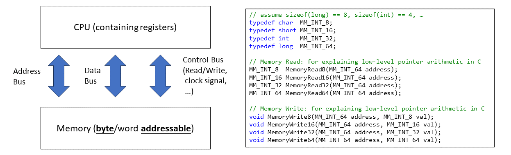

# Access Memory

``` sh
/****************************************************************************************
                How to access memory in C

    1.  Types in C

            Primary Types:  
                        char, short, int, long, double, float, ...

            Aggregate Types:  
                        array, struct
                        
            Pointer Types:
                        T *,  where T is a primary/aggregate/pointer type

                        Examples:
                            char *, int *, struct Date *, char **, 


        We don't discuss function pointer in this program.


    2.   Access memory via variable names (for accessing global/local variables)

         For simplicity, we only take global variables as an example in this program.
         But global/local memory areas can be accessed similarly via variable names.
         

    3.   Access memory via pointer variables (for accessing global/local/heap variables)
         
         The object allocated on heap (via malloc()) does not have any name.
         But the pointer variable 'ptr', which points to the heap object, has a name.
         
         void test(void) {
            int *ptr = (int *) malloc(sizeof(int));
            ...
         }

         
         Memory Layout:

                        --------------
         ptr ------>     heap object
                        --------------
                           int

        Again, we only access the global memory area via pointer variables in this program.
        But global/local/heap memory areas can be accessed similarly via pointer variables.

    4.   Low-level pointer arithmetic via MemoryRead() and MemoryWrite().

         Low-level pointer arithmetic is essentially integer arithmetic,
         with the challenge lying in the type of the pointer (T *)
         and the size of T, determined by sizeof(T).

    5.   Tested on a 64-bit system (Intel x86_64).

                                                                    COMP9024 24T2

 ******************************************************************************************/

``` 

## CPU and Memory



Memory Management Unit ([MMU](https://en.wikipedia.org/wiki/Memory_management_unit)) and [cache](https://en.wikipedia.org/wiki/Cache_(computing)) are out of the scope of this course.

Functions like MemoryRead64() and MemoryWrite64() in the figure are modeled to explain low-level pointer arithmetic.

Low-level pointer arithmetic is essentially integer arithmetic.

When you are puzzled about the memory operations of a C expression (e.g., *(pArr+1)),

you can cast a pointer into a 64-bit integer and use these functions to verify whether your understanding is correct or not.

But, in most cases, to be portable, we should access memory via variables names and pointer variables, rather than MemoryRead64() and MemoryWrite64().

**Which do you like? www.google.com or 142.251.221.68 ?**

| Human-Readable Names  |  IP or memory Addresses |
|:-------------|:------------|
|  www.google.com | 142.251.221.68 |
|   &arr[0]   |   0x5611dc43d030 |


## 1 How to download this project in [CSE VLAB](https://vlabgateway.cse.unsw.edu.au/)

Open a terminal (Applications -> Terminal Emulator)

```sh

$ git clone https://github.com/sheisc/COMP9024.git

$ cd COMP9024/C/AccessMemory

AccessMemory$ 

```


## 2 How to start [Visual Studio Code](https://code.visualstudio.com/) to browse/edit/debug a project.


```sh

AccessMemory$ code

```

Two configuration files (AccessMemory/.vscode/[launch.json](https://code.visualstudio.com/docs/cpp/launch-json-reference) and AccessMemory/.vscode/[tasks.json](https://code.visualstudio.com/docs/editor/tasks)) have been preset.


### 2.1 Open the project in VS Code

In the window of Visual Studio Code, please click "File" and "Open Folder",

select the folder "COMP9024/C/AccessMemory", then click the "Open" button.


### 2.2 Build the project in VS Code

click **Terminal -> Run Build Task**


### 2.3 Debug the project in VS Code

Open src/main.c, and click to add a breakpoint (say, line 401).

Then, click **Run -> Start Debugging**


### 2.4 Directory

```sh
├── Makefile             defining set of tasks to be executed (the input file of the 'make' command)
|
├── README.md            introduction to this tutorial
|
├── images               containing image files (*.png and *.jpg)
|
├── src                  containing *.c and *.h
|   |
│   |── main.c           how to access memory in C
|   |
│   └── MemoryRW.c       The definitions of low-level memory read/write functions
|   |
│   └── MemoryRW.h       The declarations of functions
|
└── .vscode              containing configuration files for Visual Studio Code
    |
    ├── launch.json      specifying which program to debug and with which debugger,
    |                    used when you click "Run -> Start Debugging"
    |
    └── tasks.json       specifying which task to run (e.g., 'make' or 'make clean')
                         used when you click "Terminal -> Run Build Task" or "Terminal -> Run Task"
```

Makefile is discussed in [COMP9024/C/HowToMake](../../C/HowToMake/README.md).


## 3 Build and run the project in command line

**In addition to utilizing VS Code, we can also compile and execute programs directly from the command line interface as follows.**

``` sh

AccessMemory$ make

AccessMemory$ ./main

Hello World

....


```


## 4 Primary Types


``` C
#include <stdio.h>     // printf(), scanf()
/*************************************************************
    Primary types: 
        char, short, int, long, double, ...
    Var: 
        variable
 *************************************************************/
char cVar = 'A';
short sVar = 28;
int iVar = 5;
long lVar = 2024; 
double dfVar = 3.14;

static void AccessMemoryByVariableNames(void) {
    // access primary types
    printf("cVar == %c \n", cVar);
    printf("sVar == %hd \n", sVar);
    printf("iVar == %d \n", iVar);
    printf("lVar == %ld \n", lVar);  
    printf("dfVar == %f \n\n", dfVar);
    
    // ...
}

```
**output**

```sh
cVar == A 
sVar == 28 
iVar == 5 
lVar == 2024 
dfVar == 3.140000 
```

## 5 Aggregate types

### 5.1 int arr[4]

```C
/*
                    array 

    Let us start with one-dimensional arrays.

    #define N    4

    Memory Layout:
            --------------- -----------
             Access Name      Value
            --------------- -----------
             arr[3]            40
             arr[2]            30
             arr[1]            20
             arr[0]            10    
            --------------- ---------
                             int arr[4]
 */
int arr[N] = {10, 20, 30, 40};
```

### 5.2 struct Date date

```C
/*
    We assume: sizeof(int) == 4,  sizeof(long) == 8     
 */
struct Date {
    int day;
    int month;
    long year;
};
/*
Memory Layout:
    ------------------------         --------
    FieldName  FieldOffset            Value
    ------------------------         --------
    day         0                     28      
    month       4                     5
    year        8                     2024
    ------------------------         --------
                                   struct Date date
 */      
struct Date date = {28, 5, 2024};
```

## 6 Access memory by variable names


### 6.1 Access 'int arr[4]' and 'struct Date date'

#### *(arr+i) is equivalent to arr[i], where arr is an array.

```C
static void AccessMemoryByVariableNames(void) {
    //...

    // access an array
    int len = (sizeof(arr) / sizeof(arr[0]));
    for (int i = 0; i < len; i++) {
        printf("arr[%d] == %d\n", i, arr[i]);
        // arr in "*(arr + i)" is treated as &arr[0]
        printf("*(arr + %d) == %d\n\n", i, *(arr + i));
    }
    printf("\n");

    // access each field of the struct
    printf("date.day == %d \n", date.day);
    printf("date.month == %d \n", date.month);
    printf("date.year == %ld \n\n", date.year);
    
    // ...
}
```

**output**

```sh
arr[0] == 10
*(arr + 0) == 10

arr[1] == 20
*(arr + 1) == 20

arr[2] == 30
*(arr + 2) == 30

arr[3] == 40
*(arr + 3) == 40


date.day == 28 
date.month == 5 
date.year == 2024 
```

### 6.2 Low-level pointer arithmetic in accessing arr[0]

```C
static void AccessMemoryByVariableNames(void) {
    // ...

    printf("\n\n***** Low-level pointer arithmetic in accessing arr[i] and *(arr + i), where arr is an array *******\n\n\n");
    /*

    int arr[N] = {10, 20, 30, 40};

    Memory Layout

      --------------  ---------
       Access Name      Value
      --------------  ---------
        arr[3]          40
        arr[2]          30
        arr[1]          20
        arr[0]          10       <-------- &arr[0]
      --------------  ---------
                      int arr[4]  
     */
    MM_INT_64 addrOfArr = (MM_INT_64) &arr[0];
    // arr[0]
    MM_INT_32 value = MemoryRead32(addrOfArr);

    printf("value == arr[0] == %d\n", value);  
    // ...
}
```

**output**

```sh
***** Low-level pointer arithmetic in accessing arr[i] and *(arr + i), where arr is an array *******

value == arr[0] == 10
```

### 6.3 Low-level pointer arithmetic in accessing 'struct Date date'

```C

/*

struct Date {
    int day;
    int month;
    long year;
};
struct Date date = {28, 5, 2024};


Memory Layout:

    -----------------------  ---------
    FieldName  FieldOffset     Value
    -----------------------  ---------
    day         0              28          <------ &date
    month       4              5
    year        8              2024
    -----------------------  ---------
                             struct Date date

 */      

static void AccessMemoryByVariableNames(void) {
    // ...
    printf("\n\n***** Low-level pointer arithmetic in accessing date.day, date.month, and date.year *******\n\n\n");

    MM_INT_64 addrOfDate = (MM_INT_64)(&date);

    MM_INT_64 offset;
    // date.day is at offset 0
    offset = offsetof(struct Date, day);
    // addrOfDate + 0
    int day = MemoryRead32(addrOfDate + offset);  
    printf("date.day: MemoryRead32(addrOfDate + %ld) == %d \n", offset, day);
    // addrOfDate + 4
    offset = offsetof(struct Date, month);
    int month = MemoryRead32(addrOfDate + offset);
    printf("date.month: MemoryRead32(addrOfDate + %ld) == %d \n", offset, month);
    // addrOfDate + 8
    offset = offsetof(struct Date, year);
    long year = MemoryRead64(addrOfDate + offset);
    printf("date.year: MemoryRead64(addrOfDate + %ld) == %ld \n", offset, year);
    // ...
}
```

**output**

```sh
***** Low-level pointer arithmetic in accessing date.day, date.month, and date.year *******


date.day: MemoryRead32(addrOfDate + 0) == 28 
date.month: MemoryRead32(addrOfDate + 4) == 5 
date.year: MemoryRead64(addrOfDate + 8) == 2024 

```
## 7 Access memory by pointer variables

**Pointer operator**

In C, the asterisk operator, *, is used to declare and manipulate pointers. 

It is also used as a multiplication operator in "30 * 40".

**Address operator**


Denoted as the ampersand symbol, &.

It is also used as a Bitwise AND operator in "2 & 4"

**For example**

```C
char cVar = 'A';
char *pCharVar = &cVar;
```

### 7.1  Pointer variables for accessing primary type variables
```C
/*

Memory Layout:
                    ---------
    pCharVar ---->   'A'
                    ---------
                    char cVar

                    ----------
    pShortVar --->    5
                    ----------
                    short sVar

                    ---------
    pIntVar ----->    28
                    ---------
                    int iVar

                    ---------
    pLongVar ---->    2024
                    ---------
                    long lVar

                    ------------
    pDoubleVar -->    3.14
                    ------------
                    double dfVar
 */ 
char *pCharVar = &cVar;
short *pShortVar = &sVar;
int *pIntVar = &iVar;
long *pLongVar = &lVar;
double *pDoubleVar = &dfVar;

```

### 7.2 Pointer variables for accessing aggregate type variables

```C
/*************************************************************
   We assume: sizeof(int) == 4,  sizeof(long) == 8
   
   Memory Layout:
                    -------------
                      arr[3]   
                      arr[2]
                      arr[1]
    pArr -------->    arr[0]   
                    -------------
                     int arr[4]


    -----------------------  ---------
    FieldName  FieldOffset     Value
    -----------------------  ---------
    day         0              28        <------ pDate
    month       4              5
    year        8              2024
    -----------------------  ---------
                              struct Date date
 *************************************************************/
// pointer variables
int *pArr = &arr[0];
struct Date *pDate = &date;
```

### 7.3 Via pointer variables

#### pArr[i] is equivalent to *(pArr + i), where pArr is a pointer variable.

```C
static void AccessMemoryByPointerVariables(void) {
    // access primary types
    printf("cVar == *pCharVar == %c \n", *pCharVar);
    printf("sVar == *pShortVar == %hd \n", *pShortVar);
    printf("iVar == *pIntVar == %d \n", *pIntVar);
    printf("lVar == *pLongVar == %ld \n", *pLongVar);  
    printf("dfVar == *pDoubleVar == %f \n\n", *pDoubleVar);

    // access an array
    for (int i = 0; i < N; i++) {        
        printf("pArr[%d] == %d\n", i, pArr[i]);
        printf("*(pArr + %d) == %d\n\n", i, *(pArr + i));
    }
    printf("\n");

    // access each field of the struct
    printf("pDate->day == %d \n", pDate->day);
    printf("pDate->month == %d \n", pDate->month);
    printf("pDate->year == %ld \n\n", pDate->year); 
}
```
**output**

```sh
cVar == *pCharVar == A 
sVar == *pShortVar == 28 
iVar == *pIntVar == 5 
lVar == *pLongVar == 2024 
dfVar == *pDoubleVar == 3.140000 

pArr[0] == 10
*(pArr + 0) == 10

pArr[1] == 20
*(pArr + 1) == 20

pArr[2] == 30
*(pArr + 2) == 30

pArr[3] == 40
*(pArr + 3) == 40


pDate->day == 28 
pDate->month == 5 
pDate->year == 2024 

```

### 7.4 Low-level pointer arithmetic in accessing 'int arr[4]' via 'pArr'

***(pArr+0) or pArr[0]**

Since pArr is a pointer variable, which itself is also saved in the global memory area,

we need to read the value of 'pArr' from the global memory area first, and then read the value of arr[0].

Two memory-read operations (i.e., MemoryRead64() and MemoryRead32()) are needed.


***(arr+0) or arr[0]**

By contrast, if we access arr[0] via the array name 'arr', 

only one memory-read operation is needed in the global memory area .

Please see **6.2 Low-level pointer arithmetic in accessing arr[0]**.


```C

// int *pArr = &arr[0];

static void AccessMemoryByPointerVariables(void) {
    // ...
    /*
                    -----------
                      arr[3]  40
                      arr[2]  30
                      arr[1]  20
    pArr -------->    arr[0]  10
                    -----------
                     int arr[4]    
     */
    MM_INT_64 addrOfpArr = (MM_INT_64) (&pArr);
    // Read the value of 'pArr', i.e., the address of 'arr'
    MM_INT_64 addrOfArr = MemoryRead64(addrOfpArr);
    // arr[0]
    MM_INT_32 value = MemoryRead32(addrOfArr);
    printf("value == arr[0] == %d\n", value);
    // ...
}
```

**output**

```sh
value == arr[0] == 10 
```

### 7.4 Low-level pointer arithmetic in accessing 'struct Date date' via 'pDate'

First, one memory-read operation is needed to get the value of 'pDate' in the global memory area.

Then, one memory-read operation for each field of 'struct Date date'.


```C
// struct Date *pDate = &date;

static void AccessMemoryByPointerVariables(void) {
    // ...
    /*
                         --------
            pDate ---->   day     28
                          month   5
                          year    2024
                         --------
                     struct Date date;
     */
    MM_INT_64 addrOfpDate = (MM_INT_64) (&pDate);
    // Read the value of pDate from memory, i.e., the address of 'struct Date date'    
    MM_INT_64 addrOfDate = MemoryRead64(addrOfpDate);

    MM_INT_64 offset;
    // date.day is at offset 0
    offset = offsetof(struct Date, day);
    // addrOfDate + 0
    int day = MemoryRead32(addrOfDate + offset);  
    printf("pDate->day: MemoryRead32(addrOfDate + %ld) == %d \n", offset, day);
    // addrOfDate + 4
    offset = offsetof(struct Date, month);
    int month = MemoryRead32(addrOfDate + offset);
    printf("pDate->month: MemoryRead32(addrOfDate + %ld) == %d \n", offset, month);
    // addrOfDate + 8
    offset = offsetof(struct Date, year);
    long year = MemoryRead64(addrOfDate + offset);
    printf("pDate->year: MemoryRead64(addrOfDate + %ld) == %ld \n", offset, year);
    ...
}
```

**output**

```sh
pDate->day: MemoryRead32(addrOfDate + 0) == 28 
pDate->month: MemoryRead32(addrOfDate + 4) == 5 
pDate->year: MemoryRead64(addrOfDate + 8) == 2024 
```

## 8 Low-level memory-write operations


```C

char cVar = 'A';
short sVar = 28;
int iVar = 5;
long lVar = 2024; 

static void TestMemoryWrite(void) {
    printf("\n\n*************** TestMemoryWrite(): only for explaining low-level pointer arithmetic ***************\n\n\n");
    MM_INT_64 addr;

    addr = (MM_INT_64) &cVar;
    MemoryWrite8(addr, 'B');
    printf("cVar = %c\n", cVar);

    addr = (MM_INT_64) &sVar;
    MemoryWrite16(addr, 29);
    printf("sVar = %hd\n", sVar);

    addr = (MM_INT_64) &iVar;
    MemoryWrite32(addr, 6);
    printf("iVar = %d\n", iVar);       

    addr = (MM_INT_64) &lVar;
    MemoryWrite64(addr, 2025);
    printf("lVar = %ld\n", lVar); 
}
```

**output**

```sh
*************** TestMemoryWrite(): only for explaining low-level pointer arithmetic ***************


cVar = B
sVar = 29
iVar = 6
lVar = 2025

```

## 9 Strings in C

C strings (character arrays) are terminated by null character '\0' character with value zero.

In [ASCII](https://www.asciitable.com/), the NUL control code has value 0 (0x00).


```C
static void TestCString(void) {
    // str is a pointer, which points to the first character of "Hello 9024"
    char *str = "Hello 9024";
    // visit each character in "Hello 9024"
    char *ptr = str;
    while (*ptr != 0) {
        printf("%c", *ptr);
        ptr++;
    }
    printf("\n");
    printf("\"%s\", sizeof(str) == %ld, strlen(str) == %ld \n", 
            str, sizeof(str), strlen(str));

    // character arrays
    char charBuf1[] = "CSE@UNSW"; // 
    char charBuf2[] = {'C', 'S', 'E', '@', 'U', 'N', 'S', 'W', '\0'};
    printf("%s, sizeof(charBuf1) == %ld, strlen() == %ld \n", 
            charBuf1, sizeof(charBuf1), strlen(charBuf1));
    printf("%s, sizeof(charBuf2) == %ld, strlen() == %ld  \n\n", 
            charBuf2, sizeof(charBuf2), strlen(charBuf2));
}
```

```sh

// man stands for manual

$ man strlen

size_t strlen(const char *s);

    The strlen() function calculates the length of the string pointed to by s, excluding the terminating null byte ('\0').

```

**output**

```sh
Hello 9024
"Hello 9024", sizeof(str) == 8, strlen(str) == 10 
CSE@UNSW, sizeof(charBuf1) == 9, strlen(charBuf1) == 8
CSE@UNSW, sizeof(charBuf2) == 9, strlen(charBuf2) == 8
```
## 10 Empirical experience


```sh        
Given a variable name, d, whose type is T.
       -------------------    
       |                 |
       |                 |
       -------------------
            T  d;
```
### Tip 1
```sh
(1)  In C, the variable name, d, is used to access the content/value of the memory block,
     where T is the type of d, and T is in {primary type, struct type, pointer type}.

     // Memory write/store, change the value of d
     d = ...;
     // Memory read/load, get the value of d
     ... = d;
```

### Tip 2
```sh
(2)  &d represents the address of the memory block, 
     where T is the type of d, and T is in {primary type, struct type, pointer type}.
```

### Tip 3
```sh
(3) Given a data pointer variable, ptr, whose type is T * and T is neither a function nor an array.
 
    ----------                        -------------------    
        ptr    --------------->       |                 |
    ----------                        |                 |
        T *                           -------------------
                                     An object whose type is T, which occupies sizeof(T) bytes of data area. 

     *ptr is used to access the value of the memory block pointed to by ptr.
     
     // memory write/store in data area
     *ptr = ...;
     // memory read/load in data area
     ... = *ptr;     
```

### Tip 4 (special cases)
```sh
(4) Function names and array names are treated specially by C compiler.
  
    Function Name:
   
        // both f and &f are treated as the address of the function f().
        void f(void) {
        }

    Array Name:

        int arr[4];

    (long) arr == (long) (&arr), 
    but (long) (arr + 1) != (long) (&arr + 1).
    
    arr in (arr + 1) is treated as &arr[0]. The type of &arr[0] is (int *).
    
    &arr in (&arr + 1) has the type (ArrayTy *), where ArrayTy is int[4], defined by 'typedef int ArrayTy[4]'.
       
       
    BTW, sizeof(arr) is 16, suppose sizeof(int) is 4 and sizeof (int [4]) is 16.

    There are some inconsistencies in the meaning of the array name, arr, which might lead to confusion.
```
### Example
```C
#include <stdio.h>

int arr[4];
typedef int ArrayTy[4];

int main(void) {
    
    printf("main == %p, &main === %p\n", main, &main);

    printf("sizeof(ArrayTy) == %ld\n", sizeof(ArrayTy));
    printf("sizeof(int) == %ld\n", sizeof(int));
    printf("sizeof(arr) == %ld\n", sizeof(arr));
    printf("sizeof(int[4]) == %ld\n", sizeof(int[4]));
    printf("(long) arr == %ld, (long) (&arr) == %ld\n", (long) arr, (long)(&arr));
    printf("(long) (arr + 1) == %ld, (long) (&arr + 1) == %ld\n", (long)(arr + 1), (long)(&arr + 1));
    
    return 0;
}
```    
### Output
```sh
main == 0x55bfebce5149, &main === 0x55bfebce5149
sizeof(ArrayTy) == 16
sizeof(int) == 4
sizeof(arr) == 16
sizeof(int[4]) == 16
(long) arr == 94282783293472, (long) (&arr) == 94282783293472
(long) (arr + 1) == 94282783293476, (long) (&arr + 1) == 94282783293488


```
