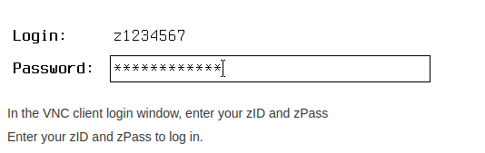
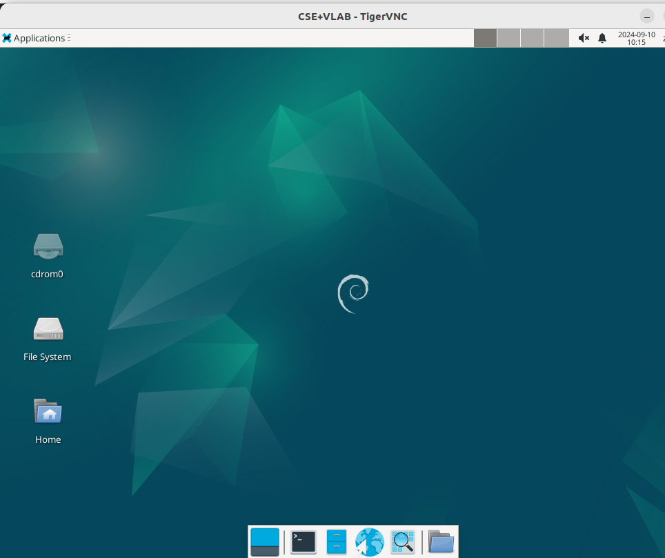
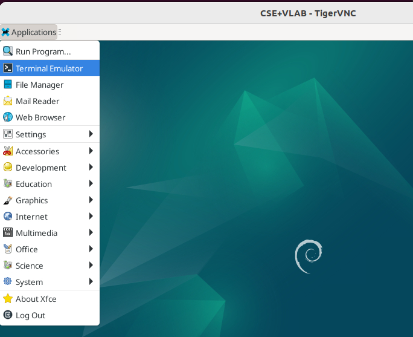
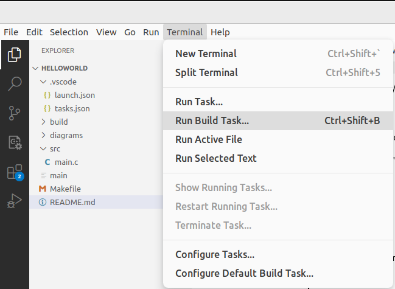
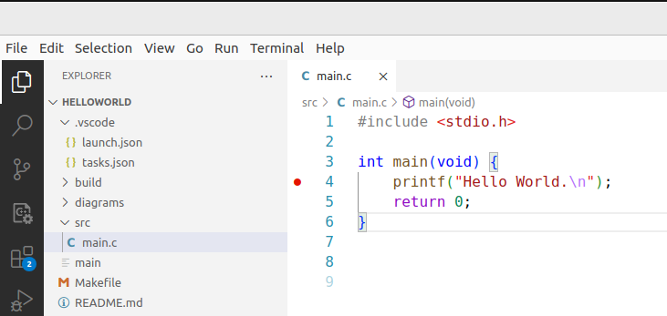
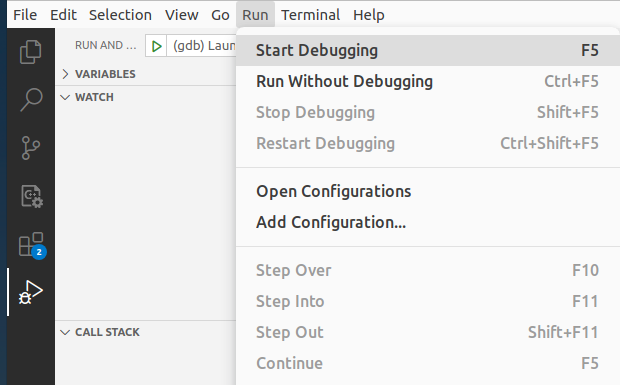
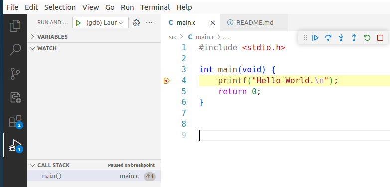
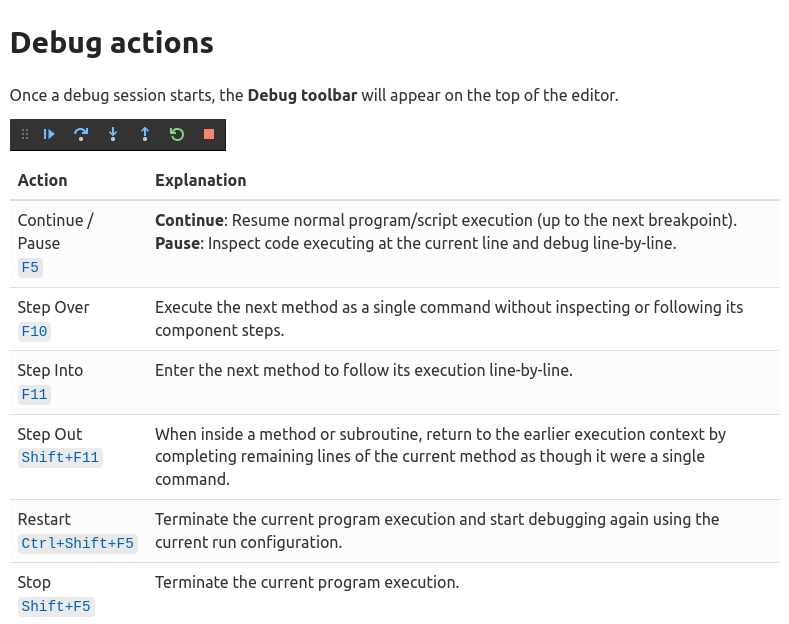
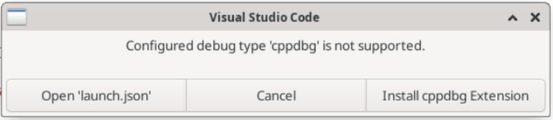
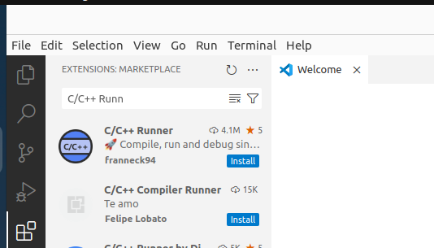

# Hello World

``` sh
/*******************************************************************
                          Hello World

    1.  How to use VLAB

    2.  How to use Visual Studio Code

    3.  Frequently asked questions

                                             COMP9024

 *******************************************************************/
``` 
## Introduction to CSE VLAB

### How to install a VNC client

[Really quick guide to VLAB](https://taggi.cse.unsw.edu.au/FAQ/Really_quick_guide_to_VLAB/)

For desktop and laptop computers we recommend [TigerVNC](https://sourceforge.net/projects/tigervnc/files/stable/1.11.0/), though any VNC client will work.

- For Mac: download **TigerVNC-version.dmg**, open the file and drag the TigerVNC app to your Applications folder
- For Windows: download **vncviewer64-version.exe** to your desktop
- For Ubuntu, run **sudo apt-get install tigervnc-viewer tigervnc-common** from the terminal

### How to connect to CSE VLAB

[Really quick guide to VLAB](https://taggi.cse.unsw.edu.au/FAQ/Really_quick_guide_to_VLAB/)

| VncViewer |
|:-------------|
||

```sh
vlab.cse.unsw.edu.au:5920
```

| How to log in  |
|:-------------|
||

| Access the Linux system |
|:-------------|
||

## 1 How to download this project in [CSE VLAB](https://taggi.cse.unsw.edu.au/FAQ/Really_quick_guide_to_VLAB/)

Open a terminal (Applications -> Terminal Emulator)

| Terminal  |
|:-------------|
||


```sh

$ git clone https://github.com/sheisc/COMP9024.git

$ cd COMP9024/C/HelloWorld

HelloWorld$ 

```


## 2 How to start [Visual Studio Code](https://code.visualstudio.com/) to browse/edit/debug a project.

```sh

HelloWorld$ code

```

Two configuration files (HelloWorld/.vscode/[launch.json](https://code.visualstudio.com/docs/cpp/launch-json-reference) and HelloWorld/.vscode/[tasks.json](https://code.visualstudio.com/docs/editor/tasks)) have been preset.


#### 2.1 Open the project in VS Code

In the window of Visual Studio Code, please click "File" and "Open Folder",

select the folder "COMP9024/C/HelloWorld", then click the "Open" button.


#### 2.2 Build the project in VS Code

click **Terminal -> Run Build Task**

|  |
|:-------------|
||

#### 2.3 Debug the project in VS Code

Open src/main.c, and click to add a breakpoint (say, line 4).

| How to add a breakpoint  |
|:-------------|
||

Then, click **Run -> Start Debugging**

| How to start debugging  |
|:-------------|
||

|   |
|:-------------|
||

| [Debug actions](https://code.visualstudio.com/docs/editor/debugging#_debug-actions)   |
|:-------------|
||

### 2.4 Directory

```sh
├── Makefile             defining set of tasks to be executed (the input file of the 'make' command)
|
├── README.md            introduction to this tutorial
|
├── src                  containing *.c and *.h
|   |
│   └── main.c           main()
|
|
└── .vscode              containing configuration files for Visual Studio Code
    |
    ├── launch.json      specifying which program to debug and with which debugger,
    |                    used when you click "Run -> Start Debugging"
    |
    └── tasks.json       specifying which task to run (e.g., 'make' or 'make clean')
                         used when you click "Terminal -> Run Build Task" or "Terminal -> Run Task"
```

Makefile is discussed in [COMP9024/C/HowToMake](../../C/HowToMake/README.md).


## 3 Build and run the program from the command line interface


``` sh

HelloWorld$ make

HelloWorld$ ./main

```

## 4 Frequently Asked Questions


### 4.1 Configured debug type 'cppdbg' is not supported in VS Code

| Question |
|:-------------|
||

**Answer**
```sh
Click the 'Extensions' icon in VS Code (the icon in the bottom-left corner of the figure below), search for "C/C++ Runner",  and install it.

```
|  |
|:-------------|
||

### 4.2 Multiple definitions of 'main'

```sh
Only one main() function definition is allowed in the src directory of each project.
```

### 4.3 Open one project (e.g., COMP9024/Sorting/BubbleSort) in VS Code, rather than the root directory (i.e., COMP9024)

The directory structure of a project in COMP9024

```sh
BubbleSort
├── diagrams
├── images
├── Makefile
├── README.md
└── src
```

### 4.4 Please use English letters and digits when naming your directory.

```sh
To be simple, the Makefile used in COMP9024 does not support whitespace characters (e.g., "Bubble Sort") in the directory name.
```

### 4.5 The destination path 'COMP9024' already exists and is not an empty directory

```sh
$ git clone https://github.com/sheisc/COMP9024.git
fatal: destination path 'COMP9024' already exists and is not an empty directory.
```

**Answer**

Rename the directory COMP9024 to a non-existing name (say, MyCOMP9024)
```sh
$ mv COMP9024 MyCOMP9024
$ git clone https://github.com/sheisc/COMP9024.git
```

### 4.6  How to setup your own Visual Studio Code in your own computers

For privacy and security reasons, the teaching team will NOT help with this.

When you are ready, you can do it by yourself.

[CSE VLAB](https://taggi.cse.unsw.edu.au/FAQ/Really_quick_guide_to_VLAB/) can make things easier for us.

We will use Visual Studio Code, make and gcc in CSE VLAB.


