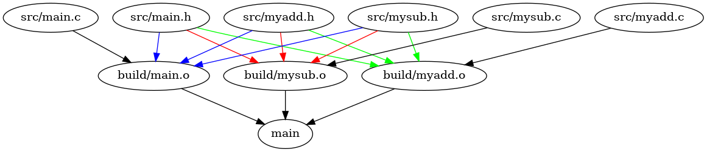
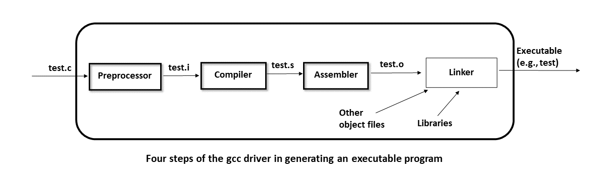
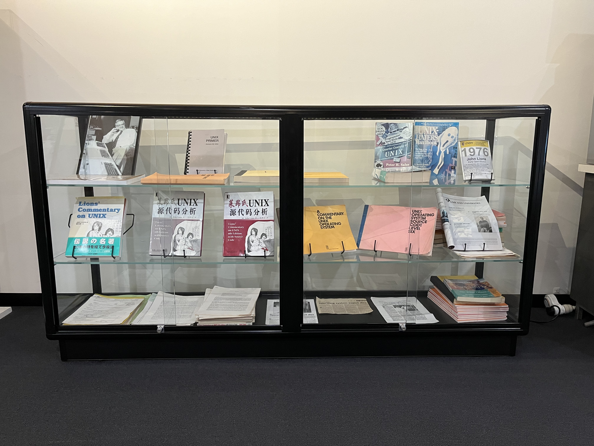

# How to Make

``` sh
/*******************************************************************
                How to Make

    1.  How to use make, Visual Studio Code and gcc in CSE VLAB

    2.  How to build and run a C project

    3.  Include Guard in a header file (see myadd.h)

    4.  Don't put definitions of global variables and functions in a header file (see myadd.h)

    5.  The four steps of the gcc driver in generating an executable program

    6.  The rules in Makefile

                                             COMP9024 24T2

 *******************************************************************/
``` 
## [Make (software)](https://en.wikipedia.org/wiki/Make_(software))

In software development, Make is a build automation tool that builds executable programs and libraries 

from source code by reading files called makefiles which specify how to derive the target program. 

## 1 How to download this project in [CSE VLAB](https://vlabgateway.cse.unsw.edu.au/)

Open a terminal (Applications -> Terminal Emulator)

```sh

$ git clone https://github.com/sheisc/COMP9024.git

$ cd COMP9024/C/HowToMake

HowToMake$ 

```


## 2 How to start [Visual Studio Code](https://code.visualstudio.com/) to browse/edit/debug a project.


```sh

HowToMake$ code

```

Two configuration files (HowToMake/.vscode/[launch.json](https://code.visualstudio.com/docs/cpp/launch-json-reference) and HowToMake/.vscode/[tasks.json](https://code.visualstudio.com/docs/editor/tasks)) have been preset.


### 2.1 Open the project in VS Code

In the window of Visual Studio Code, please click "File" and "Open Folder",

select the folder "COMP9024/C/HowToMake", then click the "Open" button.


### 2.2 Build the project in VS Code

click **Terminal -> Run Build Task**


### 2.3 Debug the project in VS Code

Open src/main.c, and click to add a breakpoint (say, line 12).

Then, click **Run -> Start Debugging**


### 2.4 Directory

```sh
├── Makefile             defining set of tasks to be executed (the input file of the 'make' command)
|
├── Makefile.V2          Generating prerequisites automatically, more precise than Makefile, but more complex.
|
├── README.md            introduction to this tutorial
|
├── images               containing image files (*.png and *.jpg)
|
|── test.c               for demonstrating the four stages of gcc
|
├── src                  containing *.c and *.h
│   ├── main.c
│   ├── main.h
│   ├── myadd.c
│   ├── myadd.h
│   ├── mysub.c
│   └── mysub.h
|
└── .vscode              containing configuration files for Visual Studio Code
    |
    ├── launch.json      specifying which program to debug and with which debugger,
    |                    used when you click "Run -> Start Debugging"
    |
    └── tasks.json       specifying which task to run (e.g., 'make' or 'make clean')
                         used when you click "Terminal -> Run Build Task" or "Terminal -> Run Task"
```


## 3 Build and run a project in command line

**In addition to utilizing VS Code, we can also compile and execute programs directly from the command line interface as follows.**

``` sh

HowToMake$ make

make main
make[1]: Entering directory 'COMP9024/C/HowToMake'
gcc -g -I COMP9024/C/HowToMake/src  -c src/myadd.c -o build/myadd.o
gcc -g -I COMP9024/C/HowToMake/src  -c src/main.c -o build/main.o
gcc -g -I COMP9024/C/HowToMake/src  -c src/mysub.c -o build/mysub.o
gcc -g -I COMP9024/C/HowToMake/src  -o main ./build/myadd.o ./build/main.o ./build/mysub.o
make[1]: Leaving directory 'COMP9024/C/HowToMake'

HowToMake$ ./main

Hello COMP9024
add(9000, 24) = 9024
sub(9000, 24) = 8976

HowToMake$ make
make main
make[1]: Entering directory 'COMP9024/C/HowToMake'
make[1]: 'main' is up to date.
make[1]: Leaving directory 'COMP9024/C/HowToMake'

// If we modify src/myadd.c, only the modified parts (i.e., 'build/myadd.o' and 'main') need to be recreated.
HowToMake$ make
make main
make[1]: Entering directory '/home/iron/github/COMP9024/C/HowToMake'
gcc -g -I COMP9024/C/HowToMake/src  -c src/myadd.c -o build/myadd.o
gcc -g -I COMP9024/C/HowToMake/src  -o main ./build/myadd.o ./build/main.o ./build/mysub.o
make[1]: Leaving directory '/home/iron/github/COMP9024/C/HowToMake'


HowToMake$ pwd

COMP9024/C/HowToMake

HowToMake$ find ./src -name "*.c"

./src/myadd.c
./src/main.c
./src/mysub.c

HowToMake$ find ./src -name "*.h"

./src/myadd.h
./src/main.h
./src/mysub.h

```


## 4 The rules in [COMP9024/C/HowToMake/Makefile](./Makefile)

```sh
####################################################################################
# 				How to Use
# 
# (1) Build the project
#   make
# (2) Run the executable
#   ./main
# (3) Clean the project
#   make clean
#
# If you want to know more about makefile, please refer to:
#
#    https://www.gnu.org/software/make/manual/html_node/Rule-Syntax.html
#
# You can reuse this Makefile in different assignments/projects in COMP9024.
# To be simple, please put your *.c and *.h in the src directory.
#
#                                                                 COMP9024 24T2
####################################################################################
PROJ_ROOT_PATH = $(shell pwd)

TARGET_EXE = main
BUILD_DIR = build

C_SRC_FILES = $(shell find ./src -name "*.c")
H_SRC_FILES = $(shell find ./src -name "*.h")

# src/*.c  --->  src/*.o ---> build/*.o
TMP_OBJ_FILES = $(C_SRC_FILES:.c=.o)
OBJ_FILES_IN_BUILD =$(subst src/,$(BUILD_DIR)/,$(TMP_OBJ_FILES))


CC= gcc
CFLAGS = -g -I $(PROJ_ROOT_PATH)/src 

# create a directory  
$(shell mkdir -p $(BUILD_DIR))

# the default target
all: 
	make $(TARGET_EXE)

# generate the target, which depends on the "build/*.o" files
$(TARGET_EXE):  $(OBJ_FILES_IN_BUILD) 	
	$(CC) $(CFLAGS) -o $(TARGET_EXE) $(OBJ_FILES_IN_BUILD)

# How to generate a "build/*.o" from a "src/*.c"
# To generate prerequisites automatically, please see Makefile.V2
# https://www.gnu.org/software/make/manual/html_node/Automatic-Prerequisites.html
$(BUILD_DIR)/%.o: src/%.c $(H_SRC_FILES)
	@mkdir -p $(shell dirname $@)
	${CC} ${CFLAGS} -c $< -o $@

# clean all the files generated	
clean:
	rm -rf $(TARGET_EXE) $(BUILD_DIR) 
	find . -name "*.o" | xargs rm -f
	find . -name "*.s" | xargs rm -f
	find . -name "*.i" | xargs rm -f
	find . -name "*.d" | xargs rm -f
	find . -name "*.bc" | xargs rm -f
```

In the following rule in [COMP9024/C/HowToMake/Makefile](./Makefile),

we simply and conservatively assume a *.o file (e.g., 'build/myadd.o') depends on all *.h files (specified by H_SRC_FILES).
```sh
$(BUILD_DIR)/%.o: src/%.c $(H_SRC_FILES)
	@mkdir -p $(shell dirname $@)
	${CC} ${CFLAGS} -c $< -o $@
```
**Explanation of the above rule in [COMP9024/C/HowToMake/Makefile](./Makefile)**
```sh

  $@      
        the name of the target being generated,  e.g., build/myadd.o
  @<      
        the first prerequisite (usually a source file), e.g., src/myadd.c

  Take 'build/myadd.o' as an example.

        The target 'build/myadd.o' conservatively depends on 'src/myadd.c', 'src/myadd.h', 'src/mysub.h', 'src/main.h'.

        To generate 'build/myadd.o', the 'make' tool will run the following commands:

        mkdir -p build
        gcc -g -I COMP9024/C/HowToMake/src  -c src/myadd.c -o build/myadd.o 

      
```


## 5 The implicit Directed Acyclic Graph (DAG) in [COMP9024/C/HowToMake/Makefile](./Makefile)





### How Does 'make' Work?

The make utility compares the modification time of the target file with that of the dependency files. 

If any dependency file has a modification time more recent than its corresponding target file, 

it necessitates the recreation of the target file.

For example, if **src/main.c** is newer than **build/main.o**, then **build/main.o** and **main** will be rebuilt in turn.


## 6 The rules in [COMP9024/C/HowToMake/Makefile.V2](./Makefile.V2)

**More precise than [COMP9024/C/HowToMake/Makefile](./Makefile), but more complex.**

**The key point in [COMP9024/C/HowToMake/Makefile.V2](./Makefile.V2) is to use gcc to generate prerequisites automatically for us**

**and then include these dependencies into Makefile.V2.**

```
HowToMake$ gcc -MM src/main.c
main.o: src/main.c src/myadd.h src/mysub.h src/main.h

HowToMake$ gcc -MM src/myadd.c
myadd.o: src/myadd.c src/myadd.h

HowToMake$ gcc -MM src/mysub.c
mysub.o: src/mysub.c src/mysub.h

```

**For simplicity, we will reuse [COMP9024/C/HowToMake/Makefile](./Makefile), rather than [COMP9024/C/HowToMake/Makefile.V2](./Makefile.V2), in other projects.**

**If you are interested in the details of Makefile.V2, please read the comments in the file.**

## 7 Four steps of the gcc driver in generating an executable program



### test.c
```C
HowToMake$ cat -n test.c
     1	int lineNumber;
     2	char *fileName;
     3	#define THIS_YEAR 2024
     4	int main(void) {
     5	    long year = THIS_YEAR;
     6	    lineNumber = __LINE__;
     7	    fileName = __FILE__;
     8	    return 0;
     9	}
```

### 7.1 Preprocessor


```C
HowToMake$ gcc -E test.c -o test.i

HowToMake$ cat test.i

...

int lineNumber;
char *fileName;

int main(void) {
    long year = 2024;
    lineNumber = 6;
    fileName = "test.c";
    return 0;
}

```

### 7.2 Compiler
```sh
HowToMake$ gcc -c -S test.i -o test.s
HowToMake$ cat test.s

    .bss
...

lineNumber:
	.zero	4

fileName:
	.zero	8


    .text
...

main:
    ...
	pushq	%rbp
	movq	%rsp, %rbp
	movq	$2024, -8(%rbp)
    ...
	movl	$0, %eax
	popq	%rbp
	ret

```

### 7.3 Assembler
```sh
HowToMake$ gcc -c test.s -o test.o

HowToMake$ readelf -h test.o
ELF Header:
  Magic:   7f 45 4c 46 02 01 01 00 00 00 00 00 00 00 00 00 
  Class:                             ELF64
  ...

```

### 7.4 Linker

```sh
HowToMake$ gcc test.o -o test
HowToMake$ ./test
```

### Four steps in one

```
HowToMake$ gcc test.c -o test
HowToMake$ ./test
```

## 8 Sidetracks: if you are interested in system programming, you can start with MIT's [xv6](https://github.com/mit-pdos/xv6-public) when you are confident in C.

**Reading xv6's code has changed my life.**

**I hope they can also inspire you.**

By implementing a simple C-like compiler, [our large assignment](../../LargeAssignment/README.md) will pave the road for you to read MIT's [xv6](https://github.com/mit-pdos/xv6-public).


### 8.1 [xv6: a simple, Unix-like teaching operating system](https://pdos.csail.mit.edu/6.828/2018/xv6/book-rev11.pdf)


[mit-pdos/xv6-public on GitHub](https://github.com/mit-pdos/xv6-public)

```sh
xv6 is inspired by John Lions's Commentary on UNIX 6th Edition (Peer
to Peer Communications; ISBN: 1-57398-013-7; 1st edition (June 14,
2000)). See also https://pdos.csail.mit.edu/6.828/, which
provides pointers to on-line resources for v6.
```

### 8.2 [Lions' Commentary on UNIX 6th Edition](https://en.wikipedia.org/wiki/A_Commentary_on_the_UNIX_Operating_System)

John Lions, Department of Computer Science, The University of New South Wales

Come to the mini museum at level 1, K17.

Lions' great book is on show.




### 8.3 Read The Source Code

```
Read The Source Code.

                Linus Torvalds 
                The creator and lead developer of the Linux kernel
```


### 8.4 [You will when you believe](https://www.youtube.com/watch?v=LKaXY4IdZ40&ab_channel=whitneyhoustonVEVO)


