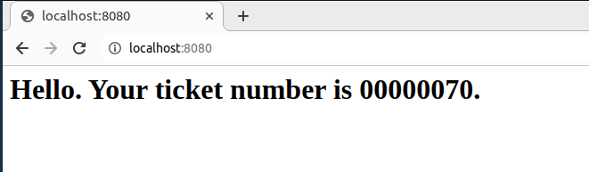

# Simple Web Server

``` sh
/*******************************************************************
                          Simple Web Server

    1.  How a data stack can be used to store thread IDs in a multi-threaded program

    2.  How to use a mutex lock to protect shared variables

    3.  How to implement a simple web server in C

                                             COMP9024 24T2

 *******************************************************************/
``` 
**This project is designed for those looking to enhance their C programming skills after completing COMP9024.**

In this project, we will discuss how a [data stack](../../Stacks/Stack_LL/README.md) can be used to store thread IDs in a multi-threaded program and how to implement a simple web server in C.

The Hypertext Transfer Protocol (HTTP) is the foundation of the World Wide Web, allowing webpages to be loaded through hypertext links.

The World Wide Web can be modeled as a huge [directed graph](../../Graphs/DirectedGraph/README.md).

In this graph, each node represents a webpage.

The directed edges represent hyperlinks between these webpages.

If a webpage A has a hyperlink to webpage B, there is a directed edge from A to B in the graph.

A [HashMap](../../Strings/HashMap/README.md) can be used to store the HTTP headers as follows.

#### An HTTP request from the Chrome browser

```sh
GET / HTTP/1.1
Host: localhost:8080
User-Agent: Mozilla/5.0 (X11; Linux x86_64) AppleWebKit/537.36 (KHTML, like Gecko) Chrome/114.0.0.0 Safari/537.36
Accept: text/html,application/xhtml+xml,application/xml;q=0.9,image/avif,image/webp,image/apng,*/*;q=0.8,application/signed-exchange;v=b3;q=0.7
Accept-Encoding: gzip, deflate, br
Accept-Language: en-GB,en-US;q=0.9,en;q=0.8

...

```

If you're interested, after completing COMP9024, you can apply the knowledge gained in Database Systems to further improve this simple web server.

Additionally, incorporating a thread pool can further boost the web server's performance.


### Two fundamental principles in software design

#### High Cohesion

The parts of a program that are grouped together (like a function, class or module) are highly related and focused on a single task.

This makes each part easier to understand and maintain because it has a clear, specific role. 

#### Low Coupling

Minimizing dependencies between different parts of a program.

When different parts of a program (like functions, classes or modules) are loosely connected, changes in one part don’t heavily affect others. 

This makes the program more flexible and easier to update. 

## 1 How to download this project in [CSE VLAB](https://vlabgateway.cse.unsw.edu.au/)

Open a terminal (Applications -> Terminal Emulator)

```sh

$ git clone https://github.com/sheisc/COMP9024.git

$ cd COMP9024/C/SimpleWebServer

SimpleWebServer$ 

```


## 2 How to start [Visual Studio Code](https://code.visualstudio.com/) to browse/edit/debug a project.

```sh

SimpleWebServer$ code

```

Two configuration files (SimpleWebServer/.vscode/[launch.json](https://code.visualstudio.com/docs/cpp/launch-json-reference) and SimpleWebServer/.vscode/[tasks.json](https://code.visualstudio.com/docs/editor/tasks)) have been preset.


#### 2.1 Open the project in VS Code

In the window of Visual Studio Code, please click "File" and "Open Folder",

select the folder "COMP9024/C/SimpleWebServer", then click the "Open" button.


#### 2.2 Build the project in VS Code

click **Terminal -> Run Build Task**


#### 2.3 Debug the project in VS Code

Open src/WebServer.c, and click to add a breakpoint (say, line 186).

Then, click **Run -> Start Debugging**

### 2.4 Directory

```sh
├── Makefile             defining set of tasks to be executed (the input file of the 'make' command)
|
├── README.md            introduction to this tutorial
|
├── src                  containing *.c and *.h
|   |
│   ├── WebServer.c      a simple multi-threaded web server
|   |
│   ├── Stack.c          For recording thread IDs
│   ├── Stack.h
|   |
│   └── main.c           main()
|
|── images               *.png files
|
└── .vscode              containing configuration files for Visual Studio Code
    |
    ├── launch.json      specifying which program to debug and with which debugger,
    |                    used when you click "Run -> Start Debugging"
    |
    └── tasks.json       specifying which task to run (e.g., 'make' or 'make clean')
                         used when you click "Terminal -> Run Build Task" or "Terminal -> Run Task"
```

Makefile is discussed in [COMP9024/C/HowToMake](../../C/HowToMake/README.md).


## 3 The main procedure


### 3.1 Build and run the program from the command line interface


``` sh

SimpleWebServer$ make

SimpleWebServer$ ./main


```

### 3.2 Use a browser as the client

http://localhost:8080

#### HTTP request from the Chrome browser

```sh
GET / HTTP/1.1
Host: localhost:8080
User-Agent: Mozilla/5.0 (X11; Linux x86_64) AppleWebKit/537.36 (KHTML, like Gecko) Chrome/114.0.0.0 Safari/537.36
Accept: text/html,application/xhtml+xml,application/xml;q=0.9,image/avif,image/webp,image/apng,*/*;q=0.8,application/signed-exchange;v=b3;q=0.7
Accept-Encoding: gzip, deflate, br
Accept-Language: en-GB,en-US;q=0.9,en;q=0.8

...

```
#### Display the HTTP response from the web server
| HTML page | 
|:-------------:|
|  |


### 3.3 Use nc as the client

**The tool nc is not available in CSE VLAB.**

Install Netcat on Debian/Ubuntu Linux

```sh
sudo apt install netcat
```

#### HTTP request from nc

``` sh

$ echo -e "GET / HTTP/1.1\r\nConnection: close\r\n\r\n" | nc localhost 8080

GET / HTTP/1.1
Connection: close

```


#### HTTP response from the simple web server

```sh
HTTP/1.1 200 OK
Server: Apache
Connection: close
Content-Type: text/html
Content-Length: 134

<html>
<head>
<meta http-equiv="refresh" content="1"></head>
<body>
<h1> Hello. Your ticket number is 00000015. </h1>
</body>
</html>
```

#### 404 Not Found

```sh
echo -e "GET /xxx HTTP/1.1\r\nConnection: close\r\n\r\n" | nc localhost 8080

HTTP/1.1 404 Not Found
Server: Apache
Connection: close
Content-Type: text/html
Content-Length: 70

<html>
<head>
</head>
<body>
<h1> 404 Not Found </h1>
</body>
</html>

```
