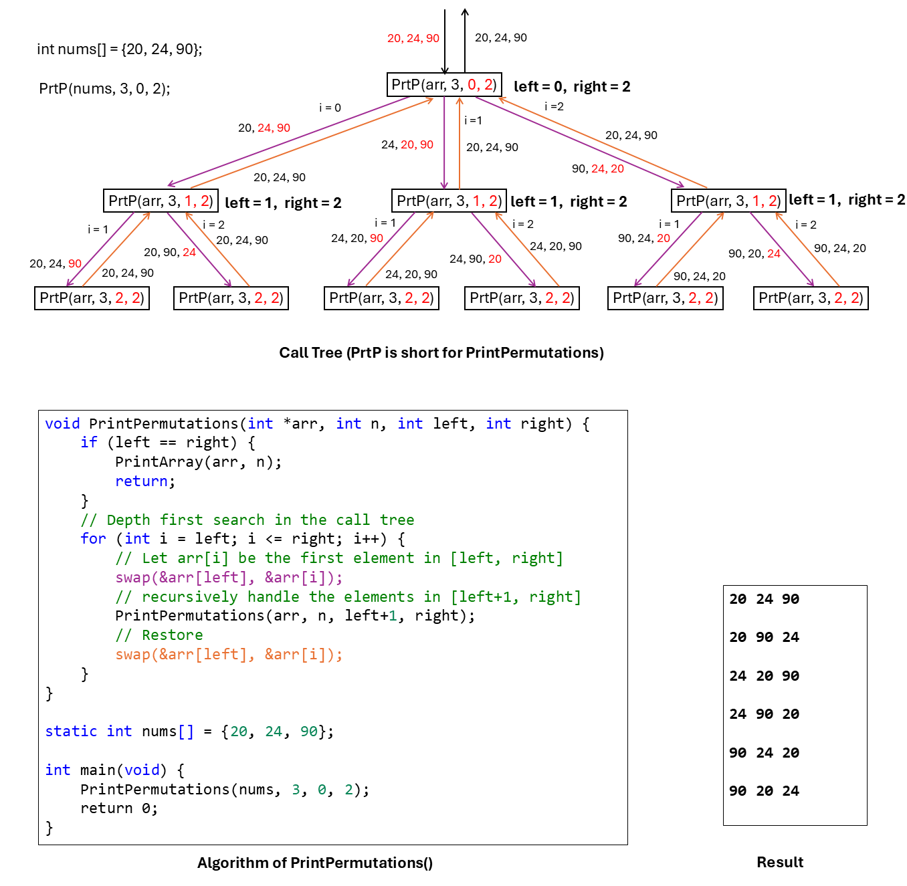

# Complexity

``` sh
/****************************************************************************************
                Complexity

    1.  Big O notation

    2.  Time complexity       

    3.  Space complexity

                                                                    COMP9024 24T2

 ******************************************************************************************/

``` 
## 1 Introduction

## 1.1 Big O notation (with a capital letter O, not a zero)

In computer science, Big O notation is a way of comparing rates of growth of different functions. 

It is often used to compare the efficiency of different algorithms, 

which is done by calculating how much time (**time complexity**) it takes to complete, and how much memory (**space complexity**) it consumes.

**The letter O is used because the rate of growth of a function is also referred to as its order.**

Suppose, given a problem of size **n**, an algorithm for it takes T(n) basic operations.

$T(n) = 2 \times (n^{2}) + 3 \times n + 4$

$T(n) = (n^{2}) \times (2 + \dfrac{3}{n} + \dfrac{4}{n^{2}}) \approx (n^{2}) \times 2$   

$n \to +\infty$ 

When n is very large, if we ignore the coefficient constant (i.e., 2) and slower growing items ($3 \times n$ and 4) in T(n),

we could say T(n) grows at the order of $n^{2}$.

So, the time needed is written/estimated/approximated as T(n) = O($n^{2}$).

## A list of classes of functions 

Notation|Name
:---:|:---:| 
$O(1)$|constant
$O(n)$|linear
$O(log(n))$|logarithmic
$O(n^2)$|quadratic
$O(n^3)$|cubic
$O(n^c)$|polynomial
$O(c^n)$|exponential


**c is some arbitrary constant while n is the size of the problem.**
## 1.2 Time Complexity


Time complexity in data structures and algorithms is about **counting**.

What we're counting is the number of basic operations performed by an algorithm in relation to the size of its input 
(often denoted by the variable 'n'). 

This measure helps us understand how the algorithm's performance scales with larger inputs.

For instance, in a sorting algorithm like [bubble sort](../../Tutorials/Week2/README.md), 

we might count how many comparisons, swaps, or iterations are needed to sort an array of a given size. 

Then, we express this count as a function of the input size (typically denoted by n). 

So, if an algorithm has a time complexity of $O(n^2)$,

it means that the number of basic operations grows quadratically with the size of the input.

## 1.2.1 Counting

- The number of iterations (for, while)

  ([COMP9024/Tutorials/Week2](../../Tutorials/Week2/src/BubbleSort.c))

- The number of function calls (recursive functions) 

  ([COMP9024/Stacks/Recursion](../../Stacks/Recursion/README.md))

- The size of the search space

  ([COMP9024/Trees/BiTree](../../Trees/BiTree/README.md))

When it's not immediately obvious how many iterations or function calls an algorithm will make, 

we can instead analyze the size of the problem's search space.

The search space refers to all the possible states that the algorithm needs to explore in order to find a solution.

For example, in traversing a binary tree with n nodes and (n-1) edges ($n \ge 1$), the time complexity is $O(n)$. 

**A tree with n nodes has (n-1) edges, where $n \ge 1$.**
```
Reason:

Every node, except the root, has exactly one incoming edge. 

As there are (n-1) nodes other than the root, there are (n-1) edges in a tree.

Example:

        + 
      /   \ 
    9000   * 
          /  \ 
         6    4 
```

### 1.2.2 Estimating the time needed in $O(n^3)$

**CPU Clock Rate or Frequency**

Given an algorithm with the time complexity $O(n^3)$, and a 4GHz CPU ($4 \times 10^{9}$ cpu clock cycles per second).

Let us optimistically assume that this CPU can complete $4 \times 10^{9}$ basic operations in a second.

**Suppose n = $10^6$**

When n is one million ($10^6$, 10 to the power of 6), how many seconds are needed for the CPU to complete the cubic algorithm?

**Number of basic operations in $O(n^3)$**

$n^{3} = (10^{6}) \times (10^{6}) \times (10^{6}) =10^{18}$

**Time estimated**

$n^{3} \div (4 \times 10^{9}) = 10^{18} \div (4 \times 10^{9}) = 2.5 \times 10^{8}$ seconds $\approx 2893.52$ days $\approx 7.93$ years

```
$ python3

>>> 2.5 * (10 ** 8) / 3600 / 24
2893.5185185185182

```
## 1.2.3 What about $O(2^n)$ when n is only 64 ?

$2^{10} = 1024 \approx 10^3$

$2^{64} = 2^4 \times 2^{10} \times 2^{10} \times 2^{10} \times 2^{10} \times 2^{10} \times 2^{10} \approx 16 \times 10^{18}$ basic operations

**Time estimated**

$2^{n} \div (4 \times 10^{9}) = 2^{64} \div (4 \times 10^{9}) \approx 16 \times 10^{18} \div (4 \times 10^{9})$ seconds $\approx 16 \times 7.93$ years $\approx 126.84$ years

``` C
#include <stdio.h>

void SeeYouIn22ndCentury(void) {
    // assume sizeof(long) == 8 bytes == 64 bits
    for (unsigned long i = 1; i != 0; i++) { // i is in [1, (2**64 - 1)], about (2**64) iterations needed
        // In fact, the basic operation, printf(), can't be finished in one CPU cycle
        printf("i = %lu\n", i);
    }
}

int main(void) {
    SeeYouIn22ndCentury();
    printf("Hello, 22nd or 32nd Century ???\n");
    return 0;
}
```
## 1.3 Space Complexity

Space complexity in algorithms is about how much memory is required by an algorithm to execute, expressed as a function of the input size. 

Space complexity is typically measured in terms of the maximum amount of memory space used during the execution of the algorithm. 

This includes not only the space required for storing the input data, but also any additional space needed for variables, data structures, and function calls.

For example, in algorithms like sorting or searching, space complexity might depend on the size of the input array or the size of the search space. 

In recursive algorithms (e.g, [COMP9024/Stacks/Recursion](../../Stacks/Recursion/README.md)), space complexity is often influenced by the depth of the recursion stack.

Space complexity is usually expressed using Big O notation, just like time complexity. 

For instance, an algorithm with a space complexity of $O(n)$ requires linear space relative to the input size n, 

while an algorithm with $O(1)$ space complexity requires constant space regardless of the input size.

For example, in [bubble sort](../../Tutorials/Week2/README.md), the memory space required for storing the input data (n integers in an array) is denoted as $O(n)$, 

but auxiliary (additional) space is $O(1)$ (meaning it is a const and does not depend on 'n').

## 2 How to download this project in [CSE VLAB](https://vlabgateway.cse.unsw.edu.au/)

Open a terminal (Applications -> Terminal Emulator)

```sh

$ git clone https://github.com/sheisc/COMP9024.git

$ cd COMP9024/Complexity/Counting

Counting$ 

```


## 3 How to start [Visual Studio Code](https://code.visualstudio.com/) to browse/edit/debug a project.


```sh

Counting$ code

```

Two configuration files (Counting/.vscode/[launch.json](https://code.visualstudio.com/docs/cpp/launch-json-reference) and Counting/.vscode/[tasks.json](https://code.visualstudio.com/docs/editor/tasks)) have been preset.


### 3.1 Open the project in VS Code

In the window of Visual Studio Code, please click "File" and "Open Folder",

select the folder "COMP9024/Complexity/Counting", then click the "Open" button.


### 3.2 Build the project in VS Code

click **Terminal -> Run Build Task**


### 3.3 Debug the project in VS Code

Open src/main.c, and click to add a breakpoint (say, line 239).

Then, click **Run -> Start Debugging**


### 3.4 Directory

```sh
├── Makefile             defining set of tasks to be executed (the input file of the 'make' command)
|
├── README.md            introduction to this tutorial
|
├── src                  containing *.c and *.h
|   |
│   |── main.c           algorithms with different complexities
|
└── .vscode              containing configuration files for Visual Studio Code
    |
    ├── launch.json      specifying which program to debug and with which debugger,
    |                    used when you click "Run -> Start Debugging"
    |
    └── tasks.json       specifying which task to run (e.g., 'make' or 'make clean')
                         used when you click "Terminal -> Run Build Task" or "Terminal -> Run Task"
```

Makefile is discussed in [COMP9024/C/HowToMake](../../C/HowToMake/README.md).


## 4 The main procedure

**In addition to utilizing VS Code, we can also compile and execute programs directly from the command line interface as follows.**

``` sh

Counting$ make

Counting$ ./main

*******************  GetArrayElement(): O(1) **********************
val = 10

*******************  GetSum(): O(n) **********************
sum = 360

*******************  Binary Search: O(log(n)) **********************
left = 0, mid = 3, right = 7
left = 4, mid = 5, right = 7
left = 6, mid = 6, right = 7
left = 7, mid = 7, right = 7

pos = -1

*******************  PrintMatrix: O(n*n) **********************
       2        0        0        1 
       0        3        0        2 
       0        0        1        3 
       0        0        0        1 

*******************  PrintMatrix: O(n*n) **********************
      10       20       30       40 
      10       20       30       40 
      10       20       30       40 
       1        1        1        1 

*******************  SquareMatrixMultiply: O(n*n*n) **********************


*******************  PrintMatrix: O(n*n) **********************
      21       41       61       81 
      32       62       92      122 
      13       23       33       43 
       1        1        1        1 


************************************************************************
20 24 90 

*******************  PrintSubSets: O(n*(2**n))    **********************
{ }
{ 20 }
{ 24 }
{ 20 24 }
{ 90 }
{ 20 90 }
{ 24 90 }
{ 20 24 90 }

*******************  PrintPermutations: O(n*(n!)) **********************
20 24 90 
20 90 24 
24 20 90 
24 90 20 
90 24 20 
90 20 24 


************************************************************************
20 24 90 


```
## 5 BinarySearch()

```sh
   Time complexity:
        O(log(n))

    Binary search, also known as half-interval search or logarithmic search, 
    is a search algorithm that finds the position of a target value within a sorted array. 
    It compares the target value to the middle element of the array.

    In this function, the input array should be sorted in an ascending order.

        arr[0], arr[1], ..., arr[n-1]
    
    @return 
        the index of the array element whose value is @targetVal, if found;
        otherwise, -1 is returned.       

    Suppose n is 8,  where log(8) == 3

    Pass 1:

        arr[0]  arr[1]  arr[2]  arr[3]  arr[4]  arr[5]  arr[6]  arr[7]

        mid = (0 + 7) / 2 = 3        

    Pass 2:

        arr[4]  arr[5]  arr[6]  arr[7]

        mid = (4 + 7) / 2 = 5
      
    Pass 3:
        arr[6]  arr[7]  
        
        mid = (6 + 7) / 2 = 6

    Pass 4:
        arr[7]

        mid = (7 + 7) / 2 = 7

    
    At most (log(n) + 1) iterations needed in the while loop, as we always choose 
    the larger half interval (worse case) in each pass.

    So, the time complexity of binary search is O(log(n)).
```
```C
int BinarySearch(int *arr, int n, int targetVal) {
    int left = 0;
    int right = n - 1;
    printf("*******************  Binary Search: O(log(n)) **********************\n");

    while (left <= right) {
        int mid = (left + right) / 2;
        printf("left = %d, mid = %d, right = %d\n", left, mid, right);

        if (arr[mid] == targetVal) {
            return mid;
        }

        if (arr[mid] < targetVal) {
            left = mid + 1;
        } else {
            right = mid - 1;
        }
    }
    // Not found
    return -1;
}

```

## 6 PrintSubSets()
```sh
    Time complexity:

        O(n*(2**n))

    To simplify, let's assume that all elements in the array arr are distinct from each other.

    arr[3] = {20, 24, 90}

    ----------------------------
    curVal      SubSet
    ----------------------------
    000         {}
    001         {20}
    010         {24}
    011         {20, 24}
    100         {90}
    101         {20, 90}
    110         {24, 90}
    111         {20, 24, 90}
    ---------------------------- 
```

```C
void PrintSubSets(int *arr, int n) {
    printf("*******************  PrintSubSets: O(n*(2**n))    **********************\n");
    // (1 << n) is  2**n
    unsigned int maxVal = (1 << n);
    // assert(n < 32);
    // printf("sizeof(maxVal) * 8 = %ld\n", sizeof(maxVal) * 8);
    assert(n < (sizeof(maxVal) * 8));

    for (unsigned int curVal = 0; curVal < maxVal; curVal++) { // (2**n) iterations
        // 
        printf("{ ");
        for (int i = 0; i < n; i++) {   // n iterations
             if ((curVal & (1 << i)) != 0) {
                printf("%d ", arr[i]);
             }
        }
        printf("}\n");
    }
}

```

## 7 [PrintPermutations()](./src/main.c)

 

### 7.1 Call Tree

A call tree, in the context of computer science and software development, refers to a hierarchical representation of function or method calls within a program. 

The call tree has not really been created during the execution of this program.

It is used to analyze and illustrate the flow of execution as functions or procedures call each other during the runtime of the program. 

Usually, there is an edge between a caller function and a callee function in a call tree.

In this example, to display the values of 'int nums[]' before a function all and after a function call, 

we add two edges between a caller and a callee: one from the caller to the callee, and the other from the callee to the caller.

Strictly speaking, it is not a tree any more.

### 7.2 Analysis of time complexity

### Number of recursive function calls in PrintPermutations(arr, 3, 0, 2)

$3! \times (1 + \dfrac{1}{2} + \dfrac{1}{2 \times 3})  = 3! \times (1 + \dfrac{1}{2!} + \dfrac{1}{3!}) = 10 $

### Number of recursive function calls in PrintPermutations(arr, 4, 0, 3)

$4 \times (3! \times (1 + \dfrac{1}{2!} + \dfrac{1}{3!})) + 1  = 4! \times (1 + \dfrac{1}{2!} + \dfrac{1}{3!}) + 4! \times \dfrac{1}{4!} = 4! \times (1 + \dfrac{1}{2!} + \dfrac{1}{3!} + \dfrac{1}{4!}) $

### ...

### Number of recursive function calls in PrintPermutations(arr, n, 0, n-1)

$n! \times (1 + \dfrac{1}{2!} + \dfrac{1}{3!} + ... + \dfrac{1}{n!}) $

[Mathematical induction](https://en.wikipedia.org/wiki/Mathematical_induction) can be used for a formal proof.

### [Maclaurin Series](https://mathworld.wolfram.com/MaclaurinSeries.html)

$e^{x} = 1 + x + \dfrac{x^{2}}{2!} + \dfrac{x^{3}}{3!} + ... + \dfrac{x^{n}}{n!} + ...$

When $x=1$, we have:

$e^{1} = 1 + (1 + \dfrac{1^{2}}{2!} + \dfrac{1^{3}}{3!} + ... + \dfrac{1^{n}}{n!}) + ...$

where **e** is a mathematical constant, approximately equal to 2.71828 ([Euler's number](https://en.wikipedia.org/wiki/E_(mathematical_constant))).

$1 + \dfrac{1}{2!} + \dfrac{1}{3!} + ... + \dfrac{1}{n!} < (e - 1)$

$n! \times (1 + \dfrac{1}{2!} + \dfrac{1}{3!} + ... + \dfrac{1}{n!}) < (n! \times (e-1))$


If we ignore the constant (e-1) in $n! \times (e-1)$,

the number of recursive function calls in PrintPermutations(arr, n, 0, n-1) can be represented as O(n!).

BTW, the time complexity in PrintArray() is $O(n)$.

**So, the time complexity of PrintPermutations(arr, n, 0, n-1) is $O(n \times n!)$.**
