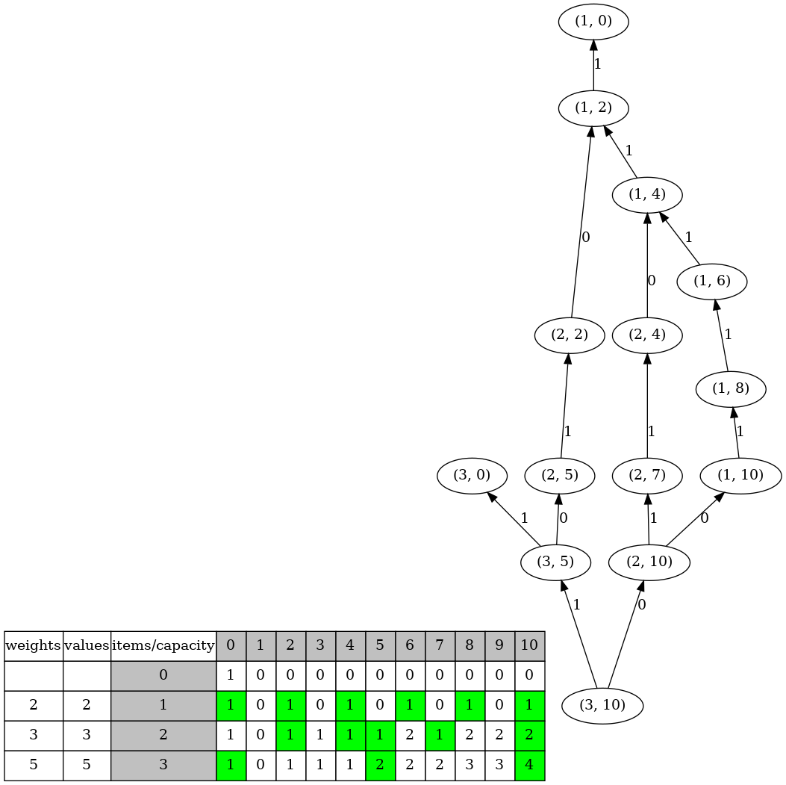

# The Coin Change Problem

|Only one 0-cent coin| Infinite 2-cent coins |Infinite 3-cent coins| Infinite 5-cent coins|
|:-------------:|:-------------:|:-------------:|:-------------:|
|  | | | |


### Different combinations of 10 cents using 2-cent, 3-cent, and 5-cent coins 

#### 10 = 5 + 5
| | | 
|:-------------:|:-------------:|
| | |

#### 10 = 5 + 3 + 2
| | | |
|:-------------:|:-------------:|:-------------:|
| | | |

#### 10 = 3 + 3 + 2 + 2
| | | ||
|:-------------:|:-------------:|:-------------:|:-------------:|
| | | | |

#### 10 = 2 + 2 + 2 + 2 + 2
| | | |||
|:-------------:|:-------------:|:-------------:|:-------------:|:-------------:|
| | | | | |

### make view 

```sh
Coins$ make view

find ./images -name "*.png" | sort | xargs feh -g 1024x768  &
```


### Output
```sh
Coins$ make
Coins$ ./main

  weights   values     item        0        1        2        3        4        5        6        7        8        9       10
                                   1        0        0        0        0        0        0        0        0        0        0
        2        2        1        1        0        1        0        1        0        1        0        1        0        1
        3        3        2        1        0        1        1        1        1        2        1        2        2        2
        5        5        3        1        0        1        1        1        2        2        2        3        3        4

Choices: 5 5 
Choices: 5 3 2 
Choices: 3 3 2 2 
Choices: 2 2 2 2 2 


```

### The dynamic programming table and the DAG for making choices

The Directed Acyclic Graph (DAG) is derived from the dynamic programming table and introduced for convenience in visualizing the algorithm.

Depth first search in the DAG can generate all the paths from root, node (3, 10), to leaf nodes (e.g., nodes (3, 0) and (1, 0) ).

For example, the following path represents the choices {item 3, item 2, item 1},  i.e., {5, 3, 2}.
```sh
          1             0            1            0           1
(3, 10)  --->  (3, 5)  ---> (2, 5)  ---> (2, 2)  ---> (1, 2) ---> (1, 0)

 ^                           ^                         ^
 item 3                      item 2                    item 1
```
| | 
|:-------------:|
|  |


The only 0-cent coin is introduced to explain the column 0 in the above table.
|Only one 0-cent coin| 
|:-------------|
|  |

|table(item number, capacity) |     meaning|
|:-------------|:-------------|
|table(0, 0) == 1 | There is 1 combination of 0 cents, i.e., using the only 0-cent coin|
|table(0, 1) == 0 | There is 0 combination of 1 cents using the only 0-cent coin|
|table(1, 0) == 1 | There is 1 combination of 0 cents using 2-cent coins, plus the only 0-cent coin|
|table(2, 0) == 1 | There is 1 combination of 0 cents using 2-cent and 3-cent coins, plus the only 0-cent coin|
|table(3, 0) == 1 | There is 1 combination of 0 cents using 2-cent, 3-cent, and 5-cent coins, plus the only 0-cent coin|
|table(1, 10) == 1 | There is 1 combination of 10 cents using 2-cent coins, plus the only 0-cent coin|
|table(2, 10) == 2 | There are 2 combinations of 10 cents using 2-cent and 3-cent coins, plus the only 0-cent coin|
|table(3, 10) == 4 | There are 4 combinations of 10 cents using 2-cent, 3-cent, and 5-cent coins, plus the only 0-cent coin|
|table(3, 5) == 2 | There are 2 combinations of 5 cents using 2-cent, 3-cent, and 5-cent coins, plus the only 0-cent coin|
|table(3, 10) == table(3, 5) + table(2, 10) | The combinations of table(3, 5) after adding one 5-cent coin, plus combinations of table(2, 10);|
| | table(3, 5) represents the combinations of 5 cents using 2-cent, 3-cent, and 5-cent coins, plus the only 0-cent coin;|
| | table(2, 10) represents the combinations of 10 cents using 2-cent, and 3-cent coins, plus the only 0-cent coin.|
| | Note that multiple copies of item 3 can be used|
|table(3, 4) == table(2, 4) | No space for adding 5-cent coins (item 3) when the capacity is 4; |
| |the combinations of table(3, 4) are the same as the combinations of table(2, 4) |
|table(2, 2) == table(1, 2) | No space for adding 3-cent coins (item 2) when the capacity is 2; |
| |the combinations of table(2, 2) are the same as the combinations of table(1, 2) |
|table(1, 1) == table(0, 1) | No space for adding 2-cent coins (item 1) when the capacity is 1; |
| |the combinations of table(1, 1) are the same as the combinations of table(0, 1) |
