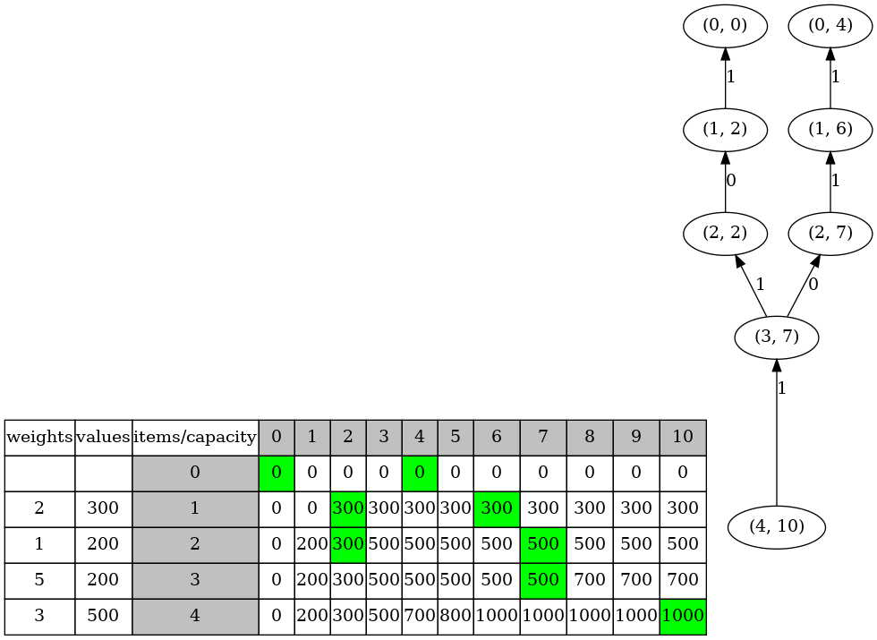

# The 0/1 Knapsack Problem


The 0/1 Knapsack Problem is a classic problem in computer science and optimization. 

It involves a scenario where you need to select items to maximize the total value, while ensuring that their combined weight does not exceed a given limit (the knapsack's capacity). 

The problem is called 0/1 because each item can either be included (1) or excluded (0) from the knapsack.

For instance, given the following four items.

|items | weights | values |  
|:-------------:|:-------------:|:-------------:|
|item 1 | 2 kg | $300|
|item 2 | 1 kg | $200|
|item 3 | 5 kg | $200|
|item 4 | 3 kg | $500|

When the capacity of a knapsack is 10 kg, the maximum value is $1000.

```sh
 {item 4, item 3, item 1} == {500, 200, 300}

 {item 4, item 2, item 1} == {500, 200, 300}
```


### make view 

```sh
Knapsack$ make view

find ./images -name "*.png" | sort | xargs feh -g 1024x768  &
```


### Output
```sh
Knapsack$ make
Knapsack$ ./main

  weights   values     item        0        1        2        3        4        5        6        7        8        9       10
                                   0        0        0        0        0        0        0        0        0        0        0
        2      300        1        0        0      300      300      300      300      300      300      300      300      300
        1      200        2        0      200      300      500      500      500      500      500      500      500      500
        5      200        3        0      200      300      500      500      500      500      500      700      700      700
        3      500        4        0      200      300      500      700      800     1000     1000     1000     1000     1000

Choices: 4 3 1 
Choices: 4 2 1 

```

### The dynamic programming table and the DAG for making choices

The Directed Acyclic Graph (DAG) is derived from the dynamic programming table and introduced for convenience in visualizing the algorithm.

Depth first search in the DAG can generate all the paths from root, node (4, 10), to leaf nodes (e.g., nodes (0, 0) and (0, 4) ).

For example, the following path represents the choices {item 4, item 2, item 1},  i.e., {500, 200, 300}.
```sh
          1             0            1            1           
(4, 10)  --->  (3, 7)  ---> (2, 7)  ---> (1, 6)  ---> (0, 4)

 ^                           ^            ^
 item 4                      item 2       item 1
```
| | 
|:-------------:|
|  |


|table(item number, capacity) |     meaning|
|:-------------|:-------------|
|table(0, 0) == 0 | The maximum value is 0 when the capacity is 0 and no item is available|
|table(0, 1) == 0 | The maximum value is 0 when the capacity is 1 and no item is available|
|table(0, 10) == 0 | The maximum value is 0 when the capacity is 10 and no item is available|
|table(1, 0) == 0 | The maximum value is 0 when the capacity is 0 and item 1 is available|
|table(2, 0) == 0 | The maximum value is 0 when the capacity is 0 and item 1, and item 2 are available|
|table(3, 0) == 0 | The maximum value is 0 when the capacity is 0 and item 1, item 2, and item 3 are available|
|table(4, 0) == 0 | The maximum value is 0 when the capacity is 0 and item 1, item 2, item 3, and item 4 are available|
|table(4, 10) == 1000 | The maximum value is max(table(3, 10 - 3) + value(item 4), table(3, 10)) when the capacity is 10 and item 1, item 2, item 3, and item 4 are available |
| |  That is, max(item 4 included, item 4 excluded).  |
| | The weight of item 4 is 3.|
|table(3, 7) == 500 | The maximum value is max(table(2, 7 - 5) + value(item 3), table(2, 7)) when the capacity is 7 and item 1, item 2, and item 3 are available |
| |  That is, max(item 3 included, item 3 excluded). |
| | The weight of item 3 is 5. |
| |  Here, table(2, 7 - weight(item 3)) + value(item 3)  == table(2, 7), resulting in two edges in the DAG (from (3, 7) to (2, 2) and (2, 7)). |
|table(4, 2) == table(3, 2) | No space for item 4 (with the weight of 3) when the capacity is 2|
|table(3, 4) == table(2, 4) | No space for item 3 (with the weight of 5) when the capacity is 4|


### How to create the dynamic programming table and the DAG for making choices

#### Method 1: Bottom-up tabulation

```C
long SolveKnapsackTabulation(struct KnapsackInfo *pKnapsack, long n, long cap) {
    assert(n >= 0 && n <= pKnapsack->numOfItems && cap >= 0 && cap <= pKnapsack->capacity);

    if (DpTableElement(pKnapsack, n, cap) != KNAPSACK_INVALID_VALUE) {
        return DpTableElement(pKnapsack, n, cap);
    }

    // row 0
    for (long col = 0; col <= pKnapsack->capacity; col++) {
        DpTableElement(pKnapsack, 0, col) = 0;
    }
    // col 0
    for (long row = 0; row <= pKnapsack->numOfItems; row++) {
        DpTableElement(pKnapsack, row, 0) = 0;
    }    
    // other rows
    for (long row = 1; row <= pKnapsack->numOfItems; row++) {
        for (long col = 1; col <= pKnapsack->capacity; col++) {
            if (col < ItemWeight(pKnapsack, row)) {
                DpTableElement(pKnapsack, row, col) = DpTableElement(pKnapsack, row - 1, col);
                if (DpTableElement(pKnapsack, row, col) > 0) {
                    DpDagNode(pKnapsack, row, col).excluded = &DpDagNode(pKnapsack, row - 1, col);
                }
            } else {
                long k = col - ItemWeight(pKnapsack, row);
                long included = ItemValue(pKnapsack, row) + DpTableElement(pKnapsack, row - 1, k);
                long excluded = DpTableElement(pKnapsack, row - 1, col);
                long max;
                // set the dag node to remember the choices
                if (included > excluded ) {
                    max = included;
                    if (max > 0) {
                        DpDagNode(pKnapsack, row, col).included = &DpDagNode(pKnapsack, row - 1, k);
                    }
                } else if (included < excluded) {
                    max = excluded;
                    if (max > 0) {
                        DpDagNode(pKnapsack, row, col).excluded = &DpDagNode(pKnapsack, row - 1, col);
                    }
                } else { // included == excluded
                    max = included;
                    if (max > 0) {
                        DpDagNode(pKnapsack, row, col).included = &DpDagNode(pKnapsack, row - 1, k);
                        DpDagNode(pKnapsack, row, col).excluded = &DpDagNode(pKnapsack, row - 1, col);
                    }
                }
                DpTableElement(pKnapsack, row, col) = max;
            }
        }
    }
    return DpTableElement(pKnapsack, n, cap);
}

```

#### Method 2: Top-down memorization
```C
long SolveKnapsackMem(struct KnapsackInfo *pKnapsack, long n, long cap) {
    assert(n >= 0 && n <= pKnapsack->numOfItems && cap >= 0 && cap <= pKnapsack->capacity);

    if (DpTableElement(pKnapsack, n, cap) != KNAPSACK_INVALID_VALUE) {
        return DpTableElement(pKnapsack, n, cap);
    }
    
    if (n == 0 || cap == 0) {
        DpTableElement(pKnapsack, n, cap) = 0;
    } else if (ItemWeight(pKnapsack, n) > cap) {
        DpTableElement(pKnapsack, n, cap) = SolveKnapsackMem(pKnapsack, n - 1, cap);
        if (DpTableElement(pKnapsack, n, cap) > 0) {
            DpDagNode(pKnapsack, n, cap).excluded = &DpDagNode(pKnapsack, n - 1, cap);
        }
    } else {
        long k = cap - ItemWeight(pKnapsack, n);
        long included = ItemValue(pKnapsack, n) + SolveKnapsackMem(pKnapsack, n - 1, k);
        long excluded = SolveKnapsackMem(pKnapsack, n - 1, cap);
        long max;
        // set the dag node to remember the choices
        if (included > excluded) {
            max = included;
            if (max > 0) {
                DpDagNode(pKnapsack, n, cap).included = &DpDagNode(pKnapsack, n - 1, k);
            }            
        } else if (included < excluded) {
            max = excluded;
            if (max > 0) {
                DpDagNode(pKnapsack, n, cap).excluded = &DpDagNode(pKnapsack, n - 1, cap);
            }           
        } else {
            max = included;
            if (max > 0) {
                DpDagNode(pKnapsack, n, cap).included = &DpDagNode(pKnapsack, n - 1, k);
                DpDagNode(pKnapsack, n, cap).excluded = &DpDagNode(pKnapsack, n - 1, cap);
            }          
        }
        DpTableElement(pKnapsack, n, cap) = max;
    }
    return DpTableElement(pKnapsack, n, cap);
}
```


