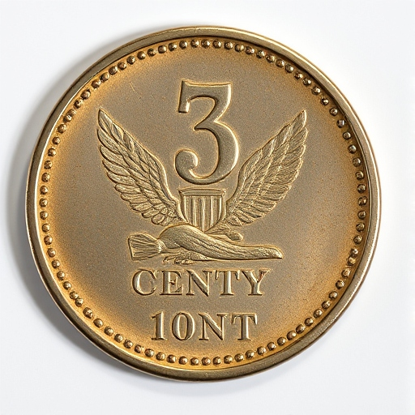
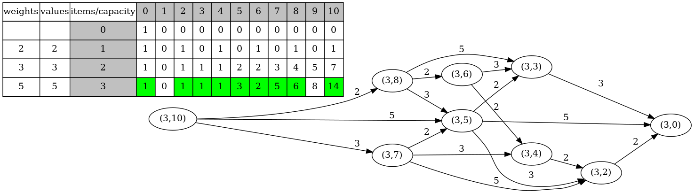

# Coin Change 

Given n types of coins and a target sum, the task is to count all possible permutatons to make that sum using the coins.

Suppose we have the following coins and want to find different permutatons to make a total of 10 cents.

| Infinite 2-cent coins |Infinite 3-cent coins| Infinite 5-cent coins|
|:-------------:|:-------------:|:-------------:|
| | | |


### Different permutatons of 10 cents using 2-cent, 3-cent, and 5-cent coins 

```sh
Choices: 2 2 2 2 2 
Choices: 2 2 3 3 
Choices: 2 3 2 3 
Choices: 2 3 3 2 
Choices: 2 3 5 

Choices: 2 5 3 
Choices: 3 2 2 3 
Choices: 3 2 3 2 
Choices: 3 2 5 
Choices: 3 3 2 2 

Choices: 3 5 2 
Choices: 5 2 3 
Choices: 5 3 2 
Choices: 5 5 

```

### make view 

```sh
Coins$ make view

find ./images -name "*.png" | sort | xargs feh -g 1024x768  &
```


### Output
```sh
Coins$ make
Coins$ ./main

  weights   values     item        0        1        2        3        4        5        6        7        8        9       10
                                   1        0        0        0        0        0        0        0        0        0        0
        2        2        1        1        0        1        0        1        0        1        0        1        0        1
        3        3        2        1        0        1        1        1        2        2        3        4        5        7
        5        5        3        1        0        1        1        1        3        2        5        6        8       14

```

### The dynamic programming table and the DAG for making choices

The Directed Acyclic Graph (DAG) is derived from the dynamic programming table and introduced for convenience in visualizing the algorithm.

Depth first search in the DAG can generate all the paths from root to leaf nodes.

For example, the following path represents the choices {2, 3, 5}.
```sh
          2             3            5            
(3, 10)  --->  (3, 8)  ---> (3, 5)  ---> (3, 0)


```
| | 
|:-------------:|
|  |

#### Motivation


```sh
    Given coins = {2, 3, 5} and the target sum m,
    the number of permutations can be seen as

        f(m) = f(m-2) + f(m-3) + f(m-5)
    
    Edges added:
             2
        f(m) --> f(m-2)

             3
        f(m) --> f(m-3)

             5 
        f(m) --> f(m-5)
```
The 0-cent coin is introduced solely as a catalyst to explain the column labeled '0' in the table above.

|Only one 0-cent coin| 
|:-------------|
|  |

### How to create the dynamic programming table

#### Method 1: Bottom-up tabulation

```C
long SolveKnapsackTabulation(struct KnapsackInfo *pKnapsack, long n, long cap) {
    assert(n >= 0 && n <= pKnapsack->numOfItems && cap >= 0 && cap <= pKnapsack->capacity); 

    if (DpTableElement(pKnapsack, n, cap) != KNAPSACK_INVALID_VALUE) {
        return DpTableElement(pKnapsack, n, cap);
    }
         
    // row 0    
    for (long col = 1; col <= pKnapsack->capacity; col++) {
        DpTableElement(pKnapsack, 0, col) = 0;
    }
    // col 0
    for (long row = 0; row <= pKnapsack->numOfItems; row++) {
        DpTableElement(pKnapsack, row, 0) = 1;
    }
    // other rows
    for (long row = 1; row <= pKnapsack->numOfItems; row++) {
        for (long col = 1; col <= pKnapsack->capacity; col++) {
            /*
                (1) row == 1
                    
                    DpTableElement(row, col) = DpTableElement(row, col - ItemWeight(item1))

                (2) row == 2
                  
                    DpTableElement(row, col) = DpTableElement(row, col - ItemWeight(item1)) 
                                               +
                                               DpTableElement(row, col - ItemWeight(item2))
                (3) row == 3

                    DpTableElement(row, col) = DpTableElement(row, col - ItemWeight(item1)) 
                                               +
                                               DpTableElement(row, col - ItemWeight(item2))
                                               +
                                               DpTableElement(row, col - ItemWeight(item3))                           
             */
            long sum = 0;
            for (long item = 1; item <= row; item++) {
                long k = col - ItemWeight(pKnapsack, item);
                if (k >= 0) {
                    sum += DpTableElement(pKnapsack, row, k);
                }
            }
            DpTableElement(pKnapsack, row, col) = sum;       
        }
    }
    return DpTableElement(pKnapsack, n, cap);
}
```

#### Method 2: Top-down memorization
```C
long SolveKnapsackMem(struct KnapsackInfo *pKnapsack, long n, long cap) {
    // 
    assert(n >= 0 && n <= pKnapsack->numOfItems && cap <= pKnapsack->capacity);

    if (cap < 0) {
        return 0;
    }
    
    if (DpTableElement(pKnapsack, n, cap) != KNAPSACK_INVALID_VALUE) {
        return DpTableElement(pKnapsack, n, cap);
    }    

    if (cap == 0) {
        DpTableElement(pKnapsack, n, cap) = 1;
    } else if (n == 0){
        DpTableElement(pKnapsack, n, cap) = 0;
    } else {
        long sum = 0;
        for (long row = 1; row <= n; row++) {
            sum += SolveKnapsackMem(pKnapsack, n, cap - ItemWeight(pKnapsack, row));
        }
        DpTableElement(pKnapsack, n, cap) = sum;
    }
    return DpTableElement(pKnapsack, n, cap);
}
```