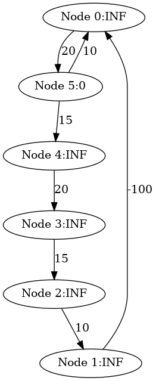
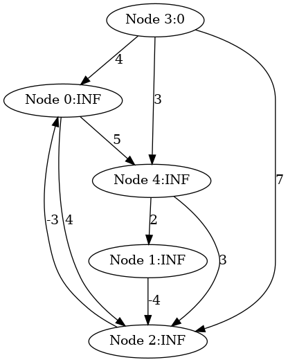
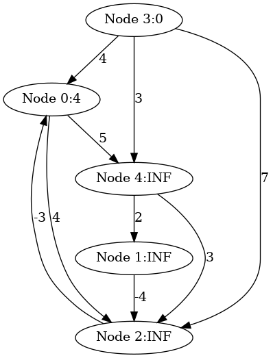
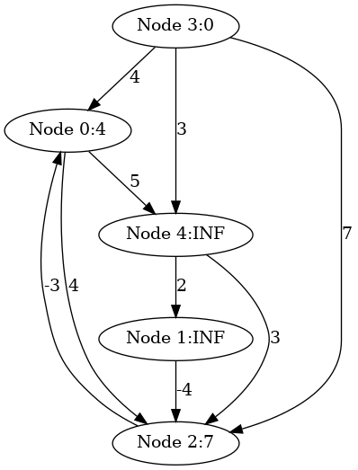
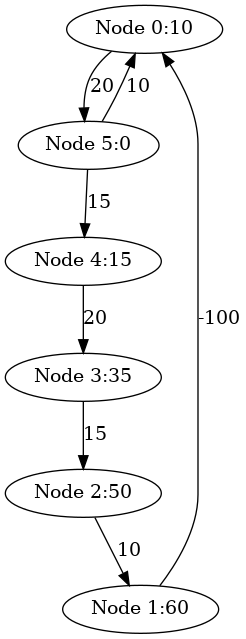
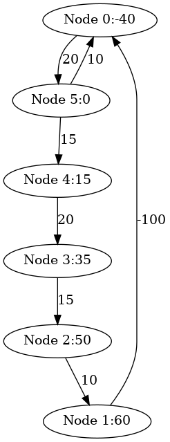
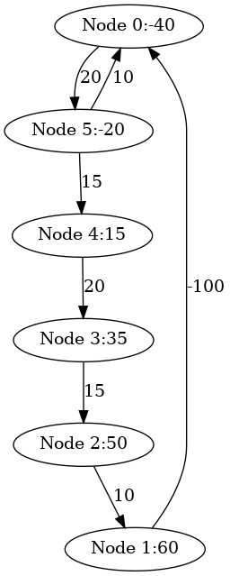

# BellmanFord's algorithm


### Introducton

The Bellman-Ford algorithm is a single-source shortest-path algorithm for graphs that may have negative weight edges. 

It can also detect negative weight cycles in the graph, which is a key feature that distinguishes it from other shortest-path algorithms like Dijkstra’s.

#### Motivation
- Check all edges (n-1) times to calculate the shortest distances, where n is the number of nodes
- Check all edges one more time to detect negative cycles

Suppose edges are checked in ascending order of their source nodes.

### make view

**Ensure that you have executed 'make' and './main' before 'make view'.**


```sh
BellmanFord$ make view
find ./images -name "*.png" | sort | xargs feh -g 720x540 &
```

**Click on the window of 'feh' or use your mouse scroll wheel to view images**.

Here, **feh** is an image viewer available in [CSE VLAB](https://vlabgateway.cse.unsw.edu.au/).


| Initial: starting from Node 5 | 
|:-------------:|
|  |  

### Suppose edges are checked in ascending order of their source nodes

| Pass 1: after checking all edges | Pass 2: after checking all edges | Pass 3: after checking all edges |
|:-------------:|:-------------:|:-------------:|
|  |   |   |


| Pass 4: after checking all edges | Pass 5: after checking all edges | One more pass: negative cycles found | 
|:-------------:|:-------------:|:-------------:|
|  |   |  | 


### Output

```sh

BellmanFord() starting from node 5:

Negative cycles detected.

```

