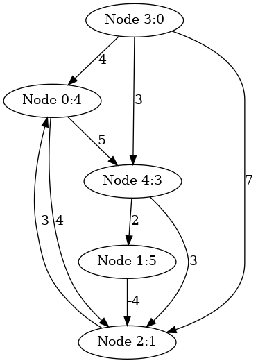
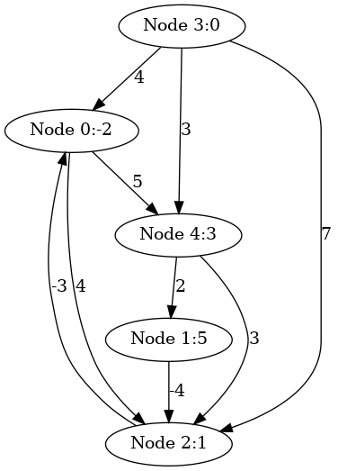

# BellmanFord's algorithm

``` sh
/*******************************************************************
                BellmanFord's algorithm 

    1.  How to use BellmanFord's Algorithm to get the shortest distances 


                                             COMP9024 24T2

 *******************************************************************/
``` 
### Introducton

The Bellman-Ford algorithm is a single-source shortest-path algorithm for graphs that may have negative weight edges. 

It can also detect negative weight cycles in the graph, which is a key feature that distinguishes it from other shortest-path algorithms like Dijkstra’s.

### make view

**Ensure that you have executed 'make' and './main' before 'make view'.**


```sh
BellmanFord$ make view
find ./images -name "*.png" | sort | xargs feh -g 720x540 &
```

**Click on the window of 'feh' or use your mouse scroll wheel to view images**.

Here, **feh** is an image viewer available in [CSE VLAB](https://vlabgateway.cse.unsw.edu.au/).


| Initial | 
|:-------------:|
|  |  


| Step 1 |  Step 2 | 
|:-------------:|:-------------:|
|  |   | 


| Step 3 |  Step 4 | 
|:-------------:|:-------------:|
|  |   | 

| Step 5 |  Step 6 | 
|:-------------:|:-------------:|
|  |   | 

| Step 7 |  Step 8 | 
|:-------------:|:-------------:|
|  |   | 


### Output

```sh

BellmanFord() starting from node 3:

The shortest path from node 3 to node 0: -2
	3 --> 4 --> 1 --> 2 --> 0

The shortest path from node 3 to node 1: 5
	3 --> 4 --> 1

The shortest path from node 3 to node 2: 1
	3 --> 4 --> 1 --> 2

The shortest path from node 3 to node 3: 0
	3

The shortest path from node 3 to node 4: 3
	3 --> 4


```

