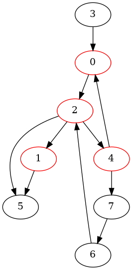
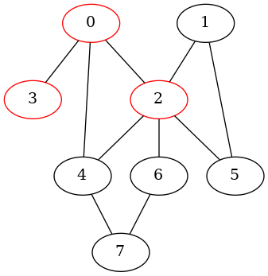
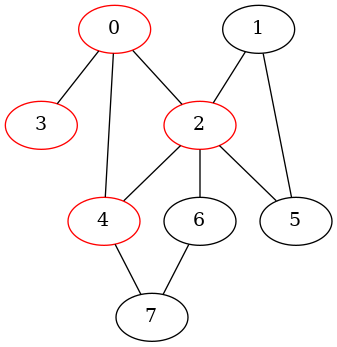
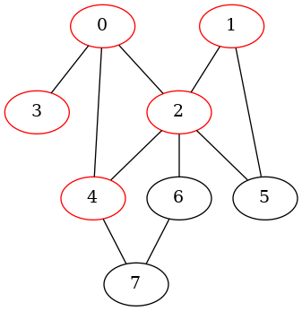
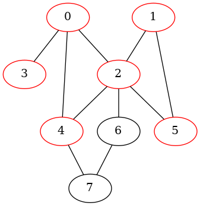
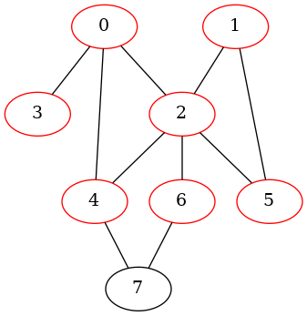
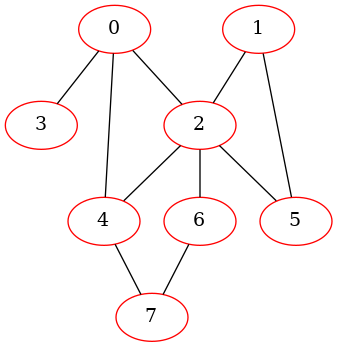

# Breadth First Search

``` sh
/*******************************************************************
                Breadth First Search

    1.  How to perform a breadth first search in a directed graph

    2.  How to perform a breadth first search in an undirected graph


                                             COMP9024 24T2

 *******************************************************************/
``` 

### Introduction

Breadth First Search (BFS) is a fundamental algorithm used in graph or tree traversal. 

It explores all nodes at the present "depth" level before moving on to nodes at the next depth level. 

This approach visits nodes level by level (layer by layer).


We have discussed the format of dot files in [COMP9024/Graphs](../../Graphs/Dot2Png/README.md), how to create a directed graph in [COMP9024/Graphs/DirectedGraph](../../Graphs/DirectedGraph/README.md), and how to create an undirected graph in [COMP9024/Graphs/UndirectedGraph](../../Graphs/UndiirectedGraph/README.md).


#### Breadth First Search (BFS) is based on a queue:

BFS uses a [queue](../../Queues/Queue_LL/README.md) data structure to facilitate its exploration strategy. 

The queue operates on a First-In-First-Out (FIFO) principle, meaning nodes are processed in the order they are added.

Breadth First Search propagates like ripples.

|BFS|
|:-------------:|
|  |  

#### Non-recursive Depth First Search (DFS) is based on a stack

Non-recursive DFS (in [Tutorial 4](../../Tutorials/Week5/README.md)) uses an explicit [stack](../../Stacks/Stack_LL/README.md) data structure. 

Unlike the recursive implementation that relies on the [call stack](../../Stacks/Recursion/README.md), the non-recursive approach uses a stack to keep track of nodes to be visited.

DFS goes as deep as possible from the starting node before backtracking to explore other branches.

|[DFS](https://sheisc.github.io/slides/COMP9024/24T2/week10/maze.html)|
|:-------------:|
|  |

## 1 How to download Tutorials in [CSE VLAB](https://vlabgateway.cse.unsw.edu.au/)

Open a terminal (Applications -> Terminal Emulator)

```sh

$ git clone https://github.com/sheisc/COMP9024.git

$ cd COMP9024/Graphs/BreadthFirstSearch

BreadthFirstSearch$ 

```


## 2 How to start [Visual Studio Code](https://code.visualstudio.com/) to browse/edit/debug a project.


```sh

BreadthFirstSearch$ code

```

Two configuration files (BreadthFirstSearch/.vscode/[launch.json](https://code.visualstudio.com/docs/cpp/launch-json-reference) and BreadthFirstSearch/.vscode/[tasks.json](https://code.visualstudio.com/docs/editor/tasks)) have been preset.


### 2.1 Open the project in VS Code

In the window of Visual Studio Code, please click "File" and "Open Folder",

select the folder "COMP9024/Graphs/BreadthFirstSearch", then click the "Open" button.


### 2.2 Build the project in VS Code

click **Terminal -> Run Build Task**


### 2.3 Debug the project in VS Code

Open src/main.c, and click to add a breakpoint (say, line 11).

Then, click **Run -> Start Debugging**


### 2.4 Directory

```sh
├── Makefile             defining set of tasks to be executed (the input file of the 'make' command)
|
├── README.md            introduction to this tutorial
|
├── images               *.dot and *.png files generated by this program
|
├── src                  containing *.c and *.h
|    |
|    ├── Graph.c         containing the code for the directed/undirected Graph
|    ├── Graph.h
|    ├── Queue.c         For BFS   
|    ├── Queue.h
|    ├── main.c          main()
|
└── .vscode              containing configuration files for Visual Studio Code
    |
    ├── launch.json      specifying which program to debug and with which debugger,
    |                    used when you click "Run -> Start Debugging"
    |
    └── tasks.json       specifying which task to run (e.g., 'make' or 'make clean')
                         used when you click "Terminal -> Run Build Task" or "Terminal -> Run Task"
```
Makefile is discussed in [COMP9024/C/HowToMake](../../C/HowToMake/README.md).


## 3 The procedure of BFS in a directed graph


### 3.1 Observe the procedure of BFS via 'make view'

**Click on the window of 'feh' or use your mouse scroll wheel to view images**.

Here, **feh** is an image viewer available in [CSE VLAB](https://vlabgateway.cse.unsw.edu.au/).

**Ensure that you have executed 'make' and './main' before 'make view'.**


| Initial | 
|:-------------:|
|  |  


| Nodes in queue: $\color{red}{0}$ | Nodes in queue: $\color{red}{2}$ | Nodes in queue: $\color{red}{1}$, 4, 5 | Nodes in queue: $\color{red}{4}$, 5, 5 |
|:-------------:|:-------------:|:-------------:|:-------------:|
| Visiting 0 | Visiting 2 |  Visiting 1 | Visiting 4 |
|  |   |  |  | 

| Nodes in queue: $\color{red}{5}$, 5, 7 | Nodes in queue: $\color{red}{7}$ | Nodes in queue: $\color{red}{6}$ | Nodes in queue: $\color{red}{3}$ |
|:-------------:|:-------------:|:-------------:|:-------------:|
| Visiting 5 | Visiting 7 |  Visiting 6 | Visiting 3 |
|  |   |  |  | 


### 3.2 More details

``` sh

BreadthFirstSearch$ make

BreadthFirstSearch$ ./main
########################### TestBFS(directed) ######################


**********  The Adjacency Matrix ************* 
0 0 1 0 0 0 0 0 
0 0 0 0 0 1 0 0 
0 1 0 0 1 1 0 0 
1 0 0 0 0 0 0 0 
1 0 0 0 0 0 0 1 
0 0 0 0 0 0 0 0 
0 0 1 0 0 0 0 0 
0 0 0 0 0 0 1 0 

****** Graph Nodes ********
Graph Node 0: 0
Graph Node 1: 1
Graph Node 2: 2
Graph Node 3: 3
Graph Node 4: 4
Graph Node 5: 5
Graph Node 6: 6
Graph Node 7: 7

BreadthFirstSearch(0)
			Queue: 0
visiting 0 
			Queue: 2
visiting 2 
			Queue: 1 --> 4 --> 5
visiting 1 
			Queue: 4 --> 5 --> 5
visiting 4 
			Queue: 5 --> 5 --> 7
visiting 5 
			Queue: 5 --> 7
			Queue: 7
visiting 7 
			Queue: 6
visiting 6 

BreadthFirstSearch(3)
			Queue: 3
visiting 3 

BreadthFirstSearch$ make view

find . -name "*.png" | sort | xargs feh -g 720x540 &

```

## 4 The procedure of BFS in an undirected graph


### 4.1 Observe the procedure of BFS via 'make view'

**Click on the window of 'feh' or use your mouse scroll wheel to view images**.

Here, **feh** is an image viewer available in [CSE VLAB](https://vlabgateway.cse.unsw.edu.au/).

**Ensure that you have executed 'make' and './main' before 'make view'.**


| Initial | 
|:-------------:|
|  |  


| Nodes in queue: $\color{red}{0}$ | Nodes in queue: $\color{red}{2}$, 3, 4 | Nodes in queue: $\color{red}{3}$, 4, 1, 4, 5, 6 | Nodes in queue: $\color{red}{4}$, 1, 4, 5, 6 |
|:-------------:|:-------------:|:-------------:|:-------------:|
| Visiting 0 | Visiting 2 |  Visiting 3 | Visiting 4 |
|  |   |  |  | 

| Nodes in queue: $\color{red}{1}$, 4, 5, 6, 7 | Nodes in queue: $\color{red}{5}$, 6, 7, 5 | Nodes in queue: $\color{red}{6}$, 7, 5 | Nodes in queue: $\color{red}{7}$, 5, 7 |
|:-------------:|:-------------:|:-------------:|:-------------:|
| Visiting 1 | Visiting 5 |  Visiting 6 | Visiting 7 |
|  |   |  |  | 


### 4.2 More details

``` sh

BreadthFirstSearch$ make

BreadthFirstSearch$ ./main
########################### TestBFS(undirected) ######################


**********  The Adjacency Matrix ************* 
0 0 1 1 1 0 0 0 
0 0 1 0 0 1 0 0 
1 1 0 0 1 1 1 0 
1 0 0 0 0 0 0 0 
1 0 1 0 0 0 0 1 
0 1 1 0 0 0 0 0 
0 0 1 0 0 0 0 1 
0 0 0 0 1 0 1 0 

****** Graph Nodes ********
Graph Node 0: 0
Graph Node 1: 1
Graph Node 2: 2
Graph Node 3: 3
Graph Node 4: 4
Graph Node 5: 5
Graph Node 6: 6
Graph Node 7: 7

BreadthFirstSearch(0)
			Queue: 0
visiting 0 
			Queue: 2 --> 3 --> 4
visiting 2 
			Queue: 3 --> 4 --> 1 --> 4 --> 5 --> 6
visiting 3 
			Queue: 4 --> 1 --> 4 --> 5 --> 6
visiting 4 
			Queue: 1 --> 4 --> 5 --> 6 --> 7
visiting 1 
			Queue: 4 --> 5 --> 6 --> 7 --> 5
			Queue: 5 --> 6 --> 7 --> 5
visiting 5 
			Queue: 6 --> 7 --> 5
visiting 6 
			Queue: 7 --> 5 --> 7
visiting 7 
			Queue: 5 --> 7
			Queue: 7


BreadthFirstSearch$ make view

find . -name "*.png" | sort | xargs feh -g 720x540 &

```

## 5 Data structure
```C
// Storing information of a graph node
struct GraphNode {
    char name[MAX_ID_LEN + 1]; 
};

typedef long AdjMatrixElementTy;

struct Graph{
    /*
       Memory Layout:
                          -----------------------------------------------------------
        pAdjMatrix ---->  Element(0, 0),   Element(0, 1),    ...,       Element(0, n-1),     // each row has n elements
                          Element(1, 0),   Element(1, 1),    ...,       Element(1, n-1),
      
                          .....                            Element(u, v)     ...             // (n * u + v) elements away from Element(0, 0)
      
                          Element(n-1, 0), Element(n-1, 1),  ...,       Element(n-1, n-1)
                          ----------------------------------------------------------- 
                                      Adjacency Matrix on Heap

     */
    AdjMatrixElementTy *pAdjMatrix;
    /*
       Memory Layout
                        ---------------------------
                        pNodes[n-1]
       
       
                        pNodes[1]
       pNodes ----->    pNodes[0]
                       ----------------------------
                        struct GraphNode[n] on Heap
     */
    struct GraphNode *pNodes;
    // number of nodes
    long n;
    // whether it is a directed graph
    int isDirected;
};

// 0 <= u < n,  0 <= v < n
// ELement(u, v) is (n * u + v) elements away from Element(0, 0)
#define  MatrixElement(pGraph, u, v)  (pGraph)->pAdjMatrix[(pGraph)->n * (u) + (v)]

```

### 5.1 About the Function-like Macro MatrixElement(pGraph, u, v)

MatrixElement(pGraph, u, v) is a macro, not a function call.

For example,

**MatrixElement(pGraph, 3 - 1, 1)** is expanded as **(pGraph)->pAdjMatrix[(pGraph)->n * (3-1) + (1)]** by the [C preprocessor](../../C/HowToMake/README.md).


If MatrixElement(pGraph, u, v) is defined as **(pGraph)->pAdjMatrix[(pGraph)->n * u + v]**, 

MatrixElement(pGraph, 3 - 1, 1) will be expanded as (pGraph)->pAdjMatrix[(pGraph)->n * 3 - 1 + 1].

Apparently, **(pGraph)->pAdjMatrix[(pGraph)->n * 3 - 1 + 1]** is not the element the C programmer wants to access.

That is why we need to add a pair of parentheses for pGraph, u, and v in **(pGraph)->pAdjMatrix[(pGraph)->n * (u) + (v)]**.


## 6 Algorithm


``` C
#define CONNECTED   1


void BreadthFirstSearch(struct Graph *pGraph, long u, int *visited) {
    assert(IsLegalNodeNum(pGraph, u));

    struct Queue *pQueue = CreateQueue();  // Similar with Q1 in Tutorial 4
    assert(pQueue);

    QueueEnqueue(pQueue, u);               // Similar with Q2 in Tutorial 4
    while(!QueueIsEmpty(pQueue)) {         // Similar with Q3 in Tutorial 4
        printf("\t\t\t");
        PrintQueue(pQueue);
        long curNodeId = QueueDequeue(pQueue);
        if (!visited[curNodeId]) {
            visited[curNodeId] = 1;
            printf("visiting %s \n", pGraph->pNodes[curNodeId].name);

            dfsImageCnt++;
            if (pGraph->isDirected) {
                GenOneImage(pGraph, "BfsDirected", "images/BfsDirected", dfsImageCnt, visited);
            } else {
                GenOneImage(pGraph, "BfsUndirected", "images/BfsUndirected", dfsImageCnt, visited);
            }            

            for (long v = 0; v < pGraph->n; v++) {
                if (MatrixElement(pGraph, curNodeId, v) == CONNECTED && !visited[v]) {
                    QueueEnqueue(pQueue, v);   //Similar with Q4 in Tutorial 4
                }
            }            
        }
    }
    printf("\n");
    ReleaseQueue(pQueue);                      //Similar with Q5 in Tutorial 4
}

void BFS(struct Graph *pGraph) {
    int *visited = (int *) malloc(pGraph->n * sizeof(int));
    assert(visited);
    //memset(visited, 0, sizeof(int) * pGraph->n);
    for (long v = 0; v < pGraph->n; v++) {
        visited[v] = 0;
    }

    dfsImageCnt = 0;
    if (pGraph->isDirected) {
        GenOneImage(pGraph, "BfsDirected", "images/BfsDirected", dfsImageCnt, visited);
    } else {
        GenOneImage(pGraph, "BfsUndirected", "images/BfsUndirected", dfsImageCnt, visited);
    }

    for (long u = 0; u < pGraph->n; u++) {
        if (!visited[u]) {
            printf("BreadthFirstSearch(%ld)\n", u);
            BreadthFirstSearch(pGraph, u, visited);
        }
    }
    printf("\n");
    free(visited);
}
```


## 7 NonRecursiveDFS in [Tutorial 4](../../Tutorials/Week5/)


```C

void NonRecursiveDFS(struct Graph *pGraph, long u) {
    assert(IsLegalNodeNum(pGraph, u));
    static long cnt = 0;

    int *visited = (int *) malloc(sizeof(int) * pGraph->n);
    struct Stack *pStack = ______Q1______;  // create a data stack
    assert(visited && pStack);

    for (long i = 0; i < pGraph->n; i++) {
        visited[i] = 0;
    }
    GenOneImage(pGraph, "dfs", "images/NonRecursiveDFS", cnt, visited);
    printf("\n\t\t\t\tpush %ld\n", u);
    ______Q2______;   // push u onto the data stack

    while (______Q3______) { // test whether the data stack is empty
        printf("\n");
        PrintStack(pStack);
        STACK_ITEM_T curNodeId = StackPop(pStack);
        printf("\t\t\t\tpop %ld\n", curNodeId);
        if (!visited[curNodeId]) {
            visited[curNodeId] = 1;
            printf("\t\t\t\t\t\tvisiting %s\n", pGraph->pNodes[curNodeId].name);
            
            cnt++;
            GenOneImage(pGraph, "dfs", "images/NonRecursiveDFS", cnt, visited);             

            //for (long v = 0; v < pGraph->n; v++) {
            for (long v = pGraph->n - 1; v >= 0; v--) {
                if (MatrixElement(pGraph, curNodeId, v) == CONNECTED && !visited[v]) {
                    ______Q4______;  // push v onto the data stack
                    printf("\t\t\t\tpush %ld\n", v);
                }
            }            
        }
    }
    printf("\n");
    ______Q5______;  // free the heap space occupied by the data stack
    free(visited);    
}

```


