# Cycle Detection

``` sh
/*******************************************************************
                          Cycle Detection

    1.  How to perform cycle detection in a directed graph

    2.  How to perform cycle detection in an undirected graph


                                             COMP9024 24T2

 *******************************************************************/
``` 

### Introduction

Detecting cycles in a graph is a fundamental problem in computer science and graph theory. 

```C
// Test whether a graph contains a cycle.
int HasCycle(struct Graph *pGraph);
```

Depth First Search (DFS) can be used to detect cycles in a graph. 

A "**back edge**" is an edge that connects a node to one of its ancestors in a DFS traversal. 

If a back edge is encountered during DFS, it indicates the presence of a cycle. 

Given a back edge from node v to node u, it implies that node u is an ancestor of node v in a DFS traversal, and there exists a path (consisting of nodes pushed on the call stack in a recursive DFS traversal) from u to v, thereby forming a cycle as follows.

```sh
u -> ... -> v -> u
```

### Example 

Suppose a DFS traversal starts from the node 0.

In the following directed graph, the edge from node 4 to node 0 is a back edge.

Node 0 is an ancestor of node 4 in the DFS traversal.

```sh
When the DFS algorithm arrives at node 4, it checks node 0, one of the adjacent nodes of node 4:

    (Node 0 has been visited) && (Node 0 is on the call stack)
```

If we implement the DFS algorithms recursively, the nodes on the call stack are 4, 2, and 0, with node 4 being the top element.

In other words, we have detected a cycle starting from node 0 to node 0 as follows.  

```sh
0 -> 2 -> 4 -> 0
```


| Visiting 4 | 
|:-------------:|
| Nodes on call stack: $\color{red}{4}$, 2, 0 |
| 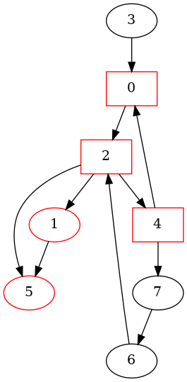 | 


## 1 How to download Tutorials in [CSE VLAB](https://vlabgateway.cse.unsw.edu.au/)

Open a terminal (Applications -> Terminal Emulator)

```sh

$ git clone https://github.com/sheisc/COMP9024.git

$ cd COMP9024/Graphs/CycleDetection

CycleDetection$ 

```


## 2 How to start [Visual Studio Code](https://code.visualstudio.com/) to browse/edit/debug a project.


```sh

CycleDetection$ code

```

Two configuration files (CycleDetection/.vscode/[launch.json](https://code.visualstudio.com/docs/cpp/launch-json-reference) and CycleDetection/.vscode/[tasks.json](https://code.visualstudio.com/docs/editor/tasks)) have been preset.


### 2.1 Open the project in VS Code

In the window of Visual Studio Code, please click "File" and "Open Folder",

select the folder "COMP9024/Graphs/CycleDetection", then click the "Open" button.


### 2.2 Build the project in VS Code

click **Terminal -> Run Build Task**


### 2.3 Debug the project in VS Code

Open src/main.c, and click to add a breakpoint (say, line 11).

Then, click **Run -> Start Debugging**


### 2.4 Directory

```sh
├── Makefile             defining set of tasks to be executed (the input file of the 'make' command)
|
├── README.md            introduction to this tutorial
|
├── images               *.dot and *.png files generated by this program
|
├── src                  containing *.c and *.h
|    |
|    ├── Graph.c         Cycle detection
|    ├── Graph.h
|    ├── Stack.c         For recording nodes on the call stack  
|    ├── Stack.h
|    ├── main.c          main()
|
└── .vscode              containing configuration files for Visual Studio Code
    |
    ├── launch.json      specifying which program to debug and with which debugger,
    |                    used when you click "Run -> Start Debugging"
    |
    └── tasks.json       specifying which task to run (e.g., 'make' or 'make clean')
                         used when you click "Terminal -> Run Build Task" or "Terminal -> Run Task"
```
Makefile is discussed in [COMP9024/C/HowToMake](../../C/HowToMake/README.md).


## 3 The procedure of cycle detection in a directed graph

**In addition to utilizing VS Code, we can also compile and execute programs directly from the command line interface as follows.**

``` sh

CycleDetection$ make

CycleDetection$ ./main

```

## 3.1 Observe the procedure of cycle detection via 'make view'


**Click on the window of 'feh' or use your mouse scroll wheel to view images**.

Here, **feh** is an image viewer available in [CSE VLAB](https://vlabgateway.cse.unsw.edu.au/).

**Ensure that you have executed 'make' and './main' before 'make view'.**


| Initial | 
|:-------------:|
|  |  


| Visiting 0 | Visiting 2 |  Visiting 1 | Visiting 5 |
|:-------------:|:-------------:|:-------------:|:-------------:|
| Nodes on call stack: $\color{red}{0}$ | Nodes on call stack: $\color{red}{2}$, 0 | Nodes on call stack: $\color{red}{1}$, 2, 0 | Nodes on call stack: $\color{red}{5}$, 1, 2, 0 |
| 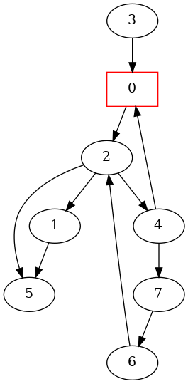 |   | 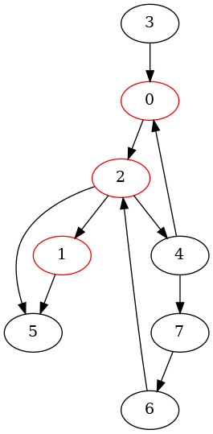 | 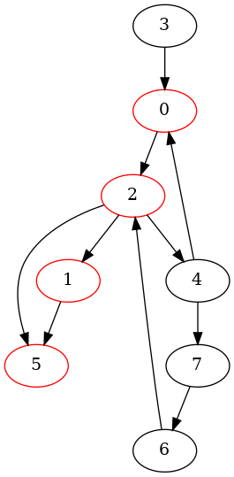 | 


| Visiting 4 (Cycle Detected) | Visiting 7 |  Visiting 6 (Cycle Detected)| Visiting 3 |
|:-------------:|:-------------:|:-------------:|:-------------:|
| Nodes on call stack: $\color{red}{4}$, 2, 0 | Nodes on call stack: $\color{red}{7}$, 4, 2, 0 | Nodes on call stack: $\color{red}{6}$, 7, 4, 2, 0 | Nodes on call stack: $\color{red}{3}$ |
|  |  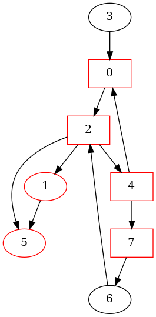 | 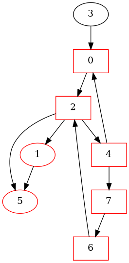 |  | 

| Call Tree and Directed Graph | 
|:-------------:|
| 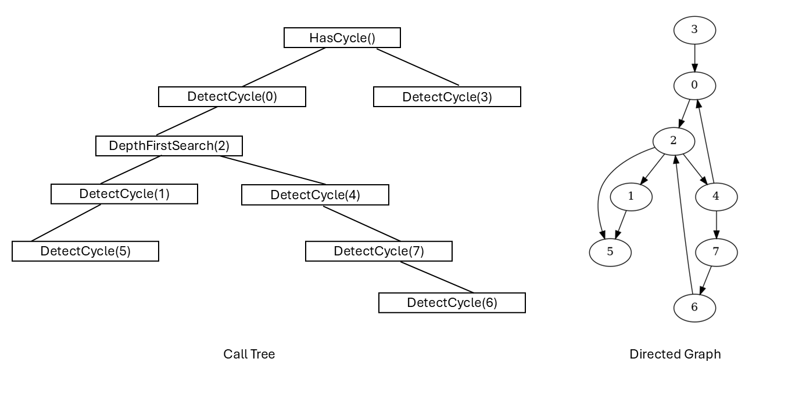 | 

### 3.2 More details

``` sh

CycleDetection$ make

CycleDetection$ ./main

########################### TestCycleDetection(directed) ######################


**********  The Adjacency Matrix ************* 
0 0 1 0 0 0 0 0 
0 0 0 0 0 1 0 0 
0 1 0 0 1 1 0 0 
1 0 0 0 0 0 0 0 
1 0 0 0 0 0 0 1 
0 0 0 0 0 0 0 0 
0 0 1 0 0 0 0 0 
0 0 0 0 0 0 1 0 

****** Graph Nodes ********
Graph Node 0: 0
Graph Node 1: 1
Graph Node 2: 2
Graph Node 3: 3
Graph Node 4: 4
Graph Node 5: 5
Graph Node 6: 6
Graph Node 7: 7


----- Test whether node 0 is on stack: NumOfNodesInCycle = 3 -----
Stack: 4 2 0
------------------------------------------------------------------


		****************** Cycle 1 detected (directed) *****************
		Stack: 4 2 0
		node 0 is on stack
		Nodes in a cycle: 
		4 2 0 
		****************************************************************

----- Test whether node 2 is on stack: NumOfNodesInCycle = 4 -----
Stack: 6 7 4 2 0
------------------------------------------------------------------


		****************** Cycle 2 detected (directed) *****************
		Stack: 6 7 4 2 0
		node 2 is on stack
		Nodes in a cycle: 
		6 7 4 2 
		****************************************************************

----- Test whether node 5 is on stack: NumOfNodesInCycle = 0 -----
Stack: 2 0
------------------------------------------------------------------


----- Test whether node 0 is on stack: NumOfNodesInCycle = 0 -----
Stack: 3
------------------------------------------------------------------

The graph is cyclic.


CycleDetection$ make view

find . -name "*.png" | sort | xargs feh -g 720x540 &

CycleDetection$ find . -name "*.c" -or -name "*.c" | xargs cat | wc -l
718

```

## 4 The procedure of cycle detection in an undirected graph


### 4.1 Observe the procedure of cycle detection via 'make view'

**Click on the window of 'feh' or use your mouse scroll wheel to view images**.

Here, **feh** is an image viewer available in [CSE VLAB](https://vlabgateway.cse.unsw.edu.au/).

**Ensure that you have executed 'make' and './main' before 'make view'.**


| Initial | 
|:-------------:|
|  |  


| Visiting 0 | Visiting 2 |  Visiting 1 | Visiting 5 (Cycle Detected) |
|:-------------:|:-------------:|:-------------:|:-------------:|
| Nodes on call stack: $\color{red}{0}$ | Nodes on call stack: $\color{red}{2}$, 0 | Nodes on call stack: $\color{red}{1}$, 2, 0 | Nodes on call stack: $\color{red}{5}$, 1, 2, 0 |
|  |  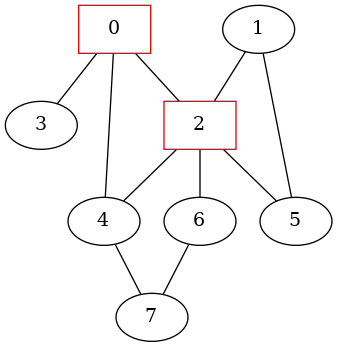 | 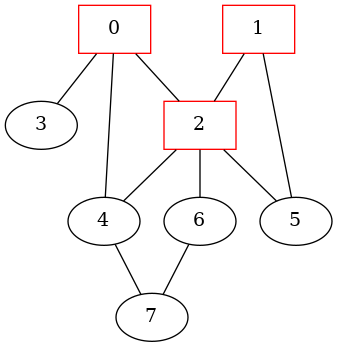 | 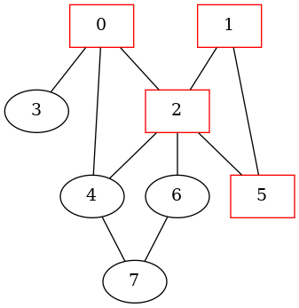 | 


| Visiting 4 (Cycle Detected) | Visiting 7 |  Visiting 6 (Cycle Detected) | Visiting 3 |
|:-------------:|:-------------:|:-------------:|:-------------:|
| Nodes on call stack: $\color{red}{4}$, 2, 0 | Nodes on call stack: $\color{red}{7}$, 4, 2, 0 | Nodes on call stack: $\color{red}{6}$, 7, 4, 2, 0 | Nodes on call stack: $\color{red}{3}$, 0|
| 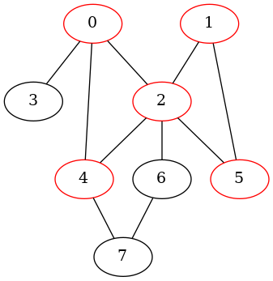 |  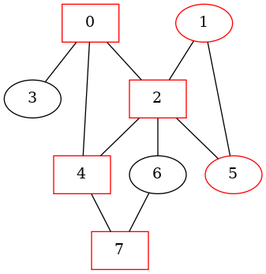 | 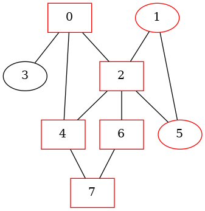 |  | 

| Call Tree and Undirected Graph | 
|:-------------:|
| 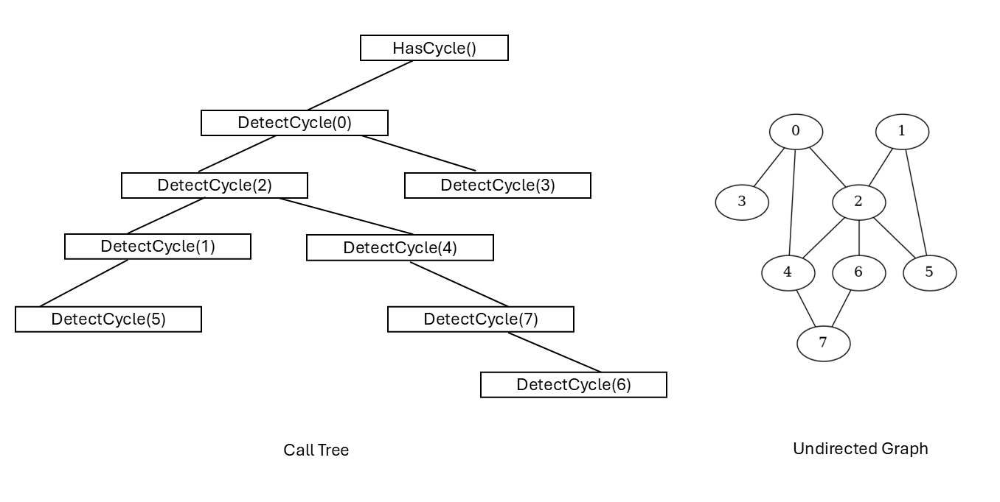 | 

### 4.2 More details

```sh
########################### TestCycleDetection(undirected) ######################


**********  The Adjacency Matrix ************* 
0 0 1 1 1 0 0 0 
0 0 1 0 0 1 0 0 
1 1 0 0 1 1 1 0 
1 0 0 0 0 0 0 0 
1 0 1 0 0 0 0 1 
0 1 1 0 0 0 0 0 
0 0 1 0 0 0 0 1 
0 0 0 0 1 0 1 0 

****** Graph Nodes ********
Graph Node 0: 0
Graph Node 1: 1
Graph Node 2: 2
Graph Node 3: 3
Graph Node 4: 4
Graph Node 5: 5
Graph Node 6: 6
Graph Node 7: 7


----- Test whether node 0 is on stack: NumOfNodesInCycle = 2 -----
Stack: 2 0
------------------------------------------------------------------


----- Test whether node 2 is on stack: NumOfNodesInCycle = 2 -----
Stack: 1 2 0
------------------------------------------------------------------


----- Test whether node 1 is on stack: NumOfNodesInCycle = 2 -----
Stack: 5 1 2 0
------------------------------------------------------------------


----- Test whether node 2 is on stack: NumOfNodesInCycle = 3 -----
Stack: 5 1 2 0
------------------------------------------------------------------


		****************** Cycle 1 detected (undirected) *****************
		Stack: 5 1 2 0
		node 2 is on stack
		Nodes in a cycle: 
		5 1 2 
		****************************************************************

----- Test whether node 0 is on stack: NumOfNodesInCycle = 3 -----
Stack: 4 2 0
------------------------------------------------------------------


		****************** Cycle 2 detected (undirected) *****************
		Stack: 4 2 0
		node 0 is on stack
		Nodes in a cycle: 
		4 2 0 
		****************************************************************

----- Test whether node 2 is on stack: NumOfNodesInCycle = 2 -----
Stack: 4 2 0
------------------------------------------------------------------


----- Test whether node 4 is on stack: NumOfNodesInCycle = 2 -----
Stack: 7 4 2 0
------------------------------------------------------------------


----- Test whether node 2 is on stack: NumOfNodesInCycle = 4 -----
Stack: 6 7 4 2 0
------------------------------------------------------------------


		****************** Cycle 3 detected (undirected) *****************
		Stack: 6 7 4 2 0
		node 2 is on stack
		Nodes in a cycle: 
		6 7 4 2 
		****************************************************************

----- Test whether node 7 is on stack: NumOfNodesInCycle = 2 -----
Stack: 6 7 4 2 0
------------------------------------------------------------------


----- Test whether node 5 is on stack: NumOfNodesInCycle = 0 -----
Stack: 2 0
------------------------------------------------------------------


----- Test whether node 6 is on stack: NumOfNodesInCycle = 0 -----
Stack: 2 0
------------------------------------------------------------------


----- Test whether node 0 is on stack: NumOfNodesInCycle = 2 -----
Stack: 3 0
------------------------------------------------------------------


----- Test whether node 4 is on stack: NumOfNodesInCycle = 0 -----
Stack: 0
------------------------------------------------------------------

The graph is cyclic.
```

## 5 Data structure
```C
// Storing information of a graph node
struct GraphNode {
    char name[MAX_ID_LEN + 1]; 
};

typedef long AdjMatrixElementTy;

struct Graph{
    /*
       Memory Layout:
                          -----------------------------------------------------------
        pAdjMatrix ---->  Element(0, 0),   Element(0, 1),    ...,       Element(0, n-1),     // each row has n elements
                          Element(1, 0),   Element(1, 1),    ...,       Element(1, n-1),
      
                          .....                            Element(u, v)     ...             // (n * u + v) elements away from Element(0, 0)
      
                          Element(n-1, 0), Element(n-1, 1),  ...,       Element(n-1, n-1)
                          ----------------------------------------------------------- 
                                      Adjacency Matrix on Heap

     */
    AdjMatrixElementTy *pAdjMatrix;
    /*
       Memory Layout
                        ---------------------------
                        pNodes[n-1]
       
       
                        pNodes[1]
       pNodes ----->    pNodes[0]
                       ----------------------------
                        struct GraphNode[n] on Heap
     */
    struct GraphNode *pNodes;
    // number of nodes
    long n;
    // whether it is a directed graph
    int isDirected;
};

// 0 <= u < n,  0 <= v < n
// ELement(u, v) is (n * u + v) elements away from Element(0, 0)
#define  MatrixElement(pGraph, u, v)  (pGraph)->pAdjMatrix[(pGraph)->n * (u) + (v)]

```
## 6 Algorithm

### 6.1  main()

``` C

#define CONNECTED   1

#define NUM_OF_NODES  8


int TestCycleDetection(int isDirected) {
    // Create a directed graph with 8 nodes
    struct Graph *pGraph = CreateGraph(NUM_OF_NODES, isDirected);

    //char *nodeNames[NUM_OF_NODES] = {"A", "B", "C", "D", "E", "F", "G", "H"};
    char *nodeNames[NUM_OF_NODES] = {"0", "1", "2", "3", "4", "5", "6", "7"};
    
    // Add nodes
    for (long u = 0; u < NUM_OF_NODES; u++) {
        GraphAddNode(pGraph, u, nodeNames[u]);
    }
    // edges: source node id, target node id, value of the edge
    long edges[][3] = {        
        {0, 2, CONNECTED},
        {1, 5, CONNECTED},
        {2, 1, CONNECTED},
        {2, 4, CONNECTED},
        {2, 5, CONNECTED},        
        {3, 0, CONNECTED},
        {4, 0, CONNECTED},
        {4, 7, CONNECTED},        
        {6, 2, CONNECTED},        
        {7, 6, CONNECTED},        
    };

    // Add edges
    for (long i = 0; i < sizeof(edges)/sizeof(edges[0]); i++) {
        GraphAddEdge(pGraph, edges[i][0], edges[i][1], edges[i][2]);
    }

    PrintGraph(pGraph);

    // create a sub-directory 'images' (if it is not present) in the current directory
    system("mkdir -p images");
    // remove the *.dot and *.png files in the directory 'images'
    //system("rm -f images/*.dot images/*.png");

    if (HasCycle(pGraph)) {
        printf("The graph is cyclic.\n");
    } else {
        printf("The graph is acyclic.\n");
    }

    ReleaseGraph(pGraph);

    //TestIterator();
    return 0;
}


int main(void) {
    // directed graph
    TestCycleDetection(1);

    // undirected graph
    TestCycleDetection(0);
    return 0;
}
```

### 6.2 int HasCycle(struct Graph *pGraph)

#### 6.2.1 How to record the nodes on the call stack in calling DetectCycle() recursively

The **DetectCycle()** function is implemented recursively for DFS traversal to detect cycles.

As it is hard to access the nodes on the call stack,  we create a [data stack](./src/Stack.c) to record the nodes.

When entering the function DetectCycle(), the current node is pushed onto the data stack.

When DetectCycle() returns, the node is popped from the data stack.

#### 6.2.2 Special case in an undirected graph

```sh
   In an undirected graph,
   an edge 'n0 -- n2' is represented as two directed edges:
       n0 -> n2
       n2 -> n0
   
   We should not treat n2 -> n0 and n0 -> n2 as a cycle in an undirected edge.
   So we need to check it here.  
```

#### 6.2.3 The Macro STOP_DETECTION_AT_FIRST_CYCLE 

Whether the cycle detection stops after finding the first cycle.

```C

/*
    if v is already on stack
        return the number of nodes in a cycle    
    else
        return 0


    ----- Test whether node 2 is on stack: NumOfNodesInCycle = 3 -----
    Stack: 5 1 2 0
    ------------------------------------------------------------------
 */
static int GetNumOfNodesInCycle(struct Graph *pGraph, long v, struct Stack *pNodesOnStack) {
    // Not used now.
    (void) pGraph;
    // number of node in a cycle
    int n = 0;
    // whether v is on stack
    int isOnStack = 0;
    // Get an iterator of the stack
    StackIterator it = GetIterator(pNodesOnStack);
    
    // visit each element
    while (HasNext(&it)) {
        STACK_ITEM_T nodeId = NextItem(&it);
        n++;
        if (nodeId == v) {
            isOnStack = 1;
            break;
            //return n;
        }
    }
    if (!isOnStack) {
        n = 0;
    }
    printf("\n----- Test whether node %ld is on stack: NumOfNodesInCycle = %d -----\n", v, n);
    PrintStack(pNodesOnStack);
    printf("------------------------------------------------------------------\n\n");
    return n;
}

//#define  STOP_DETECTION_AT_FIRST_CYCLE

static long cycles = 0;
static long imgCnt = 0;

static void PrintNodesInCycle(struct Graph *pGraph, long v, struct Stack *pNodesOnStack) {
    // Get an iterator of the stack
    StackIterator it = GetIterator(pNodesOnStack);
    
    cycles++;

    if (pGraph->isDirected) {
        printf("\n\t\t****************** Cycle %ld detected (directed) *****************\n\t\t", cycles);
    } else {
        printf("\n\t\t****************** Cycle %ld detected (undirected) *****************\n\t\t", cycles);
    }
    /*
        v == 2
        Stack: 6  7  4  2  0

        Nodes in a cycle: 
        6 7 4 2
     */
    PrintStack(pNodesOnStack);
    printf("\t\tnode %ld is on stack\n", v);
    printf("\t\tNodes in a cycle: \n\t\t");
    // visit each element
    while (HasNext(&it)) {
        STACK_ITEM_T nodeId = NextItem(&it);
        printf("%ld ", nodeId);
        if (nodeId == v) {
            break;
        }
    }
    printf("\n\t\t****************************************************************\n");
}

static int DetectCycle(struct Graph *pGraph, long u, int *visited, struct Stack *pNodesOnStack) {
    visited[u] = 1;
    // Push u onto the data stack
    StackPush(pNodesOnStack, u);    
    
    
    imgCnt++;
    if (pGraph->isDirected) {
        GenOneImage(pGraph, "HasCycleDirected", "images/HasCycleDirected", imgCnt, visited);
    } else {
        GenOneImage(pGraph, "HasCycleUndirected", "images/HasCycleUndirected", imgCnt, visited);
    }
    int cycleDetected = 0;

    // recursively visit the adjacent nodes of u, if they have not been visited yet
    for(long v = 0; v < pGraph->n; v++) {
        if (MatrixElement(pGraph, u, v)) {
            if (!visited[v]) {
                if (DetectCycle(pGraph, v, visited, pNodesOnStack)) {
                    cycleDetected = 1;
#ifdef STOP_DETECTION_AT_FIRST_CYCLE                    
                    break;
#endif                    
                }
            } else {
                int nodesInCycle = GetNumOfNodesInCycle(pGraph, v, pNodesOnStack);
                if (nodesInCycle > 0) {
                    if (!pGraph->isDirected) {
                        /*
                            In an undirected graph,

                            an edge 'n0 -- n2' is represented as two directed edges:

                                n0 -> n2
                                n2 -> n0
                            
                            We should not treat n2 -> n0 and n0 -> n2 as a cycle in an undirected edge.
                            So we need to check it here.
                                                       
                        */
                        if (nodesInCycle == 2) {
                            continue;
                        }
                    }
                    PrintNodesInCycle(pGraph, v, pNodesOnStack);
                    cycleDetected = 1;
#ifdef  STOP_DETECTION_AT_FIRST_CYCLE                   
                    break;
#endif                    
                }
            }
        }
    }
    StackPop(pNodesOnStack);
    return cycleDetected;
}

int HasCycle(struct Graph *pGraph) {
    int cyclic = 0;
    int *visited = (int *) malloc(pGraph->n * sizeof(int));
    struct Stack *pNodesOnStack = CreateStack();
    //memset(visited, 0, sizeof(int) * pGraph->n);
    for (long v = 0; v < pGraph->n; v++) {
        visited[v] = 0;
    }

    imgCnt = 0;
    cycles = 0;
    if (pGraph->isDirected) {
        GenOneImage(pGraph, "HasCycleDirected", "images/HasCycleDirected", imgCnt, visited);
    } else {
        GenOneImage(pGraph, "HasCycleUndirected", "images/HasCycleUndirected", imgCnt, visited);
    }
    
    for (long u = 0; u < pGraph->n; u++) {
        if (!visited[u]) {
            if (DetectCycle(pGraph, u, visited, pNodesOnStack)) {
                cyclic = 1;
#ifdef STOP_DETECTION_AT_FIRST_CYCLE                    
                break;
#endif
            }
        }
    }
    free(visited);
    //assert(StackIsEmpty(pNodesOnStack));
    ReleaseStack(pNodesOnStack); 
    return cyclic;
}
```

## 7 How to add an iterator interface for a Stack

In computer programming, an iterator is an object that allows a programmer to traverse through elements of a container.

Here, we implement an iterator to traverse the elements on the [data stack](./src/Stack.c), which is used to detect cycles in the function [GetNumOfNodesInCycle()](./src/Graph.c).

### 7.1  src/Stack.h
```C

// src/Stack.h

/***********************  Iterator interface for a stack ******************/
typedef struct {
    void *pStackElement;
} StackIterator;

StackIterator GetIterator(struct Stack *pStack);

int HasNext(StackIterator *it);

STACK_ITEM_T NextItem(StackIterator *it);

void TestIterator(void);

```

### 7.2 src/Stack.c

```C
// src/Stack.c


StackIterator GetIterator(struct Stack *pStack) {
    StackIterator iterator;
    iterator.pStackElement = pStack->top;
    return iterator;
}

int HasNext(StackIterator *pIt) {
    StackNode *cur = (StackNode *)(pIt->pStackElement);
    return cur != NULL;
}

STACK_ITEM_T NextItem(StackIterator *pIt) {    
    StackNode *cur = (StackNode *)(pIt->pStackElement);
    assert(cur != NULL);
    STACK_ITEM_T item = cur->item;
    pIt->pStackElement = cur->next;
    return item;
}

void TestIterator(void) {
    // Create a stack
    struct Stack *pStack = CreateStack();
    // Push 20, 24, 90 in turn
    StackPush(pStack, 20);
    StackPush(pStack, 24);
    StackPush(pStack, 90);
    // Get an iterator of the stack
    StackIterator it = GetIterator(pStack);
    // visit each element of the stack: 90, 24, 20
    while (HasNext(&it)) {
        STACK_ITEM_T item = NextItem(&it);
        printf("NextItem(it) = %ld\n", (long) item);
    }
    // All the elements are still on the stack
    PrintStack(pStack);
    // Release the heap space
    ReleaseStack(pStack);
}

```


