# Depth First Search

``` sh
/*******************************************************************
                        Depth First Search

    1.  How to perform a recursive depth first search in a directed graph

    2.  How to perform a recursive depth first search in an undirected graph


                                             COMP9024 24T2

 *******************************************************************/
``` 

### Depth First Search

Depth First Search (DFS) is an algorithm used to traverse a graph or tree data structure. 

It starts at a designated node, and explores as far as possible along each edge before backtracking. 

This means it goes as deep as possible along one edge before exploring other edges.

We have discussed the format of dot files in [COMP9024/Graphs](../../Graphs/Dot2Png/README.md), how to create a directed graph in [COMP9024/Graphs/DirectedGraph](../../Graphs/DirectedGraph/README.md), and how to create an undirected graph in [COMP9024/Graphs/UndirectedGraph](../../Graphs/UndiirectedGraph/README.md).


## 1 How to download Tutorials in [CSE VLAB](https://vlabgateway.cse.unsw.edu.au/)

Open a terminal (Applications -> Terminal Emulator)

```sh

$ git clone https://github.com/sheisc/COMP9024.git

$ cd COMP9024/Graphs/DepthFirstSearch

DepthFirstSearch$ 

```


## 2 How to start [Visual Studio Code](https://code.visualstudio.com/) to browse/edit/debug a project.


```sh

DepthFirstSearch$ code

```

Two configuration files (DepthFirstSearch/.vscode/[launch.json](https://code.visualstudio.com/docs/cpp/launch-json-reference) and DepthFirstSearch/.vscode/[tasks.json](https://code.visualstudio.com/docs/editor/tasks)) have been preset.


### 2.1 Open the project in VS Code

In the window of Visual Studio Code, please click "File" and "Open Folder",

select the folder "COMP9024/Graphs/DepthFirstSearch", then click the "Open" button.


### 2.2 Build the project in VS Code

click **Terminal -> Run Build Task**


### 2.3 Debug the project in VS Code

Open src/Graph.c, and click to add a breakpoint (say, line 262).

Then, click **Run -> Start Debugging**


### 2.4 Directory

```sh
├── Makefile             defining set of tasks to be executed (the input file of the 'make' command)
|
├── README.md            introduction to this tutorial
|
├── images               *.dot and *.png files generated by this program
|
├── diagrams             *.png files
|
├── src                  containing *.c and *.h
|    |
|    ├── Graph.c         Depth First Search
|    ├── Graph.h
|    |
|    ├── main.c          main()
|
└── .vscode              containing configuration files for Visual Studio Code
    |
    ├── launch.json      specifying which program to debug and with which debugger,
    |                    used when you click "Run -> Start Debugging"
    |
    └── tasks.json       specifying which task to run (e.g., 'make' or 'make clean')
                         used when you click "Terminal -> Run Build Task" or "Terminal -> Run Task"
```
Makefile is discussed in [COMP9024/C/HowToMake](../../C/HowToMake/README.md).


## 3 The procedure of DFS in a directed graph

**In addition to utilizing VS Code, we can also compile and execute programs directly from the command line interface as follows.**

``` sh

DepthFirstSearch$ make

DepthFirstSearch$ ./main

```

## 3.1 Observe the procedure of DFS via 'make view'


**Click on the window of 'feh' or use your mouse scroll wheel to view images**.

Here, **feh** is an image viewer available in [CSE VLAB](https://vlabgateway.cse.unsw.edu.au/).

**Ensure that you have executed 'make' and './main' before 'make view'.**


| Initial | 
|:-------------:|
| 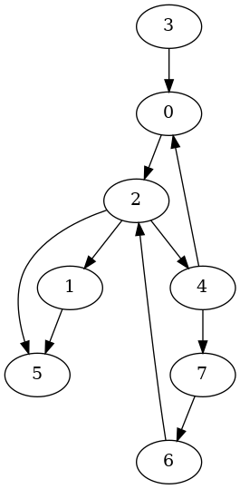 |  

**When debugging this program in VS Code, you can set a breakpoint at line 262 in [src/Graph.c](./src/Graph.c) to observe the nodes on call stack.**

| Visiting 0 | Visiting 2 |  Visiting 1 | Visiting 5 |
|:-------------:|:-------------:|:-------------:|:-------------:|
| Nodes on call stack: $\color{red}{0}$ | Nodes on call stack: $\color{red}{2}$, 0 | Nodes on call stack: $\color{red}{1}$, 2, 0 | Nodes on call stack: $\color{red}{5}$, 1, 2, 0 |
| 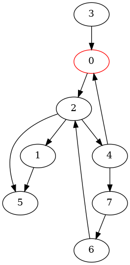 |  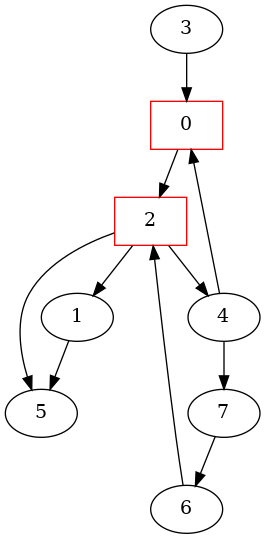 | 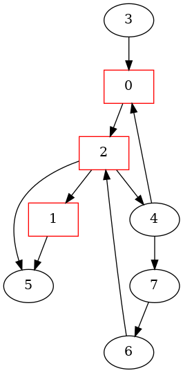 | 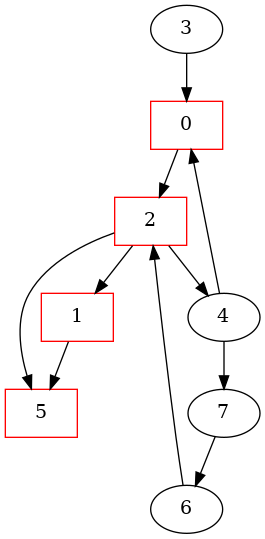 | 


| Visiting 4 | Visiting 7 |  Visiting 6 | Visiting 3 |
|:-------------:|:-------------:|:-------------:|:-------------:|
| Nodes on call stack: $\color{red}{4}$, 2, 0 | Nodes on call stack: $\color{red}{7}$, 4, 2, 0 | Nodes on call stack: $\color{red}{6}$, 7, 4, 2, 0 | Nodes on call stack: $\color{red}{3}$ |
|  |   |  | 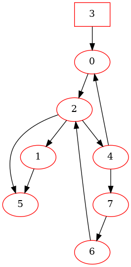 | 

| Call Tree and Directed Graph | 
|:-------------:|
| 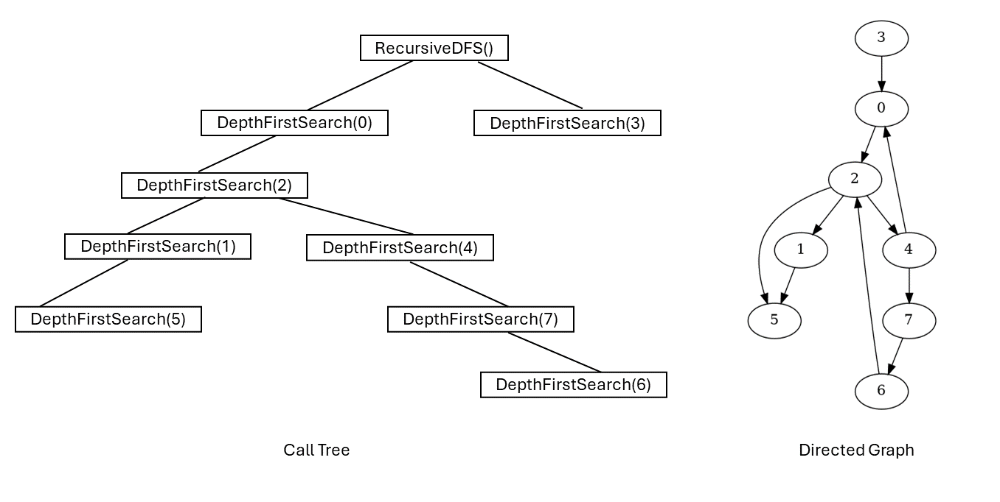 |  

### 3.2 More details

``` sh

DepthFirstSearch$ make

DepthFirstSearch$ ./main
########################### TestDFS(directed) ######################


**********  The Adjacency Matrix ************* 
0 0 1 0 0 0 0 0 
0 0 0 0 0 1 0 0 
0 1 0 0 1 1 0 0 
1 0 0 0 0 0 0 0 
1 0 0 0 0 0 0 1 
0 0 0 0 0 0 0 0 
0 0 1 0 0 0 0 0 
0 0 0 0 0 0 1 0 

****** Graph Nodes ********
Graph Node 0: 0
Graph Node 1: 1
Graph Node 2: 2
Graph Node 3: 3
Graph Node 4: 4
Graph Node 5: 5
Graph Node 6: 6
Graph Node 7: 7

visiting 0
visiting 2
visiting 1
visiting 5
visiting 4
visiting 7
visiting 6
visiting 3

DepthFirstSearch$ make view

find ./images -name "*.png" | sort | xargs feh -g 720x540 &

```

## 4 The procedure of DFS in an undirected graph


### 4.1 Observe the procedure of DFS via 'make view'

**Click on the window of 'feh' or use your mouse scroll wheel to view images**.

Here, **feh** is an image viewer available in [CSE VLAB](https://vlabgateway.cse.unsw.edu.au/).

**Ensure that you have executed 'make' and './main' before 'make view'.**


| Initial | 
|:-------------:|
| 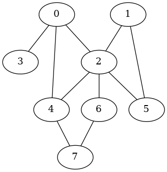 |  

**When debugging this program in VS Code, you can set a breakpoint at line 262 in [src/Graph.c](./src/Graph.c) to observe the nodes on call stack.**

| Visiting 0 | Visiting 2 |  Visiting 1 | Visiting 5 |
|:-------------:|:-------------:|:-------------:|:-------------:|
| Nodes on call stack: $\color{red}{0}$ | Nodes on call stack: $\color{red}{2}$, 0 | Nodes on call stack: $\color{red}{1}$, 2, 0 | Nodes on call stack: $\color{red}{5}$, 1, 2, 0 |
| 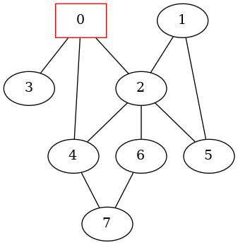 |   |  | 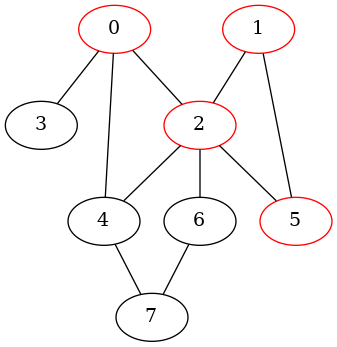 | 


| Visiting 4 | Visiting 7 |  Visiting 6 | Visiting 3 |
|:-------------:|:-------------:|:-------------:|:-------------:|
| Nodes on call stack: $\color{red}{4}$, 2, 0 | Nodes on call stack: $\color{red}{7}$, 4, 2, 0 | Nodes on call stack: $\color{red}{6}$, 7, 4, 2, 0 | Nodes on call stack: $\color{red}{3}$, 0|
| 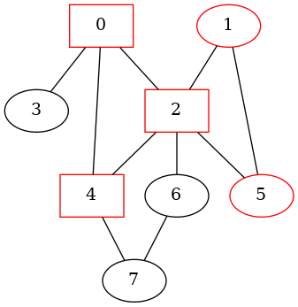 |   |  | 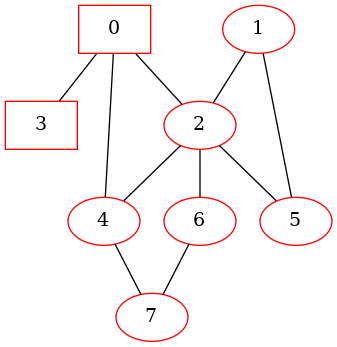 | 

| Call Tree and Undirected Graph | 
|:-------------:|
|  | 

### 4.2 More details

```sh
########################### TestDFS(undirected) ######################


**********  The Adjacency Matrix ************* 
0 0 1 1 1 0 0 0 
0 0 1 0 0 1 0 0 
1 1 0 0 1 1 1 0 
1 0 0 0 0 0 0 0 
1 0 1 0 0 0 0 1 
0 1 1 0 0 0 0 0 
0 0 1 0 0 0 0 1 
0 0 0 0 1 0 1 0 

****** Graph Nodes ********
Graph Node 0: 0
Graph Node 1: 1
Graph Node 2: 2
Graph Node 3: 3
Graph Node 4: 4
Graph Node 5: 5
Graph Node 6: 6
Graph Node 7: 7

visiting 0
visiting 2
visiting 1
visiting 5
visiting 4
visiting 7
visiting 6
visiting 3


```

## 5 Data structure
```C
// Storing information of a graph node
struct GraphNode {
    char name[MAX_ID_LEN + 1]; 
};

typedef long AdjMatrixElementTy;

struct Graph{
    /*
       Memory Layout:
                          -----------------------------------------------------------
        pAdjMatrix ---->  Element(0, 0),   Element(0, 1),    ...,       Element(0, n-1),     // each row has n elements
                          Element(1, 0),   Element(1, 1),    ...,       Element(1, n-1),
      
                          .....                            Element(u, v)     ...             // (n * u + v) elements away from Element(0, 0)
      
                          Element(n-1, 0), Element(n-1, 1),  ...,       Element(n-1, n-1)
                          ----------------------------------------------------------- 
                                      Adjacency Matrix on Heap

     */
    AdjMatrixElementTy *pAdjMatrix;
    /*
       Memory Layout
                        ---------------------------
                        pNodes[n-1]
       
       
                        pNodes[1]
       pNodes ----->    pNodes[0]
                       ----------------------------
                        struct GraphNode[n] on Heap
     */
    struct GraphNode *pNodes;
    // number of nodes
    long n;
    // whether it is a directed graph
    int isDirected;
};

// 0 <= u < n,  0 <= v < n
// ELement(u, v) is (n * u + v) elements away from Element(0, 0)
#define  MatrixElement(pGraph, u, v)  (pGraph)->pAdjMatrix[(pGraph)->n * (u) + (v)]

```
## 6 Algorithm

### 6.1  main()

``` C

#define CONNECTED   1

#define NUM_OF_NODES  8


int TestDFS(int isDirected) {
    // Create a directed graph with 8 nodes
    struct Graph *pGraph = CreateGraph(NUM_OF_NODES, isDirected);

    //char *nodeNames[NUM_OF_NODES] = {"A", "B", "C", "D", "E", "F", "G", "H"};
    char *nodeNames[NUM_OF_NODES] = {"0", "1", "2", "3", "4", "5", "6", "7"};
    
    // Add nodes
    for (long u = 0; u < NUM_OF_NODES; u++) {
        GraphAddNode(pGraph, u, nodeNames[u]);
    }
    // edges: source node id, target node id, value of the edge
    long edges[][3] = {        
        {0, 2, CONNECTED},
        {1, 5, CONNECTED},
        {2, 1, CONNECTED},
        {2, 4, CONNECTED},
        {2, 5, CONNECTED},        
        {3, 0, CONNECTED},
        {4, 0, CONNECTED},
        {4, 7, CONNECTED},        
        {6, 2, CONNECTED},        
        {7, 6, CONNECTED},        
    };

    // Add edges
    for (long i = 0; i < sizeof(edges)/sizeof(edges[0]); i++) {
        GraphAddEdge(pGraph, edges[i][0], edges[i][1], edges[i][2]);
    }

    PrintGraph(pGraph);

    // create a sub-directory 'images' (if it is not present) in the current directory
    system("mkdir -p images");
    // remove the *.dot and *.png files in the directory 'images'
    //system("rm -f images/*.dot images/*.png");

    RecursiveDFS(pGraph);

    ReleaseGraph(pGraph);

    //TestIterator();
    return 0;
}


int main(void) {
    // directed graph
    printf("########################### TestDFS(directed) ######################\n\n\n");
    TestDFS(1);
    printf("\n\n\n\n\n########################### TestDFS(undirected) ######################\n\n\n");
    // undirected graph
    TestDFS(0);
    return 0;
}

```

### 6.2 RecursiveDFS()

```C

static long dfsImageCnt = 0;

static void DepthFirstSearch(struct Graph *pGraph, long u, int *visited) {
    visited[u] = 1;
    printf("visiting %s\n", pGraph->pNodes[u].name);
    
    dfsImageCnt++;

    if (pGraph->isDirected) {
        GenOneImage(pGraph, "DfsDirected", "images/DfsDirected", dfsImageCnt, visited);
    } else {
        GenOneImage(pGraph, "DfsUndirected", "images/DfsUndirected", dfsImageCnt, visited);
    }

    // recursively visit the adjacent nodes of u, if they have not been visited yet
    for(long v = 0; v < pGraph->n; v++) {
        if (MatrixElement(pGraph, u, v) == CONNECTED && !visited[v]) {
            DepthFirstSearch(pGraph, v, visited);
        }
    }
}

void RecursiveDFS(struct Graph *pGraph) {
    int *visited = (int *) malloc(pGraph->n * sizeof(int));
    //memset(visited, 0, sizeof(int) * pGraph->n);
    for (long v = 0; v < pGraph->n; v++) {
        visited[v] = 0;
    }

    dfsImageCnt = 0;

    if (pGraph->isDirected) {
        GenOneImage(pGraph, "DfsDirected", "images/DfsDirected", dfsImageCnt, visited);
    } else {
        GenOneImage(pGraph, "DfsUndirected", "images/DfsUndirected", dfsImageCnt, visited);
    }

    for (long u = 0; u < pGraph->n; u++) {
        if (!visited[u]) {
            DepthFirstSearch(pGraph, u, visited);
        }
    }
    printf("\n");
    free(visited);
}

```


