# Dijkstra's algorithm

``` sh
/*******************************************************************
                    Dijkstra's algorithm 

    1.  How to use Dijkstra's algorithm in a directed graph

    2.  How to use Dijkstra's algorithm in an undirected graph


                                             COMP9024 24T2

 *******************************************************************/
``` 

### Dijkstra's shortest path algorithm

Dijkstra's algorithm is commonly used for finding the shortest path in a graph where the edge weights are non-negative. 

To simplify our discussions, we assume the distance from one node to another (edge weight) is a positive integer.

We have discussed the format of dot files in [COMP9024/Graphs](../../Graphs/Dot2Png/README.md), how to create a directed graph in [COMP9024/Graphs/DirectedGraph](../../Graphs/DirectedGraph/README.md), and how to create an undirected graph in [COMP9024/Graphs/UndirectedGraph](../../Graphs/UndiirectedGraph/README.md).


## 1 How to download Tutorials in [CSE VLAB](https://vlabgateway.cse.unsw.edu.au/)

Open a terminal (Applications -> Terminal Emulator)

```sh

$ git clone https://github.com/sheisc/COMP9024.git

$ cd COMP9024/Graphs/Dijkstra

Dijkstra$ 

```


## 2 How to start [Visual Studio Code](https://code.visualstudio.com/) to browse/edit/debug a project.


```sh

Dijkstra$ code

```

Two configuration files (Dijkstra/.vscode/[launch.json](https://code.visualstudio.com/docs/cpp/launch-json-reference) and Dijkstra/.vscode/[tasks.json](https://code.visualstudio.com/docs/editor/tasks)) have been preset.


### 2.1 Open the project in VS Code

In the window of Visual Studio Code, please click "File" and "Open Folder",

select the folder "COMP9024/Graphs/Dijkstra", then click the "Open" button.


### 2.2 Build the project in VS Code

click **Terminal -> Run Build Task**


### 2.3 Debug the project in VS Code

Open src/main.c, and click to add a breakpoint (say, line 11).

Then, click **Run -> Start Debugging**


### 2.4 Directory

```sh
├── Makefile             defining set of tasks to be executed (the input file of the 'make' command)
|
├── README.md            introduction to this tutorial
|
├── images               *.dot and *.png files generated by this program
|
├── src                  containing *.c and *.h
|    |
|    ├── Graph.c         containing the code for graphs
|    ├── Graph.h
|    |
|    ├── main.c          main()
|
└── .vscode              containing configuration files for Visual Studio Code
    |
    ├── launch.json      specifying which program to debug and with which debugger,
    |                    used when you click "Run -> Start Debugging"
    |
    └── tasks.json       specifying which task to run (e.g., 'make' or 'make clean')
                         used when you click "Terminal -> Run Build Task" or "Terminal -> Run Task"
```
Makefile is discussed in [COMP9024/C/HowToMake](../../C/HowToMake/README.md).


## 3 The main procedure of Dijkstra in a directed graph

### 3.1 make and ./main

**In addition to utilizing VS Code, we can also compile and execute programs directly from the command line interface as follows.**

``` sh

Dijkstra$ make

Dijkstra$ ./main

Shortest path from node 3 to node 0: 4
Shortest path from node 3 to node 1: INF 
Shortest path from node 3 to node 2: 6
Shortest path from node 3 to node 3: 0
Shortest path from node 3 to node 4: 2
Shortest path from node 3 to node 5: 11
Shortest path from node 3 to node 6: 7
Shortest path from node 3 to node 7: 10

```

### 3.2 make view

**Ensure that you have executed 'make' and './main' before 'make view'.**

Observe the procedure of Dijkstra's algorithm (starting from the node 3) via 'make view'
```sh
Dijkstra$ make view
find . -name "*.png" | sort | xargs feh &
```

**Click on the window of 'feh' or use your mouse scroll wheel to view images**.

Here, **feh** is an image viewer available in [CSE VLAB](https://vlabgateway.cse.unsw.edu.au/).


| Initial | 
|:-------------:|
|  |  


| Step 1 |  |
|:-------------:|:-------------:|
| 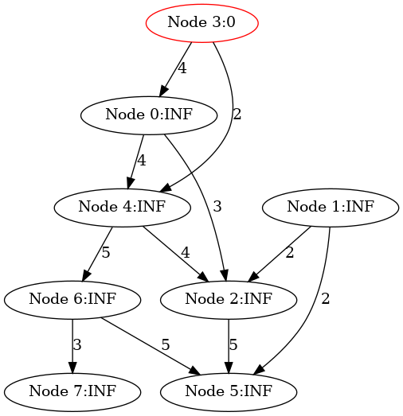 |  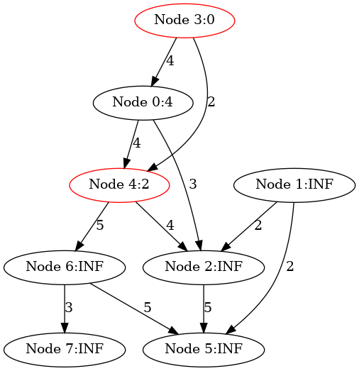 | 


| Step 2 |  |
|:-------------:|:-------------:|
| 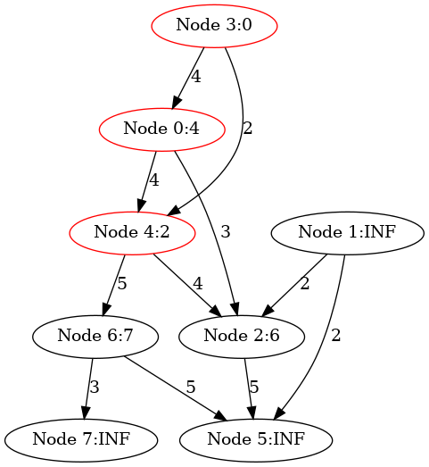 |  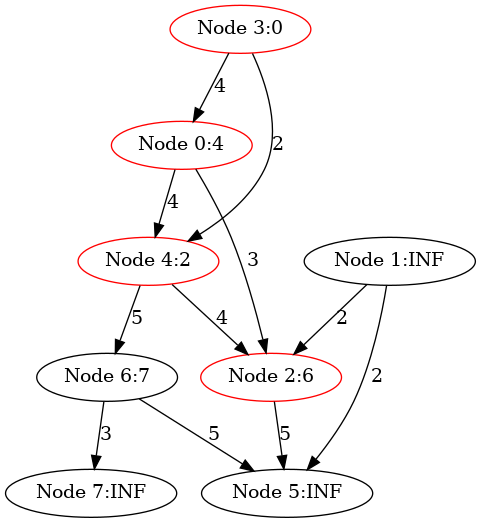 | 


|Step 3 |  |
|:-------------:|:-------------:|
| |  | 


|Step 4 | |
|:-------------:|:-------------:|
| |  | 


| Step 5 | |
|:-------------:|:-------------:|
| 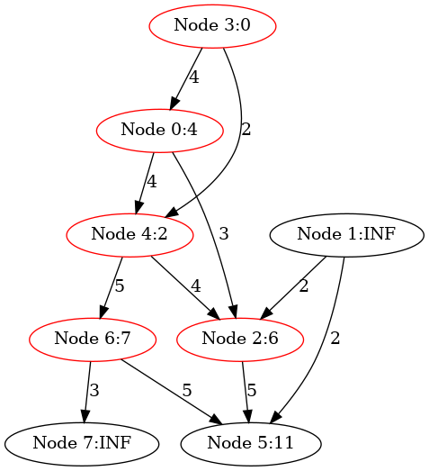 |  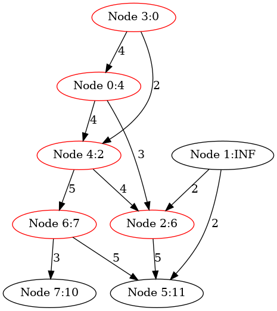 | 

| Step 6 | |
|:-------------:|:-------------:|
|  |   | 

| Step 7 ||
|:-------------:|:-------------:|
|  | | 


| Step 8 |  |
|:-------------:|:-------------:|
|  |  | 

### 3.3 More details

```sh
Dijkstra$ make

Dijkstra$ ./main

########################### TestDijkstra(directed) ######################


**********  The Adjacency Matrix ************* 
0 0 3 0 4 0 0 0 
0 0 2 0 0 2 0 0 
0 0 0 0 0 5 0 0 
4 0 0 0 2 0 0 0 
0 0 4 0 0 0 5 0 
0 0 0 0 0 0 0 0 
0 0 0 0 0 5 0 3 
0 0 0 0 0 0 0 0 

****** Graph Nodes ********
Graph Node 0: 0
Graph Node 1: 1
Graph Node 2: 2
Graph Node 3: 3
Graph Node 4: 4
Graph Node 5: 5
Graph Node 6: 6
Graph Node 7: 7

Dijkstra() starting from node 3:

============================================== Step 1 ==============================================

	-----------------------------------------------------------------------------------
	node id:           0        1        2        3        4        5        6        7
	-----------------------------------------------------------------------------------
	distances:       INF      INF      INF        0      INF      INF      INF      INF
	visited:           0        0        0        0        0        0        0        0

	-----------------------------------------------------------------------------------

Node 3 is selected

Updating distances[0]: 3 --> ... --> 3 --> 0; distance from 3 to 0 is 4

Updating distances[4]: 3 --> ... --> 3 --> 4; distance from 3 to 4 is 2

	-----------------------------------------------------------------------------------
	node id:           0        1        2        3        4        5        6        7
	-----------------------------------------------------------------------------------
	distances:         4      INF      INF        0        2      INF      INF      INF
	visited:           0        0        0        1        0        0        0        0

	-----------------------------------------------------------------------------------

============================================== Step 2 ==============================================

	-----------------------------------------------------------------------------------
	node id:           0        1        2        3        4        5        6        7
	-----------------------------------------------------------------------------------
	distances:         4      INF      INF        0        2      INF      INF      INF
	visited:           0        0        0        1        0        0        0        0

	-----------------------------------------------------------------------------------

Node 4 is selected

Updating distances[2]: 3 --> ... --> 4 --> 2; distance from 4 to 2 is 4

Updating distances[6]: 3 --> ... --> 4 --> 6; distance from 4 to 6 is 5

	-----------------------------------------------------------------------------------
	node id:           0        1        2        3        4        5        6        7
	-----------------------------------------------------------------------------------
	distances:         4      INF        6        0        2      INF        7      INF
	visited:           0        0        0        1        1        0        0        0

	-----------------------------------------------------------------------------------

============================================== Step 3 ==============================================

	-----------------------------------------------------------------------------------
	node id:           0        1        2        3        4        5        6        7
	-----------------------------------------------------------------------------------
	distances:         4      INF        6        0        2      INF        7      INF
	visited:           0        0        0        1        1        0        0        0

	-----------------------------------------------------------------------------------

Node 0 is selected

	-----------------------------------------------------------------------------------
	node id:           0        1        2        3        4        5        6        7
	-----------------------------------------------------------------------------------
	distances:         4      INF        6        0        2      INF        7      INF
	visited:           1        0        0        1        1        0        0        0

	-----------------------------------------------------------------------------------

============================================== Step 4 ==============================================

	-----------------------------------------------------------------------------------
	node id:           0        1        2        3        4        5        6        7
	-----------------------------------------------------------------------------------
	distances:         4      INF        6        0        2      INF        7      INF
	visited:           1        0        0        1        1        0        0        0

	-----------------------------------------------------------------------------------

Node 2 is selected

Updating distances[5]: 3 --> ... --> 2 --> 5; distance from 2 to 5 is 5

	-----------------------------------------------------------------------------------
	node id:           0        1        2        3        4        5        6        7
	-----------------------------------------------------------------------------------
	distances:         4      INF        6        0        2       11        7      INF
	visited:           1        0        1        1        1        0        0        0

	-----------------------------------------------------------------------------------

============================================== Step 5 ==============================================

	-----------------------------------------------------------------------------------
	node id:           0        1        2        3        4        5        6        7
	-----------------------------------------------------------------------------------
	distances:         4      INF        6        0        2       11        7      INF
	visited:           1        0        1        1        1        0        0        0

	-----------------------------------------------------------------------------------

Node 6 is selected

Updating distances[7]: 3 --> ... --> 6 --> 7; distance from 6 to 7 is 3

	-----------------------------------------------------------------------------------
	node id:           0        1        2        3        4        5        6        7
	-----------------------------------------------------------------------------------
	distances:         4      INF        6        0        2       11        7       10
	visited:           1        0        1        1        1        0        1        0

	-----------------------------------------------------------------------------------

============================================== Step 6 ==============================================

	-----------------------------------------------------------------------------------
	node id:           0        1        2        3        4        5        6        7
	-----------------------------------------------------------------------------------
	distances:         4      INF        6        0        2       11        7       10
	visited:           1        0        1        1        1        0        1        0

	-----------------------------------------------------------------------------------

Node 7 is selected

	-----------------------------------------------------------------------------------
	node id:           0        1        2        3        4        5        6        7
	-----------------------------------------------------------------------------------
	distances:         4      INF        6        0        2       11        7       10
	visited:           1        0        1        1        1        0        1        1

	-----------------------------------------------------------------------------------

============================================== Step 7 ==============================================

	-----------------------------------------------------------------------------------
	node id:           0        1        2        3        4        5        6        7
	-----------------------------------------------------------------------------------
	distances:         4      INF        6        0        2       11        7       10
	visited:           1        0        1        1        1        0        1        1

	-----------------------------------------------------------------------------------

Node 5 is selected

	-----------------------------------------------------------------------------------
	node id:           0        1        2        3        4        5        6        7
	-----------------------------------------------------------------------------------
	distances:         4      INF        6        0        2       11        7       10
	visited:           1        0        1        1        1        1        1        1

	-----------------------------------------------------------------------------------

============================================== Step 8 ==============================================

	-----------------------------------------------------------------------------------
	node id:           0        1        2        3        4        5        6        7
	-----------------------------------------------------------------------------------
	distances:         4      INF        6        0        2       11        7       10
	visited:           1        0        1        1        1        1        1        1

	-----------------------------------------------------------------------------------

Node 1 is selected

	-----------------------------------------------------------------------------------
	node id:           0        1        2        3        4        5        6        7
	-----------------------------------------------------------------------------------
	distances:         4      INF        6        0        2       11        7       10
	visited:           1        1        1        1        1        1        1        1

	-----------------------------------------------------------------------------------

Shortest path from node 3 to node 0: 4
Shortest path from node 3 to node 1: INF 
Shortest path from node 3 to node 2: 6
Shortest path from node 3 to node 3: 0
Shortest path from node 3 to node 4: 2
Shortest path from node 3 to node 5: 11
Shortest path from node 3 to node 6: 7
Shortest path from node 3 to node 7: 10


```


## 4 The main procedure of Dijkstra in an undirected graph


### 4.1 make and ./main

**In addition to utilizing VS Code, we can also compile and execute programs directly from the command line interface as follows.**

``` sh

Dijkstra$ make

Dijkstra$ ./main

Shortest path from node 3 to node 0: 4
Shortest path from node 3 to node 1: 8
Shortest path from node 3 to node 2: 6
Shortest path from node 3 to node 3: 0
Shortest path from node 3 to node 4: 2
Shortest path from node 3 to node 5: 10
Shortest path from node 3 to node 6: 7
Shortest path from node 3 to node 7: 10


```

### 4.2 make view

**Ensure that you have executed 'make' and './main' before 'make view'.**

Observe the procedure of Dijkstra's algorithm (starting from the node 3) via 'make view'
```sh
Dijkstra$ make view
find . -name "*.png" | sort | xargs feh &
```

**Click on the window of 'feh' or use your mouse scroll wheel to view images**.

Here, **feh** is an image viewer available in [CSE VLAB](https://vlabgateway.cse.unsw.edu.au/).


| Initial |
|:-------------:|
| 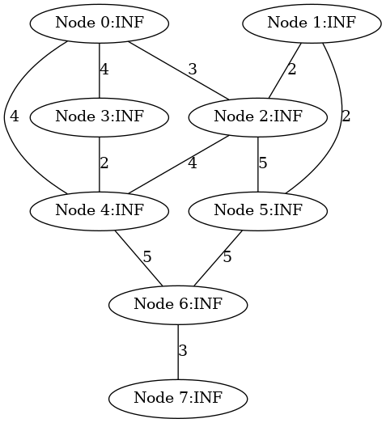 |


| Step 1 |  |
|:-------------:|:-------------:|
| 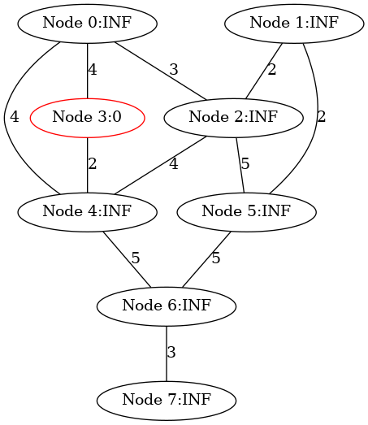 |  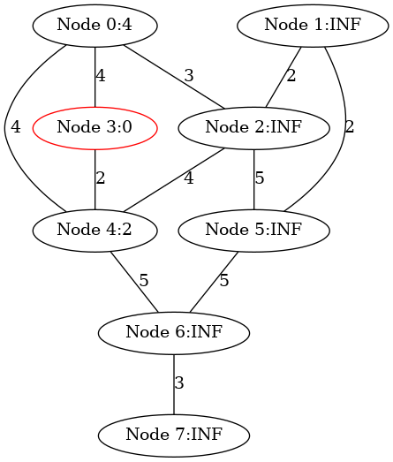 |


| Step 2 |   |
|:-------------:|:-------------:|
| 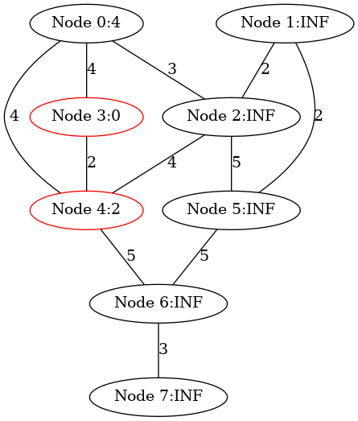 |   |

| Step 3 |   |
|:-------------:|:-------------:|
| 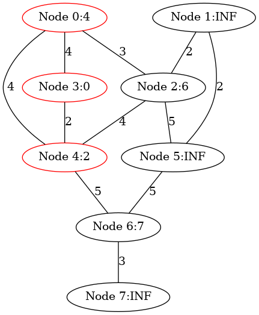 |   |


|Step 4 |  |
|:-------------:|:-------------:|
|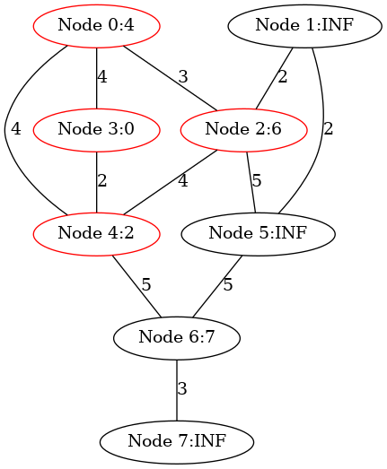 | 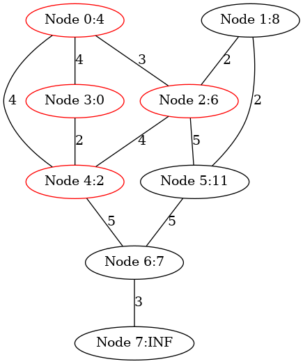 |


|Step 5 |  |
|:-------------:|:-------------:|
|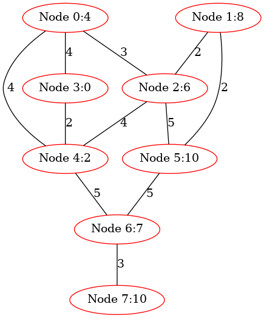 | 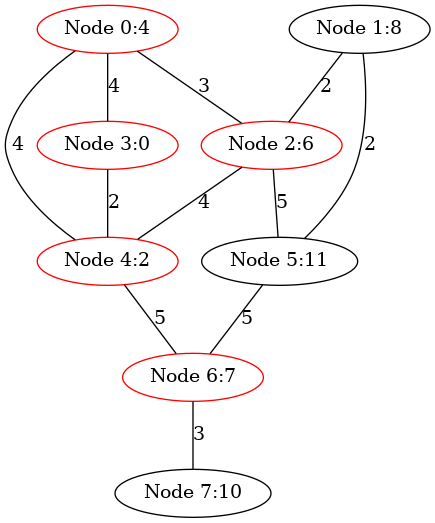 |

|Step 6 |  |
|:-------------:|:-------------:|
| | 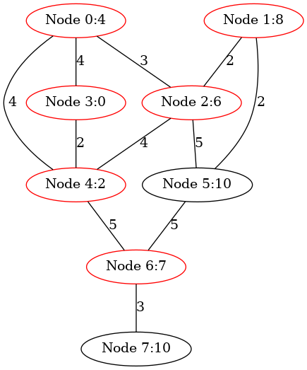 |


|Step 7 |  |
|:-------------:|:-------------:|
| |  |


| Step 8 | |
|:-------------:|:-------------:|
|  |   |


## 5 Data structure
```C
// Storing information of a graph node
struct GraphNode {
    char name[MAX_ID_LEN + 1]; 
};

typedef long AdjMatrixElementTy;

struct Graph{
    /*
       Memory Layout:
                          -----------------------------------------------------------
        pAdjMatrix ---->  Element(0, 0),   Element(0, 1),    ...,       Element(0, n-1),     // each row has n elements
                          Element(1, 0),   Element(1, 1),    ...,       Element(1, n-1),
      
                          .....                            Element(u, v)     ...             // (n * u + v) elements away from Element(0, 0)
      
                          Element(n-1, 0), Element(n-1, 1),  ...,       Element(n-1, n-1)
                          ----------------------------------------------------------- 
                                      Adjacency Matrix on Heap

     */
    AdjMatrixElementTy *pAdjMatrix;
    /*
       Memory Layout
                        ---------------------------
                        pNodes[n-1]
       
       
                        pNodes[1]
       pNodes ----->    pNodes[0]
                       ----------------------------
                        struct GraphNode[n] on Heap
     */
    struct GraphNode *pNodes;
    // number of nodes
    long n;
    // whether it is a directed graph
    int isDirected;
};

// 0 <= u < n,  0 <= v < n
// ELement(u, v) is (n * u + v) elements away from Element(0, 0)
#define  MatrixElement(pGraph, u, v)  (pGraph)->pAdjMatrix[(pGraph)->n * (u) + (v)]

```

## 6 Algorithm


``` C

// INFINITY_VALUE must align with the type of AdjMatrixElementTy
#define INFINITY_VALUE  LONG_MAX

// Also see INFINITY_VALUE
typedef long AdjMatrixElementTy;

static long getNodeIdWithMinDistance(AdjMatrixElementTy *distances, int *visited, long n) {
    AdjMatrixElementTy min = INFINITY_VALUE;
    long minIndex = -1;
    for (long u = 0; u < n; u++) {
        if (!visited[u] && distances[u] <= min) {
            min = distances[u];
            minIndex = u;
        }
    }
    assert(minIndex != -1);
    return minIndex;
}


static long imgCnt = 0;


void Dijkstra(struct Graph *pGraph, long startNodeId) {
    assert(IsLegalNodeNum(pGraph, startNodeId));

    AdjMatrixElementTy *distances = pGraph->distances;
    int *visited = (int *) malloc(pGraph->n * sizeof(int));

    assert(visited);

    imgCnt = 0;     

    // 
    for (long i = 0; i < pGraph->n; i++) {
        distances[i] = INFINITY_VALUE;
        visited[i] = 0;
    }

    if (pGraph->isDirected) {
        GenOneImage(pGraph, "DijkstraDirected", "images/DijkstraDirected", imgCnt, visited);
    } else {
        GenOneImage(pGraph, "DijkstraUndirected", "images/DijkstraUndirected", imgCnt, visited);
    }
    //
    distances[startNodeId] = 0;
    // Find the shortest distances
    for (long i = 0; i < pGraph->n; i++) {
        printf("============================================== Step %ld ==============================================\n\n", i+1);
        long u = getNodeIdWithMinDistance(distances, visited, pGraph->n);
        PrintDistancesAndVisited(pGraph, distances, visited, NULL);

        visited[u] = 1;
        printf("Node %ld is selected\n\n", u);               
            
        imgCnt++;

        if (pGraph->isDirected) {
            GenOneImage(pGraph, "DijkstraDirected", "images/DijkstraDirected", imgCnt, visited);
        } else {
            GenOneImage(pGraph, "DijkstraUndirected", "images/DijkstraUndirected", imgCnt, visited);
        }
        int changed = 0;
        for (long v = 0; v < pGraph->n; v++) {
            if (!visited[v] && MatrixElement(pGraph, u, v) != 0 && distances[u] != INFINITY_VALUE) {
                if (distances[u] + MatrixElement(pGraph, u, v) < distances[v]) {
                    printf("Updating distances[%ld]: %ld --> ... --> %ld --> %ld; distance from %ld to %ld is %ld\n\n", v, 
                            startNodeId, u, v, u, v,(long) MatrixElement(pGraph, u, v));
                    distances[v] = distances[u] + MatrixElement(pGraph, u, v);
                    changed = 1;
                }
            }
        }
        if (changed) {
            imgCnt++;

            if (pGraph->isDirected) {
                GenOneImage(pGraph, "DijkstraDirected", "images/DijkstraDirected", imgCnt, visited);
            } else {
                GenOneImage(pGraph, "DijkstraUndirected", "images/DijkstraUndirected", imgCnt, visited);
            }            
        }
        PrintDistancesAndVisited(pGraph, distances, visited, NULL);
    }
    // Output the shortest distances
    for (long v = 0; v < pGraph->n; v++) {
        if (distances[v] == INFINITY_VALUE) {
            printf("Shortest path from node %s to node %s: INF \n", 
                    pGraph->pNodes[startNodeId].name, 
                    pGraph->pNodes[v].name);
        } else {
            printf("Shortest path from node %s to node %s: %ld\n", 
                    pGraph->pNodes[startNodeId].name, 
                    pGraph->pNodes[v].name, 
                    (long) distances[v]);
        }
    }

    free(visited); 
}


```


