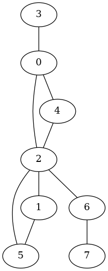
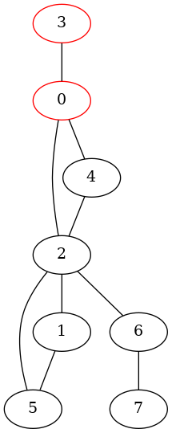
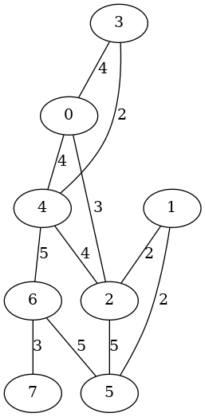
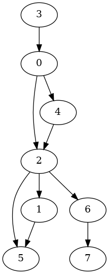
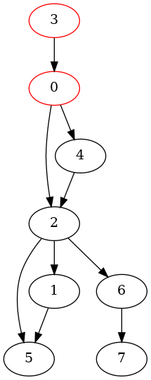
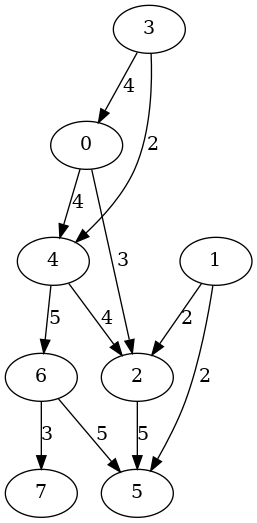
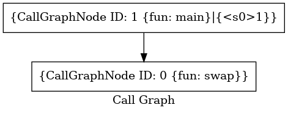
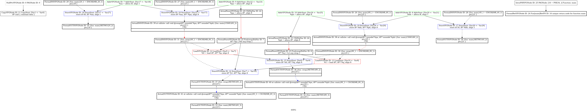

# Dot2Png

``` sh
/*******************************************************************
                    Dot2Png

    1. How to use *.dot files to represent graphs

    2. How to generate images (*.png) from *.dot files

    3. Graph-related research in CSE at UNSW

                                             COMP9024 24T2

 *******************************************************************/
``` 

## Undirected Graph

An undirected graph is a data structure consisting of a set of vertices (also called nodes) and a set of edges. 

Each edge connects two nodes and does not have a direction associated with it.

For example, friendships or connections between individuals are often represented using undirected graphs.

If person A is friends with person B, it implies that person B is also friends with person A.

## Directed Graph

A directed graph is a data structure comprising a set of vertices (nodes) and a set of directed edges (arcs).

Unlike in undirected graphs, the edges in directed graphs have a specific direction associated with them. 

This direction indicates a one-way relationship between vertices. 

For example, the Directed Acyclic Graph (DAG) in [COMP9024/C/HowToMake](../../C/HowToMake/README.md).

The target and dependency files serve as nodes within the DAG, with the dependency relationships forming the edges of the DAG.


## 1 How to download this project in [CSE VLAB](https://vlabgateway.cse.unsw.edu.au/)

Open a terminal (Applications -> Terminal Emulator)

```sh

$ git clone https://github.com/sheisc/COMP9024.git

$ cd COMP9024/Graphs/Dot2Png

Dot2Png$ 

```


## 2 How to generate *.png files from *.dot files


``` sh

Dot2Png$ make

dot -T png images/UndirectedGraph.dot -o images/UndirectedGraph.png 

Dot2Png$ make view

find . -name "*.png" | sort | xargs feh

```

## 3 Undirected Graphs

| Undirected Graph | Undirected Graph (Visited) |  Undirected Graph with Labels |
|:-------------:|:-------------:|:-------------:|
|  |   |  |


## [images/UndirectedGraphVisited.dot](./images/UndirectedGraphVisited.dot)
```sh
graph OurUndirectedGraph {    
"3" -- {"0"}
"0" -- {"2"}
"0" -- {"4"}
"4" -- {"2"}
"2" -- {"5"}
"2" -- {"1"}
"2" -- {"6"}
"1" -- {"5"}
"6" -- {"7"}
"3" [color=red]
"0" [color=red]
}

```

## 4 Directed Graphs

| Directed Graph | Directed Graph (Visited) |  Directed Graph with Labels |
|:-------------:|:-------------:|:-------------:|
|  |   |  |


## [images/DirectedGraphVisited.dot](./images/DirectedGraphVisited.dot)
```sh
graph OurDirectedGraph {    
"3" -> {"0"}
"0" -> {"2"}
"0" -> {"4"}
"4" -> {"2"}
"2" -> {"5"}
"2" -> {"1"}
"2" -> {"6"}
"1" -> {"5"}
"6" -> {"7"}
"3" [color=red]
"0" [color=red]
}

```


## 5 Graph-related research in CSE at UNSW

### 5.1 [HUGE: An Efficient and Scalable Subgraph Enumeration](http://www.zhengyi.one/)

**[Zhengyi Yang](http://www.zhengyi.one/), Longbin Lai, [Xuemin Lin](https://www.cse.unsw.edu.au/~lxue/), Kongzhang Hao and [Wenjie Zhang](https://www.cse.unsw.edu.au/~zhangw/)**
```sh
Proceedings of the 2021 International Conference on Management of Data (SIGMOD 2021)
```

**[COMP9311 Database Systems](https://webcms3.cse.unsw.edu.au/COMP9311/24T2/)**

### 5.2 [TIPS: Tracking Integer-Pointer Value Flows for C++ Member Function Pointers](https://sheisc.github.io/)
**[Changwei Zou](https://sheisc.github.io/), Dongjie He, [Yulei Sui](https://yuleisui.github.io/) and [Jingling Xue](https://www.cse.unsw.edu.au/~jingling/).**
```sh
2024 ACM SIGSOFT International Symposium on the Foundations of Software Engineering (FSE 2024)
```
**[COMP9024 Data Structures and Algorithms](https://webcms3.cse.unsw.edu.au/COMP9024/24T2/)**

| C++ Programs      | Number Of Value Flow Graph Nodes | Number of Value Flow Graph Edges |
| :---------------- | :------: | :----: |
| llvm-config       |   821,341                     | 1,166,045 |
| llvm-ml           |   5,498,863                   | 8,777,931 |
| FileCheck         |  944,214                      | 1,333,502 |
| llvm-mt           |  888,408                      | 1,259,724  |
| cmake_automoc_parser (Qt)  |   1,923,808               | 3,181,915 |
| moc (Qt)                  |   2,236,289                | 3,646,680 |
| tracegen (Qt)             |  1,779,135                 | 2,977,068 |
| tracepointgen (Qt)        |  1,737,779                 | 2,906,594 |
| ninja                 |   174,825                  | 236,430 |
| ninja_test (GoogleTest) |   1,371,169              | 2,148,449 |
| build_log_perftest      |  133,850                 | 174,170 |
| manifest_parser_perftes | 134,088                  | 174,183 |


**Our analysis environment consisted of a 3.50 GHz Intel Xeon E5 CPU, equipped with 512 GB of memory, and operated on a 64-bit Ubuntu 20.04 OS.**

### 5.3 SVF

[SVF](https://github.com/SVF-tools/SVF) is a source code analysis tool that enables inter-procedural dependence analysis for LLVM-based languages.

SVF is able to perform pointer alias analysis, value-flow tracking for program variables and memory error checking.

## [Analyze a Simple C Program](https://github.com/svf-tools/SVF/wiki/Analyze-a-Simple-C-Program)

```C

void swap(char **p, char **q) {
   char *t;
   
   t = *p;
   *p = *q;
   *q = t;
}

int main(void) {
   char aa = '1', bb = '2';
   
   char *pa = &aa;
   char *pb = &bb;
   
   swap(&pa, &pb);
   
   return 0;
}

```

## Program Assignment Graph


## Constraint Graph


## Call Graph



## Sparse Value Flow Graph



