# Edmonds-Karp's algorithm


## Introduction

The Edmonds-Karp's algorithm is an approach used to compute the maximum flow in a flow network. 

The core idea is to repeatedly find paths (e.g., Source -> Node1 -> Node3 -> Sink, found by [breadth first search](../BreadthFirstSearch/README.md)) from the source to the sink in the graph.

```sh
The meaning of the edge weight in the graph.

         0/3
Source -------->  Node 1

The flow capacity of the edge, Source --> Node 1,  is 3, and the current flow is 0.
```

To maximize the flow in a flow network, reversed edges (e.g. Node1 -> Source, the red edges in the following diagrams) are introduced when updating edge weights as follows.

```C
    for (long v = sink; v != source; v = parents[v]) {
        long u = parents[v];
        // updating one edge's weight
        MatrixElement(pGraph, u, v) -= pathFlow;
        // reversed edge
        MatrixElement(pGraph, v, u) += pathFlow;
    }
```

```
 // After updating the weights on the path found

         2/3          2/3          2/2         
 Source -----> Node1 -----> Node3 ----->  Sink

 // Reversed edges 

          0/2          0/2          0/2         
 Source <----- Node1 <----- Node3 <-----  Sink
```

Reversed edges allow for the possibility of "undoing" or "reversing" flow in future iterations.

| Path 1: Source -> Node1 -> Node3 -> Sink, Flow: 2 | Update edge weights | Hide reversed edges |
|:-------------:|:-------------:|:-------------:|
| 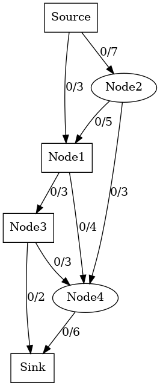 |  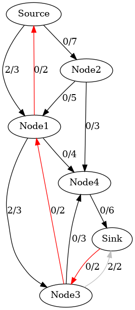 |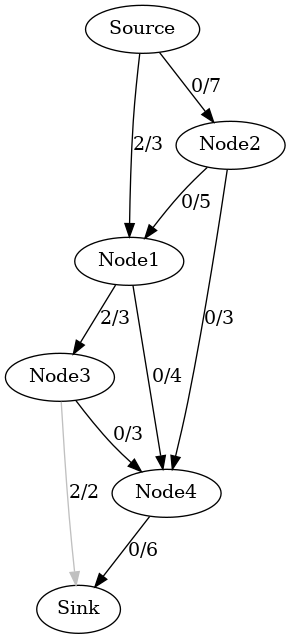 |

If the reversed edges are not included in the graph, we might end up with a scenario where the local maximum flow along a path doesn't contribute to a larger overall flow in the network.

In the following example discussed in [Ford-Fulkerson](../FordFulkersonMF/), the sum of local maximums (i.e., 3+3) might be not the global maximum (i.e., 8).


| Local maximum flow 3 on the path Source->Node1->Node3->Node4->Sink, but the flow capacity of the edge Node3->Sink has been wasted. | 
|:-------------:|
| 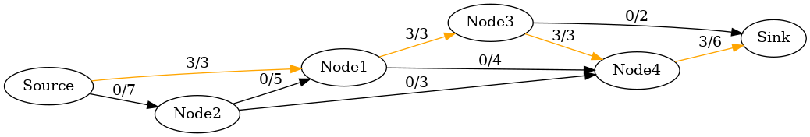 | 

| Local maximum flow 3 on the path Source->Node2->Node1->Node4->Sink, but the flow capacity of the edge Node3->Sink has been wasted. | 
|:-------------:|
| 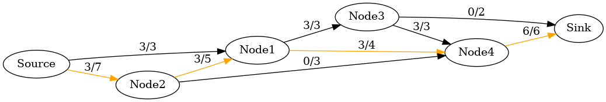 | 


| Global maximum flow 8. | 
|:-------------:|
| 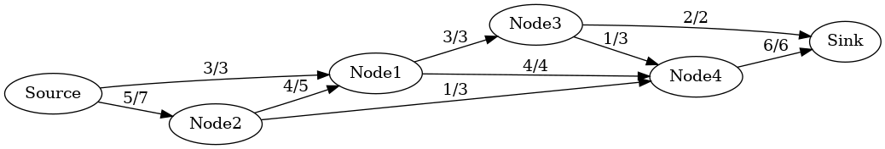 | 


Augmented paths can contain reversed edges added during the algorithm.


### Edmonds-Karp vs. [Ford-Fulkerson](../FordFulkersonMF/)

Think about augmenting paths as highways:

- BFS finds the shortest highway, one with fewer exits, fewer turns, and fewer traffic lights—allowing for the most direct travel from start to end.

- DFS, on the other hand, might find a highway that is longer or more complicated. Even though it might eventually reach the destination, it might take much longer and use unnecessary roads.


By using BFS to find shorter paths, the Edmonds-Karp algorithm ensures that each augmenting path has a meaningful impact on the flow, reducing the total number of iterations needed to reach the maximum flow.

Summary:

- BFS always finds the shortest augmenting path in terms of edges: It explores the graph in layers and finds the path with the fewest edges.

- Significant flow contribution: Shorter paths contribute more efficiently to the total flow, meaning each augmenting path makes better progress toward the maximum flow.

- Fewer iterations: Since BFS ensures that each path makes effective progress, the algorithm converges faster, leading to a polynomial time complexity.

This is why BFS is the key to ensuring Edmonds-Karp runs efficiently and avoids the inefficiencies that can arise when using DFS in the Ford-Fulkerson method.

###  make view

**Ensure that you have executed 'make' and './main' before 'make view'.**


```sh
Kruskal$ make view
find ./images -name "*.png" | sort | xargs feh -g 1024x768 &
```

**Click on the window of 'feh' or use your mouse scroll wheel to view images**.

Here, **feh** is an image viewer available in [CSE VLAB](https://vlabgateway.cse.unsw.edu.au/).


| Initial | 
|:-------------:|
| 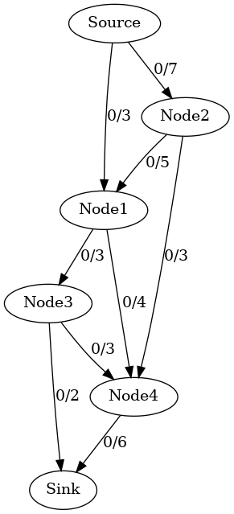 |  

| Path 1: Source -> Node1 -> Node3 -> Sink, Flow: 2 | Update edge weights | Hide reversed edges |
|:-------------:|:-------------:|:-------------:|
|  |   | |

| Path 2: Source -> Node1 -> Node4 -> Sink, Flow: 1 |Update edge weights | Hide reversed edges |
|:-------------:|:-------------:|:-------------:|
| 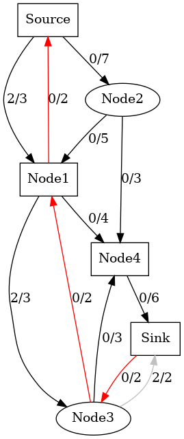 | 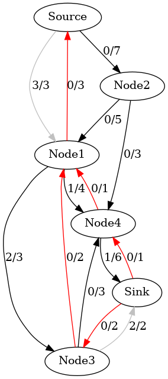 |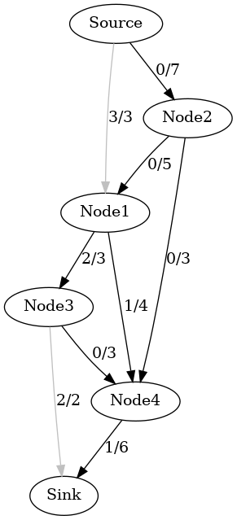 |

| Path 3: Source -> Node2 -> Node4 -> Sink, Flow: 3 | Update edge weights | Hide reversed edges |
|:-------------:|:-------------:|:-------------:|
| 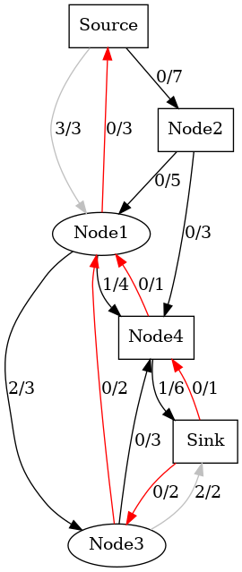 |  | 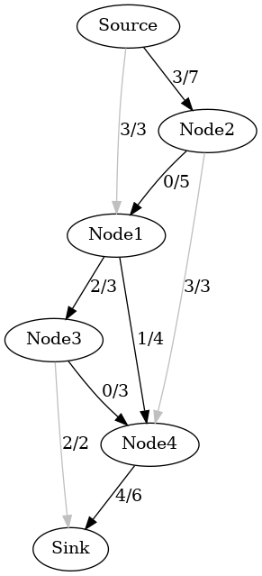 |

| Path 4: Source -> Node2 -> Node1 -> Node4 -> Sink, Flow: 2 |Update edge weights | Hide reversed edges |
|:-------------:|:-------------:|:-------------:|
| 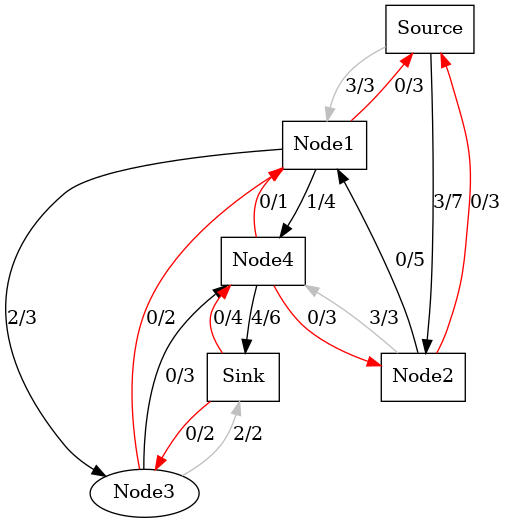 | 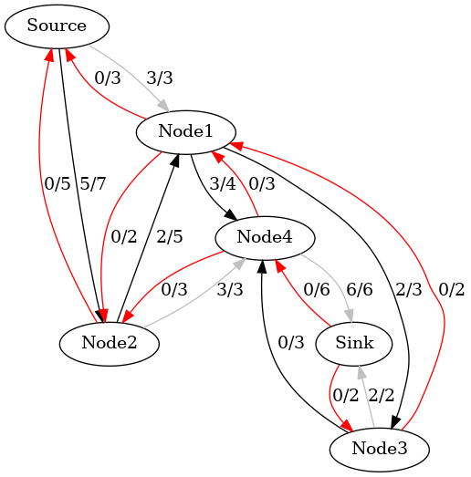 | 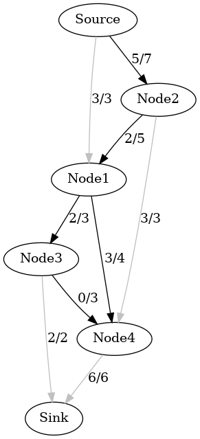 |


### Output

```sh
Path: Source -> Node1 -> Node3 -> Sink, Flow: 2
Path: Source -> Node1 -> Node4 -> Sink, Flow: 1
Path: Source -> Node2 -> Node4 -> Sink, Flow: 3
Path: Source -> Node2 -> Node1 -> Node4 -> Sink, Flow: 2

Max flow is 8 
```
 