# FordFulkerson's algorithm

## Introduction

The Ford-Fulkerson algorithm is an approach used to compute the maximum flow in a flow network. 

The algorithm was developed by L.R. Ford Jr. and D.R. Fulkerson in 1956. 

The core idea is to repeatedly find paths (e.g., Source -> Node1 -> Node3 -> Node4 -> Sink, found by [depth first search](../DepthFirstSearch/README.md)) from the source to the sink in the graph.

```sh
The meaning of the edge weight in the graph.

         0/3
Source -------->  Node 1

The flow capacity of the edge, Source --> Node 1, is 3, and the current flow is 0.
```

To maximize the flow in a flow network, reversed edges (e.g., Node1 -> Source, the red edges in the following diagrams) are introduced when updating edge weights as follows.

```C
    for (long v = sink; v != source; v = parents[v]) {
        long u = parents[v];
        // updating one edge's weight
        MatrixElement(pGraph, u, v) -= pathFlow;
        // reversed edge
        MatrixElement(pGraph, v, u) += pathFlow;
    }
```

```
 // After updating the weights on the path found

         3/3          3/3          3/3          3/6
 Source -----> Node1 -----> Node3 -----> Node4 -----> Sink

 // Reversed edges 

         0/3          0/3          0/3          0/3
 Source <----- Node1 <----- Node3 <----- Node4 <----- Sink
```

Reversed edges allow for the possibility of "undoing" or "reversing" flow in future iterations.

| Path 1: Source -> Node1 -> Node3 -> Node4 -> Sink, Flow: 3 | Update edge weights | Hide reversed edges |
|:-------------:|:-------------:|:-------------:|
| 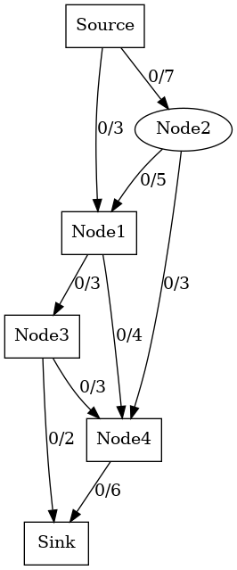 |  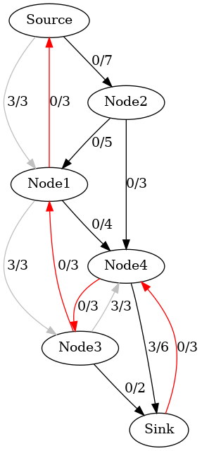 | |

If the reversed edges are not included in the graph, we might end up with a scenario where the local maximum flow along a path doesn't contribute to a larger overall flow in the network.

In the following example, the sum of local maximums (i.e., 3+3) might be not the global maximum (i.e., 8).


| Local maximum flow 3 on the path Source->Node1->Node3->Node4->Sink, but the flow capacity of the edge Node3->Sink has been wasted. | 
|:-------------:|
|  | 

| Local maximum flow 3 on the path Source->Node2->Node1->Node4->Sink, but the flow capacity of the edge Node3->Sink has been wasted. | 
|:-------------:|
|  | 


| Global maximum flow 8. | 
|:-------------:|
|  | 


Augmented paths (e.g. Path 2 in the following diagrams) can contain reversed edges (e.g., Node4 -> Node3 in Path 2 ) added during the algorithm.

###  make view

**Ensure that you have executed 'make' and './main' before 'make view'.**


```sh
Kruskal$ make view
find ./images -name "*.png" | sort | xargs feh -g 1024x768 &
```

**Click on the window of 'feh' or use your mouse scroll wheel to view images**.

Here, **feh** is an image viewer available in [CSE VLAB](https://vlabgateway.cse.unsw.edu.au/).


| Initial | 
|:-------------:|
|  |  

| Path 1: Source -> Node1 -> Node3 -> Node4 -> Sink, Flow: 3 | Update edge weights | Hide reversed edges |
|:-------------:|:-------------:|:-------------:|
|  |   | |

| Path 2: Source -> Node2 -> Node1 -> Node4 -> Node3 -> Sink, Flow: 2 |Update edge weights | Hide reversed edges |
|:-------------:|:-------------:|:-------------:|
| 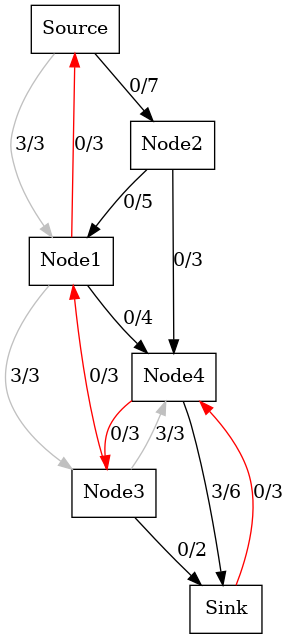 | 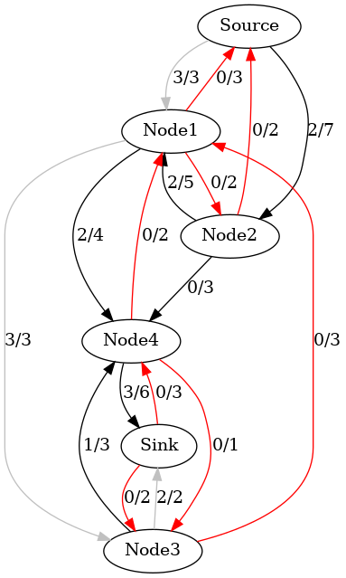 |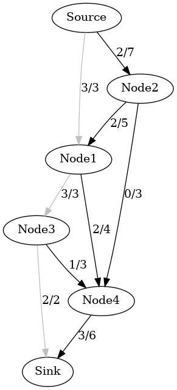 |

| Path 3: Source -> Node2 -> Node1 -> Node4 -> Sink, Flow: 2 | Update edge weights | Hide reversed edges |
|:-------------:|:-------------:|:-------------:|
| 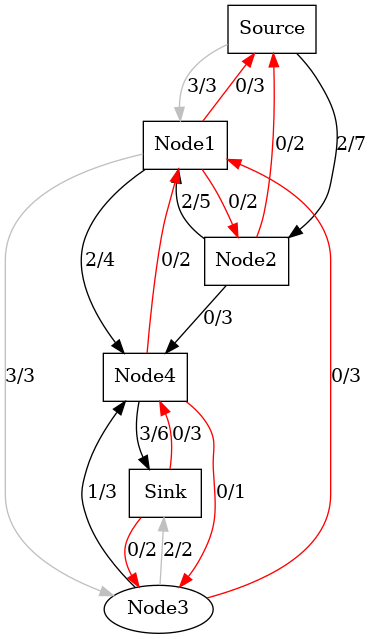 | 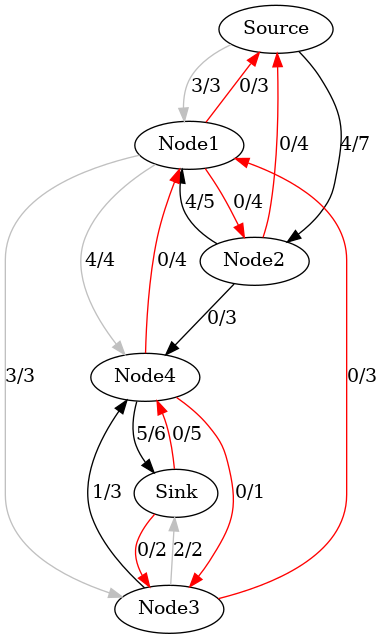 | 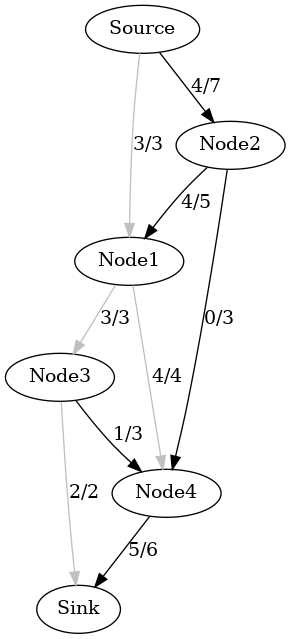 |

| Path 4: Source -> Node2 -> Node4 -> Sink, Flow: 1 |Update edge weights | Hide reversed edges |
|:-------------:|:-------------:|:-------------:|
| 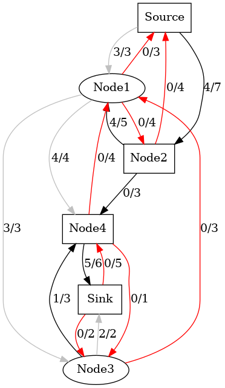 | 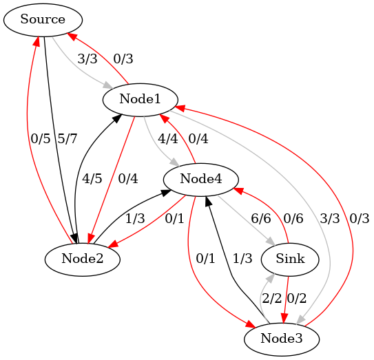 | 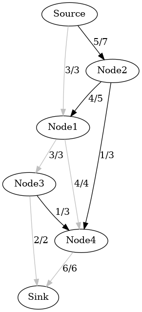 |


### Output

```sh
Path: Source -> Node1 -> Node3 -> Node4 -> Sink, Flow: 3
Path: Source -> Node2 -> Node1 -> Node4 -> Node3 -> Sink, Flow: 2
Path: Source -> Node2 -> Node1 -> Node4 -> Sink, Flow: 2
Path: Source -> Node2 -> Node4 -> Sink, Flow: 1
Max flow is 8 

```

