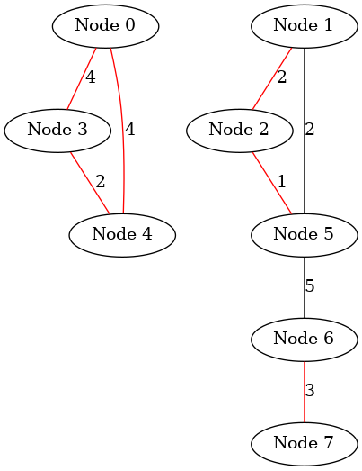
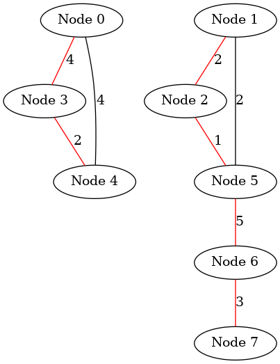

# Kruskal's algorithm

Kruskal's algorithm is a well-known algorithm in graph theory used to find the minimum spanning tree (MST) of an undirected graph with weighted edges. 

## Steps of Kruskal's Algorithm

- Sort all the edges of the graph in non-decreasing order of their weights.

- Initialize a collection of disjoint sets, where each vertex is in its own set. This is typically managed using a disjoint-set ([union-find](../../UnionFind/README.md)) data structure to efficiently perform union and find operations.

- Process the edges in order (from least weight to greatest weight).

    For each edge, if the two vertices of the edge belong to different sets (i.e., they are not connected yet), add the edge to the MST and union the two sets.
    
    If the two vertices are already in the same set, adding the edge would create a cycle, so skip this edge.
    
    Repeat this process until we have included (n-1) edges (where n is the number of nodes in the graph).


###  make view


```sh
Kruskal$ make view
find ./images -name "*.png" | sort | xargs feh -g 1024x768 &
```


| Initial | 
|:-------------:|
|  |  

| Step 1| 
|:-------------:|
|  | 

| Step 2 | 
|:-------------:|
|  | 

| Step 3 (cycle detected)| 
|:-------------:|
|  | 

| Step 4 | 
|:-------------:|
|  | 


| Step 5 | 
|:-------------:|
|  | 

| Step 6 | 
|:-------------:|
|  | 

| Step 7 (cycle detected)| 
|:-------------:|
|  | 


| Step 8 | 
|:-------------:|
|  | 


