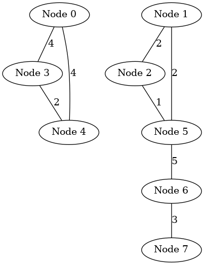
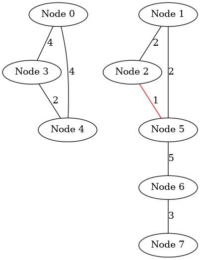
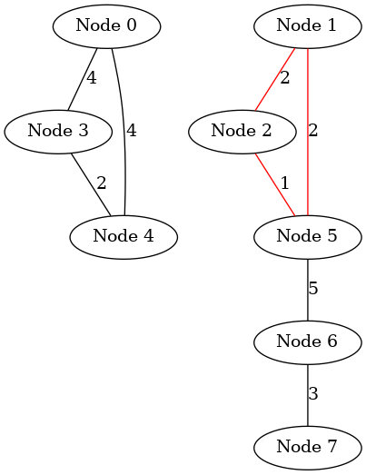
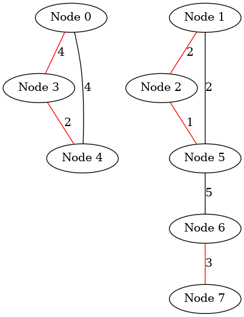

# Kruskal's algorithm

``` sh
/*******************************************************************
                    Kruskal's algorithm 

    1.  How to use Kruskal's algorithm in an undirected graph


                                             COMP9024

 *******************************************************************/
``` 

## Introduction


###  make view

**Ensure that you have executed 'make' and './main' before 'make view'.**


```sh
Kruskal$ make view
find ./images -name "*.png" | sort | xargs feh -g 1024x768 &
```

**Click on the window of 'feh' or use your mouse scroll wheel to view images**.

Here, **feh** is an image viewer available in [CSE VLAB](https://vlabgateway.cse.unsw.edu.au/).


| Initial | 
|:-------------:|
|  |  

| Step 1 | 
|:-------------:|
|  | 

| Step 2 | 
|:-------------:|
|  | 

| Step 3 | 
|:-------------:|
|  | 

| Step 4 | 
|:-------------:|
|  | 


| Step 5 | 
|:-------------:|
|  | 

| Step 6 | 
|:-------------:|
|  | 

| Step 7 | 
|:-------------:|
|  | 


