# Prim's algorithm

## Introduction

Prim's algorithm finds the Minimum Spanning Tree (MST) of a connected, undirected graph.

It can reuse a lot of the structure from [Dijkstra's algorithm](../Dijkstra/README.md). 

Both algorithms share some similarities in their approach, and this makes it easier to implement Prim's algorithm by leveraging Dijkstra's code. 

### Key differences.

- Dijkstra's Algorithm: 

    Accumulates the shortest path distances to all nodes from a source node. 

- Prim's MST Algorithm: 
  
    It expands the MST by selecting the shortest edge connecting the already selected tree to new nodes.

| Dijkstra: the 6 in (Node 2: 6) is the shortest distance accumulated | Prim: the -5 in (Node 5: -5) is the weight of the shortest edge |
|:-------------:|:-------------:|
|  |   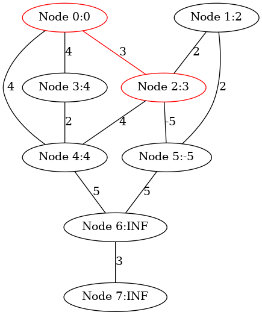 |

###  make view

**Ensure that you have executed 'make' and './main' before 'make view'.**


```sh
PrimMST$ make view
find ./images -name "*.png" | sort | xargs feh -g 1024x768 &
```


| Initial | 
|:-------------:|
| 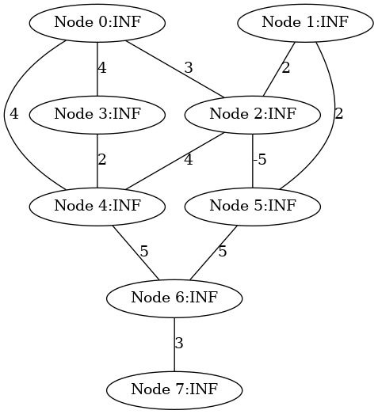 |  


| Step 1 |  |
|:-------------:|:-------------:|
| 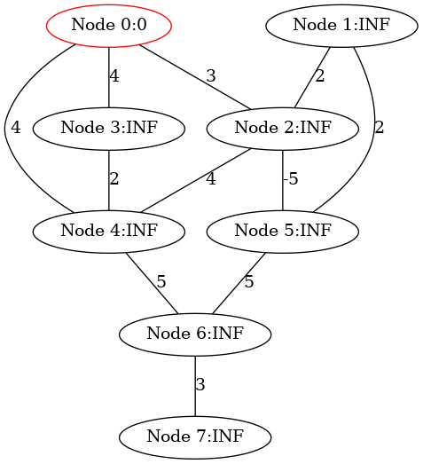 |  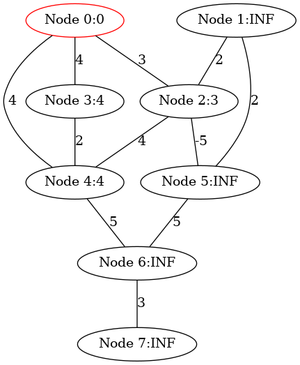 | 


| Step 2 |  |
|:-------------:|:-------------:|
| 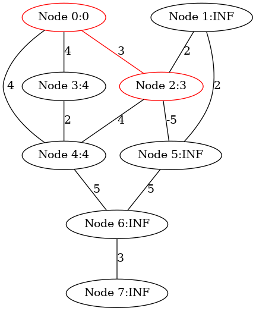 |   | 


|Step 3 |  |
|:-------------:|:-------------:|
|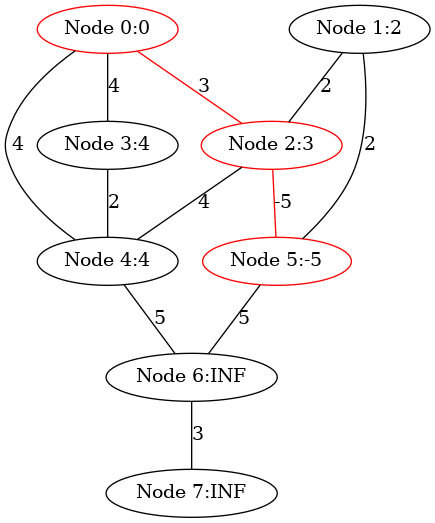 | 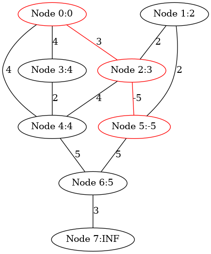  | 


|Step 4 | |
|:-------------:|:-------------:|
| 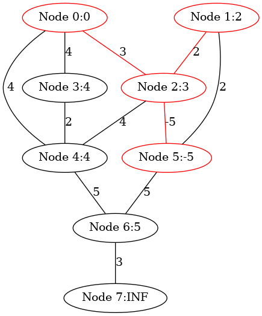 | | 


| Step 5 | |
|:-------------:|:-------------:|
|   |  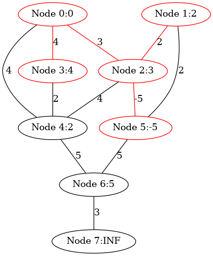| 

| Step 6 | |
|:-------------:|:-------------:|
| 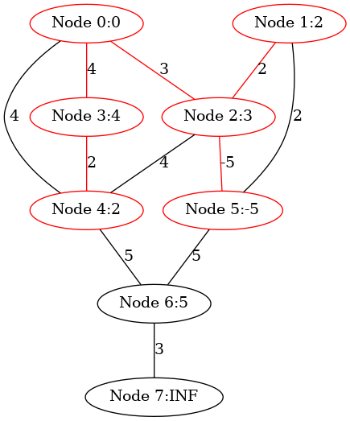  |   | 

| Step 7 ||
|:-------------:|:-------------:|
| 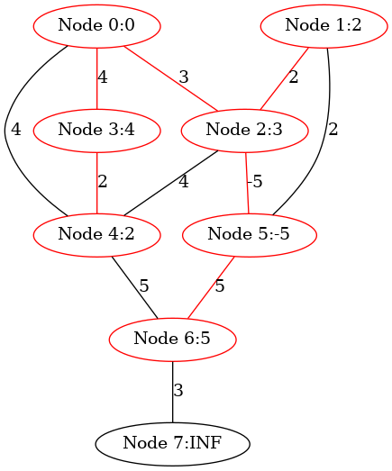  | 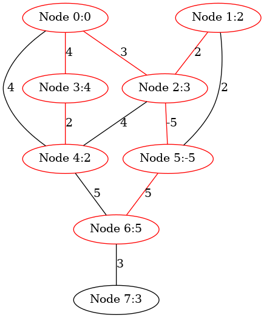| 


| Step 8 |  |
|:-------------:|:-------------:|
| 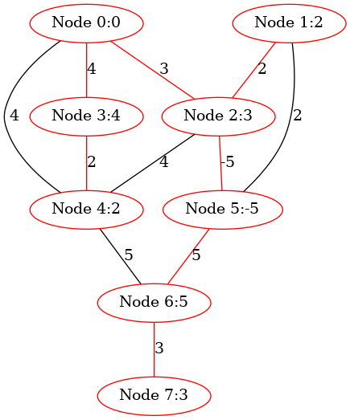 |  | 


