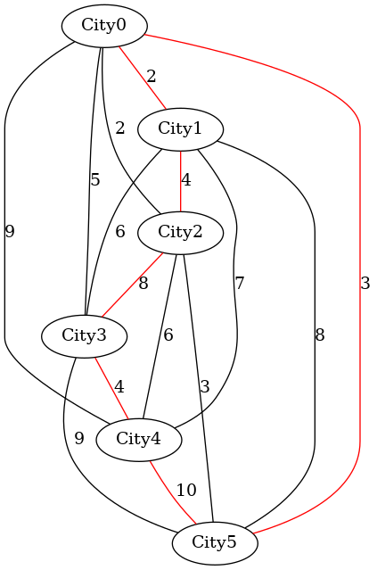
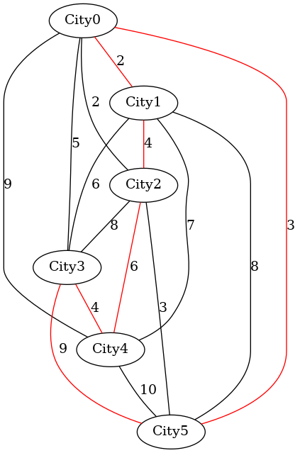
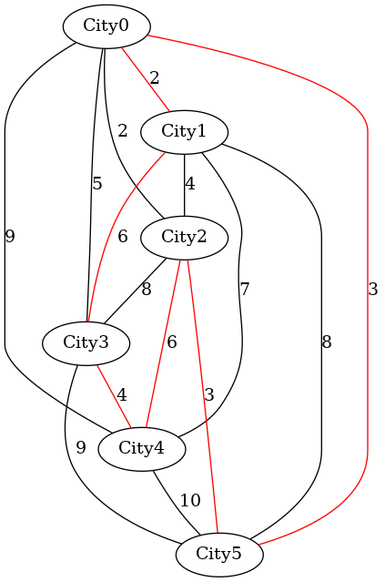
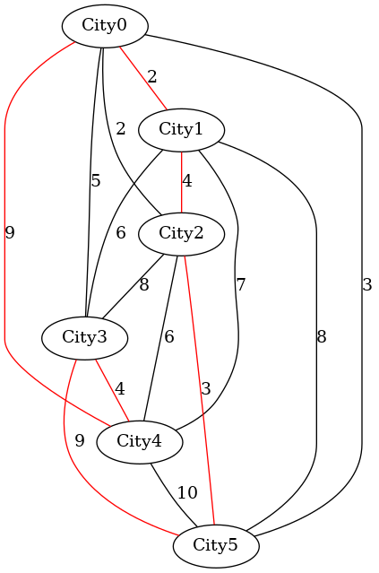

# Traveling Salesman Problem


The Traveling Salesman Problem (TSP) is a classic optimization problem in computer science and mathematics. 

In the problem, a salesperson (or any entity) is given a set of cities, and the goal is to determine the shortest possible route that visits each city exactly once and returns to the starting city.


###  make view

```sh
TravelingSalesman$ make view
find ./images -name "*.png" | sort | xargs feh -g 1024x768 &

TravelingSalesman$ ./main

The length of the route is 31: City0 -> City1 -> City2 -> City3 -> City4 -> City5 -> City0

The length of the route is 28: City0 -> City1 -> City2 -> City4 -> City3 -> City5 -> City0

The length of the route is 24: City0 -> City1 -> City3 -> City4 -> City2 -> City5 -> City0


******** The shortest route in TspNearestNeighbour(0) ************ 

The length of the route is 31: City0 -> City1 -> City2 -> City5 -> City3 -> City4 -> City0


```


### TspPermute()

Solving the Traveling Salesman Problem (TSP) by [permutations](https://github.com/sheisc/COMP9024/tree/main/Complexity/Counting#7-printpermutations) involves exhaustively checking all possible routes and selecting the one with the smallest total distance. 

This brute-force method is guaranteed to find the optimal solution, but it has a time complexity of O(n!), which quickly becomes infeasible as the number of cities grows.

| The length of the route is 31: City0 -> City1 -> City2 -> City3 -> City4 -> City5 -> City0 | 
|:-------------:|
|  |  

| The length of the route is 28: City0 -> City1 -> City2 -> City4 -> City3 -> City5 -> City0  | 
|:-------------:|
|  |  


| The length of the route is 24: City0 -> City1 -> City3 -> City4 -> City2 -> City5 -> City0 | 
|:-------------:|
|  |  

 

| The shortest route is 24: City0 -> City1 -> City3 -> City4 -> City2 -> City5 -> City0 | 
|:-------------:|
|  |  


### TspNearestNeighbour()

The Nearest Neighbor algorithm for solving the Traveling Salesman Problem (TSP) does not guarantee finding the shortest possible route.

Due to its greedy nature, the algorithm makes locally optimal choices (i.e., picking the nearest unvisited city) without considering the overall problem, which may lead to a less optimal solution.

| The length of the route is 31: City0 -> City1 -> City2 -> City5 -> City3 -> City4 -> City0 | 
|:-------------:|
|  | 


