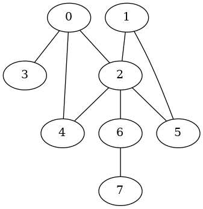

# Undirected Graph

``` sh
/*******************************************************************
                Undirected Graph

    1.  How to define the data structure of an undirected graph in C

    2.  How to create an undirected graph

    3.  How to save an undirected graph into a *.dot file and convert it into an
        image file (*.png).
        


                                             COMP9024 24T2

 *******************************************************************/
``` 

### Undirected Graph


An undirected graph is a data structure consisting of a set of vertices (also called nodes) and a set of edges. 

Each edge connects two nodes and does not have a direction associated with it.

For example, friendships or connections between individuals are often represented using undirected graphs. 

If person A is friends with person B, it implies that person B is also friends with person A.


## 1 How to download this project in [CSE VLAB](https://vlabgateway.cse.unsw.edu.au/)

Open a terminal (Applications -> Terminal Emulator)

```sh

$ git clone https://github.com/sheisc/COMP9024.git

$ cd COMP9024/Graphs/UndirectedGraph

UndirectedGraph$ 

```


## 2 How to start [Visual Studio Code](https://code.visualstudio.com/) to browse/edit/debug a project.


```sh

UndirectedGraph$ code

```

Two configuration files (UndirectedGraph/.vscode/[launch.json](https://code.visualstudio.com/docs/cpp/launch-json-reference) and UndirectedGraph/.vscode/[tasks.json](https://code.visualstudio.com/docs/editor/tasks)) have been preset.


### 2.1 Open the project in VS Code

In the window of Visual Studio Code, please click "File" and "Open Folder",

select the folder "COMP9024/Graphs/UndirectedGraph", then click the "Open" button.


### 2.2 Build the project in VS Code

click **Terminal -> Run Build Task**


### 2.3 Debug the project in VS Code

Open src/main.c, and click to add a breakpoint (say, line 11).

Then, click **Run -> Start Debugging**


### 2.4 Directory

```sh
├── Makefile             defining set of tasks to be executed (the input file of the 'make' command)
|
├── README.md            introduction to this tutorial
|
├── images               *.dot and *.png files generated by this program
|
├── src                  containing *.c and *.h
|    |
|    ├── Graph.c         containing the code for Undirected Graph
|    ├── Graph.h
|    ├── main.c          main()
|
└── .vscode              containing configuration files for Visual Studio Code
    |
    ├── launch.json      specifying which program to debug and with which debugger,
    |                    used when you click "Run -> Start Debugging"
    |
    └── tasks.json       specifying which task to run (e.g., 'make' or 'make clean')
                         used when you click "Terminal -> Run Build Task" or "Terminal -> Run Task"
```
Makefile is discussed in [COMP9024/C/HowToMake](../../C/HowToMake/README.md).


## 3 The main procedure

**In addition to utilizing VS Code, we can also compile and execute programs directly from the command line interface as follows.**

``` sh

UndirectedGraph$ make

UndirectedGraph$ ./main

**********  The Adjacency Matrix ************* 
0 0 1 1 1 0 0 0 
0 0 1 0 0 1 0 0 
1 1 0 0 1 1 1 0 
1 0 0 0 0 0 0 0 
1 0 1 0 0 0 0 0 
0 1 1 0 0 0 0 0 
0 0 1 0 0 0 0 1 
0 0 0 0 0 0 1 0 

...

dot -T png images/OurUndirectedGraph_0000.dot -o images/OurUndirectedGraph_0000.png

UndirectedGraph$ make view
find . -name "*.png" | sort | xargs feh &

```
| Undirected Graph |
|:-------------:|
| |

```C
#define CONNECTED   1
#define NUM_OF_NODES  8

int main(void) {
    // Create an undirected graph with 8 nodes
    struct Graph *pGraph = CreateGraph(NUM_OF_NODES, 0);

    //char *nodeNames[NUM_OF_NODES] = {"A", "B", "C", "D", "E", "F", "G", "H"};
    char *nodeNames[NUM_OF_NODES] = {"0", "1", "2", "3", "4", "5", "6", "7"};
    
    // Add nodes
    for (long u = 0; u < NUM_OF_NODES; u++) {
        GraphAddNode(pGraph, u, nodeNames[u]);
    }
    // edges: source node id, target/destination node id, value of the edge
    long edges[][3] = {
        {3, 0, CONNECTED},
        {0, 2, CONNECTED},
        {0, 4, CONNECTED},
        {4, 2, CONNECTED},

        {2, 5, CONNECTED},
        {2, 1, CONNECTED},
        {2, 6, CONNECTED},
        {1, 5, CONNECTED},
        {6, 7, CONNECTED}, 
    }; 

    // Add edges
    for (long i = 0; i < sizeof(edges)/sizeof(edges[0]); i++) {
        GraphAddEdge(pGraph, edges[i][0], edges[i][1], edges[i][2]);
    }

    PrintGraph(pGraph);

    // create a sub-directory 'images' (if it is not present) in the current directory
    system("mkdir -p images");
    // remove the *.dot and *.png files in the directory 'images'
    system("rm -f images/*.dot images/*.png");

    GenOneImage(pGraph, "OurUndirectedGraph", "images/OurUndirectedGraph", 0, NULL);

    ReleaseGraph(pGraph);

    return 0;
}

```

## 4 Data structure
```C
// Storing information of a graph node
struct GraphNode {
    char name[MAX_ID_LEN + 1]; 
} GraphNode;

typedef long AdjMatrixElementTy;

struct Graph{
    /*
       Memory Layout:
                          -----------------------------------------------------------
        pAdjMatrix ---->  Element(0, 0),   Element(0, 1),    ...,       Element(0, n-1),     // each row has n elements
                          Element(1, 0),   Element(1, 1),    ...,       Element(1, n-1),
      
                          .....                            Element(u, v)     ...             // (n * u + v) elements away from Element(0, 0)
      
                          Element(n-1, 0), Element(n-1, 1),  ...,       Element(n-1, n-1)
                          ----------------------------------------------------------- 
                                      Adjacent Matrix on Heap

     */
    AdjMatrixElementTy *pAdjMatrix;
    /*
       Memory Layout
                        ---------------------------
                        pNodes[n-1]
       
       
                        pNodes[1]
       pNodes ----->    pNodes[0]
                       ----------------------------
                        struct GraphNode[n] on Heap
     */
    struct GraphNode *pNodes;
    // number of nodes
    long n;
    // whether it is a directed graph
    int isDirected;
};

// 0 <= u < n,  0 <= v < n
// ELement(u, v) is (n * u + v) elements away from Element(0, 0)
#define  MatrixElement(pGraph, u, v)  (pGraph)->pAdjMatrix[(pGraph)->n * (u) + (v)]

```
## 5 Algorithm

### 5.1 How to create a graph

``` C
/*
    Create a graph which can contain n nodes
 */
struct Graph *CreateGraph(long n, int isDirected) {
    assert(n > 0);
    struct Graph *pGraph = (struct Graph *) malloc(sizeof(struct Graph));
    assert(pGraph);
    pGraph->pAdjMatrix = (AdjMatrixElementTy *) malloc(sizeof(AdjMatrixElementTy) * n * n);
    pGraph->pNodes = (struct GraphNode *) malloc(sizeof(struct GraphNode) * n);
    assert(pGraph->pAdjMatrix && pGraph->pNodes);
    memset(pGraph->pAdjMatrix, 0, sizeof(AdjMatrixElementTy) * n * n);
    memset(pGraph->pNodes, 0, sizeof(struct GraphNode) * n);
    pGraph->n = n;
    pGraph->isDirected = isDirected;
    
    return pGraph;
}


/*
    Add an undirected edge between u and v
 */

void GraphAddUndirectedEdge(struct Graph *pGraph, long u, long v, AdjMatrixElementTy val) {
    if (IsLegalNodeNum(pGraph, u) && IsLegalNodeNum(pGraph, v)) {
        MatrixElement(pGraph, u, v) = val;
        MatrixElement(pGraph, v, u) = val;
    }
}

/*
    Add a directed edge from u to v
 */
void GraphAddDirectedEdge(struct Graph *pGraph, long u, long v, AdjMatrixElementTy val) {
    if (IsLegalNodeNum(pGraph, u) && IsLegalNodeNum(pGraph, v)) {
        MatrixElement(pGraph, u, v) = val;
    }
}

/*
    Add a directed edge from u to v, or an undirected edge between u and v
 */
void GraphAddEdge(struct Graph *pGraph, long u, long v, AdjMatrixElementTy val) {
    if (pGraph->isDirected) {
        GraphAddDirectedEdge(pGraph, u, v, val);
    } else {
        GraphAddUndirectedEdge(pGraph, u, v, val);
    }

}

void GraphAddNode(struct Graph *pGraph, long u, char *name) {
    if (IsLegalNodeNum(pGraph, u)) {        
        snprintf(pGraph->pNodes[u].name, MAX_ID_LEN, "%s", name);
    }
}

```

### 5.2 How to generate [images/OurUndirectedGraph_0000.dot](./images/OurUndirectedGraph_0000.dot)

#### images/OurUndirectedGraph_0000.dot
```
graph OurUndirectedGraph {
"0" -- {"2"}
"0" -- {"3"}
"0" -- {"4"}
"1" -- {"2"}
"1" -- {"5"}
"2" -- {"4"}
"2" -- {"5"}
"2" -- {"6"}
"6" -- {"7"}
"0"
"1"
"2"
"3"
"4"
"5"
"6"
"7"
}
```

```C

void Graph2Dot(struct Graph *pGraph, 
               char *filePath,
               char *graphName,
               int isDirectedGraph,
               int displayLabel,
               int *visited,
               int displayVisited) {
    FILE *dotFile = fopen(filePath, "w");
    /*
        FIXME:  check sanity of the parameters.
     */
    if (dotFile) {
        char *edgeConnectorStr = "";
        if (isDirectedGraph) {
            edgeConnectorStr = "->";
            fprintf(dotFile, "digraph %s {\n", graphName);
        } else {
            edgeConnectorStr = "--";
            fprintf(dotFile, "graph %s {\n", graphName);
        }

        for (long u = 0; u < pGraph->n; u++) {
            long vStart = u;
            if (isDirectedGraph) {
                vStart = 0;
            }
            for (long v = vStart; v < pGraph->n; v++) {
                long val = MatrixElement(pGraph, u, v);
                if (val) {
                    fprintf(dotFile, "\"%s\" %s {\"%s\"}", 
                            pGraph->pNodes[u].name, 
                            edgeConnectorStr, 
                            pGraph->pNodes[v].name);
                    if (displayLabel) {
                        fprintf(dotFile, " [label=\"%ld\"]", val);
                    }
                    fprintf(dotFile, "\n"); 
                }
            }
        }
        /*
        "0" [color=red]
         */
        // if (displayVisited && visited) {
        //     for (long i = 0; i < pGraph->n; i++) {
        //         if (visited[i]) {
        //             fprintf(dotFile, "\"%s\" [color=red]\n", pGraph->pNodes[i].name);
        //         }
        //     }
        // }
        for (long i = 0; i < pGraph->n; i++) {
            if (displayVisited && visited && visited[i]) {
                fprintf(dotFile, "\"%s\" [color=red]\n", pGraph->pNodes[i].name);
            } else {
                fprintf(dotFile, "\"%s\"\n", pGraph->pNodes[i].name);
            }
        }      
        fprintf(dotFile, "}\n");
        fclose(dotFile);
    }                
}
```

### 5.3 How to generate [images/OurUndirectedGraph_0000.png](./images/OurUndirectedGraph_0000.png)
```sh
dot -T png images/OurUndirectedGraph_0000.dot -o images/OurUndirectedGraph_0000.png
```

```C
#define FILE_NAME_LEN  255

void GenOneImage(struct Graph *pGraph, char *graphName, char *fileName, int seqNo, int *visited) {
    char dotFileName[FILE_NAME_LEN+1] = {0};
    char pngFileName[FILE_NAME_LEN+1] = {0};
    char command[(FILE_NAME_LEN+1)*4] = {0};
    
    snprintf(dotFileName, FILE_NAME_LEN, "%s_%04d.dot", fileName, seqNo);
    snprintf(pngFileName, FILE_NAME_LEN, "%s_%04d.png", fileName, seqNo);

    Graph2Dot(pGraph, dotFileName, graphName, pGraph->isDirected, 0, visited, 1);

    snprintf(command, FILE_NAME_LEN*4, "dot -T png %s -o %s", dotFileName, pngFileName);
    
    // Execute the command in a child process (fork() + exec() on Linux)
    system(command); 

}
```