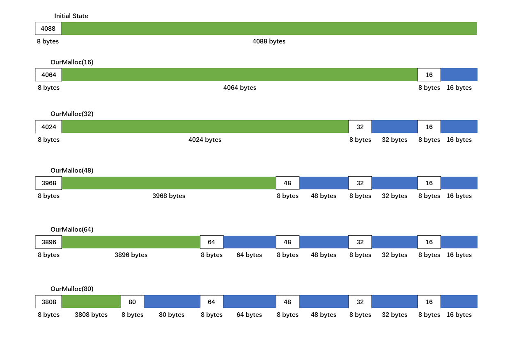
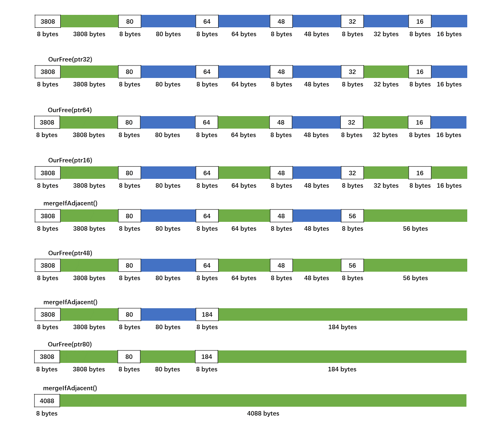

# Heap Allocator

``` sh
/*******************************************************************
                    Heap Allocator

    1.  Heap allocation with the first fit algorithm 

    2.  How to implement OurMalloc()

    3.  How to implement OurFree()

                                             COMP9024 24T2

 *******************************************************************/
``` 
## Introduction

This project is designed as a sub-project of our [large assignment](../LargeAssignment/README.md).

Heap allocation with the first fit algorithm is a fundamental concept in memory management.

An allocator is responsible for managing the allocation and deallocation of memory on the heap. 

It keeps track of which parts of the heap are in use and which are free.

To be simple, we use an array in the global memory area (only 4096 bytes) to imitate/mimic the heap space in this project.

```C
#define HEAP_SIZE (4 * 1024)

// use it as heap space via OurMalloc() and OurFree()
static char heap[HEAP_SIZE]; 
```

Two custom functions, **SccMalloc()** and **SccFree()**, are provided to manage the 'heap space', which are similar with **malloc()** and **free()** respectively.

```C
// C library functions
void *malloc(size_t size);
void free(void *ptr);

// In this project

typedef unsigned long heap_size_t;

void *SccMalloc(heap_size_t size);
void SccFree(void *addr);
```


### The first fit algorithm


Initially, our allocator has the entire heap as one large free block of memory.

That is, there is only one free memory block in the linked list after initialization. 


```sh

[0x55797dcdc040,4088]

```

We use a singly-linked list to maintain all the free memory blocks.

The singly-linked list is sorted by memory block addresses in ascending order.

When an allocation request comes in, 

the allocator looks for the first free block of memory that is large enough to hold the requested size plus any necessary metadata (like bookkeeping information, i.e., the size of the memory block).


### SccMalloc() and SccFree()

```C
#define USE_OUR_MALLOC_FREE

void *SccMalloc(heap_size_t size) {
#ifdef USE_OUR_MALLOC_FREE
  return OurMalloc(size);
#else
  return malloc(size);
#endif    

}

void SccFree(void *addr) {
#ifdef USE_OUR_MALLOC_FREE
  return OurFree(addr);
#else
  return free(addr);
#endif
}

/*
  
  1. The OurMalloc() function allocates @size bytes and returns a pointer to the allocated memory.
     
  2. The memory allocated is not initialized. 

 */
static void *OurMalloc(heap_size_t size) {
    ...
}

/*

  The OurFree() function frees the memory space pointed to by @addr, 
  which must have been returned by a previous call to OurMalloc().

  If addrs is NULL, no operation is performed.

 */
static void OurFree(void *addr) {
    ...
}


```

### How does OurFree(void *addr) know the size of the memory block pointed to by the parameter 'addr'

When allocating the memory block via **OurMalloc(unsigned long size)**, we can use 8 bytes (i.e., sizeof(unsigned long) 
on a 64-bit system) to remember the size of the memory block allocated.

For instance, after calling SccMalloc(16), a total of 24 bytes of heap memory will be allocated. 

Of these, 16 bytes are utilized by the C programmer, while 8 bytes are reserved for bookkeeping purposes.

```sh
[0x55797dcdc040,4088]

************** SccMalloc() *****************

void * ptr16 = SccMalloc(16)

	[0x55797dcdc040,4064]

```


## 1 How to download COMP9024/HeapAllocator in [CSE VLAB](https://vlabgateway.cse.unsw.edu.au/)

Open a terminal (Applications -> Terminal Emulator)

```sh

$ git clone https://github.com/sheisc/COMP9024.git

$ cd COMP9024/HeapAllocator

HeapAllocator$ 

```


## 2 How to start [Visual Studio Code](https://code.visualstudio.com/) to browse/edit/debug a project.

```sh

HeapAllocator$ code

```

Two configuration files (HeapAllocator/.vscode/[launch.json](https://code.visualstudio.com/docs/cpp/launch-json-reference) and HeapAllocator/.vscode/[tasks.json](https://code.visualstudio.com/docs/editor/tasks)) have been preset.


#### 2.1 Open the project in VS Code

In the window of Visual Studio Code, please click "File" and "Open Folder",

select the folder "COMP9024/HeapAllocator", then click the "Open" button.


#### 2.2 Build the project in VS Code

click **Terminal -> Run Build Task**


#### 2.3 Debug the project in VS Code

Open src/TestSccHeap.c, and click to add a breakpoint (say, line 88).

Then, click **Run -> Start Debugging**

### 2.4 Directory

```sh
├── Makefile             defining set of tasks to be executed (the input file of the 'make' command)
|
├── README.md            introduction to this tutorial
|
├── src                  containing *.c and *.h
|   |
│   ├── SccHeap.c        Heap allocator
│   ├── SccHeap.h
|   |
│   └── TestSccHeap.c    main()
|
|── images
|
└── .vscode              containing configuration files for Visual Studio Code
    |
    ├── launch.json      specifying which program to debug and with which debugger,
    |                    used when you click "Run -> Start Debugging"
    |
    └── tasks.json       specifying which task to run (e.g., 'make' or 'make clean')
                         used when you click "Terminal -> Run Build Task" or "Terminal -> Run Task"
```

Makefile is discussed in [COMP9024/C/HowToMake](../../C/HowToMake/README.md).


## 3 The main procedure

**After completing the code in Q1-Q10 in SccHeap.c, we can build and run this program directly from the command line interface as follows.**


``` sh

HeapAllocator$ make

HeapAllocator$ ./main

[0x55797dcdc040,4088]

************** SccMalloc() *****************

void * ptr16 = SccMalloc(16)

	[0x55797dcdc040,4064]

void * ptr32 = SccMalloc(32)

	[0x55797dcdc040,4024]

void * ptr48 = SccMalloc(48)

	[0x55797dcdc040,3968]

void * ptr64 = SccMalloc(64)

	[0x55797dcdc040,3896]

void * ptr80 = SccMalloc(80)

	[0x55797dcdc040,3808]

************** SccFree() *****************

SccFree(ptr32)

	[0x55797dcdc040,3808]-->[0x55797dcdd000,32]

SccFree(ptr64)

	[0x55797dcdc040,3808]-->[0x55797dcdcf80,64]-->[0x55797dcdd000,32]

SccFree(ptr16)

	[0x55797dcdc040,3808]-->[0x55797dcdcf80,64]-->[0x55797dcdd000,56]

SccFree(ptr48)

	[0x55797dcdc040,3808]-->[0x55797dcdcf80,184]

SccFree(ptr80)

	[0x55797dcdc040,4088]


```

## 4 Data structures

```C
#define HEAP_SIZE (4 * 1024)

typedef unsigned long heap_size_t;

// use it as heap space via OurMalloc() and OurFree()
static char heap[HEAP_SIZE]; 

// whether the heap allocator has been initialized
static int init = 0;   

// Represents a free memory block in the linked list.
struct HeapMemBlock {
  // The size of the memory block managed, including the 'next' field, but excluding the 'size' field.
  heap_size_t size;
  // Pointing to its successor
  struct HeapMemBlock *next;
};

static struct HeapMemBlock *first;

```

**A singly-linked list sorted by memory block addresses in ascending order.**

## 5 Algorithms

## 5.1 Overview

```C
#include "SccHeap.h"
#include <stdio.h>
#include <stdlib.h>

/*
  Concatenation

  https://gcc.gnu.org/onlinedocs/cpp/Concatenation.html

  Concatenation is often useful to merge two tokens into one while expanding macros.

  The ‘##’ preprocessing operator performs token pasting. 
  When a macro is expanded, 
  the two tokens on either side of each ‘##’ operator are combined into a single token.
 */

#define ALLOC(n)                                                               \
  printf("\nvoid * ptr%d = SccMalloc(%d)\n\n\t", (n), (n));                    \
  void *ptr##n = SccMalloc(n);                                                 \
  printList();

#define FREE(n)                                                                \
  printf("\nSccFree(ptr%d)\n\n\t", (n));                                       \
  SccFree(ptr##n);                                                             \
  printList();

int main() {
  printList();

  printf("\n************** SccMalloc() *****************\n");
  ALLOC(16);
  ALLOC(32);
  ALLOC(48);
  ALLOC(64);
  ALLOC(80);

  printf("\n************** SccFree() *****************\n");

  FREE(32);
  FREE(64);
  FREE(16);
  FREE(48);
  FREE(80);

  return 0;
}
```

ALLOC(16)

```C

printf("\nvoid * ptr%d = SccMalloc(%d)\n\n\t", (16), (16));
void *ptr16 = SccMalloc(16);
printList();

```

FREE(16)
```C

printf("\nSccFree(ptr%d)\n\n\t", (16));
SccFree(ptr16);
printList();

```
## 5.2 mergeIfAdjacent()

```C
/*  
    If the two nodes are adjacent,
      merge them into one node.
 */
static void mergeIfAdjacent(struct HeapMemBlock *one, struct HeapMemBlock *two) {
  if (one > two) {
    struct HeapMemBlock *tmp = one;
    one = two;
    two = tmp;
    //printf("one > two\n");
  }
  char *cptr = (char *)one;
  if (cptr + one->size + sizeof(heap_size_t) == (char *)two) {
    /*
        When @two is merged into @one, 
        sizeof(heap_size_t) bytes of memory space occupied by its field 'size' 
        can be released and used as heap space.

        So, we have 
            one->size += two->size + sizeof(heap_size_t);
     */
    one->size += two->size + sizeof(heap_size_t);
    one->next = two->next;
  }
}
```
### Why we need to merge smaller memory blocks which are adjacent

To avoid memory fragmentation.

A larger free memory block can accommodate larger heap memory requests.

## 5.3 printList()

```C
/*
  For testing.
 */
void printList() {
  if (!init) {
    init = 1;
    initialHeap();
  }
  struct HeapMemBlock *cur = first;
  for (; cur != NULL; cur = cur->next) {
    printf("[%p,%ld]", (cur), cur->size);
    if (cur->next)
      printf("-->");
    else
      printf("\n");
  }
}
```


## 5.4 OurMalloc()

| The procedure of allocating heap memory  | 
|:-------------:|
|  | 

## 5.5 OurFree()

| The procedure of deallocating heap memory  | 
|:-------------:|
|  | 

## 5.6 Round(s)

```C
#define ALIGN 3
#define ROUND(s) (((1 << ALIGN) - 1) + (s)) & (~((1 << ALIGN) - 1))


  8-byte aligned

  For example, when ALIGN is 3,  
    8 = 2 * 2 * 2 
      = (1 << 3)

  we will have

    ROUND(6)  ---> 8
    ROUND(16) ---> 16
    ROUND(18) ---> 24
    ROUND(20) ---> 24

  Low-level bit operations in C.

  To keep it simple, let us assume an integer only contains 8 bits here.

  Take ROUND(6) as an example, where s is 6, 

  Step 1.
    s =  00000110

  Step 2. ((1 << ALIGN) - 1) is 7,  when ALIGN is 3

    ((1 << ALIGN) - 1) = 7 = 00000111
  
  Step 3. ~(1 << ALIGN) - 1)

    The tilde (~) operator is used for bitwise negation.

    ~((1 << ALIGN) - 1) = 11111000

  Step 4. ((1 << ALIGN) - 1) + (s)
  
       00000110                       6   
     + 00000111                   +   7
     ------------------           ---------
       00001101                      13

  Step 5. (((1 << ALIGN) - 1) + (s)) & (~((1 << ALIGN) - 1))

       00001101
    &  11111000
    ----------------
       00001000      =  8

  Finally, we have

    ROUND(6)  ---> 8


```