# Queue

``` sh
/*******************************************************************
                Circular Queue 

    1.  How to create a circular queue (based on an array)

    2.  struct in C (for describing the data structure of Queue)

    3.  QueueEnqueue() and QueueDequeue()

                                             COMP9024

 *******************************************************************/
``` 
 

A queue is a first-in-first-out (FIFO) data structure, 

where the first element added to the queue will be the first one to be removed. 

A queue can be implemented with [a linked list](../Queue_LL/README.md) or an array for storing queue items / elements.

A circular queue is a data structure that efficiently manages a fixed-size buffer (based on an array in this project) 
by connecting the end of the queue back to the beginning, forming a circle.


### Two fundamental operations


Enqueue

    adds a new element at the tail of the queue

Dequeue

    removes and returns the first (front) element from the queue.

### How to 'form a circle' via the modulo operator in C

```C
// Get the next position in the circular queue
static long NextPosition(struct Queue *pQueue, long cur) {
    long nextPos = (cur + 1) % pQueue->size;
    return nextPos;
}
```

###  The Enqueue and Dequeue operations

| Initial | 
|:-------------:|
| 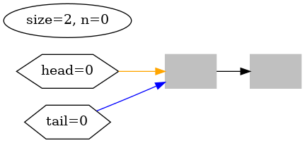 |

| Enqueue(10) | 
|:-------------:|
| 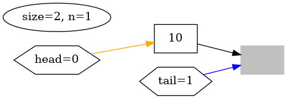 |

| Enqueue(20), double the capacity | 
|:-------------:|
| 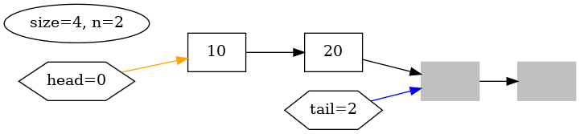 |

| Enqueue(30) | 
|:-------------:|
| 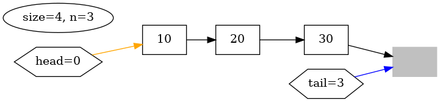 |

| Enqueue(40), double the capacity | 
|:-------------:|
| 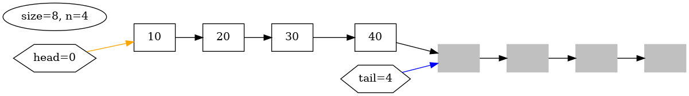 |


| Enqueue(50) | 
|:-------------:|
| 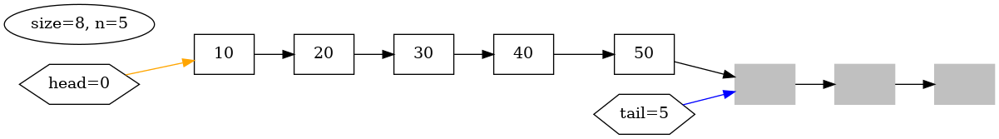 |


| Enqueue(60) | 
|:-------------:|
| 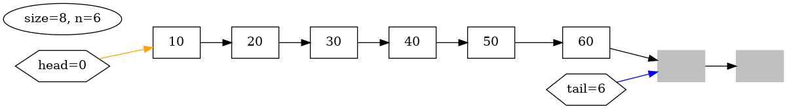 |

| Enqueue(70)  | 
|:-------------:|
| 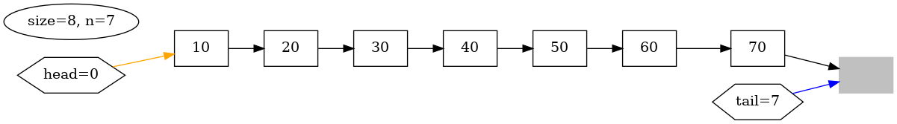 |

| Dequeue() | 
|:-------------:|
| 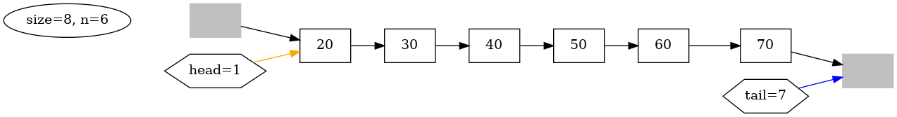 |

| Dequeue() | 
|:-------------:|
| 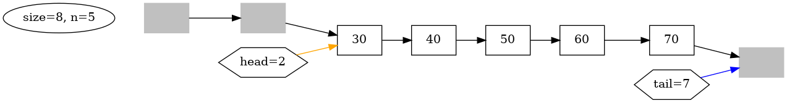 |

| Dequeue() | 
|:-------------:|
| 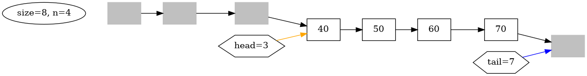 |


| Dequeue() | 
|:-------------:|
| 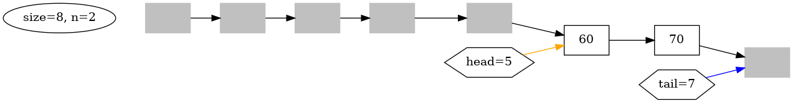 |

| Dequeue() | 
|:-------------:|
| 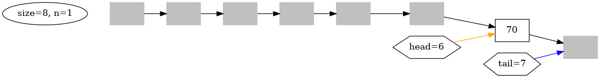 |

| Dequeue(), empty queue| 
|:-------------:|
| 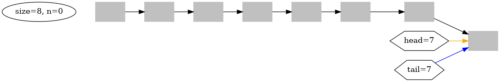 |

| Enqueue(10) | 
|:-------------:|
| 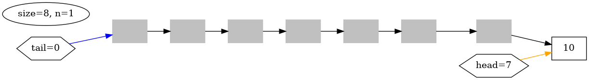 |

| Enqueue(20) | 
|:-------------:|
| 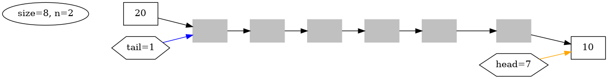 |

| Enqueue(30) | 
|:-------------:|
| 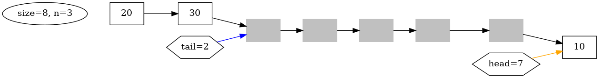 |

### QueueIsFull() and QueueIsEmpty()

```C
// Only (size - 1) slots are used
static int QueueIsFull(struct Queue *pQueue) {
    return pQueue->head == NextPosition(pQueue, pQueue->tail);
    // return pQueue->head == (pQueue->tail + 1) % pQueue->size;
}

int QueueIsEmpty(struct Queue *pQueue) {
    return pQueue->head == pQueue->tail;
}
```
## 1 How to download this project in [CSE VLAB](https://vlabgateway.cse.unsw.edu.au/)

Open a terminal (Applications -> Terminal Emulator)

```sh

$ git clone https://github.com/sheisc/COMP9024.git

$ cd COMP9024/Queues/CircularQueue

CircularQueue$ 

```


## 2 How to start [Visual Studio Code](https://code.visualstudio.com/) to browse/edit/debug a project.


```sh

CircularQueue$ code

```

Two configuration files (CircularQueue/.vscode/[launch.json](https://code.visualstudio.com/docs/cpp/launch-json-reference) and CircularQueue/.vscode/[tasks.json](https://code.visualstudio.com/docs/editor/tasks)) have been preset.


#### 2.1 Open the project in VS Code

In the window of Visual Studio Code, please click "File" and "Open Folder",

select the folder "COMP9024/Queues/CircularQueue", then click the "Open" button.


#### 2.2 Build the project in VS Code

click **Terminal -> Run Build Task**


#### 2.3 Debug the project in VS Code

Open src/Queue.c, and click to add a breakpoint (say, line 112).

Then, click **Run -> Start Debugging**


### 2.4 Directory

```sh
├── Makefile             defining set of tasks to be executed (the input file of the 'make' command)
|
├── README.md            introduction to this project
|
├── src                  containing *.c and *.h
|   |
│   ├── main.c           
│   ├── Queue.h
│   └── Queue.c          
|
|
└── .vscode              containing configuration files for Visual Studio Code
    |
    ├── launch.json      specifying which program to debug and with which debugger,
    |                    used when you click "Run -> Start Debugging"
    |
    └── tasks.json       specifying which task to run (e.g., 'make' or 'make clean')
                         used when you click "Terminal -> Run Build Task" or "Terminal -> Run Task"
```
Makefile is discussed in [COMP9024/C/HowToMake](../../C/HowToMake/README.md).

## 3 Data structure and memory layout

```C
typedef long QUEUE_ITEM_T;

// number of items, not in bytes, INITIAL_QUEUE_SIZE  >= 2
#define INITIAL_QUEUE_SIZE   2

// The type definition of Circular Queue (based on an array)
struct Queue {
    // The index of the first element in the queue
    long head;
    // The index of the next available slot
    long tail;
    // The current capacity of the queue.
    // At most (size - 1) elements are used for simplifying QueueEnQueue(), QueueIsFull(), QueueIsEmpty(), ...
    long size;
    // An array dynamically allocated on heap
    QUEUE_ITEM_T *pItems;
};

/*
                  ----------                   ----------------             
    pQueue -----> head                          pItems[size-1]                                 
                  tail                                                                            
                  n                               ...                            
                  size                          pItems[1]                         
                  pItems      --------------->  pItems[0]                                     
                  -----------                  ----------------
                 struct Queue                   Array on the heap

 */ 

```


## 4 The main procedure

### 4.1 make and ./main

**In addition to utilizing VS Code, we can also compile and execute programs directly from the command line interface as follows.**

``` sh

CircularQueue$ make

CircularQueue$ ./main

******************** count == 0 *********************


QueueEnqueue(pQueue, 10)
Queue(head = 0, tail = 1, size = 2, len = 1): 10 

QueueEnqueue(pQueue, 20)
Queue(head = 0, tail = 2, size = 4, len = 2): 10 20 

QueueEnqueue(pQueue, 30)
Queue(head = 0, tail = 3, size = 4, len = 3): 10 20 30 

QueueEnqueue(pQueue, 40)
Queue(head = 0, tail = 4, size = 8, len = 4): 10 20 30 40 

QueueEnqueue(pQueue, 50)
Queue(head = 0, tail = 5, size = 8, len = 5): 10 20 30 40 50 

QueueEnqueue(pQueue, 60)
Queue(head = 0, tail = 6, size = 8, len = 6): 10 20 30 40 50 60 

QueueEnqueue(pQueue, 70)
Queue(head = 0, tail = 7, size = 8, len = 7): 10 20 30 40 50 60 70 

QueuePeek(pQueue): 10

Queue(head = 0, tail = 7, size = 8, len = 7): 10 20 30 40 50 60 70 

...
```

### 4.2 make view

**Ensure that you have executed 'make' and './main' before 'make view'.**


```sh
CircularQueue$ make view
```

**Click on the window of 'feh' or use your mouse scroll wheel to view images**.

Here, **feh** is an image viewer available in [CSE VLAB](https://vlabgateway.cse.unsw.edu.au/).

## 5 Algorithms

### 5.1 CreateQueue

```C
/*
    Create an empty queue.

                  ----------                   ----------------             
    pQueue -----> head                          pItems[size-1]                                 
                  tail                                                                            
                  n                               ...                            
                  size                          pItems[1]                         
                  pItems      --------------->  pItems[0]                                     
                  -----------                  ----------------
                 struct Queue                   Array on the heap

 */ 
struct Queue *CreateQueue(void) {
    struct Queue *pQueue = (struct Queue *) malloc(sizeof(struct Queue));
    QUEUE_ITEM_T *pItems = (QUEUE_ITEM_T *) malloc(sizeof(QUEUE_ITEM_T) * INITIAL_QUEUE_SIZE);
    //memset(pItems, 0, sizeof(QUEUE_ITEM_T) * INITIAL_QUEUE_SIZE);
    assert(pQueue && pItems && (INITIAL_QUEUE_SIZE >= 2));

    pQueue->head = 0;
    pQueue->tail = 0;
    pQueue->size = INITIAL_QUEUE_SIZE;
    pQueue->pItems = pItems;
    return pQueue;
}

```


### 5.2  ReleaseQueue
```C

/*
    Release the heap space occupied by the queue.

                  ----------                   ----------------            
    pQueue -----> head                          pItems[size-1]                                
                  tail                                                                           
                  n                               ...                           
                  size                          pItems[1]                        
                  pItems      --------------->  pItems[0]                                    
                  -----------                  ----------------
                 struct Queue                   Array on the heap          

 */                                                                              
void ReleaseQueue(struct Queue *pQueue) {
    if (pQueue) {
        free(pQueue->pItems);
        free(pQueue);
    }
}

```

### 5.3  QueueEnqueue()
```C

// This function is used to increase the capacity of the queue when it is full.
static void ResizeQueue(struct Queue *pQueue) {
    assert(QueueIsFull(pQueue));
    //printf("\t\t\t\t\t\t\t\t ................ ResizeQueue() ...............\n");

    long newSize = pQueue->size * 2;
    QUEUE_ITEM_T *pNewItems = (QUEUE_ITEM_T *) malloc(sizeof(QUEUE_ITEM_T) * newSize);    
    assert(pNewItems);
    //memset(pNewItems, 0, sizeof(QUEUE_ITEM_T) * newSize);

    long head = pQueue->head;
    long tail = pQueue->tail;
    if (tail > head) {
        /*
        Items in the queue pointed to by pQueue:
                                                                     (Not Used)
            pItems[0] pItems[1] pItems[2]  ...   pItems[size - 2]  pItems[size - 1]
             ^                                                          ^
             ^                                                          ^
             |                                                          |
             head==0                                                     tail==size -1

         */
        long n = tail - head;
        memcpy(pNewItems + head, pQueue->pItems + head, n * sizeof(QUEUE_ITEM_T));
    } else {
        assert(tail < head);
        /*
        Items in the queue pointed to by pQueue:
                          (Not Used)                                          
            pItems[0] ...  pItems[i] ...  pItems[k]  ...   pItems[size - 2]  pItems[size - 1]
                             ^               ^                                                         
                             ^               ^                                                         
                             |               |                                                         
                            tail==i          head==k

                                             | .............  n2  ....................|                                    
            |... n1  ...|

            There are n2 elements from pItems[head] to pItems[size-1].

            There are n1 elements from pItems[0] to pItems[tail - 1].

         */        
        long n2 = (pQueue->size - head);
        long n1 = tail - 0;
        memcpy(pNewItems + head, pQueue->pItems + head, n2 * sizeof(QUEUE_ITEM_T));
        // n1 might be 0 when tail is 0
        if (n1 > 0) {
            memcpy(pNewItems + head + n2, pQueue->pItems, n1 * sizeof(QUEUE_ITEM_T));
        }
        // adjust the position of tail
        pQueue->tail = head + n1 + n2;
    }
    free(pQueue->pItems);
    pQueue->size = newSize;
    pQueue->pItems = pNewItems;
}

void QueueEnqueue(struct Queue *pQueue, QUEUE_ITEM_T item) {
    if (QueueIsFull(pQueue)) {
        ResizeQueue(pQueue);
    }

    pQueue->pItems[pQueue->tail] = item;
    // let tail point to the next available slot
    pQueue->tail = NextPosition(pQueue, pQueue->tail);
}

```

### 5.4  QueueDequeue()
```C
QUEUE_ITEM_T QueueDequeue(struct Queue *pQueue) {
    assert(!QueueIsEmpty(pQueue));

    // Get the first element
    QUEUE_ITEM_T item = pQueue->pItems[pQueue->head];
    // Its successor now becomes the new first element
    pQueue->head = NextPosition(pQueue, pQueue->head);

    return item;
}

```


### 5.5 Other functions

```C

void PrintQueue(struct Queue *pQueue) {
   
    long cur = pQueue->head;
    printf("Queue(head = %ld, tail = %ld, size = %ld, len = %ld): ", 
            pQueue->head, pQueue->tail, pQueue->size, QueueLength(pQueue));
    while (cur != pQueue->tail) {
        printf("%ld ", (long) pQueue->pItems[cur]);
        cur = NextPosition(pQueue, cur);
    }
    printf("\n");
}


QUEUE_ITEM_T QueuePeek(struct Queue *pQueue) {
    assert(!QueueIsEmpty(pQueue));
    QUEUE_ITEM_T item = pQueue->pItems[pQueue->head];
    return item;
}

// Get the number of elements in the queue
long QueueLength(struct Queue *pQueue) {
    long n;

    if (pQueue->tail >= pQueue->head) {
        n = pQueue->tail - pQueue->head;
    } else {
        n = pQueue->tail + pQueue->size - pQueue->head;
    }
    return n;
}
```

