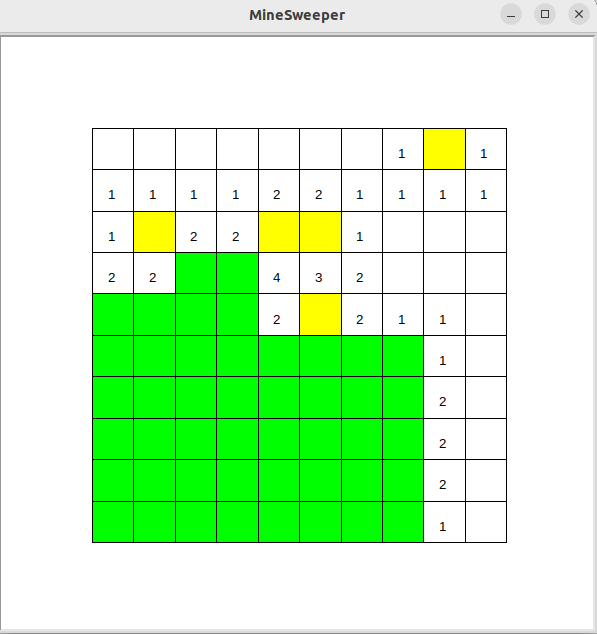
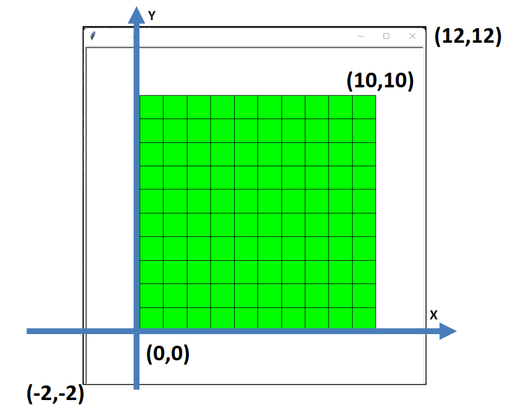
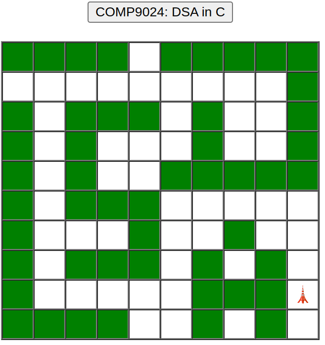

# Maze

``` sh
/*******************************************************************
                          Maze

    1.  How to explore a maze with a non-randomised algorithm

    2.  How to explore a maze with a randomised algorithm 
        (flip a coin or roll a dice)

                                             COMP9024 24T2

 *******************************************************************/
``` 

## Non-Determinism

In programming, non-determinism refers to scenarios where the behavior of a program or system cannot be precisely predicted, 
even if the initial conditions and inputs are known. This can happen for a variety of reasons.

### Concurrency and Parallelism

In multi-threaded or multi-process programs, the outcome of a computation might depend on the timing of thread or process execution.

If threads are accessing shared resources without proper synchronization, the final result can vary depending on the order in which threads execute.


#### A multi-threaded C program

```C
#include <stdio.h>
#include <stdlib.h>
#include <unistd.h>
#include <pthread.h>

#define N_LOOPS   (1000 * 1000)
#define N_THREADS   8

// mutually exclusive
pthread_mutex_t mutex = PTHREAD_MUTEX_INITIALIZER;

// ticket counter
long counter = 0;

#define USE_OUR_MUTEX_LOCK

static void *run(void *arg) {  
    for (long i = 0; i < N_LOOPS; i++) {
#ifdef USE_OUR_MUTEX_LOCK          
        pthread_mutex_lock(&mutex);
        counter = counter + 1;
        pthread_mutex_unlock(&mutex);
#else
        counter = counter + 1;
#endif
    }
    return NULL;
}

int main(void) {
    pthread_t workers[N_THREADS];

    for (long k = 0; k < N_THREADS; k++) {
        /*
            int pthread_create(pthread_t *thread, const pthread_attr_t *attr,
                          void *(*start_routine) (void *), void *arg);

            On  success,  pthread_create() returns 0; 
            on error, it returns an error number, and the contents of *thread are undefined.
         */   
        if (pthread_create(&workers[k], NULL, run, (void *) ((long) k)) != 0) {
            exit(-1);
        }
    }
    // The main thread waits until all sub-threads have finished.
    for (long k = 0; k < N_THREADS; k++) {
        pthread_join(workers[k], NULL);
    }

    printf("counter == %ld\n", counter);
    return 0;
}
```

**How many call stacks are needed in the above multi-threaded program?**

In a multi-threaded program, each thread requires its own separate call stack.

This is because each thread operates independently and manages its own function calls, local variables, and execution state.

```sh
Maze$ make

Maze$ ./CounterNoLock 
counter == 2124894

Maze$ ./CounterNoLock 
counter == 1721220

Maze$ ./CounterNoLock 
counter == 2032188

Maze$ ./CounterLock
counter == 8000000

Maze$ ./CounterLock
counter == 8000000

```

### Address Space Layout Randomization (ASLR)

ASLR randomizes the base addresses of key memory regions such as the stack, heap, and shared libraries. 

Each time a program is executed, these memory regions are placed at different locations in virtual memory.

Address Space Layout Randomization (ASLR) makes it challenging for attackers to predict memory addresses in advance by randomly rearranging the memory layout of a process. 

This technique increases the security of systems by making it more difficult for attackers to exploit memory corruption vulnerabilities. 


### Random Number Generators

Programs that use random number generators produce different results on different runs due to the inherent unpredictability of the random values. 

```C
#include <stdlib.h>     // srandom(), random()
#include <time.h>       // time()


int main(void) {
    /*
     void srandom(unsigned seed);

       The srandom() function sets its argument as the seed for a new sequence
       of pseudo-random integers to be returned by random().

     time_t time(time_t *tloc);

       The time() function returns the time as the number of seconds since the Epoch, 1970-01-01 00:00:00.
       If tloc is non-NULL, the return value is also stored in the memory pointed to by tloc.
     */
    srandom(time(NULL));

    // random() returns a random number in the range from 0 to ((2**31) - 1),
    // where (2**31) is 2 raised to the power of 31.
    long x = random();

    // ...
}
```

Randomness can introduce variety in playing games, making challenges more dynamic and requiring players to adapt their strategies.
```sh
$ make game
python3 MineSweeper.py
```

| MineSweeper | 
|:-------------:|
|  |

| Coordinate: (x, y) |  Array: (row, column) | 
|:-------------:|:-------------:|
|  |  |

### Sidetracks: Cache

Cache (much smaller and faster than the main memory) provides high-speed data access to the processor and improves overall system performance.

It temporarily stores frequently accessed data or instructions to reduce the time it takes for the CPU to access them from the main memory.

The cache hit ratio measures the proportion of cache accesses that result in a "hit", where the requested data is found in the cache, versus those that result in a "miss", where the data must be fetched from a slower storage layer (the main memory).

```C
#define ROWS   1024
#define COLS   2048

/*
    img[0][0], img[0][1], ..., img[0][2047],
    img[1][0], img[1][1], ..., img[1][2047],

    ...

    img[1023][0], ....         img[1023][2047]
 */

int img[ROWS][COLS];

/**********************************************************
    Time complexity:

        O(ROWS * COLS)

    Access the image column by column.  (Much slower)

       TimeNeeded in F() = 12455973 us

       img[0][0], img[1][0], img[2][0], ...
 **********************************************************/
void F(){
    for(int col = 0; col < COLS; col++){
        for(int row = 0; row < ROWS; row++){
            img[row][col] = 0;
        }
    }
}
/************************************************************
    Time complexity:

        O(ROWS * COLS)

    Access the image row by row.   (Much faster)

        TimeNeeded in G() = 1135229 us

        img[0][0], img[0][1], img[0][2],  ...
 ************************************************************/
void G(){
    for(int row = 0; row < ROWS; row++){
        for(int col = 0; col < COLS; col++){
            img[row][col] = 0;
        }
    }
}

unsigned long get_time_in_us(void){
    struct timeval tv;
    gettimeofday(&tv, NULL);
    return tv.tv_sec * 1000000 + tv.tv_usec;
}

void Test(void (* func)(void), char *funcName){
    unsigned long from, to;
    from = get_time_in_us();
    for(int i = 0; i < 1000; i++){
        func();
    }
    to = get_time_in_us();
    printf("TimeNeeded in %s = %ld us\n", funcName, to - from);
}

int main(void){
    Test(F, "F()");
    Test(G, "G()");
}
```

Algorithms with the same time complexity can have significantly different execution times due to variations in cache hit ratios.

```sh
$ gcc AccessImage.c -o AccessImage
$ ./AccessImage

TimeNeeded in F() = 12455973 us
TimeNeeded in G() = 1135229 us
```

### This Project

In this project, we will how to explore a maze with non-randomised and randomised algorithms.

Exploring a maze using a [data stack](../../Stacks/Stack_LL/README.md) is like following a trail of markers: 

it helps you backtrack and navigate through twists and turns efficiently. 

Imagine you're inside a maze, armed with a stack of markers. 

As you move forward, you leave a marker (or push it onto the stack). 

If you reach a dead end, you need to backtrack by popping markers off the stack until you find a new path to explore.

| Initial | 
|:-------------:|
|  |

| Exploring  |
|:-------------:|
|   |

|  Completed  |
|:-------------:|
|  |

This method ensures that every possible path is explored until the exit is found or all available paths are exhausted. 

By leveraging the stack, the algorithm maintains a record of where it has been, guiding the search towards the solution methodically.

An animation in exploring a maze can be found at the following link.

[Animation: Exploring a Maze in JavaScript](https://sheisc.github.io/slides/COMP9024/24T2/week10/maze.html)

In this tutorial, we study how to explore a maze with a non-randomised algorithm.

The randomised algorithm is left as the weekly practical exercise.

## 1 How to download this project in [CSE VLAB](https://vlabgateway.cse.unsw.edu.au/)

Open a terminal (Applications -> Terminal Emulator)

```sh

$ git clone https://github.com/sheisc/COMP9024.git

$ cd COMP9024/Randomised/Maze

Maze$ 

```


## 2 How to start [Visual Studio Code](https://code.visualstudio.com/) to browse/edit/debug a project.

```sh

Maze$ code

```

Two configuration files (Maze/.vscode/[launch.json](https://code.visualstudio.com/docs/cpp/launch-json-reference) and Maze/.vscode/[tasks.json](https://code.visualstudio.com/docs/editor/tasks)) have been preset.


#### 2.1 Open the project in VS Code

In the window of Visual Studio Code, please click "File" and "Open Folder",

select the folder "COMP9024/Randomised/Maze", then click the "Open" button.


#### 2.2 Build the project in VS Code

click **Terminal -> Run Build Task**


#### 2.3 Debug the project in VS Code

Open src/Maze.c, and click to add a breakpoint (say, line 165).

Then, click **Run -> Start Debugging**

### 2.4 Directory

```sh
├── Makefile             defining set of tasks to be executed (the input file of the 'make' command)
|
├── README.md            introduction to this tutorial
|
├── CounterLock.c        Multi-threaded program in C using a mutex lock
|
├── CounterNoLock.c      Multi-threaded program in C without using a mutex lock
|
├── MineSweeper.py       Mine Sweeper in Python
|
├── src                  containing *.c and *.h
|   |
│   ├── Maze.c           explore a maze
│   ├── Maze.h
|   |
│   ├── Stack.c          For recording the trail in exploring a maze
│   ├── Stack.h
|   |
│   └── main.c           main()
|
|── images
|
└── .vscode              containing configuration files for Visual Studio Code
    |
    ├── launch.json      specifying which program to debug and with which debugger,
    |                    used when you click "Run -> Start Debugging"
    |
    └── tasks.json       specifying which task to run (e.g., 'make' or 'make clean')
                         used when you click "Terminal -> Run Build Task" or "Terminal -> Run Task"
```

Makefile is discussed in [COMP9024/C/HowToMake](../../C/HowToMake/README.md).


## 3 The main procedure

### 3.1 How to see more lines in the terminal in [CSE VLAB](https://vlabgateway.cse.unsw.edu.au/)

Open a terminal (Applications -> Terminal Emulator -> Edit -> Preferences -> Display -> Scrollback lines)


### 3.2 Build and run the program from the command line interface


``` sh

Maze$ make

Maze$ ./main
-------------------------  Step 0 ----------------------------
X   X   X   X       X   X   X   X   X   

                                    X   

X       X   X   X       X           X   

X       X               X           X   

X       X           X   X   X   X   X   

X       X   X   X                       

X               X           X           

X       X   X   X       X       X       

X                       X   X   X   🗼   

X   X   X   X           X       X       
---------------------------------------------------------------


-------------------------  Step 1 ----------------------------
X   X   X   X       X   X   X   X   X   

→                                   X   

X       X   X   X       X           X   

X       X               X           X   

X       X           X   X   X   X   X   

X       X   X   X                       

X               X           X           

X       X   X   X       X       X       

X                       X   X   X   🗼   

X   X   X   X           X       X       
---------------------------------------------------------------


...


-------------------------  Step 152 ----------------------------
X   X   X   X       X   X   X   X   X   

→   ↓                               X   

X   ↓   X   X   X       X           X   

X   ↓   X               X           X   

X   ↓   X           X   X   X   X   X   

X   ↓   X   X   X       →   →   →   ↓   

X   ↓           X   →   ↑   X       ↓   

X   ↓   X   X   X   ↑   X       X   ↓   

X   →   →   →   →   ↑   X   X   X   🗼   

X   X   X   X           X       X       
---------------------------------------------------------------


```

## 4 Data structures

```C

#define ROWS  10
#define COLS  10

// The state of a position in the maze:
//      NOT_VISITED -> TO_RIGHT -> TO_DOWN -> TO_LEFT -> TO_UP -> FINISHED
typedef enum {
    // This position has not been visited yet
    NOT_VISITED = 0,
    // go to visit the adjacent rightward position
    TO_RIGHT = 1,
    // go to visit the adjacent downward position
    TO_DOWN = 2,
    // go to visit the adjacent leftward position
    TO_LEFT = 4,
    // go to visit the adjacent upward position
    TO_UP = 8,
    // We have explored all four directions of the current position, 
    FINISHED = 0x0F,

} PositionState;

// The information about a position in the maze
struct PositionInfo {
    // blocked:  1
    // not blocked: 0, 
    int blocked;

    /////////// used when exploring the maze ///////
    // which row
    int r;
    // which col
    int c;
    // the state of the current position
    PositionState state;
    // points to a unicode string, e.g., upArrowUnicodeStr
    char *dirStr;
};

static int map[ROWS][COLS] = {
    {1, 1, 1, 1, 0, 1, 1, 1, 1, 1}, 
    {0, 0, 0, 0, 0, 0, 0, 0, 0, 1}, 
    {1, 0, 1, 1, 1, 0, 1, 0, 0, 1}, 
    {1, 0, 1, 0, 0, 0, 1, 0, 0, 1}, 
    {1, 0, 1, 0, 0, 1, 1, 1, 1, 1},
    {1, 0, 1, 1, 1, 0, 0, 0, 0, 0},
    {1, 0, 0, 0, 1, 0, 0, 1, 0, 0},
    {1, 0, 1, 1, 1, 0, 1, 0, 1, 0},
    {1, 0, 0, 0, 0, 0, 1, 1, 1, 0},
    {1, 1, 1, 1, 0, 0, 1, 0, 1, 0},
};

static struct PositionInfo maze[ROWS][COLS];

static struct PositionInfo *pStartPos = &maze[1][0];

```

## 5 Algorithms

## 5.1 Overview

```C
int main(int argc, char **argv, char **env) {
    srandom(time(NULL));

    ExploreMaze();
    
    ExploreMazeRandomly();

    return 0;
}
```


#### 5.2 Position States
```sh
We can use the following position states to represent different stages
when we are at a position (row, column) in the maze.

It is a simple finite-state machine, with the following state transition:

 TO_RIGHT -> TO_DOWN -> TO_LEFT -> TO_UP -> FINISHED
```


**For more details about Deterministic Finite Automata (DFA) , please see [Programming Languages and Compilers (COMP3131/COMP9102)](https://webcms3.cse.unsw.edu.au/COMP3131/24T1/).**

## 5.3 ExploreMaze()

```C
static int IsLegalPosition(int r, int c) {
    return (r >= 0) && (r < ROWS) && (c >= 0) && (c < COLS);
}

static int IsExitPosition(int r, int c) {
    if (IsLegalPosition(r, c)) {
        return (r == ROWS - 2) && (c == COLS - 1);
    } else {
        return 0;
    }    
}

/*
    If (r, c) is a legal position, it is not blocked and it has not been explored yet,
    then
        push its position information onto the data stack
 */
static void PushAdjacentPosition(struct Stack *pStack, int r, int c, PositionState initState) {
    if (IsLegalPosition(r, c)) {
        if (!maze[r][c].blocked && (maze[r][c].state == NOT_VISITED)) {
            struct PositionInfo *pPos = &maze[r][c];
            pPos->state = initState;
            StackPush(pStack, pPos);
        }
    }
}

/*
  State transition:

       TO_RIGHT -> TO_DOWN -> TO_LEFT -> TO_UP -> FINISHED
 */
void ExploreMaze(void) {    
    struct Stack *pStack = CreateStack();    
    // Initialize the maze
    InitMaze();
    char *stepName = "Step";
    PrintMaze(stepName);
    // Push the start position
    pStartPos->state = TO_RIGHT;
    StackPush(pStack, pStartPos);

    while (!StackIsEmpty(pStack)) {
        struct PositionInfo *pCurPos = StackPeek(pStack);        
        if (IsExitPosition(pCurPos->r, pCurPos->c)) {
            break;
        }        
        switch(pCurPos->state) {
            case TO_RIGHT:
                pCurPos->dirStr = rightArrowUnicodeStr;              
                PushAdjacentPosition(pStack, pCurPos->r, pCurPos->c + 1, TO_RIGHT);
                // When this position becomes the top element on the stack,  
                // we need to go downward.
                pCurPos->state = TO_DOWN;
                break;
            case TO_DOWN:                
                pCurPos->dirStr = downArrowUnicodeStr;
                PushAdjacentPosition(pStack, pCurPos->r + 1, pCurPos->c, TO_RIGHT);
                // When this position becomes the top element on the stack,  
                // we need to go leftward.                
                pCurPos->state = TO_LEFT;
                break;
            case TO_LEFT:
                pCurPos->dirStr = leftArrowUnicodeStr;                
                PushAdjacentPosition(pStack, pCurPos->r, pCurPos->c - 1, TO_RIGHT);                
                // When this position becomes the top element on the stack,  
                // we need to go upward.                 
                pCurPos->state = TO_UP;
                break;
            case TO_UP:
                pCurPos->dirStr = upArrowUnicodeStr;
                PushAdjacentPosition(pStack, pCurPos->r - 1, pCurPos->c, TO_RIGHT);
                // When this position becomes the top element on the stack,  
                // we have finished all directions.                  
                pCurPos->state = FINISHED;
                break;
            case FINISHED:
                pCurPos->dirStr = NULL;
                StackPop(pStack);                
                break;
            default:
                break;                                
        }
        PrintMaze(stepName);
    }

    ReleaseStack(pStack);
    PrintMaze(stepName);
}
```

### 5.4 Sidetracks: Loops in programming

When implementing loops in programming, we can use three common techniques: while/for statements, recursive functions, and event handlers.

#### 5.4.1 For statement

Repeatedly executes code based on a condition.

```C
// g(n) = 1 * 2 * 3 * ... * n
int g(int n) {
    int res = 1;
    for (int i = 1; i <= n; i++) {
        res *= i;
    }
    return res;
}
```
#### 5.4.2 Recursive Function

Calls itself to solve problems, with a base case to terminate recursion.

```C
// f(n) = f(n-1) * n
int f(int n) {
    if (n <= 1) {
        return 1;
    } else {
        return f(n-1) * n;
    }
}

```

#### 5.4.3 Event Handler

Responds to specific events, common in interactive applications.

**Click the following link and view the JavaScript source code.**

[Animation: Exploring a Maze in JavaScript](https://sheisc.github.io/slides/COMP9024/24T2/week10/maze.html)

```JavaScript
function processStackTopCell() {
	if (stack.length != 0) {
		cur = stack[stack.length - 1];
		var i = cur.i;
		var j = cur.j;
		var cell = document.getElementById(cellName + (i * cols + j));
		if (isExitPosition(i, j)) {
			cell.innerHTML = "&#128508;"	
			//cell.style.background = "url(flag.gif) no-repeat center center";
			clearInterval(intervalId);
			mybutton.disabled = false;
			return;
		}
		switch (cur.state) {
			case State.east:
				cur.state = State.south;
				cell.innerHTML = "&#x2192;"						
				//cell.style.background = "url(east.gif) no-repeat center center";
				pushPerviousCell(i, j + 1);
				break;
			case State.south:
				cur.state = State.west;
				cell.innerHTML = "&#x2193;"	
				//cell.style.background = "url(south.gif) no-repeat center center";
				pushPerviousCell(i + 1, j);
				break;
			case State.west:
				cur.state = State.north;
				cell.innerHTML = "&#x2190;"
				//cell.style.background = "url(west.gif) no-repeat center center";
				pushPerviousCell(i, j - 1);
				break;
			case State.north:
				cur.state = State.finished;
				cell.innerHTML = "&#x2191;"
				//cell.style.background = "url(north.gif) no-repeat center center";
				pushPerviousCell(i - 1, j);
				break;
			case State.finished:
			    cell.innerHTML = " "	
				cell.style.background = "white";
				stack.pop();
				break;
		}
	}
	else {
		clearInterval(intervalId);
		mybutton.disabled = false;
	}
}

function starting() {
	mybutton.disabled = true;
	pushPerviousCell(1, 0, State.east);
    // Event handler: the function processStackTopCell() will be called every 200 milliseconds
	intervalId = setInterval("processStackTopCell()", 200);
}
```

## 6 ExploreMazeRandomly()


**Please complete the code in Q1-Q5 (ExploreMazeRandomly() in [Maze.c](./src/Maze.c)) and then answer the questions in Quiz 8 (Week 10) on [Moodle](https://moodle.telt.unsw.edu.au/my/courses.php).**

```C

// The state of a position in the maze:
//      NOT_VISITED -> TO_RIGHT -> TO_DOWN -> TO_LEFT -> TO_UP -> FINISHED
typedef enum {
    // This position has not been visited yet
    NOT_VISITED = 0,
    // go to visit the adjacent rightward position
    TO_RIGHT = 1,
    // go to visit the adjacent downward position
    TO_DOWN = 2,
    // go to visit the adjacent leftward position
    TO_LEFT = 4,
    // go to visit the adjacent upward position
    TO_UP = 8,
    // We have explored all four directions of the current position, 
    FINISHED = 0x0F,

} PositionState;


/*
    This function returns the next unexplored state randomly and also updates pCurPos->state.
 */
static PositionState NextUnexploredState(struct PositionInfo *pCurPos) {
    long x;
    long state = (long) (pCurPos->state);
    assert(pCurPos->state != FINISHED);
    // randomly generate an integer x in {0, 1, 2, 3},
    // such that (1 << x) represents a state which has not been explored yet.
    do {
        x = random();
        x %= 4;
    } while (((1 << x) & state) != 0);

    PositionState nextState = (PositionState)(1 << x);
    pCurPos->state |= nextState;
    return nextState;
}


void ExploreMazeRandomly(void) {
    struct Stack *pStack = CreateStack();
    // Initialize the maze
    InitMaze();
    char *stepName = "Random Step";
    PrintMaze(stepName);

    // pStartPos->state = NOT_VISITED;
    StackPush(pStack, pStartPos);

    while (!StackIsEmpty(pStack)) {
        struct PositionInfo *pCurPos = StackPeek(pStack);
        if (IsExitPosition(pCurPos->r, pCurPos->c)) {
            break;
        }
        PositionState nextState;
        if (pCurPos->state != FINISHED) {
            nextState = ______Q1______;
        } else {
            nextState = FINISHED;
        }
        //
        switch(nextState) {
            case TO_RIGHT:
                pCurPos->dirStr = rightArrowUnicodeStr;
                ______Q2______;
                break;
            case TO_DOWN:
                pCurPos->dirStr = downArrowUnicodeStr;
                ______Q3______;
                break;
            case TO_LEFT:
                pCurPos->dirStr = leftArrowUnicodeStr;
                ______Q4______;
                break;
            case TO_UP:
                pCurPos->dirStr = upArrowUnicodeStr;
                ______Q5______;
                break;
            case FINISHED:
                pCurPos->dirStr = NULL;
                StackPop(pStack);
                break;
            default:
                break;
        }
        PrintMaze(stepName);
    }

    ReleaseStack(pStack);
    PrintMaze(stepName);
}
```

## Once you have completed the code in Q1-Q5 correctly, you will see the output similar as follows.

**If you are lucky enough, your randomised algorithm may finish within 30 steps. Buy a lottery ticket if you wish.**


``` sh

...

-------------------------  Random Step 53 ----------------------------
X   X   X   X       X   X   X   X   X   

→   ↓                               X   

X   ↓   X   X   X       X           X   

X   ↓   X               X           X   

X   ↓   X           X   X   X   X   X   

X   ↓   X   X   X       →   →   ↓       

X   ↓           X   →   ↑   X   →   ↓   

X   ↓   X   X   X   ↑   X       X   ↓   

X   →   →   →   →   ↑   X   X   X   🗼   

X   X   X   X           X       X       
---------------------------------------------------------------


```

**Life will find a way out. We wish you all the best.**
