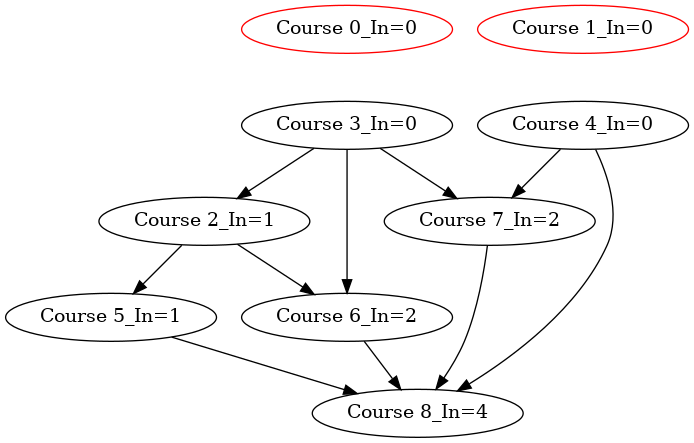
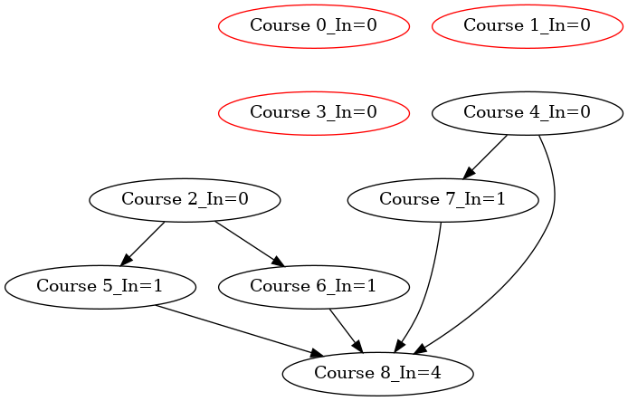
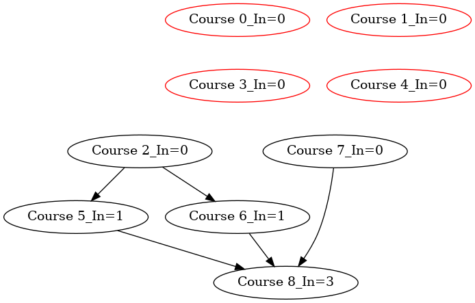
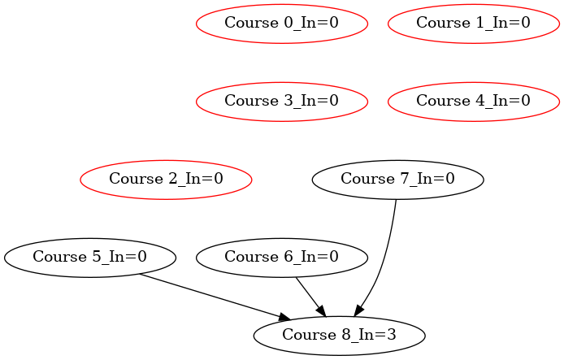
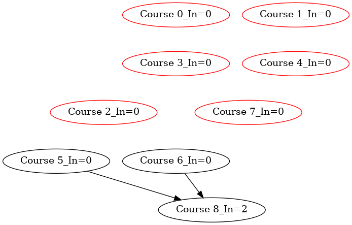
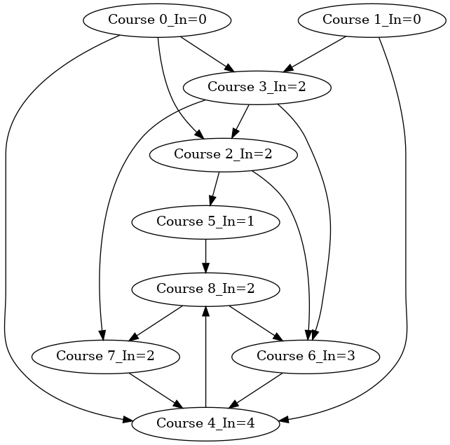
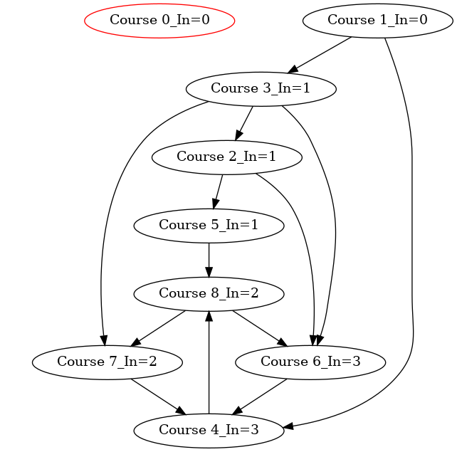

# Topological Sort

``` sh
/*******************************************************************
                Topological Sort

    1.  how to perform a topological sort in a Directed Acyclic Graph (DAG) 
        using Breadth-First Search (BFS)

    2.  How to detect cycles in a Directed Graph using Topological Sort


                                             COMP9024 24T2

 *******************************************************************/
``` 

### Introduction

Topological sort is a way of ordering the nodes of a Directed Acyclic Graph (DAG) in a linear sequence such that for every directed edge u -> v, node u comes before node v in the ordering.

The term “topological” reflects the idea that we are arranging nodes based on the direction of edges in a DAG.

This type of sorting is particularly useful in scenarios where certain tasks must be completed before others, such as task scheduling, course prerequisite chains, and resolving dependencies in build systems (e.g., [makefile](../../C/HowToMake/README.md)).

### Topological sort based on BFS

A DAG may have multiple valid topological sorts.

In this project, we will discuss how to perform a topological sort in a Directed Acyclic Graph (DAG) using Breadth-First Search (BFS).

For each node, we calculate the number of incoming edges (in-degrees). 

This helps us determine which nodes have no dependencies.

To generate a random topological sort each time this program runs, 
we randomly enqueue all nodes with an in-degree of 0.

```sh

Create a queue and randomly enqueue all nodes that have an in-degree of 0.

while (the queue is not empty) {
    dequeue a node from the front of the queue.
    add this node to the topological order list.
    for each neighboring node of the dequeued node {
        decrease its in-degree by 1.
        if the in-degree of a neighboring vertex becomes 0 {
            record the node id in an array nodeIds
        }
    }
    randomly enqueue the nodes in nodeIds

}
```

### Cycle detection in a directed graph

A topological sort is only possible if the directed graph is acyclic. 

If the graph contains cycles, a topological sort is not feasible.

However, if the number of nodes in the topological order list is less than the total number of nodes in the graph, then the graph contains a cycle.

This is because a cycle would prevent some nodes from ever reaching an in-degree of 0.

In other words, topological sort can be used to detect cycles in a directed graph.

We have discussed the format of dot files in [COMP9024/Graphs](../../Graphs/Dot2Png/README.md), how to create a directed graph in [COMP9024/Graphs/DirectedGraph](../../Graphs/DirectedGraph/README.md), and how to create an undirected graph in [COMP9024/Graphs/UndirectedGraph](../../Graphs/UndiirectedGraph/README.md).


## 1 How to download this project in [CSE VLAB](https://vlabgateway.cse.unsw.edu.au/)

Open a terminal (Applications -> Terminal Emulator)

```sh

$ git clone https://github.com/sheisc/COMP9024.git

$ cd COMP9024/Randomised/TopologicalSort

TopologicalSort$ 

```


## 2 How to start [Visual Studio Code](https://code.visualstudio.com/) to browse/edit/debug a project.


```sh

TopologicalSort$ code

```

Two configuration files (TopologicalSort/.vscode/[launch.json](https://code.visualstudio.com/docs/cpp/launch-json-reference) and TopologicalSort/.vscode/[tasks.json](https://code.visualstudio.com/docs/editor/tasks)) have been preset.


### 2.1 Open the project in VS Code

In the window of Visual Studio Code, please click "File" and "Open Folder",

select the folder "COMP9024/Randomised/TopologicalSort", then click the "Open" button.


### 2.2 Build the project in VS Code

click **Terminal -> Run Build Task**


### 2.3 Debug the project in VS Code

Open src/main.c, and click to add a breakpoint (say, line 32).

Then, click **Run -> Start Debugging**


### 2.4 Directory

```sh
├── Makefile             defining set of tasks to be executed (the input file of the 'make' command)
|
├── README.md            introduction to this tutorial
|
├── images               *.dot and *.png files generated by this program
|
├── src                  containing *.c and *.h
|    |
|    ├── Graph.c         containing the code for the directed/undirected Graph
|    ├── Graph.h
|    ├── Queue.c         For topological sort   
|    ├── Queue.h
|    ├── main.c          main()
|
└── .vscode              containing configuration files for Visual Studio Code
    |
    ├── launch.json      specifying which program to debug and with which debugger,
    |                    used when you click "Run -> Start Debugging"
    |
    └── tasks.json       specifying which task to run (e.g., 'make' or 'make clean')
                         used when you click "Terminal -> Run Build Task" or "Terminal -> Run Task"
```
Makefile is discussed in [COMP9024/C/HowToMake](../../C/HowToMake/README.md).


## 3 The procedure of Topological Sort


### 3.1 make and ./main

**In addition to utilizing VS Code, we can also compile and execute programs directly from the command line interface as follows.**

``` sh

TopologicalSort$ make

TopologicalSort$ ./main

########################### TestTopologicalSort() ######################


**********  The Adjacency Matrix ************* 
0 0 1 1 1 0 0 0 0 
0 0 0 1 1 0 0 0 0 
0 0 0 0 0 1 1 0 0 
0 0 1 0 0 0 1 1 0 
0 0 0 0 0 0 0 1 1 
0 0 0 0 0 0 0 0 1 
0 0 0 0 0 0 0 0 1 
0 0 0 0 0 0 0 0 1 
0 0 0 0 0 0 0 0 0 

****** Graph Nodes ********
Graph Node 0: Course 0
Graph Node 1: Course 1
Graph Node 2: Course 2
Graph Node 3: Course 3
Graph Node 4: Course 4
Graph Node 5: Course 5
Graph Node 6: Course 6
Graph Node 7: Course 7
Graph Node 8: Course 8

Course 1
Course 0
Course 4
Course 3
Course 7
Course 2
Course 5
Course 6
Course 8
########################### TestTopologicalSort() ######################


**********  The Adjacency Matrix ************* 
0 0 1 1 1 0 0 0 0 
0 0 0 1 1 0 0 0 0 
0 0 0 0 0 1 1 0 0 
0 0 1 0 0 0 1 1 0 
0 0 0 0 0 0 0 0 1 
0 0 0 0 0 0 0 0 1 
0 0 0 0 1 0 0 0 0 
0 0 0 0 1 0 0 0 0 
0 0 0 0 0 0 1 1 0 

****** Graph Nodes ********
Graph Node 0: Course 0
Graph Node 1: Course 1
Graph Node 2: Course 2
Graph Node 3: Course 3
Graph Node 4: Course 4
Graph Node 5: Course 5
Graph Node 6: Course 6
Graph Node 7: Course 7
Graph Node 8: Course 8

Course 1
Course 0
Course 3
Course 2
Course 5


The graph is cyclic.

```

## 4 make view

**Click on the window of 'feh' or use your mouse scroll wheel to view images**.

Here, **feh** is an image viewer available in [CSE VLAB](https://vlabgateway.cse.unsw.edu.au/).

**Ensure that you have executed 'make' and './main' before 'make view'.**

```sh
TopologicalSort$ make view

find ./images -name "*.png" | sort | xargs feh -F &

```
### 4.1 Topological sort in a directed acyclic graph (DAG)


| Initial | 
|:-------------:|
|  |  


| Course 0 | 
|:-------------:|
|  | 

| Course 0, Course 1 | 
|:-------------:|
|  |

| Course 0, Course 1, Course 3 | 
|:-------------:|
|  |

| Course 0, Course 1, Course 3, Course 4 | 
|:-------------:|
|  |

| Course 0, Course 1, Course 3, Course 4, Course 2 | 
|:-------------:|
|  |

| Course 0, Course 1, Course 3, Course 4, Course 2, Course 7 | 
|:-------------:|
|  |

| Course 0, Course 1, Course 3, Course 4, Course 2, Course 7, Course 5 | 
|:-------------:|
|  |

| Course 0, Course 1, Course 3, Course 4, Course 2, Course 7, Course 5, Course 6 | 
|:-------------:|
|  |

| Course 0, Course 1, Course 3, Course 4, Course 2, Course 7, Course 5, Course 6, Course 8 | 
|:-------------:|
|  |

**Note that the edges are not actually deleted during this algorithm.**

### 4.2 Cycle detection in a directed graph

| Initial | 
|:-------------:|
|  |

| Course 0 | 
|:-------------:|
|  | 

| Course 0, Course 1 | 
|:-------------:|
|  | 

| Course 0, Course 1, Course 3 | 
|:-------------:|
|  | 

| Course 0, Course 1, Course 3, Course 2 | 
|:-------------:|
|  | 

| Course 0, Course 1, Course 3, Course 2, Course 5 | 
|:-------------:|
|  | 

## 5 Data structure
```C
// Storing information of a graph node
struct GraphNode {
    char name[MAX_ID_LEN + 1];
    // for topological sorting
    long inDegree;
};

typedef long AdjMatrixElementTy;

struct Graph{
    /*
       Memory Layout:
                          -----------------------------------------------------------
        pAdjMatrix ---->  Element(0, 0),   Element(0, 1),    ...,       Element(0, n-1),     // each row has n elements
                          Element(1, 0),   Element(1, 1),    ...,       Element(1, n-1),
      
                          .....                            Element(u, v)     ...             // (n * u + v) elements away from Element(0, 0)
      
                          Element(n-1, 0), Element(n-1, 1),  ...,       Element(n-1, n-1)
                          ----------------------------------------------------------- 
                                      Adjacency Matrix on Heap

     */
    AdjMatrixElementTy *pAdjMatrix;
    /*
       Memory Layout
                        ---------------------------
                        pNodes[n-1]
       
       
                        pNodes[1]
       pNodes ----->    pNodes[0]
                       ----------------------------
                        struct GraphNode[n] on Heap
     */
    struct GraphNode *pNodes;
    // number of nodes
    long n;
    // whether it is a directed graph
    int isDirected;
};

// 0 <= u < n,  0 <= v < n
// ELement(u, v) is (n * u + v) elements away from Element(0, 0)
#define  MatrixElement(pGraph, u, v)  (pGraph)->pAdjMatrix[(pGraph)->n * (u) + (v)]

```


## 6 Algorithm

### 6.1 main()

``` C
#define CONNECTED   1


#define NUM_OF_NODES  9


int TestTopologicalSort(long (*edges)[3], long n) {
    // directed graph
    printf("########################### TestTopologicalSort() ######################\n\n\n");
        
    struct Graph *pGraph = CreateGraph(NUM_OF_NODES, 1);

    char *nodeNames[NUM_OF_NODES] = {"Course 0", "Course 1", "Course 2", "Course 3", "Course 4", "Course 5", "Course 6", "Course 7", "Course 8"};
    //char *nodeNames[NUM_OF_NODES] = {"0", "1", "2", "3", "4", "5", "6", "7", "8"};
    
    // Add nodes
    for (long u = 0; u < NUM_OF_NODES; u++) {
        GraphAddNode(pGraph, u, nodeNames[u]);
    }

    // Add edges
    for (long i = 0; i < n; i++) {
        GraphAddEdge(pGraph, edges[i][0], edges[i][1], edges[i][2]);
    }

    PrintGraph(pGraph);

    TopologicalSort(pGraph);

    ReleaseGraph(pGraph);

    return 0;
}

int main(void) {
    srandom(time(NULL));

    // create a sub-directory 'images' (if it is not present) in the current directory
    system("mkdir -p images");
    // remove the *.dot and *.png files in the directory 'images'
    system("rm -f images/*.dot images/*.png");


    // edges: source node id, target node id, value of the edge
    long edges[][3] = {
        {0, 2, CONNECTED},
        {0, 3, CONNECTED},
        {0, 4, CONNECTED},
        {1, 3, CONNECTED},
        {1, 4, CONNECTED},
        {2, 5, CONNECTED},
        {2, 6, CONNECTED},
        {3, 2, CONNECTED},
        {3, 6, CONNECTED},
        {3, 7, CONNECTED},
        {4, 7, CONNECTED},
        {4, 8, CONNECTED},
        {5, 8, CONNECTED},
        {6, 8, CONNECTED},
        {7, 8, CONNECTED},
    };    
    TestTopologicalSort(edges, sizeof(edges)/sizeof(edges[0]));

    // with cycles
    long edges2[][3] = {
        {0, 2, CONNECTED},
        {0, 3, CONNECTED},
        {0, 4, CONNECTED},
        {1, 3, CONNECTED},
        {1, 4, CONNECTED},
        {2, 5, CONNECTED},
        {2, 6, CONNECTED},
        {3, 2, CONNECTED},
        {3, 6, CONNECTED},
        {3, 7, CONNECTED},
        {4, 8, CONNECTED},
        {5, 8, CONNECTED},
        {6, 4, CONNECTED},
        {7, 4, CONNECTED},
        {8, 7, CONNECTED},
        {8, 6, CONNECTED},
    };
    TestTopologicalSort(edges2, sizeof(edges2)/sizeof(edges2[0]));   
    return 0;
}

```

### 6.2 TopologicalSort()

```C

#define ILLEGAL_NODE_ID     -1

static void EnqueueNodeIds(long *nodeIds, long count, struct Queue *pQueue, long randomly) {
    if (randomly) {
        long x;
        long n = 0;
        while (n < count) {
            x = random();
            x %= count;
            // If nodeIds[x] has not been processed yet
            if (nodeIds[x] != ILLEGAL_NODE_ID) {
                QueueEnqueue(pQueue, nodeIds[x]);
                nodeIds[x] = ILLEGAL_NODE_ID;
                n++;
            }
        }
    } else {
        for (long i = 0; i < count; i++) {
            QueueEnqueue(pQueue, nodeIds[i]);
        }
    }
}

long GetInDegree(struct Graph *pGraph, long v) {
    assert(IsLegalNodeNum(pGraph, v));
    long inDegree = 0;
    for (long u = 0; u < pGraph->n; u++) {
        if (MatrixElement(pGraph, u, v)) {
            inDegree++;            
        }
    }
    return inDegree;
}

static long topoImageCnt = 0;


void TopologicalSort(struct Graph *pGraph) {
    int *visited = (int *) malloc(pGraph->n * sizeof(int));
    long *nodeIds = (long *) malloc(pGraph->n * sizeof(long));
    assert(visited && nodeIds);

    for (long v = 0; v < pGraph->n; v++) {
        pGraph->pNodes[v].inDegree = GetInDegree(pGraph, v);
        visited[v] = 0;
    }

    topoImageCnt++;
    GenOneImage(pGraph, "TopologicalSort", "images/TopologicalSort", topoImageCnt, visited);   

    struct Queue *pQueue = CreateQueue();

    // number of nodes waiting to be enqueued
    long waitingCount = 0;    
    for (long v = 0; v < pGraph->n; v++) {
        if (pGraph->pNodes[v].inDegree == 0) {
            // Start from the nodes that don't have any predecessor                       
            nodeIds[waitingCount] = v;
            waitingCount++;          
        }
    } 
    // enqueue node ids randomly
    EnqueueNodeIds(nodeIds, waitingCount, pQueue, 1);

    // the number of nodes in the topological order list
    long sortedNodesCount = 0;
    while (!QueueIsEmpty(pQueue)) {
        long u = QueueDequeue(pQueue);
        printf("%s\n", pGraph->pNodes[u].name);
        
        waitingCount = 0;
        for (long v = 0; v < pGraph->n; v++) {
            if (MatrixElement(pGraph, u, v)) {
                pGraph->pNodes[v].inDegree--;
                // When inDegrees[v] is 0, it means all its predecessors have been visited
                if (pGraph->pNodes[v].inDegree == 0) {                                      
                    nodeIds[waitingCount] = v;
                    waitingCount++;                 
                }
            }
        }
        // enqueue node ids randomly
        EnqueueNodeIds(nodeIds, waitingCount, pQueue, 1);
        sortedNodesCount++;
        // Generate the image
        visited[u] = 1;
        topoImageCnt++;
        GenOneImage(pGraph, "TopologicalSort", "images/TopologicalSort", topoImageCnt, visited);        
    }
    
    if (sortedNodesCount != pGraph->n) {
        printf("\n\nThe graph is cyclic.\n\n");
    } 

    free(nodeIds);
    free(visited);
    ReleaseQueue(pQueue);
}


```


