# Bubble Sort

``` sh
/*******************************************************************
                Bubble Sort

    1.  How to use VS Code to debug a program

    2.  Array in C (used as data structures for bubble sort)

    3.  If, for/while, function, and call stack

    4.  The algorithm of bubble sort

    5.  Pointer arithmetic in *(ptr + i)

    6.  Why Swap2(int a, int b) doesn't work?

                                             COMP9024

 *******************************************************************/
``` 
## Introduction

Bubble sort gets its name because of the way smaller elements "bubble" to the beginning of the array as the algorithm progresses. 

Imagine the smallest elements gradually "bubbling up" to the beginning of the array, 

while the larger elements "sink" to their appropriate positions at the bottom or end of the array. 

| Bubble |
|:-------------:|
||

## How to access an array in C

```C
#include <stdio.h>

/*
    ------          -----------------------------------------------------------
        -------->   |  int   |  int   |  int   |  int   |    ...     |  int  |
    ------          -----------------------------------------------------------
    int *ptr         ptr[0]    ptr[1]                                 ptr[n-1]
          
                     *ptr     *(ptr+1)                               *(ptr+n-1)
 */
void PrintArray(int *ptr, int n) {
    for (int i = 0; i < n; i++) {
        printf("%d ", ptr[i]);
    }
    printf("\n");
}

int main(void) {    
    // Let the C compiler determine the number of array elements for us.
    int arr[] = {30, 50, 20, 10, 60, 40};
    // calculate the number of elements
    int len = sizeof(arr) / sizeof(arr[0]);

    PrintArray(arr, len);

    return 0;
}
```

## Call Stack

```sh

    Data Memory Layout

 High Address
              |             | 
              |_____________|
              |             | main()'s stack frame
              |             |  
              |     40      | arr[5]  
              |     60      | arr[4]
              |     10      | arr[3]
              |     20      | arr[2]
              |     50      | arr[1] 
   +------->  |     30      | arr[0]    // arr can be seen as '&arr[0]', the address of arr[0]
   +          |             |
   +      len |     6       | 
   +          |             |
   +          |             |  
   +          |             | 
   +          |             | 
   +          |_____________|         
   +          |             |         
   +      n   |      6      | 
   +-----ptr  |   &arr[0]   |
              | ret address | 
              |             | PrintArray()'s stack frame
              |             | 
              |             |
              |             | 
              |             |              

                Call Stack 
```

A Call Stack consists of stack frames (First-In-Last-Out), one for each called function.

Each frame might contain the return address, local variables, parameters, and temporary variables.

Since different functions can have different sets of local variables, their stack frames vary in size.

Local variables are declared within a function and their names are only visible within that function's scope.

The C calling convention specifies how functions receive parameters, return values, and manage the call stack.

For example, on a 32-bit system (focusing on the x86 architecture), 

arguments in a function call (e.g., arr and len in PrintArray(arr, len)) are pushed onto the call stack from right to left.

## 1 How to download this project in [CSE VLAB](https://vlabgateway.cse.unsw.edu.au/)

Open a terminal (Applications -> Terminal Emulator)

```sh

$ git clone https://github.com/sheisc/COMP9024.git

$ cd COMP9024/Sorting/BubbleSort

BubbleSort$ 

```


## 2 How to start [Visual Studio Code](https://code.visualstudio.com/) to browse/edit/debug a project.


```sh

BubbleSort$ code

```

Two configuration files (BubbleSort/.vscode/[launch.json](https://code.visualstudio.com/docs/cpp/launch-json-reference) and BubbleSort/.vscode/[tasks.json](https://code.visualstudio.com/docs/editor/tasks)) have been preset.


### 2.1 Open the project in VS Code

In the window of Visual Studio Code, please click "File" and "Open Folder",

select the folder "COMP9024/Sorting/BubbleSort", then click the "Open" button.


### 2.2 Build the project in VS Code

click **Terminal -> Run Build Task**


### 2.3 Debug the project in VS Code

Open src/BubbleSort.c, and click to add a breakpoint (say, line 63).

Then, click **Run -> Start Debugging**


### 2.4 Directory

```sh
├── Makefile             defining set of tasks to be executed (the input file of the 'make' command)
|
├── README.md            introduction to this tutorial
|
├── images               *.png files
|
├── diagrams             *.dot and *.png files
|
├── src                  containing *.c and *.h
|   |
│   └── BubbleSort.c
|
└── .vscode              containing configuration files for Visual Studio Code
    |
    ├── launch.json      specifying which program to debug and with which debugger,
    |                    used when you click "Run -> Start Debugging"
    |
    └── tasks.json       specifying which task to run (e.g., 'make' or 'make clean')
                         used when you click "Terminal -> Run Build Task" or "Terminal -> Run Task"
```

Makefile is discussed in [COMP9024/C/HowToMake](../../C/HowToMake/README.md).

## 3 The process of bubble sort

### 3.1 make view

**Click on the window of 'feh' or use your mouse scroll wheel to view images**.

```sh
BubbleSort$ make view
```

Here, **feh** is an image viewer available in [CSE VLAB](https://vlabgateway.cse.unsw.edu.au/).

All of these images for visualizing algorithms are generated automatically in [COMP9024/Sorting/Array2Dot](../../Sorting/Array2Dot/README.md).

| Initial |
|:-------------:|
||

| Final (in ascending order) |
|:-------------:|
|  |

**$\color{red}{\textsf{Pass 1}}$**

where i $\in$ {0, 1, 2, 3, 4}

| Operation | State |
|:-------------|:-------------:|
|comparison|  |

```C
    if (ptr[0] > ptr[0 + 1]) {
        Swap(ptr + 0, ptr + 0 + 1);
    }
```

| Operation | State  | 
|:-------------|:-------------:|
|comparison, swap|  |

| Operation | State (after swapping)|
|:-------------|:-------------:|
|| 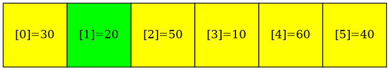 |

```C
    if (ptr[1] > ptr[1 + 1]) {
        Swap(ptr + 1, ptr + 1 + 1);
    }
```

| Operation | State |
|:-------------|:-------------:|
|comparison, swap| 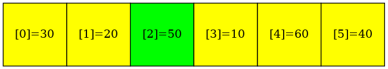 |

| Operation | State (after swapping) |
|:-------------|:-------------:|
| | 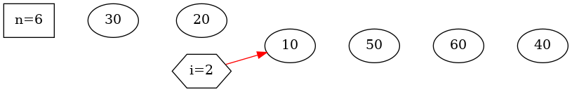 |

```C
    if (ptr[2] > ptr[2 + 1]) {
        Swap(ptr + 2, ptr + 2 + 1);
    }
```

| Operation | State |
|:-------------|:-------------:|
|comparison| 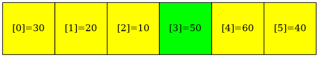 |

```C
    if (ptr[3] > ptr[3 + 1]) {
        Swap(ptr + 3, ptr + 3 + 1);
    }
```

| Operation | State | 
|:-------------|:-------------:|
|comparison, swap| 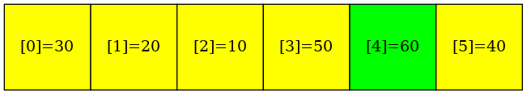 |

| Operation | State (after swapping) |
|:-------------|:-------------:|
| | 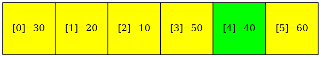 |

```C
    if (ptr[4] > ptr[4 + 1]) {
        Swap(ptr + 4, ptr + 4 + 1);
    }
```

**Put the repeated operations (i.e., if statements) into a loop statement**
```C
for (int i = 0; i <= 4; i++) {
    if (ptr[i] > ptr[i+1]) {
        Swap(ptr + i, ptr + i + 1);
    }
}
```

**$\color{red}{\textsf{Pass 2}}$**

where i $\in$ {0, 1, 2, 3}

| Operation | State |
|:-------------|:-------------:|
|comparison, swap| 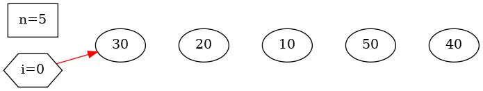 |

| Operation | State (after swapping) |
|:-------------|:-------------:|
| | 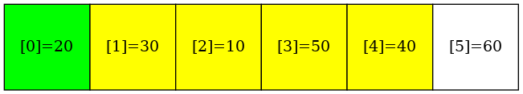 |

```C
    if (ptr[0] > ptr[0 + 1]) {
        Swap(ptr + 0, ptr + 0 + 1);
    }
```

| Operation | State |
|:-------------|:-------------:|
|comparison, swap| 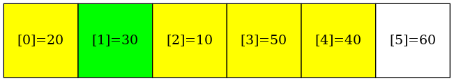 |

| Operation | State (after swapping) |
|:-------------|:-------------:|
| | 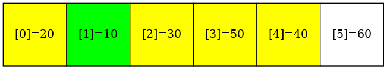 |

```C
    if (ptr[1] > ptr[1 + 1]) {
        Swap(ptr + 1, ptr + 1 + 1);
    }
```

| Operation | State |
|:-------------|:-------------:|
|comparison|  |

```C
    if (ptr[2] > ptr[2 + 1]) {
        Swap(ptr + 2, ptr + 2 + 1);
    }
```


| Operation | State |
|:-------------|:-------------:|
|comparison, swap| 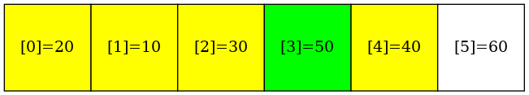 |

| Operation | State (after swapping) |
|:-------------|:-------------:|
| | 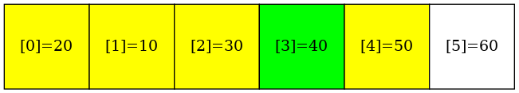 |

```C
    if (ptr[3] > ptr[3 + 1]) {
        Swap(ptr + 3, ptr + 3 + 1);
    }
```

**Put the repeated operations (i.e., if statements) into a loop statement**
```C
for (int i = 0; i <= 3; i++) {
    if (ptr[i] > ptr[i+1]) {
        Swap(ptr + i, ptr + i + 1);
    }
}
```

**$\color{red}{\textsf{Pass 3}}$**

where i $\in$ {0, 1, 2}

| Operation | State |
|:-------------|:-------------:|
|comparison, swap|  |

| Operation | State (after swapping) |
|:-------------|:-------------:|
| | 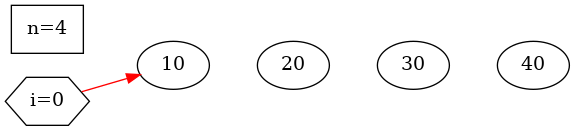 |

```C
    if (ptr[0] > ptr[0 + 1]) {
        Swap(ptr + 0, ptr + 0 + 1);
    }
```

| Operation | State | 
|:-------------|:-------------:|
|comparison| 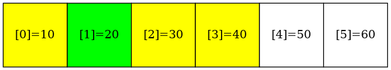 |

```C
    if (ptr[1] > ptr[1 + 1]) {
        Swap(ptr + 1, ptr + 1 + 1);
    }
```

| Operation | State  |
|:-------------|:-------------:|
|comparison | 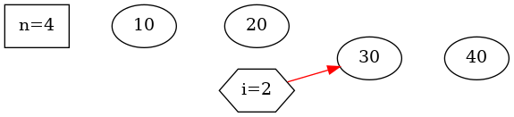 |

```C
    if (ptr[2] > ptr[2 + 1]) {
        Swap(ptr + 2, ptr + 2 + 1);
    }
```


**Put the repeated operations (i.e., if statements) into a loop statement**
```C
for (int i = 0; i <= 2; i++) {
    if (ptr[i] > ptr[i+1]) {
        Swap(ptr + i, ptr + i + 1);
    }
}
```

**$\color{red}{\textsf{Pass 4}}$**

where i $\in$ {0, 1}

| Operation | State  |
|:-------------|:-------------:|
|comparison | 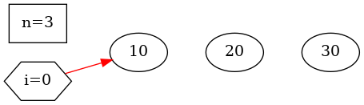 |

```C
    if (ptr[0] > ptr[0 + 1]) {
        Swap(ptr + 0, ptr + 0 + 1);
    }
```

| Operation | State  |
|:-------------|:-------------:|
|comparison |  |

```C
    if (ptr[1] > ptr[1 + 1]) {
        Swap(ptr + 1, ptr + 1 + 1);
    }
```

**Put the repeated operations (i.e., if statements) into a loop statement**
```C
for (int i = 0; i <= 1; i++) {
    if (ptr[i] > ptr[i+1]) {
        Swap(ptr + i, ptr + i + 1);
    }
}
```


**$\color{red}{\textsf{Pass 5}}$**

where i $\in$ {0}

| Operation | State  |
|:-------------|:-------------:|
|comparison | 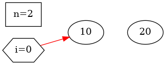 |

```C
    if (ptr[0] > ptr[0 + 1]) {
        Swap(ptr + 0, ptr + 0 + 1);
    }
```

| Final (in ascending order) |
|:-------------:|
|  |

**Put the repeated operations (i.e., if statements) into a loop statement**
```C
for (int i = 0; i <= 0; i++) {
    if (ptr[i] > ptr[i+1]) {
        Swap(ptr + i, ptr + i + 1);
    }
}
```

**$\color{red}{\textsf{Summary}}$**

where n is 6

| Pass | i |  iMax   | Initial State |
|:-------------|:-------------|:-------------|:-------------| 
| Pass 1 | {0, 1, 2, 3, 4} |  $\color{red}{4}$   | |
```C
    for (int i = 0; i <= 4; i++) {
        if (ptr[i] > ptr[i+1]) {
            Swap(ptr + i, ptr + i + 1);
        }
    }
```

| Pass | i |  iMax   | Initial State |
|:-------------|:-------------|:-------------|:-------------| 
| Pass 2 | {0, 1, 2, 3} |  $\color{red}{3}$   | |
```C
    for (int i = 0; i <= 3; i++) {
        if (ptr[i] > ptr[i+1]) {
            Swap(ptr + i, ptr + i + 1);
        }
    }
```

| Pass | i |  iMax   | Initial State |
|:-------------|:-------------|:-------------|:-------------| 
| Pass 3 | {0, 1, 2} |  $\color{red}{2}$   | |
```C
    for (int i = 0; i <= 2; i++) {
        if (ptr[i] > ptr[i+1]) {
            Swap(ptr + i, ptr + i + 1);
        }
    }
```

| Pass | i |  iMax   | Initial State |
|:-------------|:-------------|:-------------|:-------------| 
| Pass 4 | {0, 1} |  $\color{red}{1}$  | |
```C
    for (int i = 0; i <= 1; i++) {
        if (ptr[i] > ptr[i+1]) {
            Swap(ptr + i, ptr + i + 1);
        }
    }
```

| Pass | i |  iMax   | Initial State |
|:-------------|:-------------|:-------------|:-------------| 
| Pass 5 | {0} |  $\color{red}{0}$  | |
```C
    for (int i = 0; i <= 0; i++) {
        if (ptr[i] > ptr[i+1]) {
            Swap(ptr + i, ptr + i + 1);
        }
    }
```


**Put the repeated operations (i.e., $\color{red}{for}$ statements) into a loop statement**

```C
/*
    Bubble sort the n numbers pointed to by ptr.
    The elements are sorted in ascending order (from the least to the greatest).
 */
void BubbleSort(int *ptr, int n) {
    /*
        1. iMax represents the max value of i in a pass
          (in the following statement "if (ptr[i] > ptr[i+1])")

        2. (n-1) passes needed in Bubble Sort
     */
    for (int iMax = n - 2; iMax >= 0; iMax--) { // (n-1) passes
        // i is in [0, iMax] in the current pass
        for (int i = 0; i <= iMax; i++) {
            if (ptr[i] > ptr[i+1]) {
                Swap(ptr + i, ptr + i + 1);
            }
        }       
    }
}
```

**If statement in C**
```C
    if (expression)
        statement1
    else
        statement2
```
or
```C
    if (expression)
        statement
```


**For statement in C**
```C
    for (expression1; expression2; expression3)
        statement
```
is equivalent to 

**While statement in C**
```C
    expression1;
    while (expression2) {
        statement
        expression3;
    }
```
except for the behavior of **continue**.

**When there is a continue statement in the loop**

- in the **for** statement

    control passes to the increment step (i.e., expression3).

- in the **while** statement

    control passes to the test part (i.e., expression2).

```C
    for (int i = 0; i < 10; i++) {
        if (i == 3) {
            continue;
        }
        printf("%d\n", i);
    }

    // Bug: infinite loop
    int i = 0;
    while (i < 10) {
        if (i == 3) {
            continue;
        }
        printf("%d\n", i);
        i++;
    }    
```

Whether to use 'while' or 'for' is largely a matter of personal preference.

**Function definition in C**
```C
    ReturnType FunctionName (parameters) {
        DeclarationList
        StatementList
    }
```

If ReturnType is 'void', the function does not return a value.

If 'parameters' is 'void', the function has no parameters.


**Why we put the above source code in a C function (i.e, BubbleSort())**

- **Code Reusability**

    By putting code into a function, you can easily reuse it across different parts of your program or even in different programs. 

    This avoids duplication and makes the code more maintainable.

- **Modularity**

    Functions help in breaking down a complex problem into smaller, manageable pieces. 

    This makes your code easier to understand and debug.

- **Abstraction**

    Functions abstract away the implementation details. 

    This means you can use the function without needing to know the specifics of how it works internally. 

    You only need to know what inputs it requires and what outputs it provides.


### 3.2 make && ./main

**In addition to utilizing VS Code, we can also compile and execute programs directly from the command line interface as follows.**

``` sh

BubbleSort$ make

BubbleSort$ ./main

Before sorting:
30 50 20 10 60 40 
............... iMax = 4 ...............

30 50 20 10 60 40 


After swapping ptr[1] and ptr[2]:
30 20 50 10 60 40 

After swapping ptr[2] and ptr[3]:
30 20 10 50 60 40 

After swapping ptr[4] and ptr[5]:
30 20 10 50 40 60 

............... iMax = 3 ...............

30 20 10 50 40 


After swapping ptr[0] and ptr[1]:
20 30 10 50 40 

After swapping ptr[1] and ptr[2]:
20 10 30 50 40 

After swapping ptr[3] and ptr[4]:
20 10 30 40 50 

............... iMax = 2 ...............

20 10 30 40 


After swapping ptr[0] and ptr[1]:
10 20 30 40 


............... iMax = 1 ...............

10 20 30 


............... iMax = 0 ...............

10 20 


After sorting:
10 20 30 40 50 60 


Why Swap2(i, j) doesn't work?

i = 20, j = 24


Swap2(i, j)
a = 20, b = 24
a = 24, b = 20
i = 20, j = 24


```


## 4 Data structures 

**Array in C**

```C
// array in C    
int arr[] = {30, 50, 20, 10, 60, 40};


// Memory Layout:

    High Address
    
            --------------- -----------
             Access Name      Value
            --------------- -----------
             arr[5]            40
             arr[4]            60            
             arr[3]            10
             arr[2]            20
             arr[1]            50
             arr[0]            30          
            --------------- ---------
                             int arr[]
    Low Address
```

### 4.1 Access an array via its name (e.g., arr)
``` C
    // Let the C compiler determine the number of array elements for us.
    int arr[] = {30, 50, 20, 10, 60, 40};
    // calculate the number of elements
    int len = sizeof(arr) / sizeof(arr[0]);
    // only &arr[0] is passed  
    PrintArray(arr, len);
```
    
#### 4.1.1  arr[0] in C

```C
    In C, arr[0] is the syntax used to access the first element of an array arr.

    Here's what it means:
    
    (1)
        arr is the name of the array.
    (2)
        [0] indicates the index of the element you want to access.
    (3)
        array indices start from 0, 
        so arr[0] refers to the first element of the array arr.
```
    
#### 4.1.2  arr passed as an argument in a function call

```C
    When an array arr is passed as an argument in a function call (say, PrintArray(arr, len)), 
       
    only &arr[0] is passed (i.e., the address of arr[0]), rather than the value of the whole array arr.  

    By contrast, the value of len is passed (e.g., PrintArray(arr, len)).
```
    
#### 4.1.3  arr[-1] in C

```C
    Attempting to access an array element with a negative index, 
    such as arr[-1], results in undefined behavior. 
    It's considered as an "out of bounds" access, 
    meaning you're trying to access memory outside the allocated space for the array. 

    This can lead to unpredictable program behavior, crashes, or even security vulnerabilities. 

    Always ensure that you're accessing array elements within the bounds of the array.    
```

#### 4.1.4 arr[i] and *(arr+i)

```C
    // access array elements via arr[i] 
    for (int i = 0; i < len; i++) {
        printf("%d ", arr[i]);
    }

    // access array elements via *(arr+i)
    // *(arr+i) is equivalent to arr[i], where arr is an array
    for (int i = 0; i < len; i++) {
        printf("%d ", *(arr+i));
    }
```            

#### 4.1.5  li[-1] in Python (COMP9021)

```C
    In Python, accessing li[-1] returns the last element of the list. 

    $ python3

    >>> li = [10, 20, 30]

    >>> li[-1]
    30
```


### 4.2 Access an array via a pointer variable (e.g., ptr)

```C
    void PrintArray(int *ptr, int n) {
        for (int i = 0; i < n; i++) {
            printf("%d ", ptr[i]);
        }
        printf("\n");
    }
```
   
#### 4.2.1  ptr[i]
```C
    ptr[i] accesses the value at the memory location i positions away 
    from the base address pointed to by ptr.
    
    It's equivalent to *(ptr + i).       
```
#### 4.2.2 The address of ptr[i] can be expressed as:

```C
    (1)  &ptr[i]
    (2)  (ptr + i)
```
#### 4.2.3 ptr + i

```C
    In C, ptr + i is an expression used in pointer arithmetic. 
    Here, ptr is a pointer variable, and i is an integer. 
    When you add an integer to a pointer, 
    the result is a new pointer that points to a memory location i elements away from the original location, 
    where the size of each element (sizeof(*ptr) or sizeof(T)) is determined by the type of the pointer (T *).
    In this case, T is int.    
```

#### 4.2.4  *(ptr + i)
```C
    In C, *(ptr + i) is an expression that is used to access the value 
    stored at a memory location that is i elements away 
    from the memory location pointed to by the pointer ptr.

    Let us break it down:

    (1)
        ptr is a pointer variable, pointing to some memory location.
    (2)
        i is an integer.
    (3)
        ptr + i performs pointer arithmetic, 
        resulting in a pointer that points to a memory location i elements away from the original location.
    (4)
        *(ptr + i) dereferences this pointer, 
        meaning it retrieves the value stored at that memory location.

```

## 5 Algorithms

### 5.1 Swap(int *pa, int *pb) 

```C
void Swap(int *pa, int *pb) {
    int tmp = *pa;
    *pa = *pb;
    *pb = tmp;
}
```

### Before swapping
```sh

    Swap the values of the two integer variables pointed to by pa and pb, respectively.  

  
    Let's suppose *pa is 20 and *pb is 24.
                 
    -------             --------
         ------------>    20
    -------             --------
    int *pa               int
       

    -------             --------
         ------------>    24
    -------             --------
    int *pb               int
```
### Swapping
```C
    // int tmp = *pa;
    ------
      20
    ------
    int tmp

    // *pa = *pb

    -------             --------
         ------------>    24
    -------             --------
    int *pa               int
       
    // *pb = tmp
    
    -------             --------
         ------------>    20
    -------             --------
    int *pb               int
```

### 5.2 PrintArray(int *ptr, int n)

**Memory Layout**
```sh

    ------          -----------------------------------------------------------
        -------->   |  int   |  int   |  int   |  int   |    ...     |  int  |
    ------          -----------------------------------------------------------
    int *ptr         ptr[0]    ptr[1]                                 ptr[n-1]
          
                     *ptr     *(ptr+1)                               *(ptr+n-1)


```
**Source Code**
``` C
#include <stdio.h>
/*
    void PrintArray(int *ptr, int n);

        Print the values of the n integer variables pointed to by an pointer ptr:

            ptr[0],  ptr[1],    ptr[2],    ...,  ptr[n-1]

        or 
            *ptr,   *(ptr+1),  *(ptr+2),   ...,  *(ptr + n -1)
 */
void PrintArray(int *ptr, int n) {
    for (int i = 0; i < n; i++) {
        printf("%d ", ptr[i]);
    }
    printf("\n");
}
```

### 5.3 BubbleSort(int *ptr, int n)

```C
/*
    Bubble sort the n numbers pointed to by ptr.
    The elements are sorted in ascending order (from the least to the greatest).
 */
void BubbleSort(int *ptr, int n) {
    /*
        1. iMax represents the max value of i in a pass
          (in the following statement "if (ptr[i] > ptr[i+1])")

        2. (n-1) passes needed in Bubble Sort
     */
    for (int iMax = n - 2; iMax >= 0; iMax--) { // (n-1) passes
        // i is in [0, iMax] in the current pass
        for (int i = 0; i <= iMax; i++) {
            if (ptr[i] > ptr[i+1]) {
                Swap(ptr + i, ptr + i + 1);
            }
        }       
    }
}

// Only one main() function in a C program
int main(void) {    
    // Let the C compiler determine the number of array elements for us.
    int arr[] = {30, 50, 20, 10, 60, 40};
    // calculate the number of elements
    int len = sizeof(arr) / sizeof(arr[0]);
    
    BubbleSort(arr, len);

    // ...

    return 0;
}

```

**Call Stack**

```sh

 In the function call BubbleSort(arr, len),  arr can be seen as '&arr[0]', the address of arr[0].

 High Address
              |             | 
              |_____________|
              |             | main()'s stack frame
              |             |  
              |     40      | arr[5]  
              |     60      | arr[4]
              |     10      | arr[3]
              |     20      | arr[2]
              |     50      | arr[1] 
   +------->  |     30      | arr[0]    // arr can be seen as '&arr[0]', the address of arr[0]
   +          |             |
   +      len |     6       | 
   +          |             |
   +          |             |  
   +          |             | 
   +          |             | 
   +          |_____________|         
   +          |             |         
   +      n   |      6      | 
   +-----ptr  |   &arr[0]   |
              | ret address | 
              |             | BubbleSort()'s stack frame
              |             | 
              |             |
              |             | 
              |             |              

                Call Stack
Low Address
```


## 6 Why Swap2(int a, int b) doesn't work

**Source Code**
```C
/*
  Why Swap2(int a, int b) doesn't work?

    Only the values of the two parameters a and b are swapped.

 */
void Swap2(int a, int b) {
    printf("a = %d, b = %d\n", a, b);
    int tmp = a;
    a = b;
    b = tmp;
    printf("a = %d, b = %d\n", a, b);
}

int main(void) {
    int i = 20, j = 24;
    printf("i = %d, j = %d\n\n", i, j);
    printf("\nSwap2(i, j)\n");
    // The values of i and j are passed.
    Swap2(i, j);
    printf("i = %d, j = %d\n\n", i, j);    
}
```

**Output**
```sh

i = 20, j = 24


Swap2(i, j)
a = 20, b = 24
a = 24, b = 20
i = 20, j = 24
```

**Call Stack**


```sh
 High Address
              |             | 
              |_____________|
              |             |
          i   |     20      |  
          j   |     24      |  main()'s stack frame  
              |             |
              |_____________| 
              |             |
          b   |     24      |  
          a   |     20      | Swap2()'s stack frame
              | return addr |
              |             | 
         tmp  |             |
              |             |  
              |             | 
              |             |
              |_____________| 
              |             |
                Call Stack
Low Address
```


