# CountSort

### make view 

```sh
CountSort$ make view

find ./images -name "*.png" | sort | xargs feh -g 1024x768  &
```

### The process of CountSort(arr, 6)


```C
void CountSort(ArrayElementTy *ptr, long n);
```

|Initial | 
|:-------------:|
| 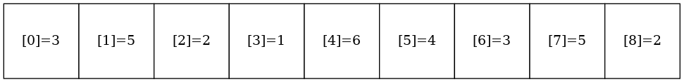 |

|Counters | 
|:-------------:|
| 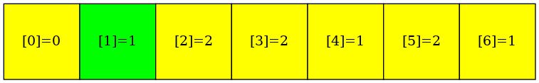 |

|Sorted | 
|:-------------:|
| 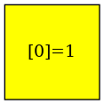 |

|Counters | 
|:-------------:|
| 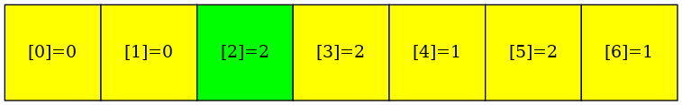 |

|Sorted | 
|:-------------:|
| 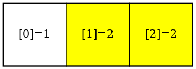 |

|Counters | 
|:-------------:|
| 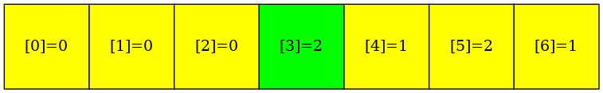 |

|Sorted | 
|:-------------:|
| 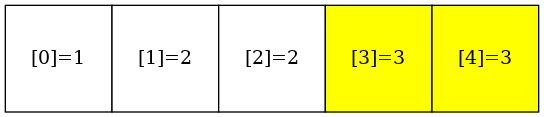 |

|Counters | 
|:-------------:|
| 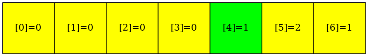 |

|Sorted | 
|:-------------:|
| 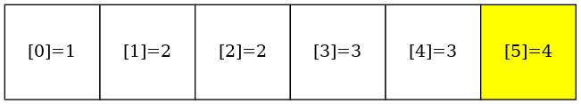 |

|Counters | 
|:-------------:|
| 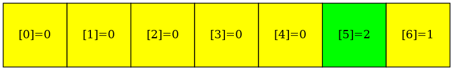 |

|Sorted | 
|:-------------:|
| 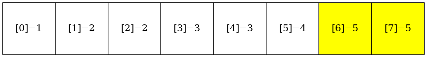 |

|Counters | 
|:-------------:|
| 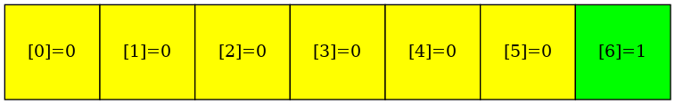 |

|Sorted | 
|:-------------:|
| 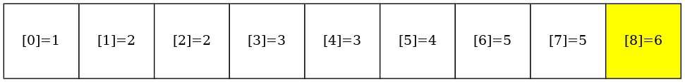 |

|Final | 
|:-------------:|
| 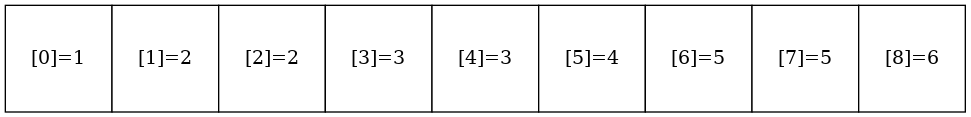 |


### Output
```sh
CountSort$ make
CountSort$ ./main

Before sorting:
3 5 2 1 6 4 3 5 2 
After sorting:
1 2 2 3 3 4 5 5 6

```