# HeapSort

The term "heap" can refer to two different concepts in computer science: heap in heap sort and heap in heap memory.

- The heap in heap sort is a tree-based data structure.

- The [heap](../../HeapAllocator/README.md) in heap memory is a memory area used for dynamic storage.

### make view 

```sh
HeapSort$ make view

find ./images -name "*.png" | sort | xargs feh -g 1024x768  &
```

### The process of HeapSort(arr, 6)


```C
/*
    Heapify a subtree at index i.
 */
static void Heapify(ArrayElementTy *ptr, long n, long i);

void HeapSort(ArrayElementTy *ptr, long n);
```

|Initial: ArrayElementTy arr[] = {30, 50, 20, 10, 60, 40}; | 
|:-------------:|
| 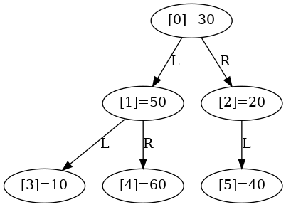 |

#### Stage 1: build the max heap

| Before Heapify(arr, 6, 2) | After Heapify(arr, 6, 2) |
|:-------------:|:-------------:|
| 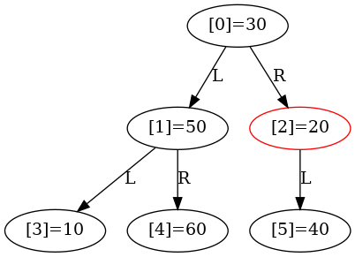 |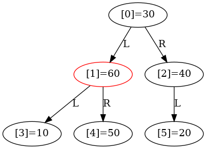 |

| Before Heapify(arr, 6, 1) | After Heapify(arr, 6, 1) |
|:-------------:|:-------------:|
| 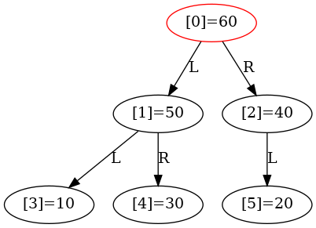 | |

| Before Heapify(arr, 6, 0) | After Heapify(arr, 6, 0) |
|:-------------:|:-------------:|
| 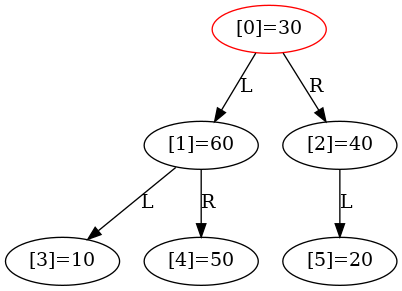 | |


#### Stage 2: sorting

|After Swap(arr, arr + 5)| Before Heapify(arr, 5, 0) | After Heapify(arr, 5, 0) | 
|:-------------:|:-------------:|:-------------:|
| 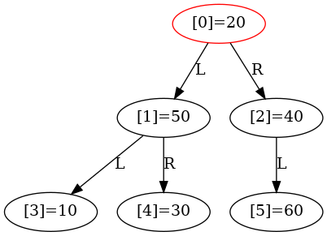 |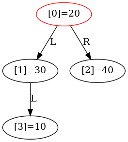 |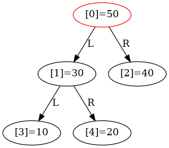 |

|After Swap(arr, arr + 4)| Before Heapify(arr, 4, 0) | After Heapify(arr, 4, 0) | 
|:-------------:|:-------------:|:-------------:|
| 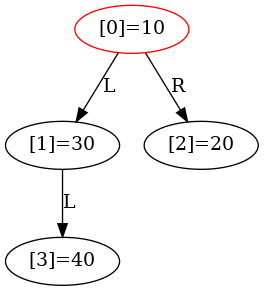 |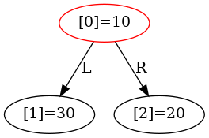 | |

|After Swap(arr, arr + 3)| Before Heapify(arr, 3, 0) | After Heapify(arr, 3, 0) | 
|:-------------:|:-------------:|:-------------:|
| 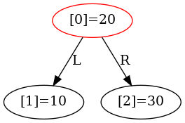 |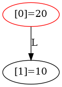 |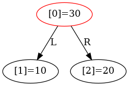 |

|After Swap(arr, arr + 2)| Before Heapify(arr, 2, 0) | After Heapify(arr, 2, 0) | 
|:-------------:|:-------------:|:-------------:|
|  |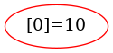 | |

|After Swap(arr, arr + 1)| Before Heapify(arr, 1, 0) | After Heapify(arr, 1, 0) | 
|:-------------:|:-------------:|:-------------:|
| 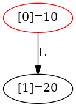 | | |

|Final | 
|:-------------:|
|  |


### Output
```sh
HeapSort$ make
HeapSort$ ./main

Before sorting:
30 50 20 10 60 40 
After sorting:
10 20 30 40 50 60

```