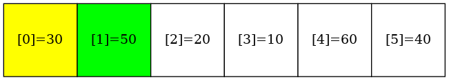
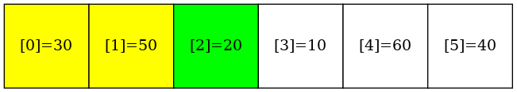
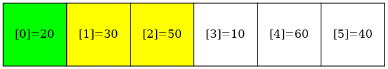
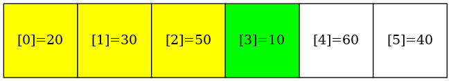
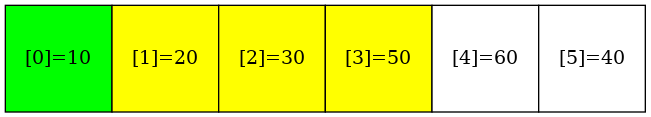
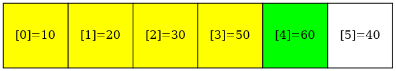
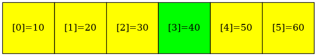

# InsertionSort

### make view 

```sh
InsertionSort$ make view

find ./images -name "*.png" | sort | xargs feh -g 1024x768  &
```

### The process of InsertionSort(arr, 6)

|Initial | 
|:-------------:|
|  |

|Pass 1: i=1 | Update the insertion point | 
|:-------------:|:-------------:|
|  | |

|Pass 2: i=2 |Update the insertion point | 
|:-------------:|:-------------:|
|  | |


|Pass 3: i=3 |Update the insertion point | 
|:-------------:|:-------------:|
|  | |

|Pass 4: i=4 | Update the insertion point| 
|:-------------:|:-------------:|
|  | |

|Pass 5: i=5 | Update the insertion point| 
|:-------------:|:-------------:|
|  | |

|Final | 
|:-------------:|
|  |

### Output
```sh
InsertionSort$ make
InsertionSort$ ./main

Before sorting:
30 50 20 10 60 40 
After sorting:
10 20 30 40 50 60 

```