# MergeSort

### make view 

```sh
MergeSort$ make view

find ./images -name "*.png" | sort | xargs feh -g 1024x768  &
```

### The process of MergeSort(arr, 0, 5, 6)


**Call Tree**

```sh
                                          MergeSort(arr, 0, 5, 6)
                                        /                         \
                                       /                           \
                    MergeSort(arr, 0, 2, 6)                        MergeSort(arr, 3, 5, 6) 
                     /               \                                      /           \
                    /                 \                                    /             \
    MergeSort(arr, 0, 1, 6)      MergeSort(arr, 2, 2, 6)      MergeSort(arr, 3, 4, 6)      MergeSort(arr, 5, 5, 6)
           /              \                                           /          \
          /                \                                         /            \
MergeSort(arr, 0, 0, 6)    MergeSort(arr, 1, 1, 6)    MergeSort(arr, 3, 3, 6)     MergeSort(arr, 4, 4, 6)


```

```C
void MergeSort(ArrayElementTy *ptr, long left, long right, long n);
```

|Initial | 
|:-------------:|
|  |

|MergeSort(arr, 0, 0, 6) | 
|:-------------:|
| 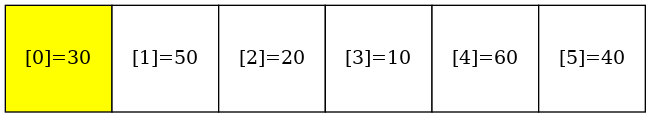 |

|MergeSort(arr, 1, 1, 6) | 
|:-------------:|
| 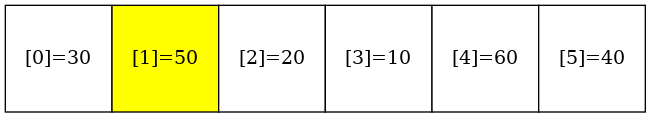 |


|MergeSort(arr, 0, 1, 6) | 
|:-------------:|
| 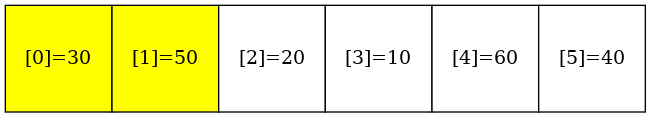 |

|MergeSort(arr, 2, 2, 6) | 
|:-------------:|
| 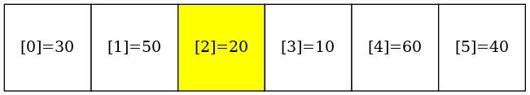 |

|MergeSort(arr, 0, 2, 6) | 
|:-------------:|
| 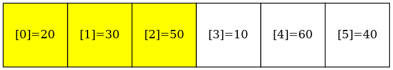 |

|MergeSort(arr, 3, 3, 6) | 
|:-------------:|
| 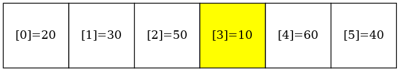 |


|MergeSort(arr, 4, 4, 6) | 
|:-------------:|
| 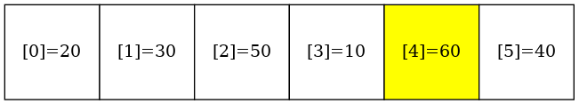 |


|MergeSort(arr, 3, 4, 6) | 
|:-------------:|
| 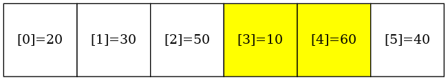 |

|MergeSort(arr, 5, 5, 6) | 
|:-------------:|
| 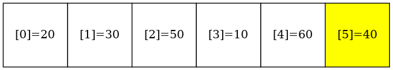 |

|MergeSort(arr, 3, 5, 6) | 
|:-------------:|
| 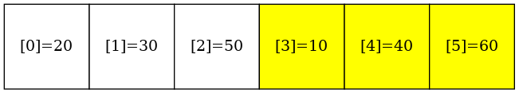 |

|MergeSort(arr, 0, 5, 6) | 
|:-------------:|
| 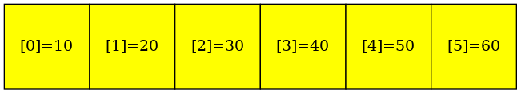 |

|Final | 
|:-------------:|
|  |


### Output
```sh
MergeSort$ ./main

Before sorting:
30 50 20 10 60 40 
After sorting:
10 20 30 40 50 60 

```