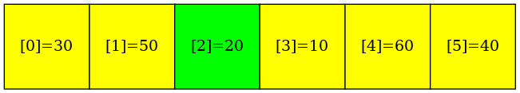
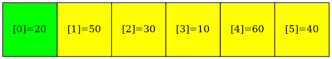
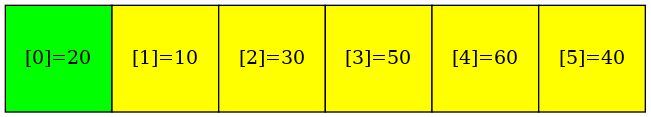
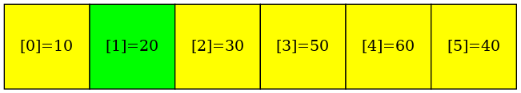
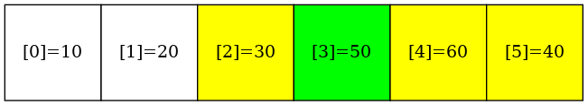
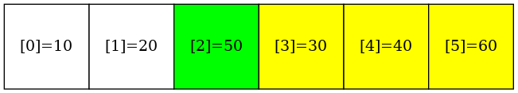
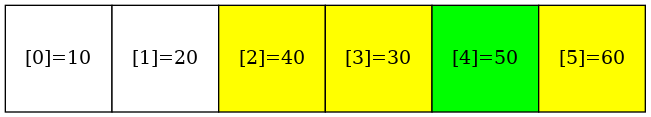
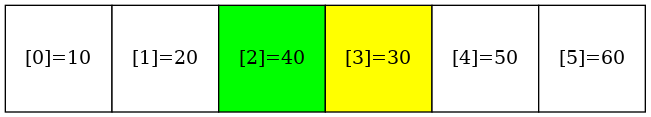
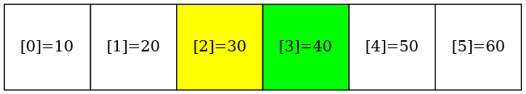

# QuickSort


### make view 

```sh
QuickSort$ make view

find ./images -name "*.png" | sort | xargs feh -g 1024x768  &
```

### The process of QuickSort(arr, 0, 5, 6)

```C
void QuickSort(ArrayElementTy *ptr, long left, long right, long n);
```

|Initial | 
|:-------------:|
|  |

|QuickSort(arr, 0, 5, 6): partitionElement in the middle | partitionElement, {other elements} | partitionElement, [ < ],  [ >= ] | [ < ],  partitionElement, [ >= ] | 
|:-------------:|:-------------:|:-------------:|:-------------:|
|  | |  |  |


|QuickSort(arr, 2, 5, 6): partitionElement in the middle | partitionElement, {other elements} | partitionElement, [ < ],  [ >= ] | [ < ],  partitionElement, [ >= ] | 
|:-------------:|:-------------:|:-------------:|:-------------:|
|  | |  |  |

|QuickSort(arr, 2, 3, 6): partitionElement in the middle | partitionElement, {other elements} | partitionElement, [ < ],  [ >= ] | [ < ],  partitionElement, [ >= ] | 
|:-------------:|:-------------:|:-------------:|:-------------:|
|  | |  |  |

|Final | 
|:-------------:|
|  |

### Output
```sh
QuickSort$ make
QuickSort$ ./main

Before sorting:
30 50 20 10 60 40 
After sorting:
10 20 30 40 50 60 
```