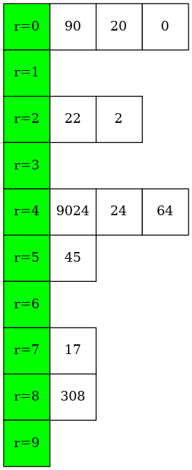
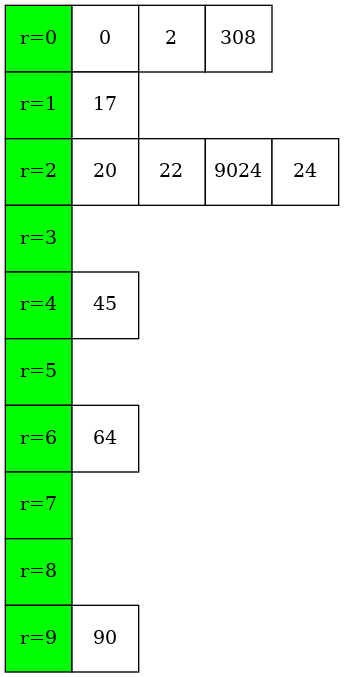
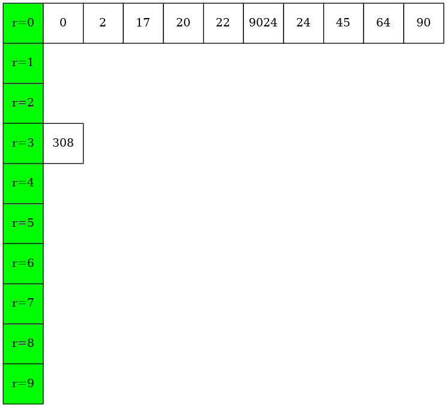
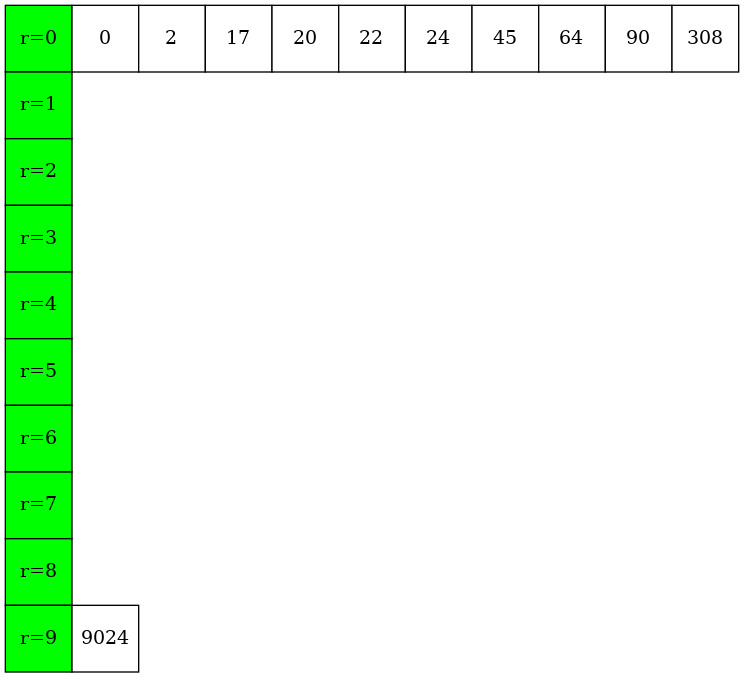

# RadixSort

The radix is essentially the base of the numeral system. 

- In the decimal system (base 10), the radix is 10 because there are 10 digits (0-9).
- In the binary system (base 2), the radix is 2 because there are 2 digits (0, 1).
- In the hexadecimal system (base 16), the radix is 16 because there are 16 digits (0-9, A-F).

### make view 

```sh
RadixSort$ make view

find ./images -name "*.png" | sort | xargs feh -g 1024x768  &
```


### Output
```sh
RadixSort$ make
RadixSort$ ./main

Before sorting:
22, 45, 308, 90, 9024, 24, 2, 64, 17, 20, 0 


After sorting:
0, 2, 17, 20, 22, 24, 45, 64, 90, 308, 9024

```

### The process of RadixSort(arr, 6)

```C
void RadixSort(ArrayElementTy *ptr, long n);
 
```
#### Initial
```sh
22, 45, 308, 90, 9024, 24, 2, 64, 17, 20, 0

```

#### Step 1:  (ptr[i] / 1) % 10

| 90, 20, 0, 22, 2, 9024, 24, 64, 45, 17, 308 | 
|:-------------:|
|  |

#### Step 2:  (ptr[i] / 10) % 10

|0, 2, 308, 17, 20, 22, 9024, 24, 45, 64, 90   | 
|:-------------:|
|  |


#### Step 3:  (ptr[i] / 100) % 10

| 0, 2, 17, 20, 22, 9024, 24, 45, 64, 90, 308  | 
|:-------------:|
|  |

#### Step 4:  (ptr[i] / 1000) % 10

|0, 2, 17, 20, 22, 24, 45, 64, 90, 308, 9024  | 
|:-------------:|
|  |


#### Final
```sh
0, 2, 17, 20, 22, 24, 45, 64, 90, 308, 9024

```