# SelectionSort

``` sh
/*******************************************************************
                SelectionSort

    1.  The algorithm of selection sort


                                             COMP9024

 *******************************************************************/
``` 

### make view 

```sh
SelectionSort$ make view

find ./images -name "*.png" | sort | xargs feh -g 1024x768  &
```

### The process of SelectionSort(arr, 0, 5, 6)

|Initial | 
|:-------------:|
|  |

|Pass 1: minIndex=0 | Update minIndex| After Swap(arr+0, arr+minIndex) |
|:-------------:|:-------------:|:-------------:|
| 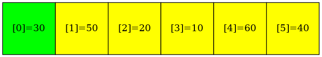 |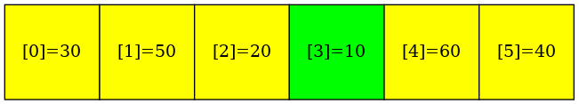 |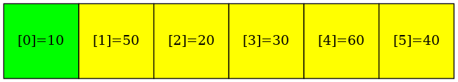 |

|Pass 2: minIndex=1 | Update minIndex|  After Swap(arr+1, arr+minIndex) |
|:-------------:|:-------------:|:-------------:|
| 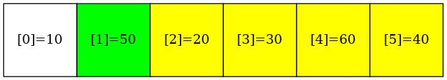 |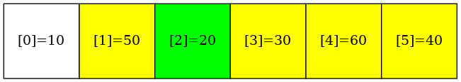 | |


|Pass 3: minIndex=2 | Update minIndex|  After Swap(arr+2, arr+minIndex) |
|:-------------:|:-------------:|:-------------:|
| 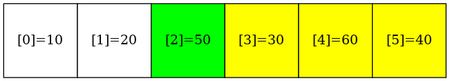 | |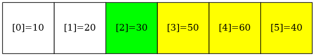 |

|Pass 4: minIndex=3 | Update minIndex|  After Swap(arr+3, arr+minIndex) |
|:-------------:|:-------------:|:-------------:|
| 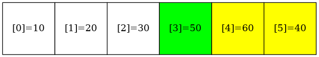 |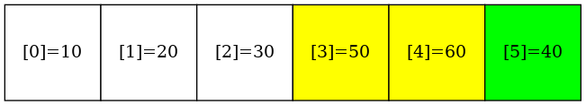 |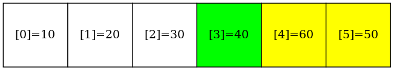 |

|Pass 5: minIndex=4 | Update minIndex|  After Swap(arr+4, arr+minIndex) |
|:-------------:|:-------------:|:-------------:|
| 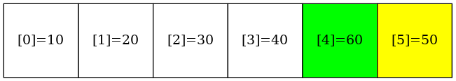 |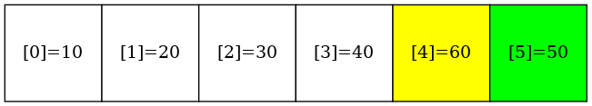 |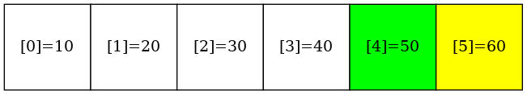 |

|Final | 
|:-------------:|
|  |

### Output
```sh
SelectionSort$ ./main

Before sorting:
30 50 20 10 60 40 
After sorting:
10 20 30 40 50 60 

```