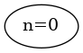
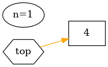
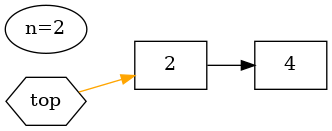
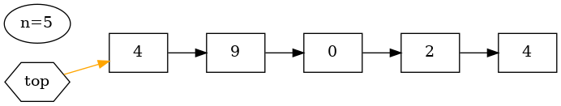
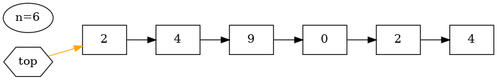
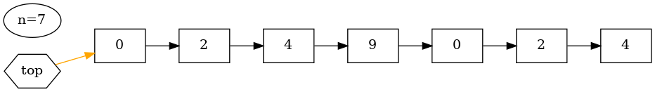
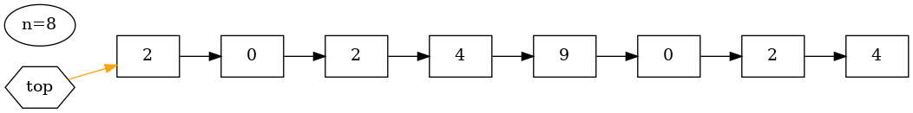
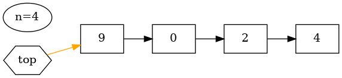
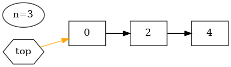

# Stack

``` sh
/*******************************************************************
                   Stack (based on a linked list)

    1.  How to create a stack

    2.  struct in C (for describing the data structure of Stack)

    3.  StackPush() and StackPop()

    4.  How to print the string representations of an integer x 
        (based on a stack)

                                             COMP9024

 *******************************************************************/
``` 

### Struct in C

The **struct** keyword in C is used to define user-defined data types.

The **typedef** keyword is used to create an alias for existing data types, making code easier to read and maintain.

```C
#include <stdio.h>
#if 1
// Method 1
struct Date {
    int day;
    int month;
    long year;
};

typedef struct Date DateTy;
#else
// Method 2
typedef struct Date {
    int day;
    int month;
    long year;
} DateTy;
#endif

DateTy d2 = {19, 9, 2024};

void PrintDateV1(struct Date date) {
    printf("date.day = %d, date.month = %d, date.year = %ld\n",
           date.day, 
           date.month, 
           date.year);
}

void PrintDateV2(struct Date *pDate) {
    printf("pDate->day = %d, pDate->month = %d, pDate->year = %ld\n",
           pDate->day, 
           pDate->month, 
           pDate->year);
}

int main(void) {
    struct Date d = {19, 9, 2024};
    PrintDateV1(d);
    PrintDateV2(&d);
    return 0;
}
```
**Output**
```sh
$ gcc Struct.c -o Struct 
$ ./Struct
date.day = 19, date.month = 9, date.year = 2024
pDate->day = 19, pDate->month = 9, pDate->year = 2024
```
**What is the difference between PrintDateV1() and PrintDateV2()?**
```C
void PrintDateV1(struct Date date) {
    date.day = 20;
    printf("date.day = %d, date.month = %d, date.year = %ld\n",
           date.day, 
           date.month, 
           date.year);
}
```


## Introduction
A stack is an abstract data type primarily characterized by two fundamental operations:

Push

    add an element to the stack

Pop

    remove the most recently added element from the stack


The order in which an element added to or removed from a stack is described as First In Last Out (FILO)
or Last In First Out (LIFO).

|Stack|
|:-------------:|
|  |  


In this tutorial, we will delve into the creation of a stack and its practical application in generating string representations of integers.

A stack can be implemented using an array ([COMP9024/Tutorials/Week3](../../Tutorials/Week3/README.md)) or with a linked list (in this project) for storing stack items / elements.


### Sidetracks

Note that a call stack is a stack data structure that stores information about the active functions of a running program, 

which is supported by the operating system and CPU (or by an [interpreter](https://github.com/rocky/x-python/)) and discussed in [COMP9024/Stacks/Recursion](../Recursion/README.md).

<!---
Interestingly, recursive functions depend on the call stack ([COMP9024/Stacks/Recursion](../Recursion/README.md)).
-->

The call stack also operates on a LIFO principle. 

**This implies that the function most recently invoked will be the first one to be removed from the call stack.**


## 1 How to download this project in [CSE VLAB](https://vlabgateway.cse.unsw.edu.au/)

Open a terminal (Applications -> Terminal Emulator)

```sh

$ git clone https://github.com/sheisc/COMP9024.git

$ cd COMP9024/Stacks/Stack_LL/

Stack_LL$ 

```


## 2 How to start [Visual Studio Code](https://code.visualstudio.com/) to browse/edit/debug a project.


```sh

Stack_LL$ code

```

Two configuration files (Stack_LL/.vscode/[launch.json](https://code.visualstudio.com/docs/cpp/launch-json-reference) and Stack_LL/.vscode/[tasks.json](https://code.visualstudio.com/docs/editor/tasks)) have been preset.


### 2.1 Open the project in VS Code

In the window of Visual Studio Code, please click "File" and "Open Folder",

select the folder "COMP9024/Stacks/Stack_LL", then click the "Open" button.


### 2.2 Build the project in VS Code

click **Terminal -> Run Build Task**


### 2.3 Debug the project in VS Code

Open src/Int2Str.c, and click to add a breakpoint (say, line 71).

Then, click **Run -> Start Debugging**

### 2.4 Directory

```sh
├── Makefile             defining set of tasks to be executed (the input file of the 'make' command)
|
├── README.md            introduction to this tutorial
|
├── src                  containing *.c and *.h
|    |
|    ├── Int2Str.c       print an integer as a string (based on a stack)
|    ├── Int2Str.h
|    ├── main.c          main()
|    ├── Stack.c         the implementation of a linked-list-based stack
|    └── Stack.h         the header file of the stack
|
|
└── .vscode              containing configuration files for Visual Studio Code
    |
    ├── launch.json      specifying which program to debug and with which debugger,
    |                    used when you click "Run -> Start Debugging"
    |
    └── tasks.json       specifying which task to run (e.g., 'make' or 'make clean')
                         used when you click "Terminal -> Run Build Task" or "Terminal -> Run Task"
```
Makefile is discussed in [COMP9024/C/HowToMake](../../C/HowToMake/README.md).


## 3 The push/pop operations in printing the string representations of an integer (e.g., x)


### 3.1 make view

**Click on the window of 'feh' or use your mouse scroll wheel to view images**.

```sh
BubbleSort$ make view
```

Here, **feh** is an image viewer available in [CSE VLAB](https://vlabgateway.cse.unsw.edu.au/).

All of these images for visualizing algorithms are generated automatically in [COMP9024/Stacks/Stack2Dot](../Stack2Dot/README.md).

```C
    long x = 20249024;
    long base = 10;   
    do {
        r = x % base;
        x = x / base;
        printf("push %d\n", r);
        StackPush(pStack, r);
    } while(x != 0);
```
|x| base | Remainder (r) | Quotient (x) |
|:-------------:|:-------------:|:-------------:|:-------------:| 
|20249024| 10 | r = x % base | x = x / base|

|Quotient|Remainder | Action |State | 
|:-------------:|:-------------:|:-------------|:-------------|
|20249024| |  | |

|Quotient|Remainder | Action |State | 
|:-------------:|:-------------:|:-------------|:-------------|
|2024902| 4| Push(4) | |

|Quotient|Remainder | Action |State | 
|:-------------:|:-------------:|:-------------|:-------------|
|202490| 2| Push(2) | |

|Quotient|Remainder | Action |State | 
|:-------------:|:-------------:|:-------------|:-------------|
|20249| 0| Push(0) | |

|Quotient|Remainder | Action |State | 
|:-------------:|:-------------:|:-------------|:-------------|
|2024| 9| Push(9) | |

|Quotient|Remainder | Action |State | 
|:-------------:|:-------------:|:-------------|:-------------|
|202| 4| Push(4) | |

|Quotient|Remainder | Action |State | 
|:-------------:|:-------------:|:-------------|:-------------|
|20| 2| Push(2) | |

|Quotient|Remainder | Action |State | 
|:-------------:|:-------------:|:-------------|:-------------|
|2| 0| Push(0) | |

|Quotient|Remainder | Action |State | 
|:-------------:|:-------------:|:-------------|:-------------|
|0| 2| Push(2) | |

| After pushing | 
|:-------------|
|  |

| Output | Action |  State |
|:-------------:|:-------------:|:-------------|
| 2| Pop() |  |

| Output | Action |  State |
|:-------------:|:-------------:|:-------------|
| 20| Pop() |  |

| Output | Action |  State |
|:-------------:|:-------------:|:-------------|
| 202| Pop() |  |

| Output | Action |  State |
|:-------------:|:-------------:|:-------------|
| 2024| Pop() |  |

| Output | Action |  State |
|:-------------:|:-------------:|:-------------|
| 20249| Pop() |  |

| Output | Action |  State |
|:-------------:|:-------------:|:-------------|
| 202490| Pop() |  |

| Output | Action |  State |
|:-------------:|:-------------:|:-------------|
| 2024902| Pop() |  |

| Output | Action |  State |
|:-------------:|:-------------:|:-------------|
| 20249024| Pop() |  |

### 3.2 make && ./main

``` sh
Stack_LL$ make

Stack_LL$ ./main
------------- x = 20249024, base = 10 -------------

push 4
push 2
push 0
push 9
push 4
push 2
push 0
push 2


After popping (First In Last Out):

20249024
------------- x = 20249024, base = 16 -------------

push 0
push 12
push 9
push 15
push 4
push 3
push 1


After popping (First In Last Out):

0x134F9C0
------------- x = 20249024, base = 8 -------------

push 0
push 0
push 7
push 4
push 7
push 1
push 5
push 1
push 1


After popping (First In Last Out):

0o115174700
------------- x = 20249024, base = 2 -------------

push 0
push 0
push 0
push 0
push 0
push 0
push 1
push 1
push 1
push 0
push 0
push 1
push 1
push 1
push 1
push 1
push 0
push 0
push 1
push 0
push 1
push 1
push 0
push 0
push 1


After popping (First In Last Out):

0b1001101001111100111000000

```


## 4 Data structure and memory layout

```C

 Stack:

                ----------            ----------         ----------         ----------   
  pStack -----> top         ------>     next      ------>  next      .....   next: NULL  
                n                       item               item              item        
                ----------            ----------         ----------         ----------  
               struct Stack           StackNode          StackNode           StackNode   
                                                                                                          
 
 
 In C:   // See COMP9024/Stacks/Stack_LL/src/Stack.c      

  typedef long STACK_ITEM_T;

  // the definition of a node in a linked list
  typedef struct node {    
      struct node *next;
      STACK_ITEM_T item;
  } StackNode;

  // The type definition of our Stack (based on a linked list)
  struct Stack {
      // the top element on the stack; 
      // i.e., the first element in the linked list
      StackNode *top;    
      // number of elements on stack
      long n;
  };

  // API (Application Programming Interface) in "Stack.h"

  struct Stack *CreateStack(void);

  void ReleaseStack(struct Stack *pStack);

  void StackPush(struct Stack *pStack, STACK_ITEM_T item);

  STACK_ITEM_T StackPop(struct Stack *pStack);

  STACK_ITEM_T StackPeek(struct Stack *pStack);

  int StackIsEmpty(struct Stack *pStack);


```

### How to write a header file in C

Please refer to [Include Guard](https://github.com/sheisc/COMP9024/blob/main/C/HowToMake/src/myadd.h) and [Abstract Data Type](https://sheisc.github.io/slides/COMP9024/24T3/week01/slides.html#s64)

## 5 Algorithm

```C
void PrintInteger(STACK_ITEM_T x, int base) {
    struct Stack *pStack = CreateStack();
    int r;

    x = (x >= 0 ? x : -x);
    base = (base >= 0 ? base: -base);

    printf("------------- x = %ld, base = %d -------------\n\n", (long) x, base);
    
    // push the remainders onto the stack
    do {
        r = x % base;
        x = x / base;
        printf("push %d\n", r);
        StackPush(pStack, r);
    } while (x != 0);

    printf("\n\nAfter popping (First In Last Out):\n\n");
    PrintPrefix(base);
    // output the remainders in the FILO order
    while(!StackIsEmpty(pStack)) {
        r = StackPop(pStack);
        // see https://www.asciitable.com/
        if (r <= 9) {
            // 1 --> '1' (0x31, 49); ...
            // 1 + 48 == 49
            printf("%c", r + 48);
        } else if (r <= 15) {
            // 10 --> 'A' (0x41, 65);  11 --> 'B', ...
            // 10 + 55 == 65
            printf("%c", r + 55);
        } else {
            // unknown base
            printf("?");
        }
    }
    ReleaseStack(pStack);
    printf("\n");
}

```
