# HashMap for Strings

``` sh
/*******************************************************************
                        HashMap for Strings

    1.  The data structure used for storing key-value pairs

    2.  How to insert a key-value pair into a HashMap

    3.  How to search for a key in a HashMap

    4.  How to delete a key-value pair in a HashMap


                                             COMP9024 24T2

 *******************************************************************/
``` 
## Introduction

### Hash Value
A hash value, also known simply as a hash, is a fixed-size string or number generated by applying a mathematical function (hash function) to a data item (such as a file, message, or block of data).

It is like a fingerprint for the digital data.

Hash values are essential for quickly comparing large datasets.

For example, in Git, every commit is identified and tracked using a unique hexadecimal string known as a Git SHA (Secure Hashing Algorithm).

This [SHA](https://en.wikipedia.org/wiki/Secure_Hash_Algorithms) is calculated based on the contents of the commit using a cryptographic hash function.

```sh
commit 41104cdaaa94edd08aee1cd4fbc37c515fdd3e2e

Date:   Mon Jul 22 17:11:43 2024 +1000

    Update Strings/HashMap

```

**A simple hash function for a string**
```C
/*
    For more about hash functions, please refer to

        https://cseweb.ucsd.edu/~kube/cls/100/Lectures/lec16/lec16.html
 */
static unsigned int GetHash(char *key) {
    unsigned int sum = 0;
    for (int i = 0; key[i] != '\0'; i++) {
        sum += ((unsigned char) key[i]);
    }
    return sum;  
}

const char *HashMapGet(struct HashMap *pMap, const char* key) {
    unsigned int index = GetHash(key) % pMap->capacity;

    struct BucketEntry *current = pMap->buckets[index];

    ...
}
```
For example, the hash value of "ear" (i.e., the return value of GetHash("ear")) is 312 (i.e., 101 + 97 + 114).

| [ASCII](https://www.asciitable.com/) Character | Decimal Integer |
|:-------------:|:-------------:|
|'e'| 101 |
|'a'| 97 |
|'r'| 114|

Suppose the capacity of the HashMap is 32.

After the following modulo operation, the value of 'index' will be 24.

```C
// 9 is the quotient of (312 / 32)
// 24 is the remainder of (312 / 32)
unsigned int index = 312 % 32;

struct BucketEntry *current = pMap->buckets[index];

...
```


### HashMap

A HashMap is a fundamental data structure in programming that provides a way to store key-value pairs.

BTW, key-value pairs can also be stored in a [SortedMap](https://en.cppreference.com/w/cpp/container/map), which uses a self-balancing binary search tree to keep keys in sorted order.

Internally, a HashMap ([unordered](https://en.cppreference.com/w/cpp/container/unordered_map)) uses an array of buckets to store key-value pairs.

Each bucket is a linked list of elements. 

When multiple elements hash to the same bucket (**collision**), they are stored as nodes in this linked list.

The key’s hash value determines the bucket location for storage.

Hashing (GetHash(key) and index calculation) is used to convert the key into an index in the underlying array.

| HashMap| 
|:-------------:|
|  |

| Purpose |   Description  |
|:-------------:|:-------------:|
|Fast Access | Hashing allows for constant-time **average** lookup, insert, and delete operations|
|Uniform Distribution | A good hash function distributes keys evenly across the array, reducing collisions |
| | |

Given a HashMap which contains n elements, 

if the hash function is good enough (almost no hash collision), 

the **average** time complexity of the lookup, insert, and delete operations can be seen as O(1) (if the overhead of GetHash() is 
ignored).

The GetHash(key) takes some time but it does not depend on 'n'.

Moreover, storing the hash value of a key once it has been calculated can be a practical optimization strategy. 

But, if hash collisions are frequent in a HashMap, the **worst-case** time complexity for these operations can indeed be O(n).

### Sidetracks: Is O(1) always better/faster than O(log(n)) ?

It depends on both the size of n and the ignored constant factors in O(1).

The big O notation ignores the constant factor (e.g., 100 in 'TimeA(n)=100').

Suppose n is less than $2^{32}$.
```sh
O(1):
    TimeA(n) = 100

O(log(n)):
    TimeB(n) = log(n) <= 32
```


#### Capacity and Load Factor

The capacity of a HashMap's table refers to the number of buckets (or slots) available in the underlying array where the key-value pairs are stored.

Load factor is calculated as the ratio of the number of elements currently present in the HashMap to the capacity of the HashMap's table.

$Load Factor = \frac{Number Of Elements}{Capacity Of The HashMap's Table}$

The load factor (e.g., default is 0.75 in [Java's HashMap](https://docs.oracle.com/javase/8/docs/api/java/util/HashMap.html)) determines when the HashMap will resize its capacity. 

When the number of elements exceeds the load factor multiplied by the current capacity, the HashMap will resize and rehash its elements into a larger table.

We assume that both the key and its corresponding value are C strings in this project.

#### Basic Operations
```C

// insert or update a key-value pair in a HashMap
void HashMapPut(struct HashMap *pMap, HashMapKeyTy key, HashMapValueTy value);

// get the value associated with a key
HashMapValueTy HashMapGet(struct HashMap *pMap, HashMapKeyTy key);

// delete a key-value pair
void HashMapDelete(struct HashMap *pMap, HashMapKeyTy key);

```


## 1 How to download this project in [CSE VLAB](https://vlabgateway.cse.unsw.edu.au/)

Open a terminal (Applications -> Terminal Emulator)

```sh

$ git clone https://github.com/sheisc/COMP9024.git

$ cd COMP9024/Strings/HashMap

HashMap$ 

```


## 2 How to start [Visual Studio Code](https://code.visualstudio.com/) to browse/edit/debug a project.


```sh

HashMap$ code

```

Two configuration files (HashMap/.vscode/[launch.json](https://code.visualstudio.com/docs/cpp/launch-json-reference) and HashMap/.vscode/[tasks.json](https://code.visualstudio.com/docs/editor/tasks)) have been preset.


#### 2.1 Open the project in VS Code

In the window of Visual Studio Code, please click "File" and "Open Folder",

select the folder "COMP9024/Strings/HashMap", then click the "Open" button.


#### 2.2 Build the project in VS Code

click **Terminal -> Run Build Task**


#### 2.3 Debug the project in VS Code

Open src/main.c, and click to add a breakpoint (say, line 34).

Then, click **Run -> Start Debugging**

### 2.4 Directory

```sh
├── Makefile             defining set of tasks to be executed (the input file of the 'make' command)
|
├── README.md            introduction to this project
|
├── src                  containing *.c and *.h
|   |
|   |
│   ├── HashMap.c        The data structure used for storing key-value pairs
│   ├── HashMap.h
|   |
│   └── main.c           main()
|
|── images               containing *.dot and *.png files
|
|── diagrams             containing *.png files
|
└── .vscode              containing configuration files for Visual Studio Code
    |
    ├── launch.json      specifying which program to debug and with which debugger,
    |                    used when you click "Run -> Start Debugging"
    |
    └── tasks.json       specifying which task to run (e.g., 'make' or 'make clean')
                         used when you click "Terminal -> Run Build Task" or "Terminal -> Run Task"
```

Makefile is discussed in [COMP9024/C/HowToMake](../../C/HowToMake/README.md).

## 3 The main procedure

### 3.1 make and ./main

**In addition to utilizing VS Code, we can also compile and execute programs directly from the command line interface as follows.**

``` sh

HashMap$ make

HashMap$ ./main

The meaning of "ear": the sense organ for hearing

Updating the meaning of "ear"
The meaning of "ear": The sense organ for hearing

HashMapDelete(pMap, "earl")

The hash map does not contain the key "earl"

	 ear: The sense organ for hearing
	 apply: put into service
	 ape: a large primate that lacks a tail
	 apes: the plural noun of the word ape
	 earth: the planet on which we live
	 east: the eastern part of the world
	 app: an application, especially as downloaded by a user to a mobile device
	 ace: a playing card with a single spot on it
	 early: happening or done before the usual or expected time
	 "earl" not found
	 aces: the plural noun of the word ace
	 apple: a round fruit with firm, white flesh and a green, red, or yellow skin


```


### 3.2 make view

**Ensure that you have executed 'make' and './main' before 'make view'.**


```sh
HashMap$ make view
```

**Click on the window of 'feh' or use your mouse scroll wheel to view images**.

Here, **feh** is an image viewer available in [CSE VLAB](https://vlabgateway.cse.unsw.edu.au/).

```C
// keys
static char *words[] = { 
    "ear", "apply", "ape", "apes", "earth", 
    "east", "app", "ace", "early", "earl", 
    "aces", "apple"
};
```

#### 3.2.1 HashMapPut()

| HashMapPut("ear", "the sense organ for hearing") | 
|:-------------:|
|  |

| HashMapPut("apply", ...) | 
|:-------------:|
| 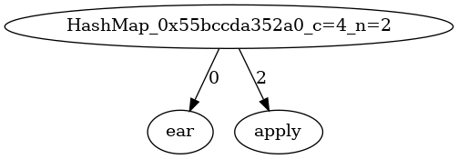 |

| HashMapPut("ape", ...) | 
|:-------------:|
| 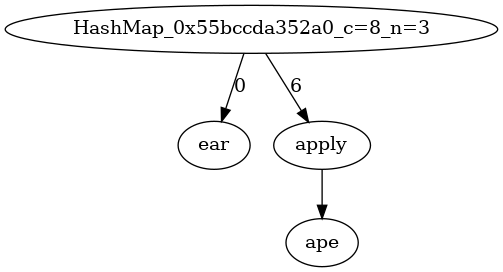 |

| HashMapPut("apes", ...) | 
|:-------------:|
| 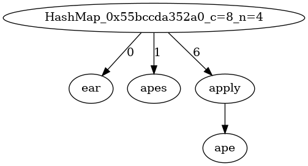 |

| HashMapPut("earth", ...) | 
|:-------------:|
| 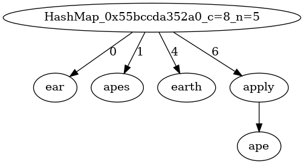 |


| HashMapPut("east", ...) | 
|:-------------:|
|  |

| HashMapPut("app", ...) | 
|:-------------:|
| 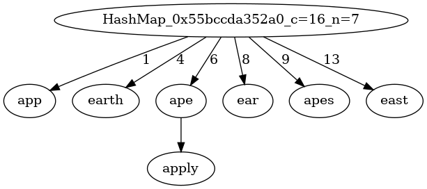 |

| HashMapPut("ace", ...) | 
|:-------------:|
| 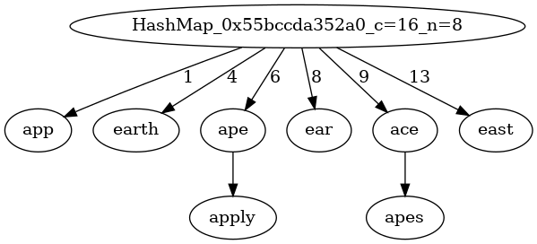 |

| HashMapPut("early", ...) | 
|:-------------:|
| 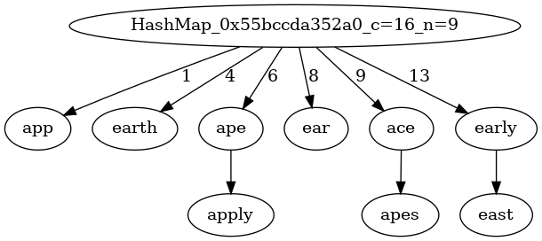 |

| HashMapPut("earl", ...) | 
|:-------------:|
| 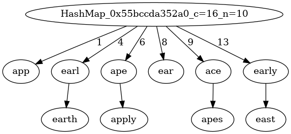 |


| HashMapPut("aces", ...) | 
|:-------------:|
| 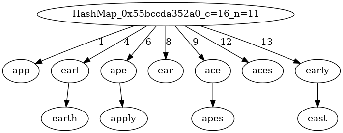 |

| HashMapPut("apple", ...) | 
|:-------------:|
| 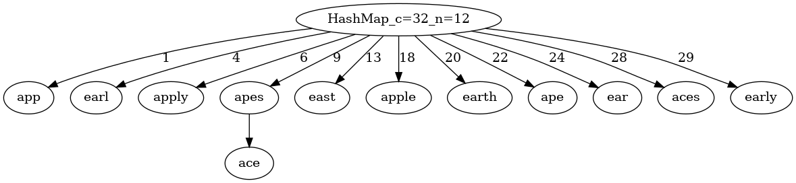 |


#### 3.2.2 HashMapDelete()

| HashMapDelete("earl") | 
|:-------------:|
| 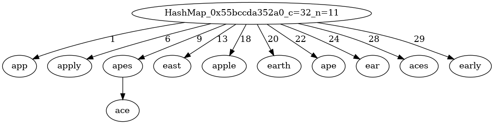 |

## 4 Data structures

```C

#define BUCKET_COUNT    2

#define LOAD_FACTOR_THRESHOLD       0.75

typedef char *HashMapKeyTy;
typedef char *HashMapValueTy;

struct BucketEntry {
    HashMapKeyTy key;
    HashMapValueTy value;
    struct BucketEntry* next;
};


struct HashMap{
    /*
                             ------------------------
                                buckets[capacity-1]    ---->  BucketEntry  ----> ....   ---> BucketEntry
                                buckets[capacity-2]
                                     ...
            buckets   ---->     buckets[0]             ---->  BucketEntry  ----> ....   ---> BucketEntry 
                             ------------------------
                              Array of pointers on the heap
     */
    struct BucketEntry **buckets;
    // the number of slots/buckets in the HashMap
    int capacity;
    // the number of key-value pairs in the HashMap
    int n;
};

```


## 5 Algorithms

### 5.1 main()

```C

// keys
static char *words[] = { 
    "ear", "apply", "ape", "apes", "earth", 
    "east", "app", "ace", "early", "earl", 
    "aces", "apple"
};

// values
static char *meanings[] = { 
    "the sense organ for hearing", 
    "put into service", 
    "a large primate that lacks a tail", 
    "the plural noun of the word ape", 
    "the planet on which we live", 
    
    "the eastern part of the world",
    "an application, especially as downloaded by a user to a mobile device", 
    "a playing card with a single spot on it", 
    "happening or done before the usual or expected time", 
    "a British nobleman",
    
    "the plural noun of the word ace",
    "a round fruit with firm, white flesh and a green, red, or yellow skin"
};    

int main(void) {
    long count = 0;
    struct HashMap *pMap = CreateHashMap();

    int n = sizeof(words)/sizeof(words[0]);
    assert(n == (sizeof(meanings)/sizeof(meanings[0])));   

    // create a sub-directory 'images' (if it is not present) in the current directory
    system("mkdir -p images");
    // remove the *.dot and *.png files in the directory 'images'
    system("rm -f images/*.dot images/*.png");

    for (int i = 0; i < n; i++) {
        HashMapPut(pMap, words[i], meanings[i]);
        //
        GenOneImage(pMap, "OurHashMap", "images/OurHashMap", count);
        count++;
    }

    // Demonstrate get and put
    HashMapKeyTy key = words[0];
    HashMapValueTy value = HashMapGet(pMap, key);
    if (value) {
        printf("\nThe meaning of \"%s\": %s\n", key, value);
    }
  
    printf("\nUpdating the meaning of \"%s\"", key);
    if (value) {
        HashMapPut(pMap, key, "The sense organ for hearing");
    }

    value = HashMapGet(pMap, key);
    if (value) {
        printf("\nThe meaning of \"%s\": %s\n", key, value);
    }

    key = "earl";
    printf("\nHashMapDelete(pMap, \"%s\")\n", key);
    HashMapDelete(pMap, key);

    GenOneImage(pMap, "OurHashMap", "images/OurHashMap", count);
    count++;

    value = HashMapGet(pMap, key);
    if (!value) {
        printf("\nThe hash map does not contain the key \"%s\"\n\n", key);
    }

    for (int i = 0; i < n; i++) {
        value = HashMapGet(pMap, words[i]);
        if (!value) {
            printf("\t \"%s\" not found\n", words[i]);
        } else {
            printf("\t %s: %s\n", words[i], value);
        }        
    }

    ReleaseHashMap(pMap);
    return 0;
}
```

### 5.2 CreateHashMap() and ReleaseHashMap()
```C

struct BucketEntry *CreateBucketEntry(HashMapKeyTy key, HashMapValueTy value) {
    struct BucketEntry *pEntry = (struct BucketEntry *) malloc(sizeof(struct BucketEntry));
    assert(pEntry);
    // Copy key and value. Heap space will be allocated if necessary.
    pEntry->key = CopyKey(key);
    pEntry->value = CopyValue(value);
    pEntry->next = NULL;
    return pEntry;
}

void ReleaseBucketEntry(struct BucketEntry *pEntry) {
    if (pEntry) {
        ReleaseKey(pEntry->key);
        ReleaseValue(pEntry->value);
        free(pEntry);
    }    
}

struct HashMap *CreateHashMap(void) {
    struct HashMap *pMap = (struct HashMap *) malloc(sizeof(struct HashMap));
    struct BucketEntry **buckets = 
        (struct BucketEntry **) malloc(sizeof(struct BucketEntry *) * BUCKET_COUNT);
    assert(pMap && buckets);

    pMap->buckets = buckets;
    pMap->capacity = BUCKET_COUNT;
    pMap->n = 0;
    for (int i = 0; i < pMap->capacity; i++) {
        pMap->buckets[i] = NULL;
    }    
    return pMap;
}

void ReleaseHashMap(struct HashMap* pMap) {
    for (int i = 0; i < pMap->capacity; i++) {
        struct BucketEntry *current = pMap->buckets[i];
        // Release the elements in each bucket
        while (current != NULL) {
            struct BucketEntry *tmp = current;
            current = current->next;
            ReleaseBucketEntry(tmp);
        }
    }
    free(pMap->buckets);
    free(pMap);
}

```

### 5.3 GetHash()
```C
/*
    For more about hash functions, please refer to 

        https://cseweb.ucsd.edu/~kube/cls/100/Lectures/lec16/lec16.html
 */
static unsigned int GetHash(char *key) {
    unsigned int sum = 0;
    for (int i = 0; key[i] != '\0'; i++) {
        sum += ((unsigned char) key[i]);
    }
    return sum;  
}
```

### 5.4 HashMapPut()

```C


// insert or update a key-value pair in a HashMap
void HashMapPut(struct HashMap *pMap, HashMapKeyTy key, HashMapValueTy value) {
    unsigned int index = GetHash(key) % pMap->capacity;
    struct BucketEntry *current = pMap->buckets[index];
    
    // Update the value if its key already exists
    while (current != NULL) {
        if (IsEqual(current->key, key)) {
            // Release the heap space pointed to by current->value
            ReleaseValue(current->value);
            // Copy the value and allocate heap space if necessary
            current->value = CopyValue(value);
            return;
        }
        current = current->next;
    }

    // Add a key-value pair
    struct BucketEntry *pEntry = CreateBucketEntry(key, value);
    // add the entry at the front of the bucket
    pEntry->next = pMap->buckets[index];
    pMap->buckets[index] = pEntry;
    //increase the number of key-value pairs
    pMap->n++;

    // Test whether we need to resize the HashMap for better performance
    if (HashMapLoadFactor(pMap) >= LOAD_FACTOR_THRESHOLD) {
        HashMapResize(pMap);
    }
}

```
### 5.5 HashMapGet()

```C
// get the value associated with a key
HashMapValueTy HashMapGet(struct HashMap *pMap, HashMapKeyTy key) {
    unsigned int index = GetHash(key) % pMap->capacity;
    struct BucketEntry *current = pMap->buckets[index];
    
    while (current != NULL) {
        if (IsEqual(current->key, key)) {
            return current->value;
        }
        current = current->next;
    }
    // Not found
    return NULL; 
}
```

### 5.6 HashMapDelete()

```C
// delete a key-value pair
void HashMapDelete(struct HashMap *pMap, HashMapKeyTy key) {
    unsigned int index = GetHash(key) % pMap->capacity;
    struct BucketEntry *current = pMap->buckets[index];
    struct BucketEntry *prev = NULL;
    
    while (current != NULL) {
        if (IsEqual(current->key, key)) {
            if (prev != NULL) { 
                // current is not the first element
                prev->next = current->next;
            } else { 
                // current is the first element
                pMap->buckets[index] = current->next;
            }
            ReleaseBucketEntry(current);
            // decrease the number of key-value pairs
            pMap->n--;
            return;
        }
        prev = current;
        current = current->next;
    }
}

```

### 5.7 HashMapResize()
```C

static void HashMapResize(struct HashMap *pMap) {
    int newCapacity = pMap->capacity * 2;
    assert(newCapacity > pMap->capacity);
    struct BucketEntry **newBuckets = 
        (struct BucketEntry **) malloc(sizeof(struct BucketEntry *) * newCapacity);
    assert(newBuckets);
    for (int i = 0; i < newCapacity; i++) {
        newBuckets[i] = NULL;
    }

    // move the existing bucket entries 
    for (int i = 0; i < pMap->capacity; i++) {
        struct BucketEntry *current = pMap->buckets[i];
        while (current != NULL) {
            struct BucketEntry *tmp = current;
            // rehash the element into a larger table.
            unsigned int index = GetHash(tmp->key) % newCapacity;
            current = current->next;
            // insert the BucketEntry at the head of the linked list pointed to by newBuckets[index]
            tmp->next = newBuckets[index];
            newBuckets[index] = tmp;
        }
    }
    // release the old buckets
    free(pMap->buckets);
    // resize
    pMap->buckets = newBuckets;
    pMap->capacity = newCapacity;
}

double HashMapLoadFactor(struct HashMap *pMap) {
    assert(pMap->capacity > 0);
    double loadFactor = ((double) (pMap->n)) / pMap->capacity;
    return loadFactor;
}

```

### 5.8 HashMapToDot()
```C

//////////////////////////// HashMap2Dot ////////////////////////////////////////

#define FILE_NAME_LEN  255

void GenOneImage(struct HashMap* pMap, char *graphName, char *fileName, long seqNo) {
    char dotFileName[FILE_NAME_LEN+1] = {0};
    char pngFileName[FILE_NAME_LEN+1] = {0};
    char command[(FILE_NAME_LEN+1)*4] = {0};
    
    snprintf(dotFileName, FILE_NAME_LEN, "%s_%04ld.dot", fileName, seqNo);
    snprintf(pngFileName, FILE_NAME_LEN, "%s_%04ld.png", fileName, seqNo);

    HashMap2Dot(pMap, dotFileName, graphName);

    snprintf(command, FILE_NAME_LEN*4, "dot -T png %s -o %s", dotFileName, pngFileName);

    //printf("%s\n", command);
    
    // Execute the command in a child process (fork() + exec() on Linux)
    system(command);
}

/*
    digraph OurHashMap {
    "HashMap_c=8_n=3"
    "HashMap_c=8_n=3" -> {"ear"} [label="0"]
    "HashMap_c=8_n=3" -> {"apply"} [label="6"]
    "apply" -> {"ape"}
    }
 */
void HashMap2Dot(struct HashMap* pMap, char *filePath, char *graphName) {
    
    FILE *dotFile = fopen(filePath, "w");
    assert(pMap);
    /*
        FIXME:  check sanity of the parameters.
     */
    if (dotFile) {
        char *edgeConnectorStr = "->";
        fprintf(dotFile, "digraph %s {\n", graphName);
        // Node for the whole HashMap
        fprintf(dotFile, 
                "\"HashMap_c=%d_n=%d\"\n",
                pMap->capacity,
                pMap->n);
        for (int i = 0; i < pMap->capacity; i++) {
            if (pMap->buckets[i]) {
                fprintf(dotFile, 
                        "\"HashMap_c=%d_n=%d\" %s {\"%s\"} [label=\"%d\"]\n",
                        pMap->capacity,
                        pMap->n,
                        edgeConnectorStr,
                        KeyToString(pMap->buckets[i]->key),
                        i);
                struct BucketEntry *next = pMap->buckets[i]->next;
                struct BucketEntry *current = pMap->buckets[i];
                while (next) {
                    fprintf(dotFile, 
                            "\"%s\" %s {\"%s\"}\n",
                            KeyToString(current->key),
                            edgeConnectorStr,
                            KeyToString(next->key));
                    current = next;
                    next = current->next;                   
                }
            }
        }
        fprintf(dotFile, "}\n");
        fclose(dotFile);
    }                
}

```

### 5.9 Functions for C Strings

```C
/////////////////////////////// Both key and value are strings ///////////////////////////////////////////////
typedef char *HashMapKeyTy;
typedef char *HashMapValueTy;

static char * CopyString(char *str) {
    size_t len = strlen(str);
    char *str2 = (char *) malloc(len+1);
    strncpy(str2, str, len);
    str2[len] = 0;
    return str2;    
}

static void ReleaseString(char *str) {
    free(str);
}

static HashMapKeyTy CopyKey(HashMapKeyTy key) {
    return CopyString(key);
}

static void ReleaseKey(HashMapKeyTy key) {
    ReleaseString(key);
}

static HashMapValueTy CopyValue(HashMapValueTy value) {
    return CopyString(value);
}

static void ReleaseValue(HashMapValueTy value) {
    free(value);
}

static int IsEqual(HashMapKeyTy k1, HashMapKeyTy k2) {
    return strcmp(k1, k2) == 0;
}

static char *KeyToString(HashMapKeyTy key) {
    return key;
}
```
