# HashSet for Strings

``` sh
/*******************************************************************
                        HashSet for Strings

    1.  The data structure used for storing keys

    2.  How to insert a key into a HashSet

    3.  How to search for a key in a HashSet

    4.  How to delete a key in a HashSet


                                             COMP9024

 *******************************************************************/
``` 
A HashSet is a powerful tool for managing collections of unique elements. 

At its core, a HashSet leverages a hash table for storage. 

Each element is hashed to determine its position in the table, which enables average-case constant time complexity, O(1), for common operations such as adding elements, checking for membership, or removing elements. 

#### Basic Operations
```C


typedef char *HashSetKeyTy;


struct HashSet *CreateHashSet(void);

void ReleaseHashSet(struct HashSet* pSet);

// test whether a HashSet contains a key
int HashSetContains(struct HashSet *pSet, HashSetKeyTy key);

// insert a key
void HashSetInsert(struct HashSet *pSet, HashSetKeyTy key);

// delete a key
void HashSetDelete(struct HashSet *pSet, HashSetKeyTy key);

```


## 1 How to download this project in [CSE VLAB](https://vlabgateway.cse.unsw.edu.au/)

Open a terminal (Applications -> Terminal Emulator)

```sh

$ git clone https://github.com/sheisc/COMP9024.git

$ cd COMP9024/Strings/HashSet

HashSet$ 

```


## 2 How to start [Visual Studio Code](https://code.visualstudio.com/) to browse/edit/debug a project.


```sh

HashSet$ code

```

Two configuration files (HashSet/.vscode/[launch.json](https://code.visualstudio.com/docs/cpp/launch-json-reference) and HashSet/.vscode/[tasks.json](https://code.visualstudio.com/docs/editor/tasks)) have been preset.


#### 2.1 Open the project in VS Code

In the window of Visual Studio Code, please click "File" and "Open Folder",

select the folder "COMP9024/Strings/HashSet", then click the "Open" button.


#### 2.2 Build the project in VS Code

click **Terminal -> Run Build Task**


#### 2.3 Debug the project in VS Code

Open src/main.c, and click to add a breakpoint (say, line 34).

Then, click **Run -> Start Debugging**

### 2.4 Directory

```sh
├── Makefile             defining set of tasks to be executed (the input file of the 'make' command)
|
├── README.md            introduction to this project
|
├── src                  containing *.c and *.h
|   |
|   |
│   ├── HashSet.c        for managing collections of unique elements
│   ├── HashSet.h
|   |
│   └── main.c           main()
|
|── images               containing *.dot and *.png files
|
|
└── .vscode              containing configuration files for Visual Studio Code
    |
    ├── launch.json      specifying which program to debug and with which debugger,
    |                    used when you click "Run -> Start Debugging"
    |
    └── tasks.json       specifying which task to run (e.g., 'make' or 'make clean')
                         used when you click "Terminal -> Run Build Task" or "Terminal -> Run Task"
```

Makefile is discussed in [COMP9024/C/HowToMake](../../C/HowToMake/README.md).

## 3 The main procedure

### 3.1 make and ./main

**In addition to utilizing VS Code, we can also compile and execute programs directly from the command line interface as follows.**

``` sh

HashSet$ make

HashSet$ ./main

	The HashSet contains "earl"

After HashSetDelete(pSet, key)

	HashSet doesn't contain "earl"


```


### 3.2 make view

**Ensure that you have executed 'make' and './main' before 'make view'.**


```sh
HashSet$ make view
```

**Click on the window of 'feh' or use your mouse scroll wheel to view images**.

Here, **feh** is an image viewer available in [CSE VLAB](https://vlabgateway.cse.unsw.edu.au/).

```C
// keys
static char *words[] = { 
    "ear", "apply", "ape", "apes", "earth", 
    "east", "app", "ace", "early", "earl", 
    "aces", "apple"
};
```

#### 3.2.1 HashSetInsert()

| HashSetInsert("ear", "the sense organ for hearing") | 
|:-------------:|
| 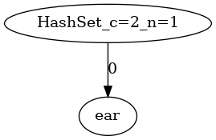 |

| HashSetInsert("apply") | 
|:-------------:|
| 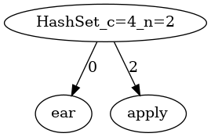 |

| HashSetInsert("ape") | 
|:-------------:|
| 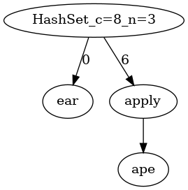 |

| HashSetInsert("apes") | 
|:-------------:|
| 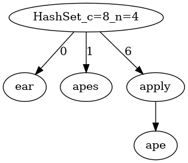 |

| HashSetInsert("earth") | 
|:-------------:|
| 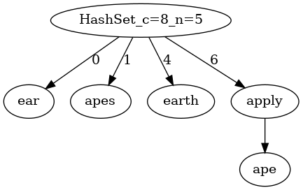 |


| HashSetInsert("east") | 
|:-------------:|
| 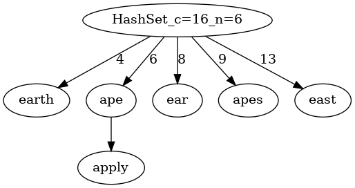 |

| HashSetInsert("app") | 
|:-------------:|
| 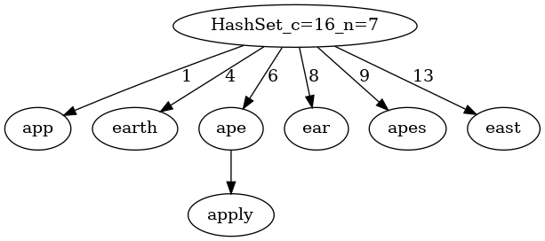 |

| HashSetInsert("ace") | 
|:-------------:|
| 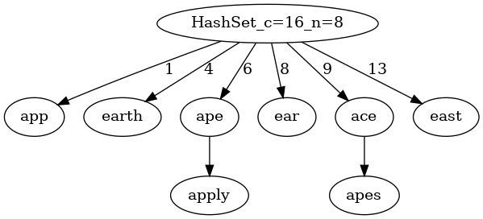 |

| HashSetInsert("early") | 
|:-------------:|
| 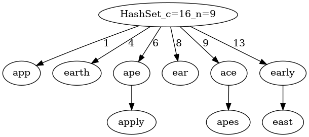 |

| HashSetInsert("earl") | 
|:-------------:|
| 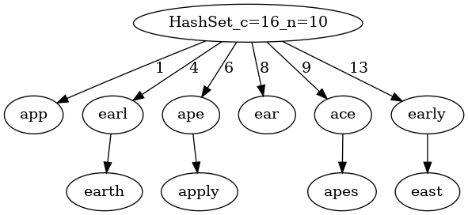 |


| HashSetInsert("aces") | 
|:-------------:|
| 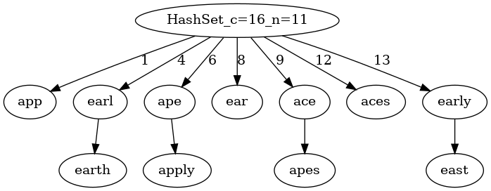 |

| HashSetInsert("apple") | 
|:-------------:|
| 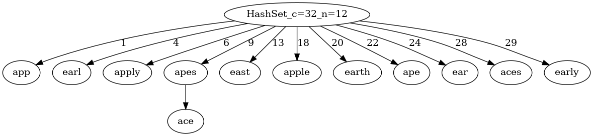 |


#### 3.2.2 HashSetDelete()

| HashSetDelete("earl") | 
|:-------------:|
|  |

## 4 Data structures

```C

#define BUCKET_COUNT    2

#define LOAD_FACTOR_THRESHOLD       0.75

typedef char *HashSetKeyTy;

struct BucketEntry {
    HashSetKeyTy key;
    struct BucketEntry* next;
};


struct HashSet{
    /*
                             ------------------------
                                buckets[capacity-1]    ---->  BucketEntry  ----> ....   ---> BucketEntry
                                buckets[capacity-2]
                                     ...
            buckets   ---->     buckets[0]             ---->  BucketEntry  ----> ....   ---> BucketEntry 
                             ------------------------
                              Array of pointers on the heap
     */
    struct BucketEntry **buckets;
    // the number of slots/buckets in the HashSet
    int capacity;
    // the number of keys in the HashSet
    int n;
};

```


## 5 Algorithms


### 5.1 main()


```C

struct HashSet *CreateHashSet(void);

void ReleaseHashSet(struct HashSet* pSet);

// test whether a HashSet contains a key
int HashSetContains(struct HashSet *pSet, HashSetKeyTy key);

// insert a key
void HashSetInsert(struct HashSet *pSet, HashSetKeyTy key);

// delete a key
void HashSetDelete(struct HashSet *pSet, HashSetKeyTy key);

// keys
static char *words[] = { 
    "ear", "apply", "ape", "apes", "earth", 
    "east", "app", "ace", "early", "earl", 
    "aces", "apple"
};
   

int main(void) {
    long count = 0;
    struct HashSet *pSet = CreateHashSet();

    int n = sizeof(words)/sizeof(words[0]);

    // create a sub-directory 'images' (if it is not present) in the current directory
    system("mkdir -p images");
    // remove the *.dot and *.png files in the directory 'images'
    system("rm -f images/*.dot images/*.png");

    for (int i = 0; i < n; i++) {
        HashSetInsert(pSet, words[i]);
        GenOneImage(pSet, "OurHashSet", "images/OurHashSet", count);
        count++;
    }

    HashSetKeyTy key = "earl";

    if (HashSetContains(pSet, key)) {
        printf("\tThe HashSet contains \"%s\"\n", key);
    }

    HashSetDelete(pSet, key);
    printf("After HashSetDelete(pSet, key)\n");
    if (!HashSetContains(pSet, key)) {
        printf("\tHashSet doesn't contain \"%s\"\n", key);
    }

    ReleaseHashSet(pSet);
    return 0;
}
```
