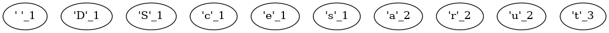

# Huffman Coding 


### make view 

```sh
Huffman/$ make view

find ./images -name "*.png" | sort | xargs feh -g 1024x768  &
```


### Output
```sh
Huffman$ make
Huffman$ ./main
Original text: Data Structures
' ': 1010
'D': 1011
'S': 1100
'a': 010
'c': 1101
'e': 1110
'r': 011
's': 1111
't': 00
'u': 100
Encoded: 101101000010101011000001110011010010001111101111
Decoded: Data Structures


```

### Frequencies of characters in "Data Structures"

| Character|t | a | r| u | ' ' | D |S |c | e| s |
|:---:|:---:|:---:|:---:|:---:|:---:|:---:|:---:|:---:|:---:|:---:|
|Frequency| 3 | 2 | 2 | 2| 1 | 1 |1 | 1 |1 | 1 |


### The process of creating a Huffman tree

| | 
|:-------------:|
|  |

### Encoding

| Character |   Huffman Codes |
|:---:|:---:|
|'t'| 00    |
|'a'| 010   | 
|'r'| 011   | 
|'u'| 100   | 
|' '| 1010  |  
|'D'| 1011  |  
|'S'| 1100  |  
|'c'| 1101  |  
|'e'| 1110  |  
|'s'| 1111  |  


