# KMP

KMP stands for Knuth-Morris-Pratt, which is an efficient algorithm used for string matching or substring searching. 

LPPS: The longest proper prefix (also a suffix). 

```sh
String: "ababab"
LPPS: "abab"
Explanation:  The longest proper prefix ("abab") is also a suffix.
              "ab" is another proper prefix (also a suffix) of "ababab", but not the longest.
```


It uses preprocessing to build an auxiliary array called the longest proper prefix (also a suffix) array, lppsArr[]. 

This array helps in skipping unnecessary comparisons when a mismatch occurs.

### When a mismatch occurs (text[i] != pattern[j])

```sh

(1) j == 0

text
                                    i
            .   .   .   .   .   .   y   .   .   

pattern
                                    x   .   .

                                    j

Shift:
        i++;
```

```sh
(2) j > 0            


text
                        i-j         i
            .   .   .   .   .   .   y   .   .   

pattern
                        .   .   .   x   .   .

                        0           j


We want to reuse the information (i.e., text[i-j .. i-1] == pattern[0 .. j-1])

Shift:
        j = lppsArr[j-1],  
        where lppsArr[j-1] is the length of the longest proper 
        prefix (also a suffix) of pattern[0 .. j-1].
```

### The key point of KMP is how to generate the lppsArr[] array

- Scan the pattern from left to right.
- The base case is lppsArr[0] = 0, as the empty string "" (with a length of 0) is the LPPS of pattern[0 .. 0].
- The notation pattern[0 .. -1] is a special notation, representing ""

### The substring pattern[0 .. lppsArr[len - 1]-1] is the second longest proper prefix (also a suffix) of pattern[0 .. i-1], where lppsArr[i-1] == len && i >= 1 && len > 0

For a length k, where lppsArr[len - 1] < k < len, pattern[0 .. k-1] can't be a proper prefix (also a proper suffix) of pattern[0 .. i-1].

```sh
Proof by contradiction:

Suppose pattern[0 .. k-1] is a proper prefix (also a proper suffix) of pattern[0 .. i-1].

    pattern[0 .. k-1] == pattern[i-k .. i-1]

then it is also a proper prefix (also a proper suffix) of pattern[0 .. len-1].

Note that pattern[0 .. len-1] is the LPPS of pattern[0 .. i-1]

    pattern[0 .. len-1] == pattern[i-len .. i-1]

Since k < len, we have

    i-len < i-k

So pattern[0 .. k-1] is also a proper prefix and a proper suffix of pattern[0 .. len-1].

But pattern[0 .. k-1] is longer than pattern[0 .. lppsArr[len - 1]-1].

This contradicts the definition of lppsArr[len - 1]:

    pattern[0 .. lppsArr[len - 1]-1] (with a length of lppsArr[len - 1]) is the LPPS of pattern[0 .. len-1].
```

### InitLPPSArray()

```C
/* 
    LPPS: the Longest Proper Prefix (also a Suffix).

    lppsArr[i] is the length of the longest proper prefix of pattern[0..i]
    which is also a suffix of pattern[0..i].
 */
static void InitLPPSArray(char *pattern, long *lppsArr, long m) {
    /*
        Base case:

            The empty string "" (with a length of 0) is the LPPS of pattern[0 .. 0].
     */
    lppsArr[0] = 0;

    long i = 1;
    long len = 0;
    while (i < m) {
        /*
            We have
                lppsArr[i-1] == len
            
            pattern[0 .. len-1] == pattern[i-len .. i-1]
         */
        if (pattern[len] == pattern[i]) {
            /*
                pattern[0 .. len] == pattern[i-len .. i]
             */
            lppsArr[i] = len + 1;
            len++;
            i++;
        } else {
            if (len > 0) {
                /*
                    Since lppsArr[i-1] == len,
                    pattern[0 .. len-1] is the LPPS of pattern[0 .. i-1].
                    
                    Try a shorter proper prefix of pattern[0 .. i-1].
                 */
                len = lppsArr[len-1];
            } else {
                // no shorter one, only "" left.
                assert(len == 0);
                lppsArr[i] = 0;
                i++;
            }
        }
    }
}
```


### make view 

```sh
KMP$ make view

find ./images -name "*.png" | sort | xargs feh -g 1024x768  &
```


### Output
```sh
KMP$ make
KMP$ ./main

aaba found in acaadaaaababaaba at index 7
aaba found in acaadaaaababaaba at index 12

aaa found in aaaabaaaa at index 0
aaa found in aaaabaaaa at index 1
aaa found in aaaabaaaa at index 5
aaa found in aaaabaaaa at index 6

aabaabaab found in aaaabaaaabaabaabaa at index 7

caba found in ddcabacc at index 2


```

### The process of KMP

```C
/* 
    Search the pattern in the text.
 */
void KMPSearch(char *pattern, char *text);
 
```
#### When a mismatch occurs (text[i] != pattern[j])

```
    if j == 0
        i++
    else
        j = lpps[j-1]
```


### Example 1: KMPSearch("aaba", "acaadaaaababaaba")

|  | 
|:-------------:|
|  |

|  | 
|:-------------:|
|  |

|  | 
|:-------------:|
|  |

|  | 
|:-------------:|
|  |

| | 
|:-------------:|
|  |

|  | 
|:-------------:|
|  |

|  | 
|:-------------:|
|  |


|  | 
|:-------------:|
|  |


|  | 
|:-------------:|
|  |

| | 
|:-------------:|
|  |

|  | 
|:-------------:|
|  |


|  | 
|:-------------:|
|  |


|  | 
|:-------------:|
|  |


|  | 
|:-------------:|
|  |

|  | 
|:-------------:|
|  |


|  | 
|:-------------:|
|  |


| | 
|:-------------:|
|  |

| | 
|:-------------:|
| 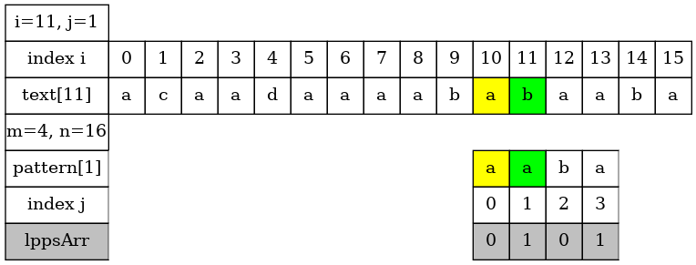 |

| | 
|:-------------:|
|  |

| | 
|:-------------:|
| 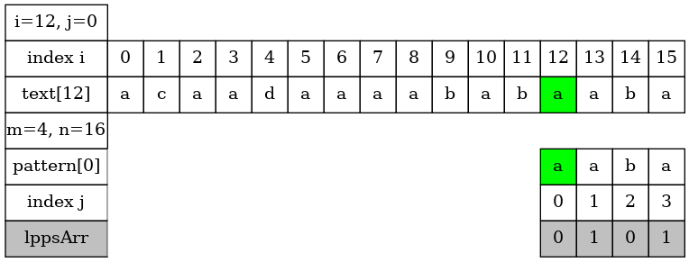 |

| | 
|:-------------:|
| 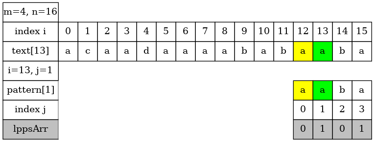 |

| | 
|:-------------:|
| 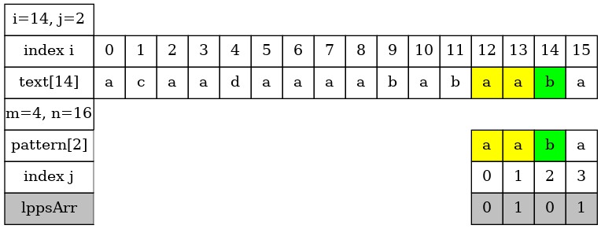 |


| | 
|:-------------:|
| 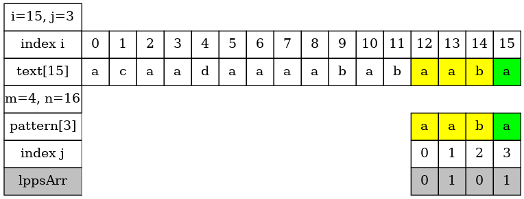 |


| | 
|:-------------:|
| 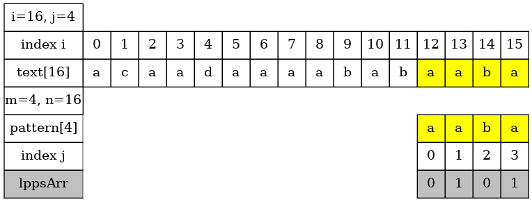 |


    

### Example 2: KMPSearch("aaa", "aaaabaaaa")

| | 
|:-------------:|
| 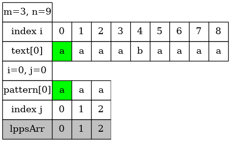 |

| | 
|:-------------:|
| 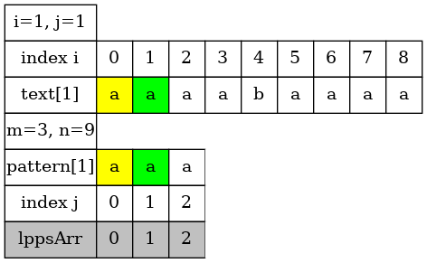 |

| | 
|:-------------:|
| 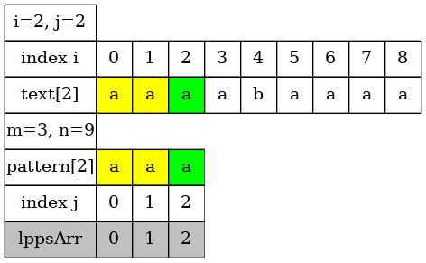 |


| | 
|:-------------:|
| 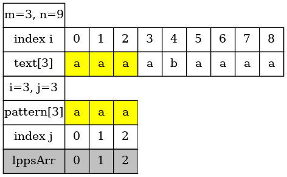 |


| | 
|:-------------:|
| 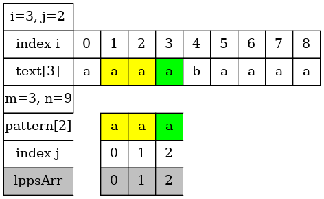 |


| | 
|:-------------:|
| 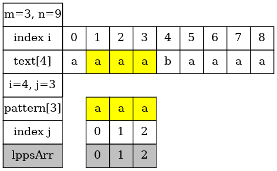 |


| | 
|:-------------:|
|  |

| | 
|:-------------:|
| 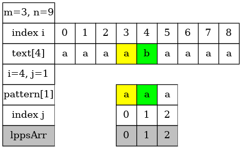 |

| | 
|:-------------:|
| 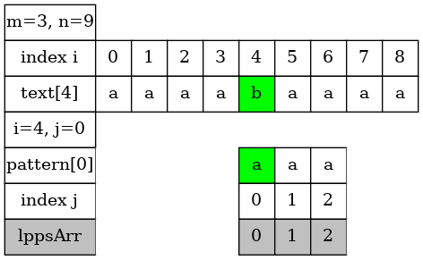 |

| | 
|:-------------:|
|  |

| | 
|:-------------:|
| 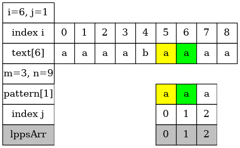 |

| | 
|:-------------:|
| 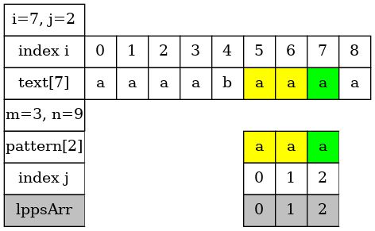 |

| | 
|:-------------:|
| 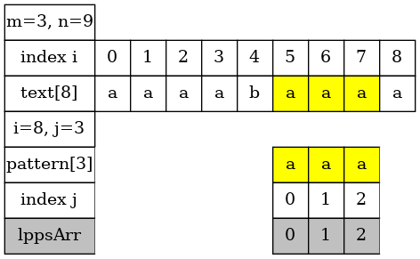 |


| | 
|:-------------:|
| 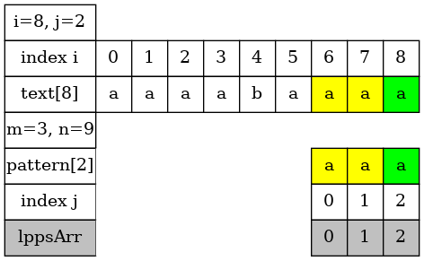 |


| | 
|:-------------:|
| 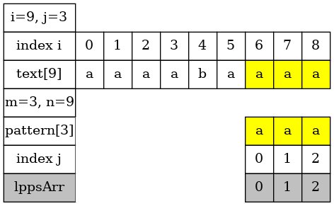 |

### Example 3: KMPSearch("aabaabaab", "aaaabaaaabaabaabaa")

| | 
|:-------------:|
| 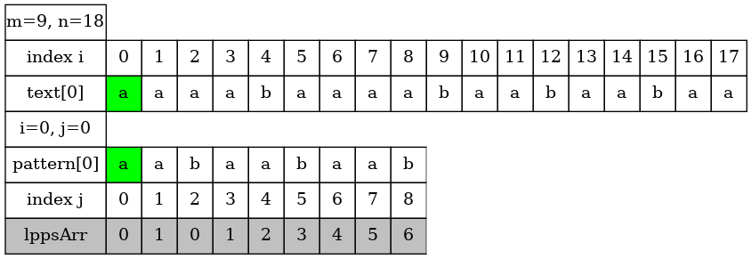 |

| | 
|:-------------:|
| 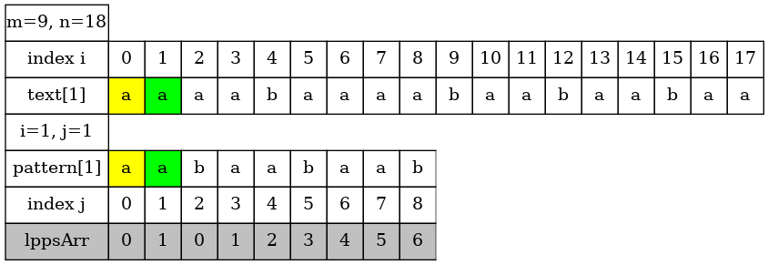 |

| | 
|:-------------:|
| 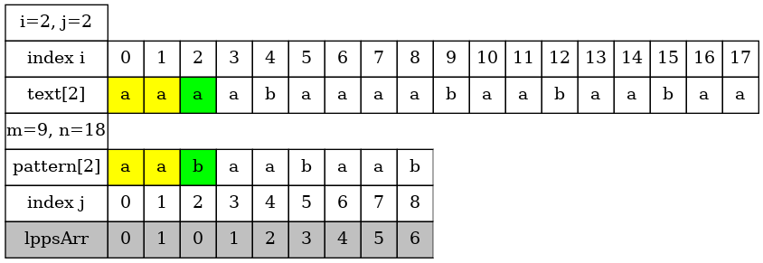 |


| | 
|:-------------:|
| 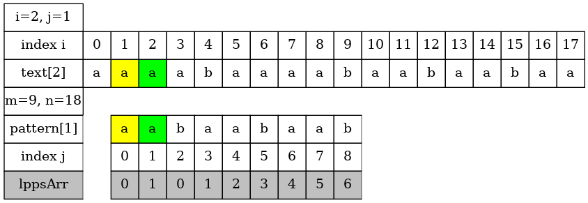 |


| | 
|:-------------:|
| 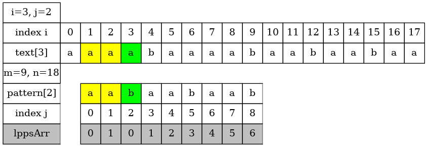 |

| | 
|:-------------:|
| 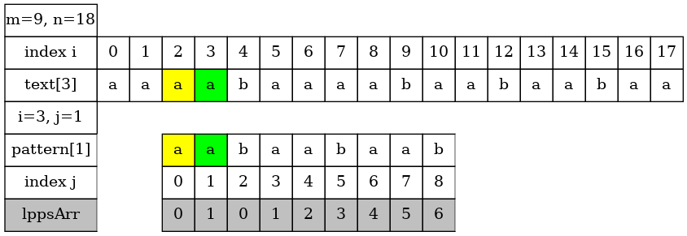 |

| | 
|:-------------:|
| 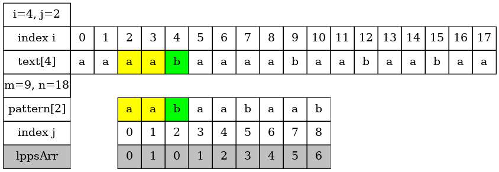 |

| | 
|:-------------:|
| 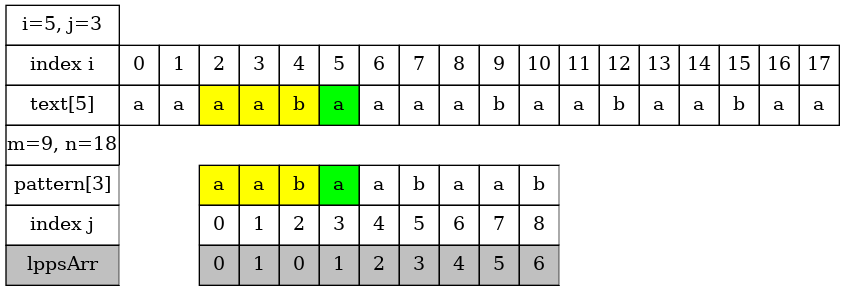 |


| | 
|:-------------:|
| 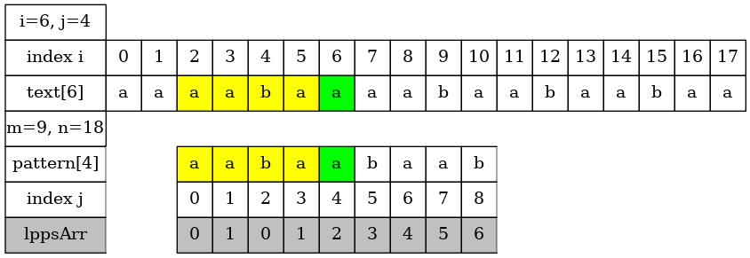 |

| | 
|:-------------:|
| 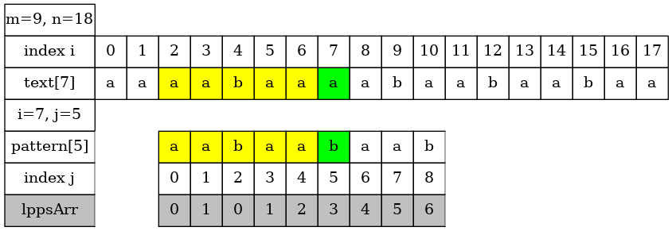 |

| | 
|:-------------:|
| 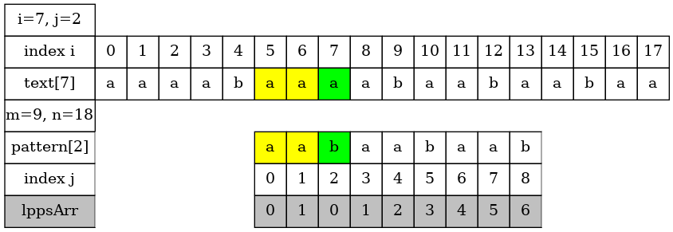 |

| | 
|:-------------:|
| 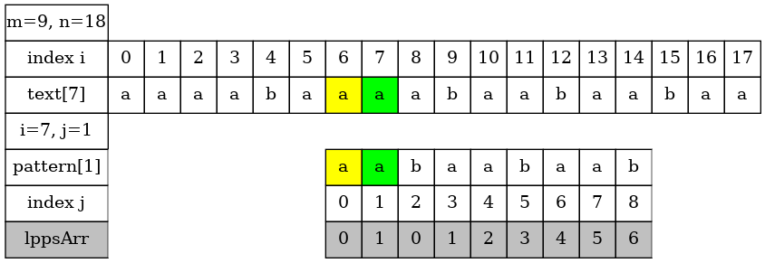 |

| | 
|:-------------:|
| 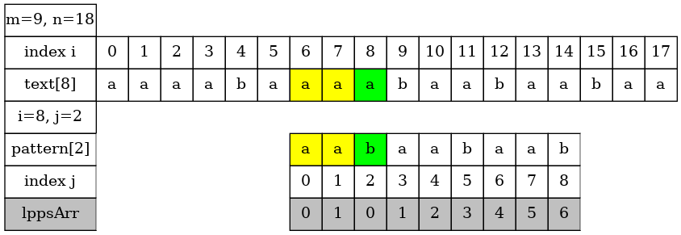 |


| | 
|:-------------:|
| 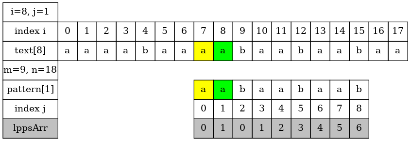 |


| | 
|:-------------:|
| 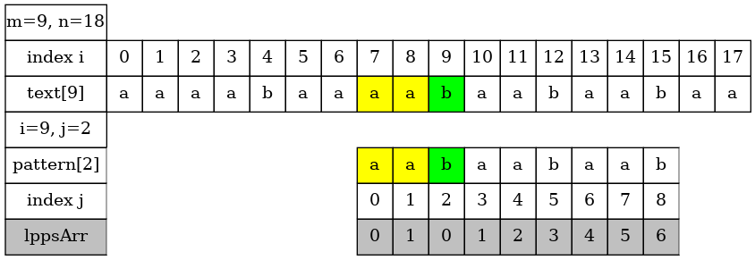 |

| | 
|:-------------:|
| 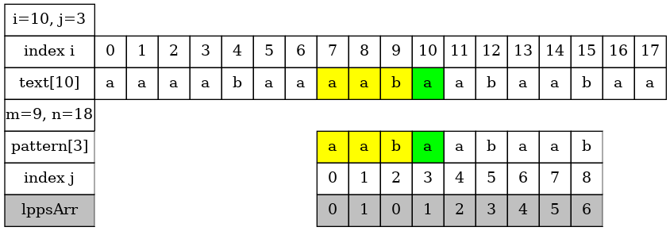 |

| | 
|:-------------:|
| 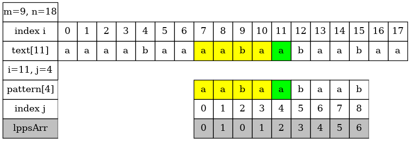 |

| | 
|:-------------:|
| 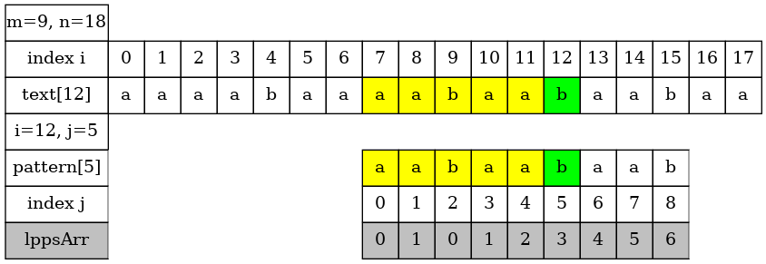 |


| | 
|:-------------:|
| 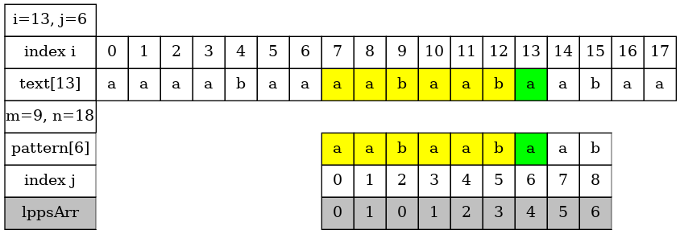 |

| | 
|:-------------:|
| 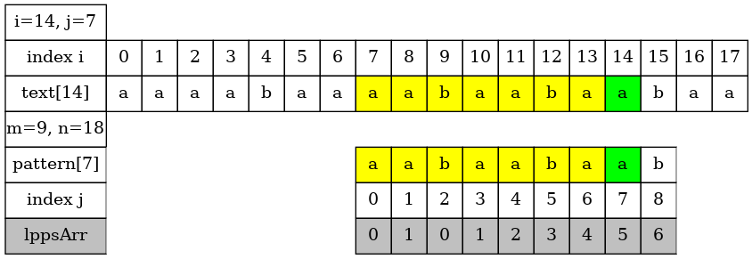 |

| | 
|:-------------:|
| 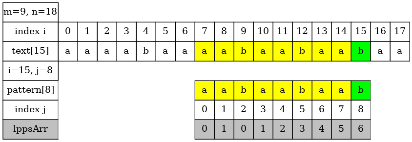 |

| | 
|:-------------:|
|  |

| | 
|:-------------:|
|  |


| | 
|:-------------:|
| 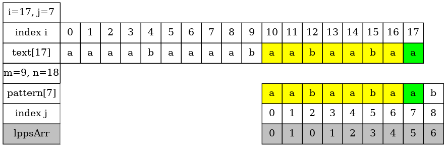 |

### Example 4: KMPSearch("caba", "ddcabacc")

| | 
|:-------------:|
| 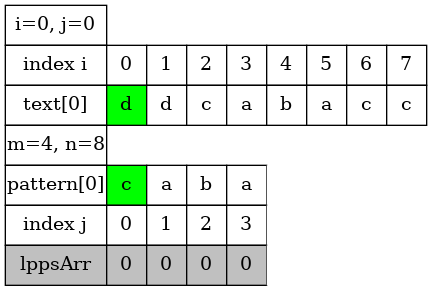 |

| | 
|:-------------:|
| 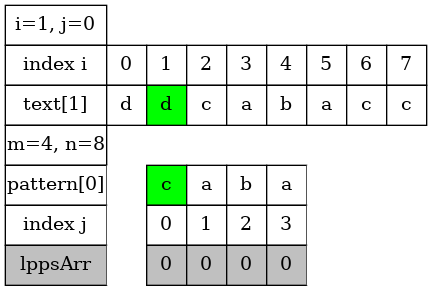 |

| | 
|:-------------:|
|  |

| | 
|:-------------:|
| 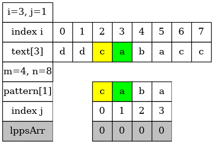 |


| | 
|:-------------:|
| 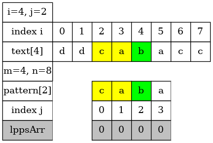 |

| | 
|:-------------:|
| 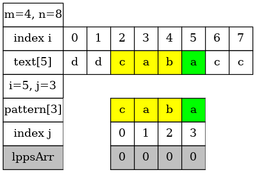 |

| | 
|:-------------:|
| 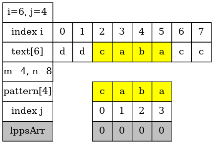 |

| | 
|:-------------:|
| 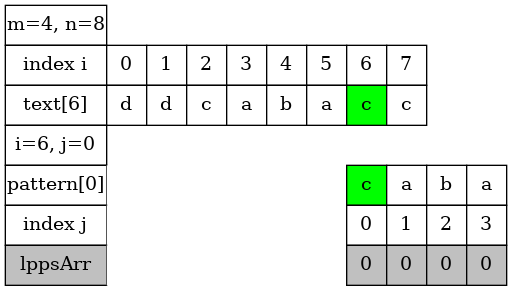 |

| | 
|:-------------:|
|  |


| | 
|:-------------:|
| 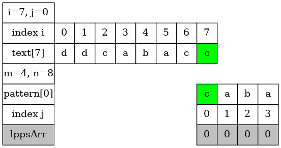 |

