# KMP

KMP stands for Knuth-Morris-Pratt, which is an efficient algorithm used for string matching or substring searching. 

LPPS: The longest proper prefix (also a suffix). 

```sh
String: "ababab"
LPPS: "abab"
Explanation:  The longest proper prefix ("abab") is also a suffix.
              "ab" is another proper prefix (also a suffix) of "ababab", but not the longest.
```


It uses preprocessing to build an auxiliary array called the longest proper prefix (also a suffix) array, lppsArr[]. 

This array helps in skipping unnecessary comparisons when a mismatch occurs.

### When a mismatch occurs (text[i] != pattern[j])

```sh

(1) j == 0

text
                                    i
            .   .   .   .   .   .   y   .   .   

pattern
                                    x   .   .

                                    j

Shift:
        i++;
```

```sh
(2) j > 0            


text
                        i-j         i
            .   .   .   .   .   .   y   .   .   

pattern
                        .   .   .   x   .   .

                        0           j


We want to reuse the information (i.e., text[i-j .. i-1] == pattern[0 .. j-1])

Shift:
        j = lppsArr[j-1],  
        where lppsArr[j-1] is the length of the longest proper 
        prefix (also a suffix) of pattern[0 .. j-1].
```

<!--
**The key point of KMP is how to generate the array lppsArr[].**


### The naive method for constructing the LPPS array lppsArr

LPPS: the Longest Proper Prefix (also a Suffix)

```C

/*
    Test whether pattern[0..j] is a LPPS of pattern[0..i].    
 */
static int IsLPPS(char *pattern, long i, long j) {
    assert(i > j);
    for (long k = j; k >= 0; k--, i--) {
        if (pattern[i] != pattern[k]) {
            return 0;
        }
    }
    return 1;
}

/*
    LPPS: the Longest Proper Prefix (also a Suffix).

    lppsArr[i] is the length of the longest proper prefix of pattern[0..i]
    which is also a suffix of pattern[0..i].
 */
void GetLengthOfLPPSV2(char *pattern, long *lppsArr, long m) {
    lppsArr[0] = 0;
    
    for (long i = 1; i < m; i++) {
        lppsArr[i] = 0;
        // Test each possible prefix.  
        for (long j = i - 1; j >= 0; j--) {
            if (IsLPPS(pattern, i, j)) {
                // j+1 is the length of patter[0..j]
                lppsArr[i] = j + 1;
                break;
            }
        } 
    }
}

```
-->

### The key point of KMP is how to generate the lppsArr[] array

- Scan the pattern from left to right.
- The base case is lppsArr[0] = 0, as the empty string "" (with a length of 0) is the LPPS of pattern[0 .. 0].
- The notation pattern[0 .. -1] is a special notation, representing ""

### The substring pattern[0 .. lppsArr[len - 1]] is the second longest prefix (also a suffix) of pattern[0 .. i-1], where lppsArr[i-1] == len && i >= 1 && len > 0

For an index k, where lppsArr[len - 1] < k < len-1, pattern[0 .. k] can't be a proper prefix (also a proper suffix) of pattern[0 .. i-1].

```sh
Proof by contradiction:

Suppose pattern[0 .. k] is a proper prefix (also a proper suffix) of pattern[0 .. i-1].

    pattern[0 .. k] == pattern[i-k-1 .. i-1]

then it is also a proper prefix (also a proper suffix) of pattern[0 .. len-1].

Note that pattern[0 .. len-1] is the LPPS of pattern[0 .. i-1]

    pattern[0 .. len-1] == pattern[i-len .. i-1]

Since k < len-1, we have

    i-len < i-k-1

So pattern[0 .. k] is also a proper prefix and a proper suffix of pattern[0 .. len-1].

But pattern[0 .. k] is longer than pattern[0 .. lppsArr[len - 1]].

This contradicts the definition of lppsArr[len - 1].
```

### GetLengthOfLPPS()

```C
/* 
    LPPS: the Longest Proper Prefix (also a Suffix).

    lppsArr[i] is the length of the longest proper prefix of pattern[0..i]
    which is also a suffix of pattern[0..i].
 */
void GetLengthOfLPPS(char *pattern, long *lppsArr, long m) {
    /*
        len stores the length of the longest proper prefix (also a suffix) 
        of the previous index (i - 1).
     */
    long len = 0;
    /*
        There is only one proper prefix (i.e., "") of the string pattern[0].
        "" is also a suffix of pattern[0].
        The length of "" is 0.
     */
    lppsArr[0] = 0;

    long i = 1;

    while (i < m) {
        /*
            We know lppsArr[i-1] == len.

            According the definition of LPPS, we have

                pattern[0 .. len-1] == pattern[i-len .. i-1]           
         */          
        if (pattern[i] == pattern[len]) {
            /*
                Now, we have

                    pattern[0 .. len] == pattern[i-len .. i]
             */
            len++;
            lppsArr[i] = len;
            i++;
        } else {
            // If there is a mismatch
            if (len > 0) {
                /*
                    Try the second longest proper prefix (also a suffix) of pattern[0 .. i-1]    
                 */
                len = lppsArr[len - 1];
            } else {
                // no shorter one, only "" left
                lppsArr[i] = 0;
                i++;
            }
        }
    }  
}
```


### make view 

```sh
KMP$ make view

find ./images -name "*.png" | sort | xargs feh -g 1024x768  &
```


### Output
```sh
KMP$ make
KMP$ ./main

0 1 0 1 
aaba found at index 7 in acaadaaaababaaba 

```

### The process of KMP

```C
/* 
    Search the pattern in the text.

    It returns

    (1) the position of the pattern in the text if there is a match
    (2) -1 if there is no match
 */
long KMPSearch(char *pattern, char *text);
 
```
#### When a mismatch occurs (text[i] != pattern[j])

```
    if j == 0
        i++
    else
        j = lpps[j-1]
```


|  | 
|:-------------:|
|  |

|  | 
|:-------------:|
| 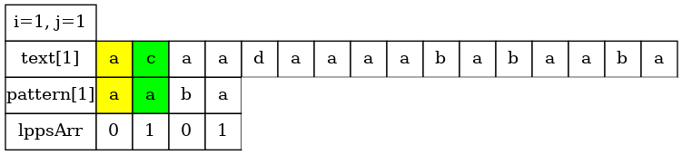 |

|  | 
|:-------------:|
| 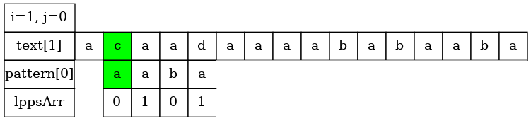 |

|  | 
|:-------------:|
| 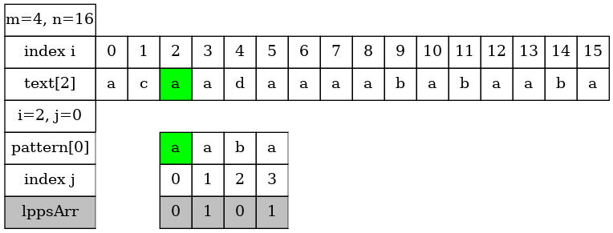 |

| | 
|:-------------:|
| 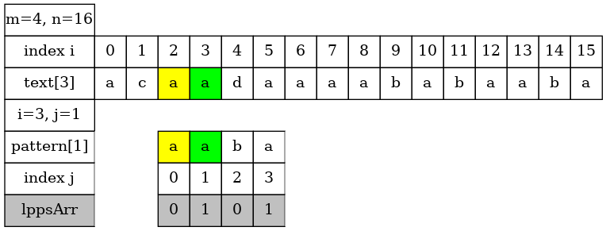 |

|  | 
|:-------------:|
| 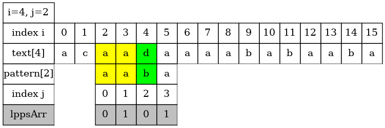 |

|  | 
|:-------------:|
|  |


|  | 
|:-------------:|
| 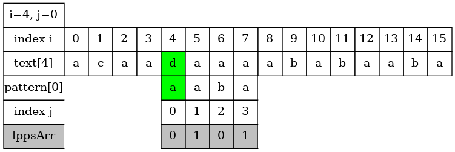 |


|  | 
|:-------------:|
| 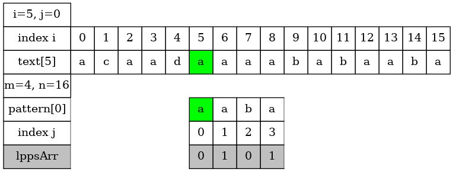 |

| | 
|:-------------:|
|  |

|  | 
|:-------------:|
| 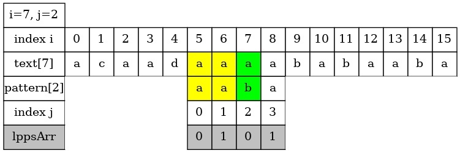 |


|  | 
|:-------------:|
| 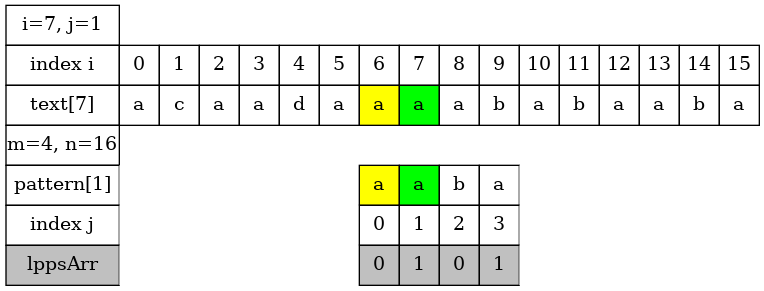 |


|  | 
|:-------------:|
| 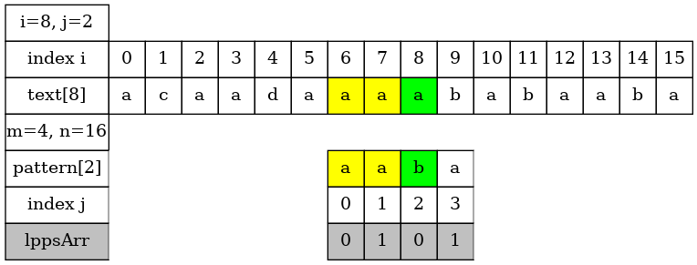 |


|  | 
|:-------------:|
| 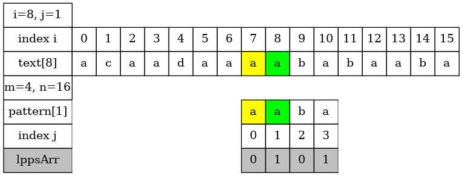 |

|  | 
|:-------------:|
| 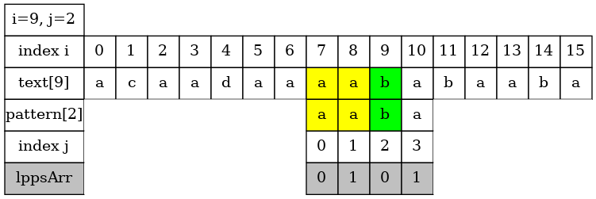 |


|  | 
|:-------------:|
| 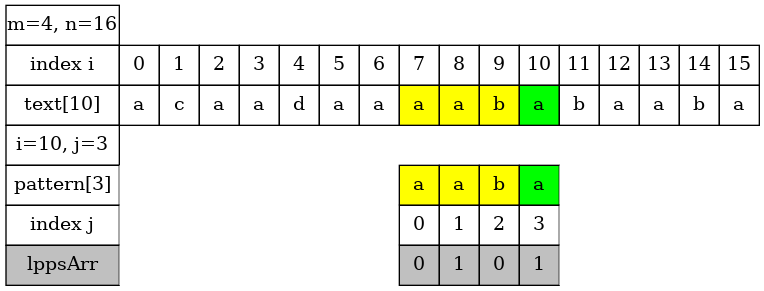 |


| | 
|:-------------:|
| 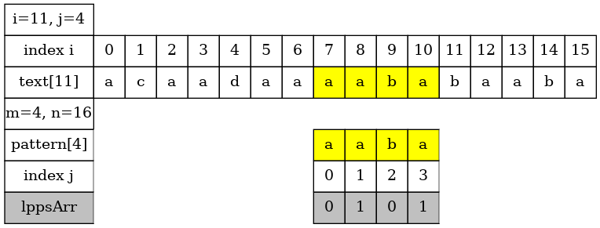 |

