# Trie

``` sh
/*******************************************************************
                            Trie

    1.  The data structure used for storing and retrieving strings

    2.  How to insert a key-value pair into a Trie

    3.  How to search for a key in a Trie

    4.  How to find the longest prefix match in a Trie


                                             COMP9024 24T2

 *******************************************************************/
``` 
A Trie, also known as a prefix tree, is a specialized tree-based data structure used for efficiently storing and retrieving strings in a way that supports prefix matching.

The term "Trie" (pronounced "try") is derived from the word "retrieval," which underscores the structure's suitability for efficient retrieval operations, particularly for words or strings based on prefixes.

The root of the Trie usually represents an empty string or null prefix.

Each node in a Trie typically consists of a set of child pointers (usually implemented as an array, representing possible next characters), and a flag indicating whether the node marks the end of a valid word.

Tries are commonly used in spell checkers and dictionary implementations. 

They are also highly effective for finding the longest prefix match in IP address lookup.

```C
static char *words[] = { "ear", "apply", "ape", "apes", "earth",
                         "east", "app",  "ace", "early", "earl",
                         "aces" };
```

| Trie |
|:-------------:|
|  |


## 1 How to download this project in [CSE VLAB](https://vlabgateway.cse.unsw.edu.au/)

Open a terminal (Applications -> Terminal Emulator)

```sh

$ git clone https://github.com/sheisc/COMP9024.git

$ cd COMP9024/Strings/Trie

Trie$ 

```


## 2 How to start [Visual Studio Code](https://code.visualstudio.com/) to browse/edit/debug a project.


```sh

Trie$ code

```

Two configuration files (Trie/.vscode/[launch.json](https://code.visualstudio.com/docs/cpp/launch-json-reference) and Trie/.vscode/[tasks.json](https://code.visualstudio.com/docs/editor/tasks)) have been preset.


#### 2.1 Open the project in VS Code

In the window of Visual Studio Code, please click "File" and "Open Folder",

select the folder "COMP9024/Strings/Trie", then click the "Open" button.


#### 2.2 Build the project in VS Code

click **Terminal -> Run Build Task**


#### 2.3 Debug the project in VS Code

Open src/main.c, and click to add a breakpoint (say, line 35).

Then, click **Run -> Start Debugging**

### 2.4 Directory

```sh
├── Makefile             defining set of tasks to be executed (the input file of the 'make' command)
|
├── README.md            introduction to this project
|
├── src                  containing *.c and *.h
|   |
|   |
│   ├── Trie.c           The data structure used for storing and retrieving strings
│   ├── Trie.h
|   |
│   ├── Queue.c          used in a breadth-first tree traversal when generating *.dot files
│   ├── Queue.h
|   |
│   └── main.c           main()
|
|── images               containing *.dot and *.png files
|
|── diagrams             containing *.png files
|
└── .vscode              containing configuration files for Visual Studio Code
    |
    ├── launch.json      specifying which program to debug and with which debugger,
    |                    used when you click "Run -> Start Debugging"
    |
    └── tasks.json       specifying which task to run (e.g., 'make' or 'make clean')
                         used when you click "Terminal -> Run Build Task" or "Terminal -> Run Task"
```

Makefile is discussed in [COMP9024/C/HowToMake](../../C/HowToMake/README.md).

## 3 The main procedure

### 3.1 make and ./main

**In addition to utilizing VS Code, we can also compile and execute programs directly from the command line interface as follows.**

``` sh

Trie$ make

Trie$ ./main

Our dictionary contains the following items:

ear
	the sense organ for hearing
apply
	put into service
ape
	a large primate that lacks a tail
apes
	the plural noun of the word ape
earth
	the planet on which we live
east
	the eastern part of the world
app
	an application, especially as downloaded by a user to a mobile device
ace
	a playing card with a single spot on it
early
	happening or done before the usual or expected time
earl
	a British nobleman
aces
	the plural noun of the word ace

Our dictionary does not contain the word "nullpointer"


10000011 ---> Block
00111111 ---> Forward
11110100 ---> Block and alarm
11111000 ---> Block and alarm
00011111 ---> Forward and alarm

```

### 3.2 make view

**Ensure that you have executed 'make' and './main' before 'make view'.**


```sh
Trie$ make view
```

**Click on the window of 'feh' or use your mouse scroll wheel to view images**.

Here, **feh** is an image viewer available in [CSE VLAB](https://vlabgateway.cse.unsw.edu.au/).


#### 3.2.1 TrieInsert()

| Insert "ear" | 
|:-------------:|
| 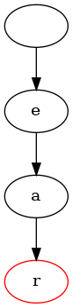 |

| Insert "apply" |
|:-------------:|
| 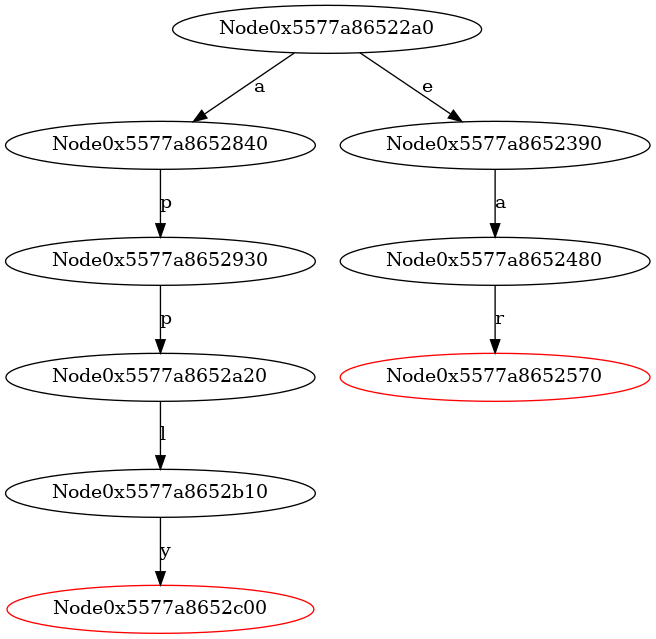 |

| Insert "ape" |
|:-------------:|
| 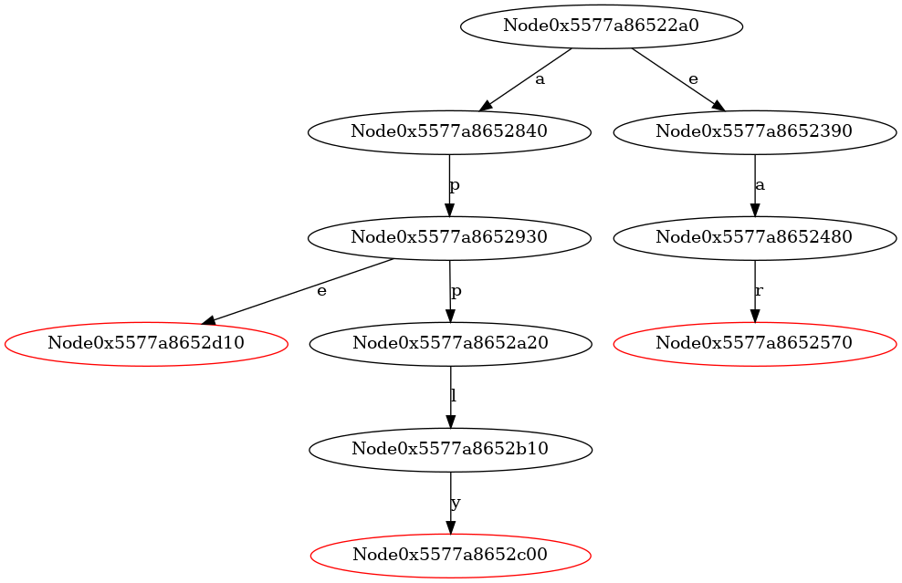  |

| Insert "apes" |
|:-------------:|
| 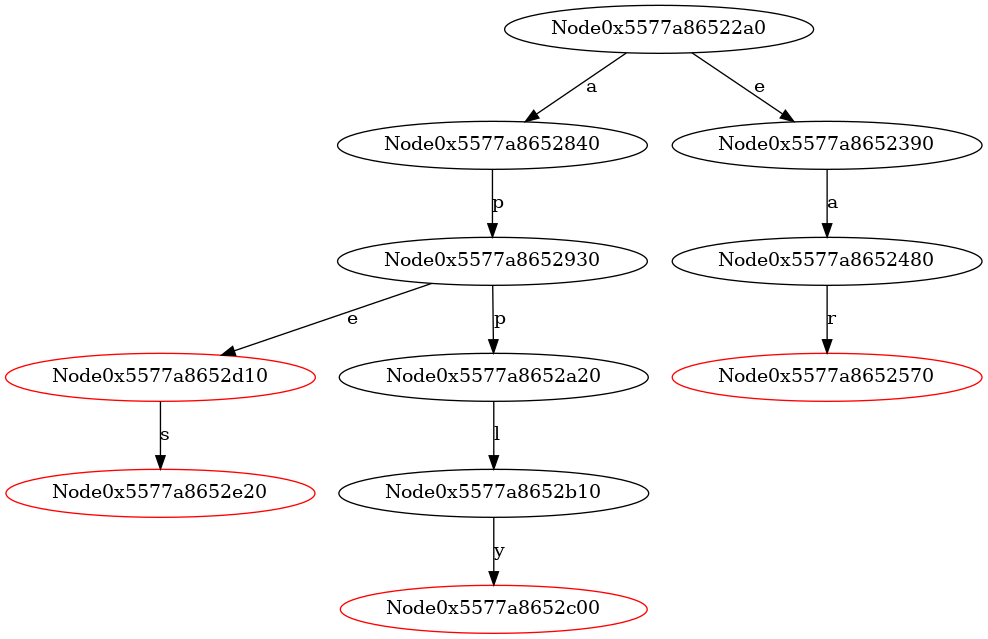 |

| Insert "earth"|
|:-------------:|
| 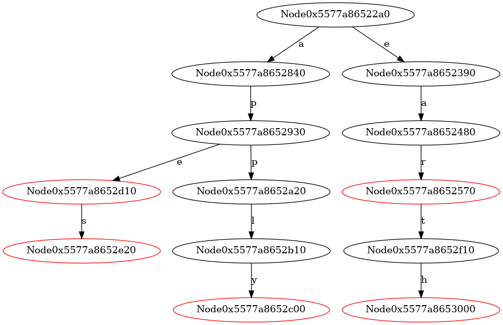 |

| Insert "east" |
|:-------------:|
| 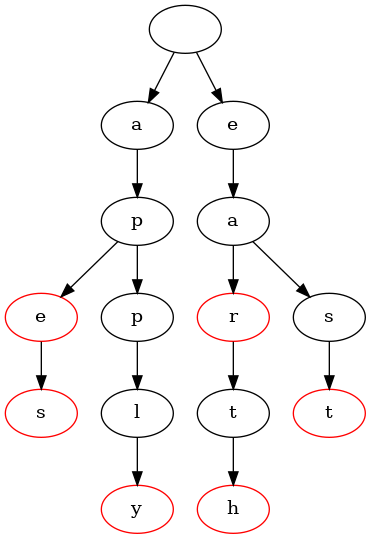 |

| Insert "app" |
|:-------------:|
| 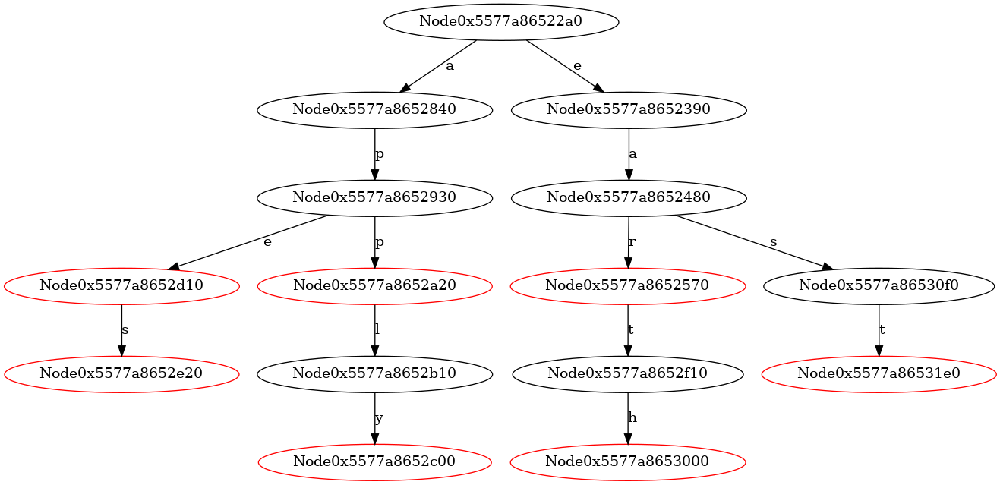 |

| Insert "ace" | 
|:-------------:|
|  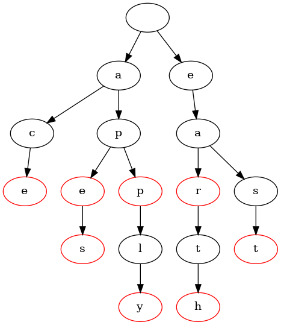 |

| Insert "early" | 
|:-------------:|
| 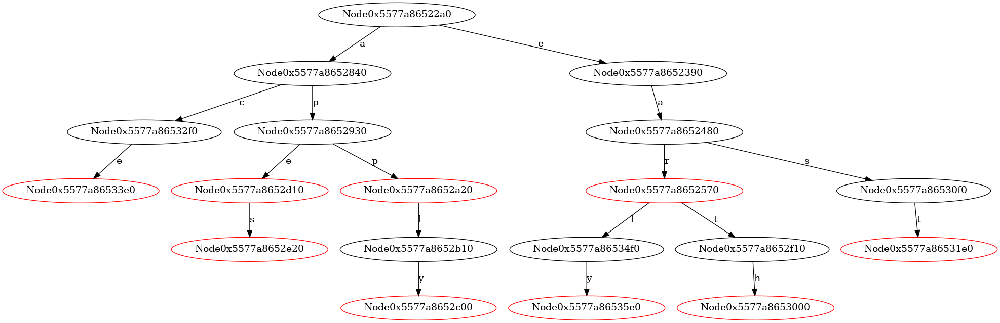 |

| Insert "earl" |
|:-------------:|
| 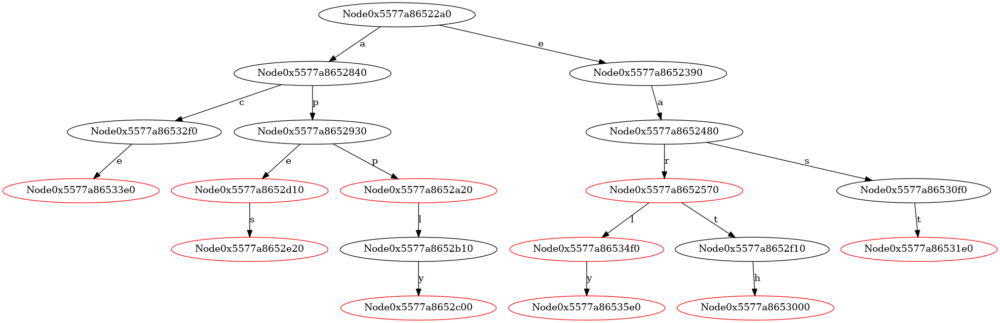 |

| Insert "aces" |
|:-------------:|
| 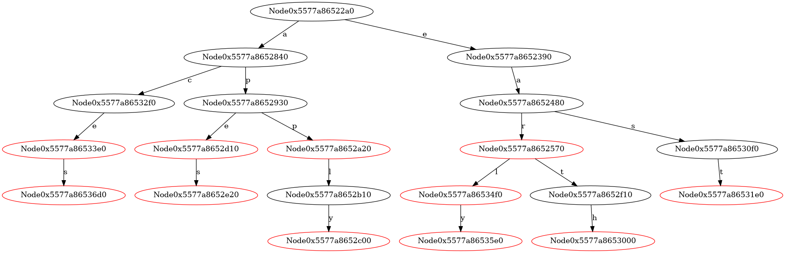 |


#### 3.2.2 IP Address Lookup Using a Trie

| Insert "1"|
|:-------------:|
| 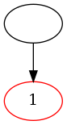 |

| Insert "0" |
|:-------------:|
| 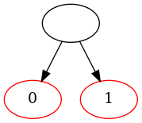 |

| Insert "1111" |
|:-------------:|
| 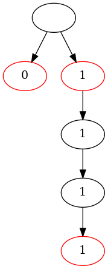 |

| Insert "000" |
|:-------------:|
| 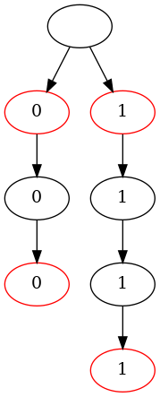 |


**The output of TestLongestPrefixMatch()**
```
10000011 ---> Block
00111111 ---> Forward
11110100 ---> Block and alarm
11111000 ---> Block and alarm
00011111 ---> Forward and alarm

```

```sh

    To be simple, only 8 bits are used here, rather than 32 bits in IPv4
    (e.g., '192.168.0.1' in binary is 11000000.10101000.00000000.00000001)

    ------------------------------------------------------
        IP Address (binary)        Action
    ------------------------------------------------------
        1xxxxxxx                   Block
        0xxxxxxx                   Forward
        1111xxxx                   Block and alarm
        000xxxxx                   Forward and alarm
    ------------------------------------------------------
```


## 4 Data structures

```C

// from '0' to 'z'
// (from 48  to  122)
#define ALPHABET_SIZE 75
#define FIRST_CHAR '0'

typedef char *ValueType;

struct TrieNode;
typedef struct TrieNode *Trie;

struct TrieNode {
    // Test whether it represents the last char in a key? 
    int wordEnd;
    // value for a key when wordEnd == 1  
    ValueType value;
    // from '0' to 'z' in ASCII table        
    Trie kids[ALPHABET_SIZE];
};

```


## 5 Algorithms

### 5.1 main()

```C
#include <stdio.h>
#include <stdlib.h>
#include "Trie.h"

static long imgCount = 1;

static char *words[] = { "ear", "apply", "ape", "apes", "earth", 
                         "east", "app",  "ace", "early", "earl", 
                         "aces" };                     

// The meaning of each word
static char *meanings[] = { 
    "the sense organ for hearing", 
    "put into service", 
    "a large primate that lacks a tail", 
    "the plural noun of the word ape", 
    "the planet on which we live", 

    "the eastern part of the world",
    "an application, especially as downloaded by a user to a mobile device", 
    "a playing card with a single spot on it", 
    "happening or done before the usual or expected time", 
    "a British nobleman", 

    "the plural noun of the word ace"
};

void TestDictionary(void) {
    Trie t = CreateTrie();

    int n = sizeof(words)/sizeof(words[0]);   
    for (int i = 0; i < n; i++) {
        t = TrieInsert(t, words[i], meanings[i]);
        GenOneImage(t, "TrieInsert", "images/TrieInsert", imgCount);
        imgCount++;
    }
    
    printf("Our dictionary contains the following items:\n\n");
    ValueType value = NULL;
    for (int i = 0; i < n; i++) {
        if (SearchKey(t, words[i], &value)) {
            printf("%s\n\t%s\n", words[i], value);
        }
    }   
    printf("\n");

    char *newWord = "nullpointer";
    if (SearchKey(t, newWord, &value) == 0) {
        printf("Our dictionary does not contain the word \"%s\"\n\n", newWord);
    } else {
        printf("%s\n\t%s\n", newWord, value);
    }     
    ReleaseTrie(t);
}

/*
    IP Address Lookup Using Trie

    To be simple, only 8 bits are used here, rather than 32 bits in IPv4
    (e.g., '192.168.0.1' in binary is 11000000.10101000.00000000.00000001)
    
    ------------------------------------------------------
        IP Address (binary)        Action
    ------------------------------------------------------
        1xxxxxxx                   Block
        0xxxxxxx                   Forward
        1111xxxx                   Block and alarm
        000xxxxx                   Forward and alarm
    ------------------------------------------------------
 */

static char *ipPrefix[] = { "1", "0", "1111", "000"}; 

static char *actions[] = {"Block", "Forward", "Block and alarm", "Forward and alarm"};

void TestLongestPrefixMatch(void) {
    Trie t = CreateTrie();
    int n = sizeof(ipPrefix)/sizeof(ipPrefix[0]);   
    for (int i = 0; i < n; i++) {
        t = TrieInsert(t, ipPrefix[i], actions[i]);
        GenOneImage(t, "TrieInsert", "images/TrieInsert", imgCount);
        imgCount++;
    }
    // To be simple, only 8 bits are used here, rather than 32 bits in IPv4
    char *ipAddrs[] = {"10000011", "00111111", "11110100", "11111000", "00011111"};
    ValueType value = NULL;
    for (int i = 0; i < sizeof(ipAddrs)/sizeof(ipAddrs[0]); i++) {
        if (LongestPrefixMatch(t, ipAddrs[i], &value)) {
            printf("%s ---> %s\n", ipAddrs[i], value);
        } else {
            printf("%s ---> NO Action Specified\n", ipAddrs[i]);
        }
    }  
    ReleaseTrie(t);
}


int main(void) {    
    // create a sub-directory 'images' (if it is not present) in the current directory
    system("mkdir -p images");
    // remove the *.dot and *.png files in the directory 'images'
    system("rm -f images/*.dot images/*.png");

    TestDictionary();
    TestLongestPrefixMatch();
    return 0;
}

```

### 5.2 TrieInsert()

```C
/*
    Create a Trie node
 */
static Trie CreateTrieNode(void) {
    Trie pNode = malloc(sizeof(struct TrieNode));
    assert(pNode != NULL);
    pNode->wordEnd = 0;
    pNode->value = NULL;   
    for (int i = 0; i < ALPHABET_SIZE; i++) {
        pNode->kids[i] = NULL;
    }
    return pNode;
}


Trie CreateTrie() {
    // Create a trie node, representing the special string prefix "", an empty string
    return CreateTrieNode();
}

void ReleaseTrie(Trie t) {
    if (t != NULL) {
        for (int i = 0; i < ALPHABET_SIZE; i++) {
            ReleaseTrie(t->kids[i]);
        }
        if (t->value) {
            ReleaseValue(t->value);
        }
        free(t);
    }
}

/*
    Insert 
 */
Trie TrieInsert(Trie t, char *key, ValueType value) {
    assert(t);
    Trie curNode = t;
    char *ptr = key;
    /*
        ptr ---> "ear" 

        "ear" can be seen as:

                "" + "a" + "b" + "c"

        We use four nodes to represent "ear" in a Trie.
     */
    while (1) {
        if(*ptr) {
            int i = *ptr - FIRST_CHAR;
            assert((i >= 0) && (i < ALPHABET_SIZE));
            if (curNode->kids[i] == NULL) {
                curNode->kids[i] = CreateTrieNode();
            }
            curNode = curNode->kids[i];
            ptr++;
        } else { // the end of the C string            
            curNode->wordEnd = 1;
            curNode->value = CopyValue(value);
            break;
        }       
    }
    return t;
}

```

### 5.3 SearchKey()

```C
/*
   SearchKey() returns 1 when it finds the key in the Trie.
           It will also stores the value in *pVal.
           
   SearchKey() returns 0 when the key doesn't exist.           
 */
int SearchKey(Trie t, char *key, ValueType *pVal) {
    // if (t == NULL) {
    //     return 0;
    // }

    assert(t);
    Trie curNode = t;
    char *ptr = key;
    //
    while (*ptr) {
        int i = *ptr - FIRST_CHAR;
        assert((i >= 0) && (i < ALPHABET_SIZE));
        if (curNode->kids[i] == NULL) {
            return 0;
        }
        curNode = curNode->kids[i];
        ptr++;
    }
    //
    if (curNode->wordEnd) {
        if (pVal) {
            *pVal = curNode->value;
        }
        return 1;
    } else {
        return 0;
    }
}
```

### 5.4 LongestPrefixMatch()

```C

/*
   LongestPrefixMatch() returns 1 when it finds the longest prefix match in the Trie.
           It will also stores the value in *pVal.
           
   LongestPrefixMatch() returns 0 when the key doesn't exist.           
 */
int LongestPrefixMatch(Trie t, char *key, ValueType *pVal) {
    assert(t);
    Trie curNode = t;
    char *ptr = key;

    ValueType valueFound = NULL;
    if (t->wordEnd) {
        valueFound = t->value;
    }
    // Try to find the longest prefix match
    while (*ptr) {
        int i = *ptr - FIRST_CHAR;
        assert((i >= 0) && (i < ALPHABET_SIZE));
        // 
        if (curNode->kids[i] == NULL) {
            break;
        } else if (curNode->kids[i]->wordEnd) {
            valueFound = curNode->kids[i]->value;            
        }        
        curNode = curNode->kids[i];
        ptr++;
    }
    //
    if (valueFound) {
        if (pVal) {
            *pVal = valueFound;
        }
        return 1;
    } else {
        return 0;
    }
}
```

### 5.5 Trie2Dot()

```C
/*
    digraph TrieInsert {
    "0x587a961a42a0" -> {"0x587a961a4390"} [label="e"]
    "0x587a961a4390" -> {"0x587a961a4480"} [label="a"]
    "0x587a961a4480" -> {"0x587a961a4570"} [label="r"]
    "0x587a961a4570" [color=red]
    }
 */
void Trie2Dot(Trie root, char *filePath, char *graphName) {

    FILE *dotFile = fopen(filePath, "w");
    /*
        FIXME:  check sanity of the parameters.
     */
    if (dotFile) {
        char *edgeConnectorStr = "->";
        fprintf(dotFile, "digraph %s {\n", graphName);
        
        struct Queue *pQueue = CreateQueue();
        if (root) {
            QueueEnqueue(pQueue, root);
            while (!QueueIsEmpty(pQueue)) {
                Trie curNode = QueueDequeue(pQueue);
                // output current node
                if (curNode->wordEnd) {
                    fprintf(dotFile, 
                            "\"%p\" [color=red]\n",
                            curNode);
                }
                // output the directed edge
                for (int i = 0; i < ALPHABET_SIZE; i++) {
                    if (curNode->kids[i]) {
                        fprintf(dotFile, "\"%p\" %s {\"%p\"} [label=\"%c\"]\n",
                                curNode,
                                edgeConnectorStr,                         
                                curNode->kids[i],
                                FIRST_CHAR + i);
                        QueueEnqueue(pQueue, curNode->kids[i]);                        
                    }
                }                
            }
        }
        ReleaseQueue(pQueue);     
        fprintf(dotFile, "}\n");
        fclose(dotFile);
    }                
}

#define FILE_NAME_LEN  255

void GenOneImage(Trie root, char *graphName, char *fileName, long seqNo) {
    char dotFileName[FILE_NAME_LEN+1] = {0};
    char pngFileName[FILE_NAME_LEN+1] = {0};
    char command[(FILE_NAME_LEN+1)*4] = {0};
    
    snprintf(dotFileName, FILE_NAME_LEN, "%s_%04ld.dot", fileName, seqNo);
    snprintf(pngFileName, FILE_NAME_LEN, "%s_%04ld.png", fileName, seqNo);

    Trie2Dot(root, dotFileName, graphName);

    snprintf(command, FILE_NAME_LEN*4, "dot -T png %s -o %s", dotFileName, pngFileName);

    //printf("%s\n", command);
    
    // Execute the command in a child process (fork() + exec() on Linux)
    system(command);
}

```