# Ast2Dot

``` sh
/*******************************************************************
                Ast2Dot

    1.  How to define the data structure of a binary tree in C

    2.  How to visualize Abstract Syntax Tree operations

                                             COMP9024

 *******************************************************************/
``` 
This project is designed to visualize Abstract Syntax Tree operations.

More details will be discussed in [COMP9024/Graphs/Dot2Png](../../Graphs/Dot2Png/README.md).


## 1 How to download this project in [CSE VLAB](https://vlabgateway.cse.unsw.edu.au/)

Open a terminal (Applications -> Terminal Emulator)

```sh

$ git clone https://github.com/sheisc/COMP9024.git

$ cd COMP9024/Trees/Ast2Dot

Ast2Dot$ 

```


## 2 How to start [Visual Studio Code](https://code.visualstudio.com/) to browse/edit/debug a project.


```sh

Ast2Dot$ code

```

Two configuration files (Ast2Dot/.vscode/[launch.json](https://code.visualstudio.com/docs/cpp/launch-json-reference) and Ast2Dot/.vscode/[tasks.json](https://code.visualstudio.com/docs/editor/tasks)) have been preset.


### 2.1 Open the project in VS Code

In the window of Visual Studio Code, please click "File" and "Open Folder",

select the folder "COMP9024/Trees/Ast2Dot", then click the "Open" button.


### 2.2 Build the project in VS Code

click **Terminal -> Run Build Task**


### 2.3 Debug the project in VS Code

Open src/main.c, and click to add a breakpoint (say, line 67).

Then, click **Run -> Start Debugging**


### 2.4 Directory

```sh
├── Makefile             defining set of tasks to be executed (the input file of the 'make' command)
|
├── README.md            introduction to this tutorial
|
├── src                  containing *.c and *.h
|    |
|    ├── error.c         reporting an error
|    ├── error.h
|    ├── expr.c          create a tree by parsing an arithmetic expression (e.g., "9000 + (6 * 4)") and evaluate its value     
|    ├── expr.h
|    ├── lex.c           lexical analysis for recognizing a token (i.e., a word), such as 9000, +, (, ...
|    ├── lex.h      
|    ├── main.c          main()
|    └── tokens.txt      containing the token kinds and names
|
└── .vscode              containing configuration files for Visual Studio Code
    |
    ├── launch.json      specifying which program to debug and with which debugger,
    |                    used when you click "Run -> Start Debugging"
    |
    └── tasks.json       specifying which task to run (e.g., 'make' or 'make clean')
                         used when you click "Terminal -> Run Build Task" or "Terminal -> Run Task"
```
Makefile is discussed in [COMP9024/C/HowToMake](../../C/HowToMake/README.md).

## 3 How to visualize Abstract Syntax Tree operations

### 3.1 make && ./main

**In addition to utilizing VS Code, we can also compile and execute programs directly from the command line interface as follows.**

``` sh

Ast2Dot$ make

Ast2Dot$ ./main

```
### 3.2 make view

**Click on the window of 'feh' or use your mouse scroll wheel to view images**.

```sh
Ast2Dot$ make view
```

Here, **feh** is an image viewer available in [CSE VLAB](https://vlabgateway.cse.unsw.edu.au/).

**EvalExpression("3000 + (1000 + 2000) * 2 + 6 * 4")**

||
|:-------------:|
| 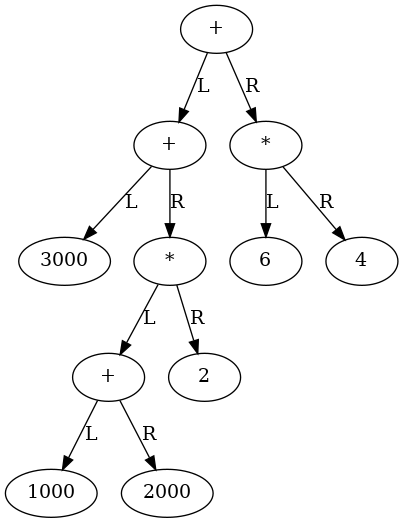 |

||
|:-------------:|
| 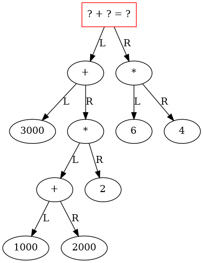 |

||
|:-------------:|
|  |

||
|:-------------:|
| 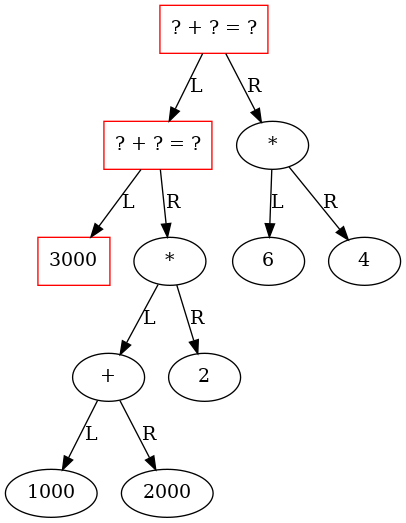 |

||
|:-------------:|
| 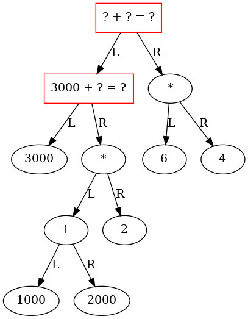 |

||
|:-------------:|
| 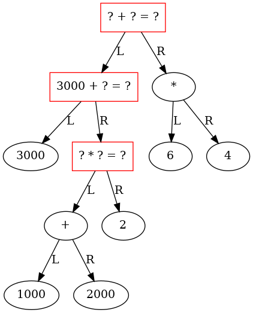 |

||
|:-------------:|
| 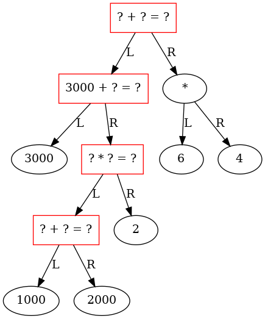 |

||
|:-------------:|
| 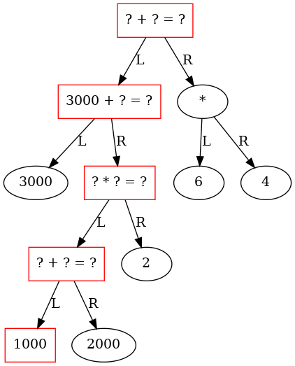 |

||
|:-------------:|
| 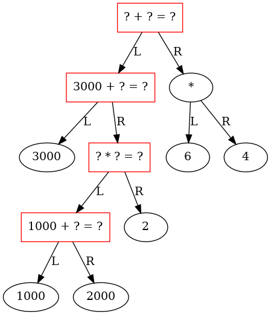 |

||
|:-------------:|
| 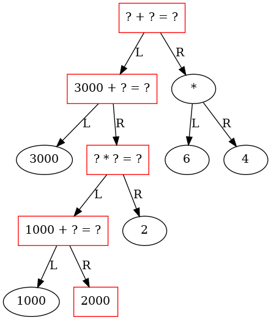 |

||
|:-------------:|
|  |

||
|:-------------:|
| 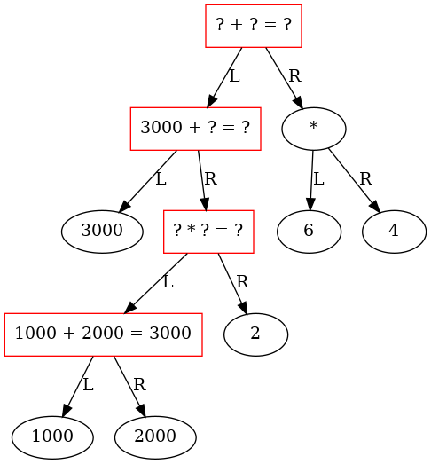 |

||
|:-------------:|
| 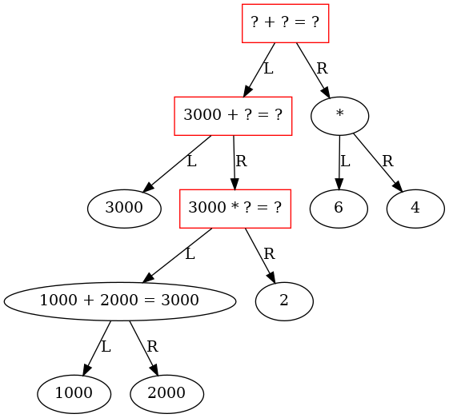 |

||
|:-------------:|
| 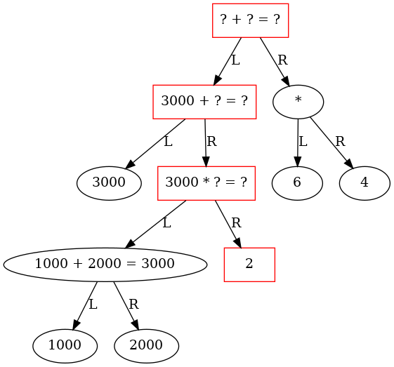 |


||
|:-------------:|
| 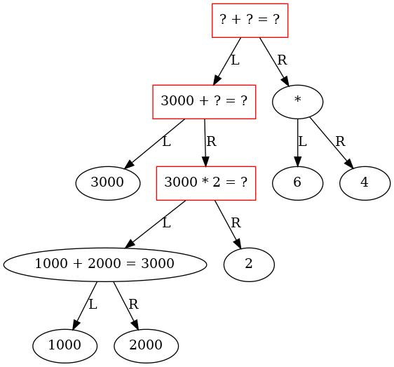 |

||
|:-------------:|
| 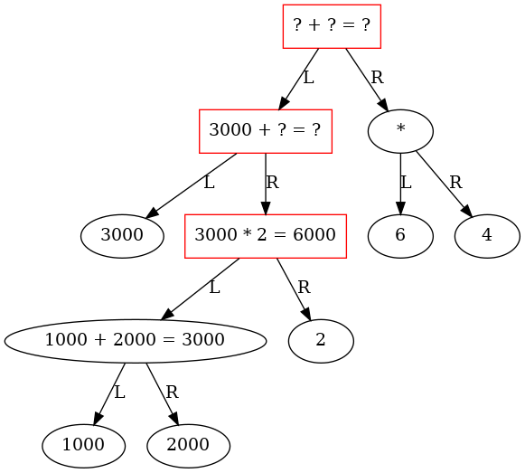 |


||
|:-------------:|
| 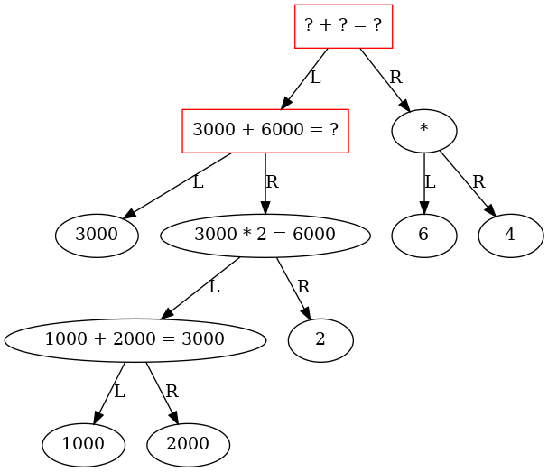 |

||
|:-------------:|
| 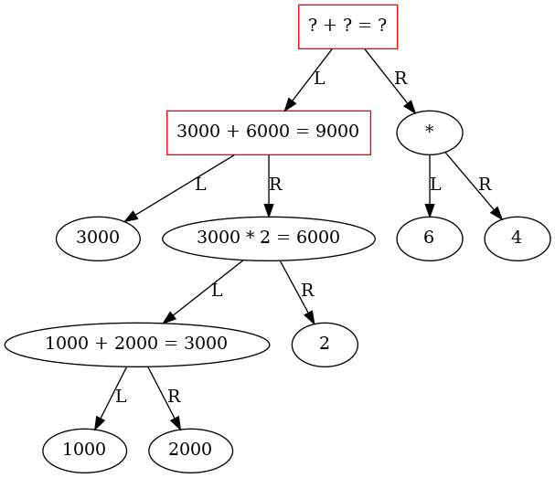 |

||
|:-------------:|
| 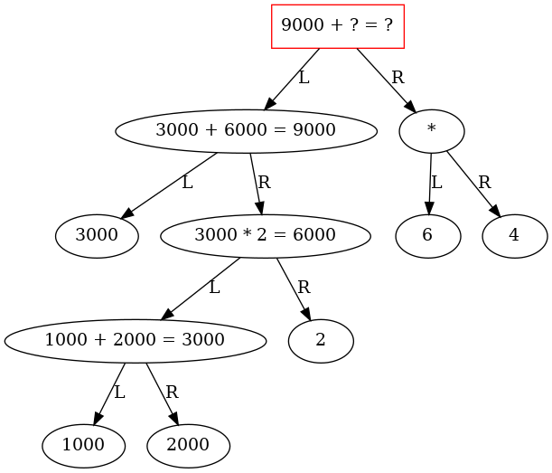 |

||
|:-------------:|
|  |


||
|:-------------:|
| 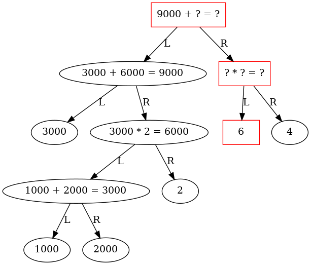 |

||
|:-------------:|
|  |

||
|:-------------:|
| 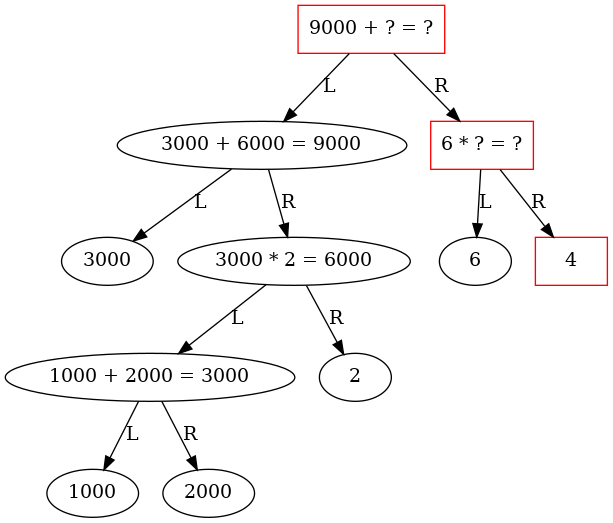 |

||
|:-------------:|
| 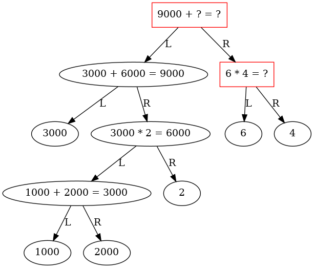 |

||
|:-------------:|
| 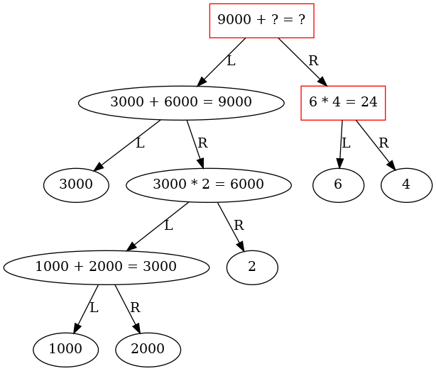 |

||
|:-------------:|
| 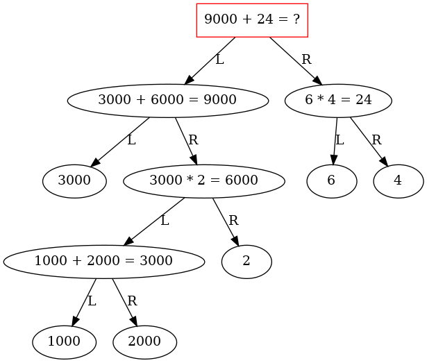 |

||
|:-------------:|
| 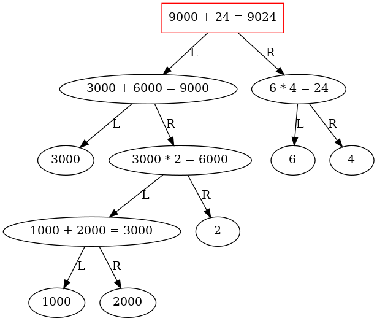 |

