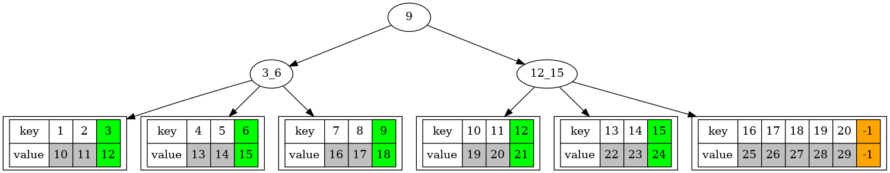
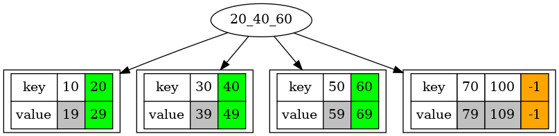
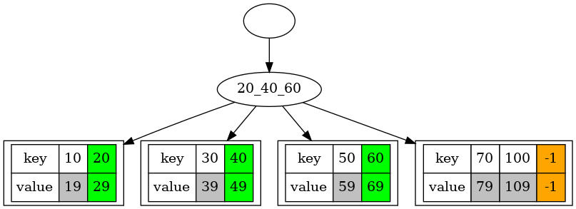
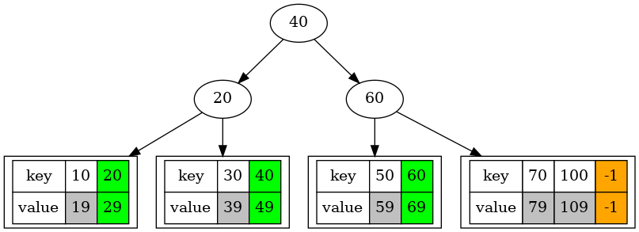
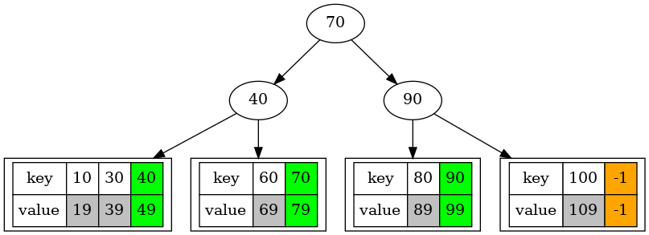
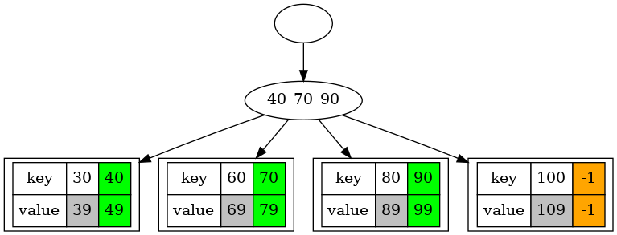
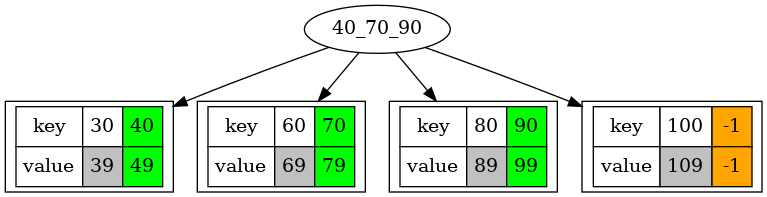

# B+ Tree


<!-- A B+ tree can be used to accelerate access to block devices, such as hard disks. -->
Although [AVL](../SelfBalancingBST/README.md), [Red-Black](../RedBlackTree/README.md), and B+ trees all have the same time complexity of O(log(n)) for search, insertion, and deletion, the B+ tree offers significant advantages in terms of reducing I/O operations on block devices.

| A B+ Tree with the minimum degree 3 |
|:-------------:|
|  |


<!-- Although AVL, Red-Black, and B+ trees all have the same time complexity of O(log(n)) for search, insertion, and deletion, the B+ tree offers significant advantages in reducing I/O operations on block devices. -->

The B+ tree is particularly optimized for systems that involve block-based storage (like databases or file systems) because it minimizes the number of I/O operations required to search for data. This is achieved through its structure, where all values are stored in the leaf nodes and internal nodes store only keys. This allows for better use of sequential access patterns, which is more efficient for I/O operations on disk compared to other tree structures.

### Minimum degree md
Its goal is to store more keys in a B+ tree node, which typically corresponds to a page or block (usually hundreds or thousands of bytes, the basic unit for accessing a block device).
In contrast, a node in a binary search tree (e.g., [AVL](../SelfBalancingBST/README.md) or [Red-Black](../RedBlackTree/README.md) trees) typically contains only a single key.


Except for the root node, an internal node in a B+ tree must have at least md branches and (md - 1) keys, where md ≥ 2.
<!-- As md increases (for example, from 2 to 128), the height of the tree can be reduced, thereby decreasing I/O operations on the block device and improving system performance. -->
An internal node can have no more than (2 * md - 1) keys and (2 * md) branches, subtrees, or children.
This design means that a block (or page) in memory should be filled at least halfway with data. If a block is underutilized, the I/O operations would be inefficient because many blocks might need to be read, and the effective use of each read would be lower.


The data pointers (highlight in grey in the above figure), which point to data records, are stored in the leaf nodes.
An additional slot (mark in green color) in a leaf node can store a key-value pair from its ancestor node.
In a leaf node, there can be at most 2 * md keys (plus the key from its ancestor) and 
2 * md data pointers pointing to the data records.
All the leaf nodes of a B+ tree can be linked together to efficiently support range queries.
Since only the leaf nodes store actual data, range queries can efficiently access and return the necessary records.

### Two basic operations merge() and split() for maintaining the balance of a B+ tree during insertions and deletions.

In a B+ tree, the split() operation occurs when a node exceeds its capacity due to an insertion.

In the following example, we assume md is 2.

The node’s keys are split into two halves. The middle key is selected to be promoted to the parent node.
A new sibling node is created to hold the second half of the keys. This new node will either be a leaf node or an internal node, depending on the type of node being split.

| split(): the root node containing 20, 40, and 60| create a new root node| after split()|
|:-------------|:-------------:|:-------------:|
|  |  |  |


In a B+ tree, the merge() operation is the counterpart to the split() operation and occurs during deletion when a node becomes underfilled. Merging ensures that the tree remains balanced and maintains the property that internal nodes always have at least half of their maximum capacity.


| merge(): node 40, its sibling, and one key from their parent| no key in the root| after merge() |
|:-------------|:-------------:|:-------------:|
|  |  |  |


### How the B+ Tree increases its height and branches

A B+ tree grows when the root node becomes full, containing (2 * md - 1) keys.
Note that during the split() operation, one key is inserted into the parent node.
The split() operation also increases the number of branches in the B+ tree.

### How the B+ Tree decreases its height and branches


When the root node contains no keys, it is deleted, resulting in a reduction of the tree's height by one.
Note that in the merge() operation, one key is pulled down from the parent node to its child.

### Range queries

```
void BPlusTreeRangeQuery(struct BPlusTree *pBPlusTree, BPlusTreeKeyTy startKey, BPlusTreeKeyTy endKey);
```
Range queries in a B+ tree refer to the operation of retrieving all the keys (and their associated values or data pointers) within a specified range. 

**Query**

For example, given the B+ tree above, the following query can display the key-value pairs for all keys within the range [7, 11].
```   
    BPlusTreeRangeQuery(pBPlusTree, 7, 11); 
```

**Output**
```sh
        7         16 
        8         17 
        9         18 
       10         19 
       11         20 
```
### make view


```sh
BPlusTree$ make view
```


