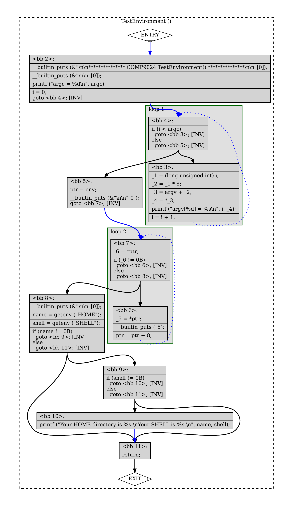

# Binary Tree

A binary tree is a hierarchical data structure wherein each node can have a maximum of two children,

known as the left child and the right child.

## 1 Introduction

```sh

    
An expression (i.e., a string) from a user:

   "9000 + 6 * 4" 

The input string will be represented as a binary tree:


        + 
      /   \ 
    9000   * 
          /  \ 
         6    4 

After visiting/traversing each node of the binary tree:

   eval("9000 + 6 * 4") == 9024

Its intermediate representation (IR): 

    t0 = 6 * 4
    t1 = 9000 + t0
   

```    

## 1 How to download Tutorials in [CSE VLAB](https://vlabgateway.cse.unsw.edu.au/)

Open a terminal (Applications -> Terminal Emulator)

```sh

$ git clone https://github.com/sheisc/COMP9024.git

$ cd COMP9024/Trees/BiTree

BiTree$ 

```


## 2 How to start [Visual Studio Code](https://code.visualstudio.com/) to browse/edit/debug a project.


```sh

BiTree$ code

```

Two configuration files (BiTree/.vscode/[launch.json](https://code.visualstudio.com/docs/cpp/launch-json-reference) and BiTree/.vscode/[tasks.json](https://code.visualstudio.com/docs/editor/tasks)) have been preset.


#### 2.1 Open the project in VS Code

In the window of Visual Studio Code, please click "File" and "Open Folder",

select the folder "COMP9024/Tutorials/BiTree", then click the "Open" button.


#### 2.2 Build the project in VS Code

click **Terminal -> Run Build Task**


#### 2.3 Debug the project in VS Code

Open src/expr.c, and click to add a breakpoint (say, line 105).

Then, click **Run -> Start Debugging**

## 3 Data structures

```C

// Max length of an identifier (e.g., a function or variable name) 
#define MAX_ID_LEN 127

// token value
typedef struct {
  // e.g, "year", "t0", "t1", "+", "-", "*", "/", "(", ")", ...
  char name[MAX_ID_LEN + 1];
  // value of an integer, e.g., 2024
  long numVal;
} Value;


// In C, an Enum/Enumeration is a custom data type where users can assign names to constant integers. 
// Using enums makes it easier for programmers to learn, understand, and maintain the program.
typedef enum {
  TK_NA,     // 0     By default, the first item has the value 0. Here, NA stands for Not Available.
  TK_ADD,    // 1     '+'
  TK_SUB,    // 2     '-'
  TK_MUL,    // 3     '*'
  TK_DIV,    // 4     '/'
  TK_NUM,    // 5     number 
  TK_LPAREN, // 6     '('  left parenthesis
  TK_RPAREN, // 7     ')'  right parenthesis
  TK_EOF,    // 8     end of file
} TokenKind;

/*
  The Abstract Syntax Tree Node for an expression.

  In an abstract syntax tree, syntactic details such as parentheses in expressions 
  like "(20 + 30) * 40" are considered redundant and thus ignored.

           * 
         /   \
        +     40
      /   \ 
     20   30

 */
struct astExprNode {
  /*
    1. The kind of an expression node: 
         an operand (e.g., 300) or an operator (e.g., '+', '-', '*' and '/')
    
    2. To keep it simple, we use the TokenKind defined in tokens.txt.  
         TK_NUM for 300, 400, ...
         TK_ADD for '+'
         TK_SUB for '-'
         TK_MUL for '*'
         TK_DIV for '/'
   */
  TokenKind op;
  /*
   The value of the token (a token is a word), consisting of two parts:

   1. an integer for representing the node's value (e.g., 300), 
    
   2. a C string for representing its name or value (e.g., "+", "t0", "t1", "(", ")", "300", ...)
   */
  Value value;

  /////////////////////////////////////////////
  // e.g.,  left and right operands of a binary operator (+, -, *, /)
  struct astExprNode *leftChild;
  struct astExprNode *rightChild; 
};

typedef struct astExprNode *AstExprNodePtr;

```

## 4 Algorithms

## 4.1 Overview

```C
int main(int argc, char **argv, char **env) {

  // Create a binary tree
  AstExprNodePtr expr = Expression();

  // Perform a postorder traversal of the binary tree
  long result = EvalExpression(expr);  

  // Output the result
  printf("\n9000 + 6 * 4 == %ld\n", result);

  // Free the heap memory
  ReleaseAstExpr(expr);

  return 0;
}
```

## 4.1 How to create a binary tree for "9000 + 6 * 4"

```C
  Now, let's manually create the binary tree. 
  
  We can see why pointers (addresses) are so important.
  A tree node (oneNode) can save/keep/store another node's address,
  thus establishing a connection from one node to another node.
  
  =====================================================================
          Pointers are just like hyper links in web pages.
  =====================================================================
                      via a pointer           
  A tree node   ------------------------------->  another tree node 
  
  pOneNode->leftChild = address of another node

  The branch in the following binary tree represents a pointer.

  =====================================================================

                      via a hyperlink
  one.html      ------------------------------->  two.html
  
  <a href="two.html">Neo</a>
  ======================================================================

        + 
      /   \ 
    9000   * 
          /  \ 
         6    4 

  // Now, let's manually create the binary tree. 
  // We will write a parser to create the tree for us later.
  AstExprNodePtr left = CreateAstExprNode(TK_NUM, 9000, "", NULL, NULL);
  AstExprNodePtr rightLeft = CreateAstExprNode(TK_NUM, 6, "", NULL, NULL);
  AstExprNodePtr rightRight = CreateAstExprNode(TK_NUM, 4, "", NULL, NULL);
  AstExprNodePtr right = CreateAstExprNode(TK_MUL, 0, "*", rightLeft, rightRight);
  AstExprNodePtr root = CreateAstExprNode(TK_ADD, 0, "+", left, right); 

```


## 4.2 How to evaluate the expression "9000 + 6 * 4"

**Perform a postorder traversal of its binary tree.**

Postorder traversal is a tree traversal method that adheres to the Left-Right-Root policy.

In this method, each node in the tree is visited in the following sequence:

(1) The left subtree is traversed first.

(2) Then the right subtree is traversed.

(3) Finally, the root node of the subtree is traversed.

```C

#define EmitIR  printf

// In fact, it is a simple interpreter
long EvalExpression(AstExprNodePtr root) {    
    assert(root);
    if (root->op == TK_NUM) {  // 9000, 6, 4      
        return root->value.numVal;
    }
    else { // +, -, *, /
        assert(root->leftChild);
        assert(root->rightChild);        
        long leftOperand = EvalExpression(root->leftChild);
        long rightOperand = EvalExpression(root->rightChild); 
        // Postorder traversal:
        //     a tree traversal method that adheres to the Left-Right-Root policy
        long result = 0;
        switch (root->op) {
            case TK_ADD:              
                result = leftOperand + rightOperand;
                EmitIR("%s = %s + %s\n", root->value.name, 
                                         root->leftChild->value.name, 
                                         root->rightChild->value.name);
                break;
            case TK_SUB:
                result = leftOperand - rightOperand;
                EmitIR("%s = %s - %s\n", root->value.name, 
                                         root->leftChild->value.name, 
                                         root->rightChild->value.name);              
                break;
            case TK_MUL:
                result = leftOperand * rightOperand;
                EmitIR("%s = %s * %s\n", root->value.name, 
                                         root->leftChild->value.name, 
                                         root->rightChild->value.name);             
                break;
            case TK_DIV:
                result = leftOperand / rightOperand;
                EmitIR("%s = %s / %s\n", root->value.name, 
                                         root->leftChild->value.name, 
                                         root->rightChild->value.name);               
                break;
            default:
                break;              
        }
        return result;
    } 
}
```

## Build and run the program in the command line

```sh

COMP9024/Trees/BiTree$ make

COMP9024/Trees/BiTree$ ./main

t0 = 6 * 4
t1 = 9000 + t0

9000 + 6 * 4 == 9024

COMP9024/Trees/BiTree$ make clean

```

## 5 The real-world application of data structures and algorithms.

```sh 

Data structures—such as stacks, queues, linked lists, trees, and graphs—covered 
in COMP9024 find extensive practical application in real-world interpreters and compilers.

```

### 5.1 [Python Interpreter](https://github.com/python/cpython.git)
```sh                                                       

    $ python3

    >>> eval("9000 + 6 * 4")
    9024

    >>> code = compile("9000 + 6 * 4", "", "eval")
    >>> eval(code)
    9024

    >>> help(eval)

    eval(source, globals=None, locals=None)
    
        Evaluate the given source in the context of globals and locals.
        The source may be a string representing a Python expression
        or a code object as returned by compile().    
```

### 5.2 A control-flow graph generated by gcc

```C
#include <stdio.h>  // Standard library header files, printf(), scanf()
#include <stdlib.h> // getenv(), ...


int TestEnvironment(int argc, char **argv, char **env) {
    printf("\n\n*************** COMP9024 TestEnvironment() ***************\n\n\n");
    // print the command-line arguments
    printf("\n\n");
    printf("argc = %d\n", argc);
    for (int i = 0; i < argc; i++) {
        printf("argv[%d] = %s\n", i, argv[i]);
    }
    
    // print all the environment variables (passed to this program by the shell)
    char **ptr = env;
    printf("\n\n\n");
    while (*ptr != NULL) {
        printf("%s\n", *ptr);
        ptr++;
    }

    //
    printf("\n\n\n");
    char *name = getenv("HOME");
    char *shell = getenv("SHELL");
    if (name != NULL && shell) {
        printf("Your HOME directory is %s.\nYour SHELL is %s.\n", name, shell);    
    }
}

int main(int argc, char **argv, char **env) {    
    TestEnvironment(argc, argv, env);    
    return 0;
}


```




### 5.3 Graph-related research in CSE

#### [HUGE: An Efficient and Scalable Subgraph Enumeration](http://www.zhengyi.one/)
```sh

Zhengyi Yang, Longbin Lai, Xuemin Lin, Kongzhang Hao and Wenjie Zhang

Proceedings of the 2021 International Conference on Management of Data (SIGMOD 2021)
```

#### [TIPS: Tracking Integer-Pointer Value Flows for C++ Member Function Pointers](https://sheisc.github.io/)
```sh
Changwei Zou, Dongjie He, Yulei Sui and Jingling Xue.
2024 ACM SIGSOFT International Symposium on the Foundations of Software Engineering (FSE 2024)
```


| C++ Programs      | Number Of Value Flow Graph Nodes | Number of Value Flow Graph Edges |
| :---------------- | :------: | :----: |
| llvm-config       |   821,341                     | 1,166,045 |
| llvm-ml           |   5,498,863                   | 8,777,931 |
| FileCheck         |  944,214                      | 1,333,502 |
| llvm-mt           |  888,408                      | 1,259,724  |
| cmake_automoc_parser  |   1,923,808               | 3,181,915 |
| moc                   |   2,236,289                | 3,646,680 |
| tracegen              |  1,779,135                 | 2,977,068 |
| tracepointgen         |  1,737,779                 | 2,906,594 |
| ninja                 |   174,825                  | 236,430 |
| ninja_test (GoogleTest) |   1,371,169              | 2,148,449 |
| build_log_perftest      |  133,850                 | 174,170 |
| manifest_parser_perftes | 134,088                  | 174,183 |

