# Binary Search Tree

``` sh
/*******************************************************************
                 Binary Search Tree

    1.  How to do an in-order traversal in a binary search tree

    2.  How to insert data in a binary search tree

    3.  How to delete data in a binary search tree

    4.  How to search for a value in a binary search tree

                                             COMP9024

 *******************************************************************/
``` 

## Introduction

A Binary Search Tree (BST) is a type of data structure that organizes data efficiently.

### BST property

Each node has at most two children, with values smaller than the node on the left and values larger on the right. 

This arrangement allows for fast operations like searching, inserting, and deleting data, making BSTs ideal for tasks that require quick access to sorted information.

```sh
           50  
        /      \
      20        70
     /  \      /  \  
    10  30    60  100
          \        /
          40      90
                 /
                80
```

### How to create a binary search tree

Ensure that the binary search tree (BST) property is preserved when inserting and deleting nodes.

**Data Structures**
```C
// Max length of an identifier (e.g., the name for a tree node) 
#define MAX_ID_LEN 127

// node value
typedef struct {
    // e.g, "9000", "Node A", "Node B"
    char name[MAX_ID_LEN + 1];
    // value of an integer, e.g., 2024
    long numVal;
} NodeValue;

struct BiTreeNode {
    /*
     The value of a binary tree node:
  
     1. an integer for representing the node's value (e.g., 300), 
      
     2. a C string for representing its node name
     */
    NodeValue value;  
    // left subtree
    struct BiTreeNode *leftChild;
    // right subtree
    struct BiTreeNode *rightChild;

    // ...
};

typedef struct BiTreeNode *BiTreeNodePtr;
```

We have discussed how to create a *.dot file in [COMP9024/Trees/Tree2Dot](../../Trees/Tree2Dot/README.md) for a binary tree.

In this project, we study how to insert and delete data in a BST.

Self-balancing trees will be introduced in [COMP9024/Trees/SelfBalancingBST](../../Trees/SelfBalancingBST/README.md).

| Self-Balancing Tree | 
|:-------------:|
| 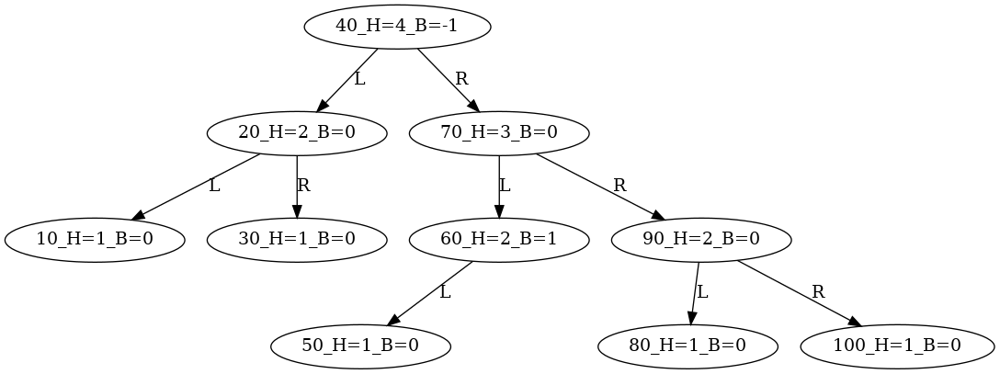 | 

Searching within a BST is left as the weekly practical exercise in [Tutorial 7](../../Tutorials/Week9/README.md).

```sh
           50  
        /      \
      20        70
     /  \      /  \  
    10  30    60  100
          \        /
          40      90
                 /
                80
```

```C

typedef struct BiTreeNode *BiTreeNodePtr;

BiTreeNodePtr BiTreeSearch(BiTreeNodePtr root, long numVal) {
    if (______Q1______) {       // Base case:  root is NULL
        return ______Q2______;  // Not found
    } else if (numVal == root->value.numVal) {
        return ______Q3______;  // Found
    } else if (numVal < root->value.numVal) {
        return ______Q4______;  // Recursively search in left sub-tree
    } else { // numVal > root->value.numVal
        return ______Q5______;  // Recursively search in right sub-tree
    }
}
```
Example
```C
int main(void) {
    BiTreeNodePtr pa = BiTreeSearch(root, 60);

    BiTreeNodePtr pb = BiTreeSearch(root, 55);
}
```

### How to update the value of a pointer variable in a caller function


#### Method 1: pass the address of a pointer variable as an argument to a function

```C
//typedef struct BiTreeNode *BiTreeNodePtr;

int main(void) {
    // Create an empty binary tree
    BiTreeNodePtr root = NULL;

    // Insert a node with the value 50
    BiTreeInsert(&root, 50, NULL);

}

void BiTreeInsert(BiTreeNodePtr *pNodePtr, long numVal, char *nodeName) {  
    BiTreeNodePtr pNode = *pNodePtr;
    if (pNode == NULL) {
        
        BiTreeNodePtr tmp = CreateBinaryTreeNode(numVal, nodeName, NULL, NULL);
        *pNodePtr = tmp;

        // Simplified as follows
        // *pNodePtr = CreateBinaryTreeNode(numVal, nodeName, NULL, NULL);

        // But, does the following statement have the same effect?
        // pNode = CreateBinaryTreeNode(numVal, nodeName, NULL, NULL);
    } else {
        if (numVal < pNode->value.numVal) {
            BiTreeInsert(&(pNode->leftChild), numVal, nodeName);
        } else if (numVal > pNode->value.numVal) {
            BiTreeInsert(&(pNode->rightChild), numVal, nodeName);
        } else {
            // If numVal is already in the binary search tree, do nothing.
        }
    } 
}

/*
  Create an Ast node for an expression.
 */
BiTreeNodePtr CreateBinaryTreeNode(long numVal, char *nodeName, BiTreeNodePtr left, BiTreeNodePtr right) {
    BiTreeNodePtr pNode = (BiTreeNodePtr) malloc(sizeof(struct BiTreeNode));

    // ...
    return pNode;
}
```


#### Method 2: reset its value using the return value of a function

```C
//typedef struct BiTreeNode *BiTreeNodePtr;

int main(void) {
    // Create an empty binary tree
    BiTreeNodePtr root = NULL;

    // Insert a node with the value 50
    root = BiTreeInsert2(root, 50, NULL);

    // ... 
}

BiTreeNodePtr BiTreeInsert2(BiTreeNodePtr pNode, long numVal, char *nodeName) {  
    if (pNode == NULL) {
        BiTreeNodePtr tmp = CreateBinaryTreeNode(numVal, nodeName, NULL, NULL);
        return tmp;
    } else {
        if (numVal < pNode->value.numVal) {
            pNode->leftChild = BiTreeInsert2(pNode->leftChild, numVal, nodeName);
        } else if (numVal > pNode->value.numVal) {
            pNode->rightChild = BiTreeInsert2(pNode->rightChild, numVal, nodeName);
        } else {
            // If numVal is already in the binary search tree, do nothing.
        }
        return pNode;
    }  
}

```

### How to get the node with the minimum value in a binary search tree

```sh
           50  
        /      \
      20        70
     /  \      /  \  
    10  30    60  100
          \        /
          40      90
                 /
                80
```

Get the left-most node.

```C
BiTreeNodePtr BiTreeMinValueNode(BiTreeNodePtr root) {
    BiTreeNodePtr cur = root;
    // Get the left-most node
    while ((cur != NULL) && (cur->leftChild != NULL)) {
        cur = cur->leftChild;
    }
    return cur;
}
```


## 1 How to download this project in [CSE VLAB](https://vlabgateway.cse.unsw.edu.au/)

Open a terminal (Applications -> Terminal Emulator)

```sh

$ git clone https://github.com/sheisc/COMP9024.git

$ cd COMP9024/Trees/BinarySearchTree

BinarySearchTree$ 

```


## 2 How to start [Visual Studio Code](https://code.visualstudio.com/) to browse/edit/debug a project.


```sh

BinarySearchTree$ code

```

Two configuration files (BinarySearchTree/.vscode/[launch.json](https://code.visualstudio.com/docs/cpp/launch-json-reference) and BinarySearchTree/.vscode/[tasks.json](https://code.visualstudio.com/docs/editor/tasks)) have been preset.


#### 2.1 Open the project in VS Code

In the window of Visual Studio Code, please click "File" and "Open Folder",

select the folder "COMP9024/Trees/BinarySearchTree", then click the "Open" button.


#### 2.2 Build the project in VS Code

click **Terminal -> Run Build Task**


#### 2.3 Debug the project in VS Code

Open src/main.c, and click to add a breakpoint (say, line 45).

Then, click **Run -> Start Debugging**

### 2.4 Directory

```sh
├── Makefile             defining set of tasks to be executed (the input file of the 'make' command)
|
├── README.md            introduction to this project
|
├── src                  containing *.c and *.h
|   |
|   |
│   ├── BiTree.c         Binary Search Tree
│   ├── BiTree.h
|   |
│   ├── Queue.c          used in a breadth-first tree traversal when generating *.dot files
│   ├── Queue.h
|   |
│   └── main.c           main()
|
|── images               containing *.dot and *.png files
|
|── diagrams             containing *.png files
|
└── .vscode              containing configuration files for Visual Studio Code
    |
    ├── launch.json      specifying which program to debug and with which debugger,
    |                    used when you click "Run -> Start Debugging"
    |
    └── tasks.json       specifying which task to run (e.g., 'make' or 'make clean')
                         used when you click "Terminal -> Run Build Task" or "Terminal -> Run Task"
```

Makefile is discussed in [COMP9024/C/HowToMake](../../C/HowToMake/README.md).

## 3 The main procedure

### 3.1 make and ./main

**In addition to utilizing VS Code, we can also compile and execute programs directly from the command line interface as follows.**

``` sh

BinarySearchTree$ make

BinarySearchTree$ ./main

*******************************  Testing BiTreeInsert() *******************************


After inserting 50 
*****************  InOrderTraversal() **********************
50 

...


*******************************  Testing BiTreeDelete() *******************************


deleting 50
After deleting 50 
*****************  InOrderTraversal() **********************
10 20 30 40 60 70 80 90 100 

...

```

### 3.2 make view

**Ensure that you have executed 'make' and './main' before 'make view'.**


```sh
BinarySearchTree$ make view
```

**Click on the window of 'feh' or use your mouse scroll wheel to view images**.

Here, **feh** is an image viewer available in [CSE VLAB](https://vlabgateway.cse.unsw.edu.au/).


#### 3.2.1 BiTreeInsert()

| Insert 50 | Insert 20  |  Insert 10  |  Insert 30 |
|:-------------:|:-------------:|:-------------:|:-------------:|
|  |  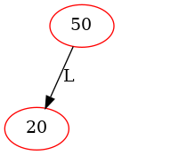 | 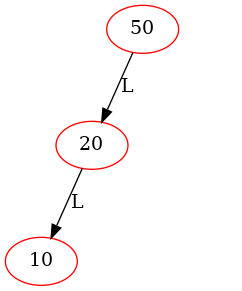 | 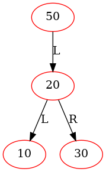 |

```C
void BiTreeInsert(BiTreeNodePtr *pNodePtr, long numVal, char *nodeName) {  
    BiTreeNodePtr pNode = *pNodePtr;
    if (pNode == NULL) {        
        BiTreeNodePtr tmp = CreateBinaryTreeNode(numVal, nodeName, NULL, NULL);
        *pNodePtr = tmp;
    } else {
        if (numVal < pNode->value.numVal) {
            BiTreeInsert(&(pNode->leftChild), numVal, nodeName);
        } else if (numVal > pNode->value.numVal) {
            BiTreeInsert(&(pNode->rightChild), numVal, nodeName);
        } else {
            // If numVal is already in the binary search tree, do nothing.
        }
    } 
}

int main(int argc, char **argv, char **env) {
    BiTreeNodePtr root = NULL;
    long nums[] = {50, 20, 10, 30, 40, 70, 60, 100, 90, 80};
    for (int i = 0; i < sizeof(nums)/sizeof(nums[0]); i++) {
        BiTreeInsert(&root, nums[i], NULL);
    }
}
```

| Insert 40 | Insert 70  |  Insert 60  |
|:-------------:|:-------------:|:-------------:|
| 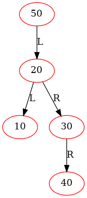 |  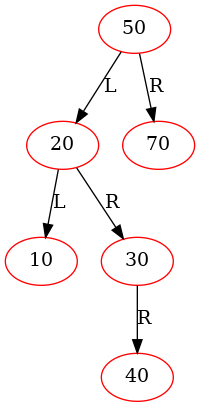 | 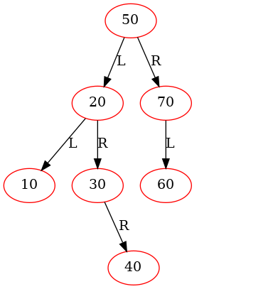 |

| Insert 100 | Insert 90  |  Insert 80  |
|:-------------:|:-------------:|:-------------:|
| 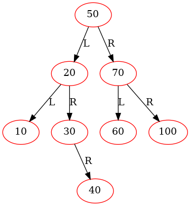 |  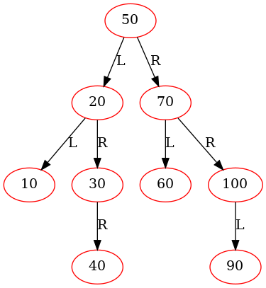 |  |


#### 3.2.2 BiTreeDelete()

| Node to Be Deleted | Left Child |  Right Child   | Action |
|:-------------:|:-------------:|:-------------:|:-------------:|
| Case 00 | NULL |  NULL   | replaced by the node's right child|
| Case 01 | NULL |  NOT NULL   |replaced by the node's right child |
| Case 10 | NOT NULL |  NULL   |replaced by the node's left child |
| Case 11 | NOT NULL |  NOT NULL   | Swap the values of the node to be deleted and its in-order successor |


| Initial | Delete 50 (case 11 in the previous state, swapping 50 and 60, inconsistency) |  Delete 50 (case 00 in the previous state)  |
|:-------------:|:-------------:|:-------------:|
|  |  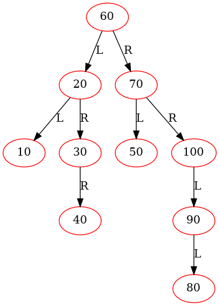 | 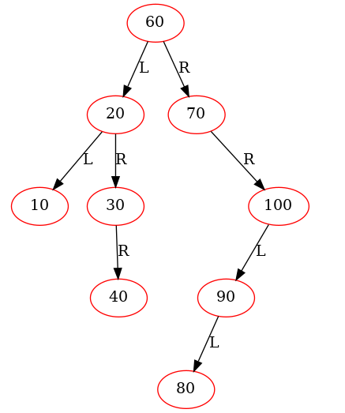 |


|Delete 20 (case 11 in the previous state, swapping 20 and 30, inconsistency) | Delete 20 (case 01 in the previous state)  |  Delete 10 (case 00 in the previous state)  |
|:-------------:|:-------------:|:-------------:|
|  |  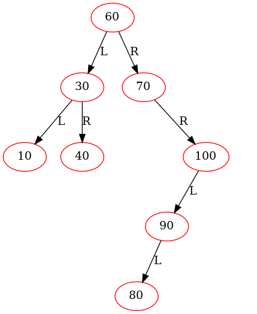 | 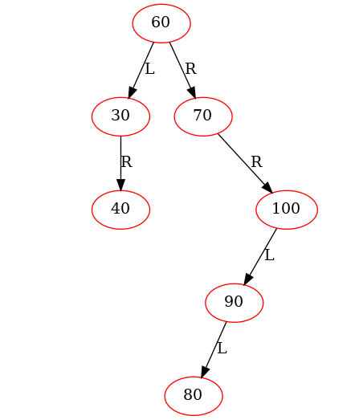 |


| Delete 30 (case 01 in the previous state) | Delete 40 (case 00 in the previous state)  |  Delete 70 (case 01 in the previous state) | Delete 60 (case 01 in the previous state) |
|:-------------:|:-------------:|:-------------:|:-------------:|
| 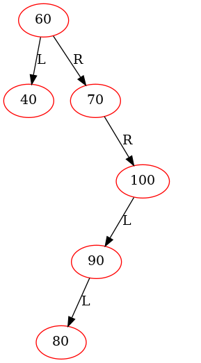 |  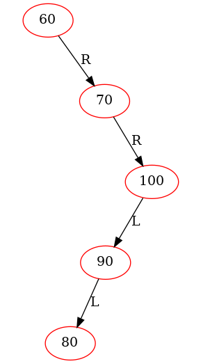 | 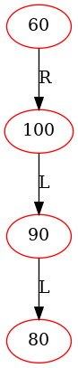 | 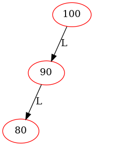 |


| Delete 100 (case 10 in the previous state) | Delete 90 (case 10 in the previous state) |  Delete 80 (case 00 in the previous state) | 
|:-------------:|:-------------:|:-------------:|
| 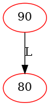 |   |  |


## 4 Data structures

```C

struct BiTreeNode {
    /*
     The value of a binary tree node:
  
     1. an integer for representing the node's value (e.g., 300), 
      
     2. a C string for representing its node name
     */
    NodeValue value;  
    // left subtree
    struct BiTreeNode *leftChild;
    // right subtree
    struct BiTreeNode *rightChild;

    // ...
};

typedef struct BiTreeNode *BiTreeNodePtr;
```


## 5 Algorithms

### 5.1 main()
```sh

    // long nums[] = {50, 20, 10, 30, 40, 70, 60, 100, 90, 80};
    // 'nums[]' contains the pre-order traversal of the following binary search tree.

           50  
        /      \
      20        70
     /  \      /  \  
    10  30    60  100
          \        /
          40      90
                 /
                80
 
```

```C
int main(int argc, char **argv, char **env) {
    // ...
    // Create an empty binary tree
    BiTreeNodePtr root = NULL;
     
    printf("*******************************  Testing BiTreeInsert() *******************************\n\n\n");
    long nums[] = {50, 20, 10, 30, 40, 70, 60, 100, 90, 80};
    for (int i = 0; i < sizeof(nums)/sizeof(nums[0]); i++) {
        BiTreeInsert(&root, nums[i], NULL);

        printf("After inserting %ld \n", nums[i]);

        printf("*****************  InOrderTraversal() **********************\n");
        InOrderTraversal(root, PrintNodeInfo);
        printf("\n\n");

        cnt++;              
        GenOneImage(root, "BiTreeBiTreeInsert", "images/BiTreeBiTreeInsert", cnt);        
    }
    printf("\n");

    printf("\n\n\n*******************************  Testing BiTreeDelete() *******************************\n\n\n");
    cnt = 0;
    GenOneImage(root, "BiTreeDelete", "images/BiTreeDelete", cnt);
    for (int i = 0; i < sizeof(nums)/sizeof(nums[0]); i++) {                        
        BiTreeDelete(&root, &root, nums[i]);
        printf("After deleting %ld \n", nums[i]);
        printf("*****************  InOrderTraversal() **********************\n");
        InOrderTraversal(root, PrintNodeInfo);
        printf("\n\n");

        //cnt++;              
        //GenOneImage(root, "BiTreeDelete", "images/BiTreeDelete", cnt);        
    }
    printf("\n");  
    
    // Free the heap memory
    ReleaseBinaryTree(root);
    return 0;
}
```

### 5.2 BiTreeInsert()

```C

void BiTreeInsert(BiTreeNodePtr *pNodePtr, long numVal, char *nodeName) {  
    BiTreeNodePtr pNode = *pNodePtr;
    if (pNode == NULL) {
        BiTreeNodePtr tmp = CreateBinaryTreeNode(numVal, nodeName, NULL, NULL);
        *pNodePtr = tmp;
    } else {
        if (numVal < pNode->value.numVal) {
            BiTreeInsert(&(pNode->leftChild), numVal, nodeName);
        } else if (numVal > pNode->value.numVal) {
            BiTreeInsert(&(pNode->rightChild), numVal, nodeName);
        } else {
            // If numVal is already in the binary search tree, do nothing.
        }
    }  
}
```

### 5.3 BiTreeDelete()

#### Method 1: pass the address of a pointer variable as an argument to a function

```C
typedef struct BiTreeNode *BiTreeNodePtr;

// The parameter pRoot is only used for generating the image of the binary search tree.
// In this recursive function, *pNodePtr might point to a sub-tree in the BST.
void BiTreeDelete(BiTreeNodePtr *pRoot, BiTreeNodePtr *pNodePtr, long numVal) {
    static long cnt = 0;

    BiTreeNodePtr pNode = *pNodePtr;
    if (pNode) {
        if (numVal < pNode->value.numVal) {
            BiTreeDelete(pRoot, &(pNode->leftChild), numVal);
        } else if (numVal > pNode->value.numVal) {
            BiTreeDelete(pRoot, &(pNode->rightChild), numVal);
        } else {
            /************************************************************************
                If the node (to be deleted) has:

                    0 child:

                        leftChild == NULL && rightChild == NULL    // case 00

                    1 child:

                        leftChild == NULL && rightChild != NULL    // case 01

                        or 
                        leftChild != NULL && rightChild == NULL    // case 10
                 
                    2 children:

                        leftChild != NULL && rightChild != NULL    // case 11

             **************************************************************************/
            
            if (pNode->leftChild == NULL) {   // case 00 and case 01
                BiTreeNodePtr tmp = pNode->rightChild;
                printf("deleting %ld\n", pNode->value.numVal);
                free(pNode);
                *pNodePtr = tmp;

                cnt++;
                GenOneImage(*pRoot, "BiTreeDelete", "images/BiTreeDelete", cnt);
            } else if (pNode->rightChild == NULL) { // case 10
                BiTreeNodePtr tmp = pNode->leftChild;
                printf("deleting %ld\n", pNode->value.numVal);      
                free(pNode);
                *pNodePtr = tmp;

                cnt++;
                GenOneImage(*pRoot, "BiTreeDelete", "images/BiTreeDelete", cnt);                
            } else {
                // case 11:  with two children
                // Get pNode's in-order successor, which is left-most node in its right sub-tree.
                BiTreeNodePtr pSuccessor = BiTreeMinValueNode(pNode->rightChild);

                // (Swapping is done for clearer debugging output)
                // Swap the values of the node pointed to by pNode and its in-order successor              
                NodeValue val = pNode->value;
                // Copy the successor's value (this copy is necessary)
                pNode->value = pSuccessor->value;
                pSuccessor->value = val;

                // Display the inconsistent state
                cnt++;
                GenOneImage(*pRoot, "BiTreeDelete", "images/BiTreeDelete", cnt);
                // Now, numVal is in right sub-tree. Let us recursively delete it.
                // Temporarily, the whole binary search tree is at an inconsistent state.
                // It will become consistent when the deletion is really done.
                BiTreeDelete(pRoot, &(pNode->rightChild), pSuccessor->value.numVal);
            }
        }
    }
}

BiTreeNodePtr BiTreeMinValueNode(BiTreeNodePtr root) {
    BiTreeNodePtr cur = root;
    // Get the left-most node
    while ((cur != NULL) && (cur->leftChild != NULL)) {
        cur = cur->leftChild;
    }
    return cur;
}

int main(void) {
    // Create an empty binary tree
    BiTreeNodePtr root = NULL;
   
    // Simplified
    BiTreeInsert(&root, 50, NULL);

    // Simplified
    BiTreeDelete(&root, &root, 50);

    // ...
}
```


### 5.4 BiTreeDelete2()

#### Method 2: reset its value using the return value of a function

```C
typedef struct BiTreeNode *BiTreeNodePtr;

// In this recursive function, pNode might point to a sub-tree in the BST.
BiTreeNodePtr BiTreeDelete2(BiTreeNodePtr pNode, long numVal) {
    if (pNode) {
        if (numVal < pNode->value.numVal) {
            pNode->leftChild = BiTreeDelete2(pNode->leftChild, numVal);
        } else if (numVal > pNode->value.numVal) {
            pNode->rightChild = BiTreeDelete2(pNode->rightChild, numVal);
        } else {
            /************************************************************************
                If the node (to be deleted) has:

                    0 child:

                        leftChild == NULL && rightChild == NULL    // case 00

                    1 child:

                        leftChild == NULL && rightChild != NULL    // case 01

                        or 
                        leftChild != NULL && rightChild == NULL    // case 10
                 
                    2 children:

                        leftChild != NULL && rightChild != NULL    // case 11

             **************************************************************************/
            
            if (pNode->leftChild == NULL) {   // case 00 and case 01
                BiTreeNodePtr tmp = pNode->rightChild;
                printf("deleting %ld\n", pNode->value.numVal);
                free(pNode);
                return tmp;

            } else if (pNode->rightChild == NULL) { // case 10
                BiTreeNodePtr tmp = pNode->leftChild;
                printf("deleting %ld\n", pNode->value.numVal);      
                free(pNode);
                return tmp;            
            } else {
                // case 11:  with two children
                // Get pNode's in-order successor, which is left-most node in its right sub-tree.
                BiTreeNodePtr pSuccessor = BiTreeMinValueNode(pNode->rightChild);

                // (Swapping is done for clearer debugging output)
                // Swap the values of the node pointed to by pNode and its in-order successor              
                NodeValue val = pNode->value;
                // Copy the successor's value (this copy is necessary)
                pNode->value = pSuccessor->value;
                pSuccessor->value = val;


                // Now, numVal is in right sub-tree. Let us recursively delete it.
                // Temporarily, the whole binary search tree is at an inconsistent state.
                // It will become consistent when the deletion is really done.
                pNode->rightChild = BiTreeDelete2(pNode->rightChild, pSuccessor->value.numVal);
            }
        }
        return pNode;
    } else {
        return NULL;
    }
}

int main(void) {
    // Create an empty binary tree
    BiTreeNodePtr root = NULL;
   
    // Simplified
    root = BiTreeInsert2(root, 50, NULL);

    // or
    // BiTreeInsert(&root, 50, NULL);

    // Simplified
    root = BiTreeDelete2(root, 50);

    // ...
}
```

