# Red-Black Tree

In this project, each node in the red-black tree does not include a parent field, whereas the red-black tree nodes in the project [RedBlackTreeParent](../RedBlackTreeParent/README.md) have a parent field.
Using the parent field allows for more concise code when accessing a node's uncle and sibling. However, it introduces additional complexity in the handling of rotations.

[AVL Trees](../SelfBalancingBST/README.md) require a strict balancing condition: the height difference between the left and right subtrees of any node (called the balance factor) must be at most 1 (i.e., -1, 0, and 1). Rotations are performed to maintain balance of an AVL tree.
Red-Black Trees, on the other hand, use color-based balancing with a much more relaxed set of rules and lighter operations (i.e., recoloring) to maintain balance. The key balancing rules for Red-Black Trees are:

- Every path from a node to its leaves must have the same number of black nodes.
- Red nodes cannot have red children (no two consecutive red nodes).

Together, these two rules ensure that the longest path in a Red-Black tree from the root to any leaf is no more than twice the length of the shortest path. 

| Number of random keys| Black height | Real height (ignoring node color) |
|:----:|:----:|:----:| 
| $2^{4}$ | 3 | 5 |
| $2^{6}$ | 4 | 8 |
| $2^{8}$ | 5 | 10 |
| $2^{10}$ | 6 | 12 |
| $2^{12}$ | 8 | 15 |
| $2^{14}$ | 9 | 17 |
| $2^{16}$ | 10 | 20 |
| $2^{18}$ | 11 | 22 |
| $2^{20}$ | 13 | 25 |
| $2^{22}$ | 14 | 27 |
| $2^{24}$ | 15 | 29 |

For example, in the following diagram, 
the Red-Black tree uses the recoloring operation to restore its balance, but it tends to have a taller tree structure. 
The AVL Tree maintain a stricter balance, resulting in a generally shorter tree (i.e., shorter search time), 
but potentially more complex insertions due to its balancing constraints.

### Red-Black Tree and AVL Tree

| Initial (Red-Black Tree) | Insert | Self-Balancing (recoloring or rotation) |
|:-------------:|:-------------:|:-------------:|
|  | 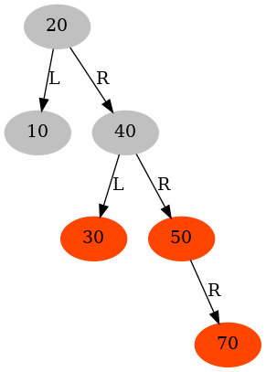 |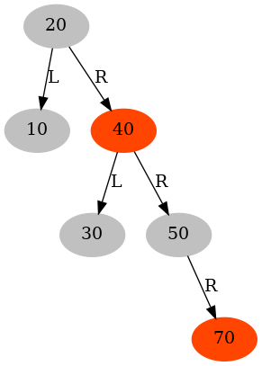 |

| Initial (AVL Tree) | Insert | Self-Balancing (Rotation) |
|:-------------:|:-------------:|:-------------:|
| 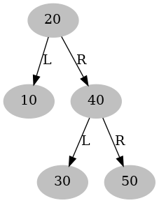 | 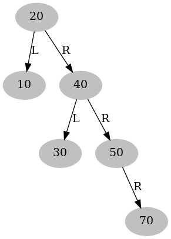 |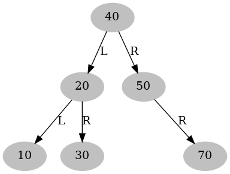 |


<!-- (A dichromatic framework for balanced trees) -->
### A Red-Black Tree is a self-balancing [binary search tree](../BinarySearchTree/README.md) with the following properties.

- Property 1: the root is black.
- Property 2: a node is either BLACK or RED
- Property 3: a red node shouldn't have any red child.
- Property 4: the left and right subtrees have the same black height.
- Property 5: all null nodes are black.

```C
/*
    This function returns 1 when root is a legal RB tree.
    Otherwise, it returns 0.
 */
int IsRBTree(BiTreeNodePtr root) {
    if (root) {
        // Property 1: the root is black.
        if (root->color != BLACK) {
            return 0;
        }
        // Check other properties
        return CheckRBTree(root);
    } else {
        return 1;
    }
}

static int CheckRBTree(BiTreeNodePtr pNode) {
    if (pNode) {
        // Property 2: a node is either BLACK or RED
        if (pNode->color != BLACK && pNode->color != RED) {
            return 0;
        }        

        if (pNode->color == RED) {
            // Property 3: a red node shouldn't have any red child.
            if (hasRedLeft(pNode) || hasRedRight(pNode)) {
                return 0;
            }
        }

        // Property 4: The left and right subtrees have the same black height.
        if (RBTreeBlackHeight(pNode->leftChild) != RBTreeBlackHeight(pNode->rightChild)) {
            return 0;
        }

        // Property 5: All null nodes are black.  See hasBlackLeft() and hasBlackRight()

        // Recursively check left and right subtrees
        if (CheckRBTree(pNode->leftChild) == 0) {
            return 0;
        }
        
        if (CheckRBTree(pNode->rightChild) == 0) {
            return 0;
        }
    }
    return 1;
}

int hasRedRight(BiTreeNodePtr pNode) {
    return pNode->rightChild && pNode->rightChild->color == RED;
}

int hasBlackRight(BiTreeNodePtr pNode) {
    // Property 5: All null nodes are black
    return (!pNode->rightChild) || (pNode->rightChild->color == BLACK);
}

```

### RBTreeBlackHeight()
```C
int RBTreeBlackHeight(struct RBTreeNode *pNode) {
    if (pNode) {
        if (pNode->blackHeight != ILLEGAL_TREE_HEIGHT) {
            return pNode->blackHeight;
        }        
        int leftLen = RBTreeBlackHeight(pNode->left);
        int rightLen = RBTreeBlackHeight(pNode->right);
        assert(leftLen == rightLen);
        if (pNode->color == BLACK) {
            pNode->blackHeight = 1 + leftLen;
            return 1 + leftLen;
        } else {
            pNode->blackHeight = leftLen;
            return leftLen;
        }
    } else {
        return 0;
    }
}
```


### Red-Black Tree and 2-3-4 Tree

A 2-3-4 Tree is a type of self-balancing search tree and a specific form of a [B-tree](../BPlusTree/README.md) (a generalization of binary search trees), where each node can have 2, 3, or 4 children and can store 1, 2, or 3 keys, respectively. 
A Red-Black Tree can be converted to a 2-3-4 Tree.
The converted 2-3-4 tree can be used to explain the height of a Red-Black Tree. The correspondence between a Red-Black Tree and a 2-3-4 Tree provides a simple and intuitive way to understand the height properties of a Red-Black Tree.

<!-- In the following red-black trees, 

- **H** is short for the black height of a tree node, returned by **RBTreeBlackHeight()**

- **B** stands for the balance factor of the tree node, calculated at run time via  **RBTreeBalanceFactor()** -->


| Red-Black Tree | 2-3-4 Tree |
|:-------------:|:-------------:|
| 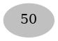 | 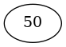 |
| 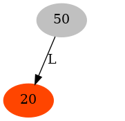 |  |
| 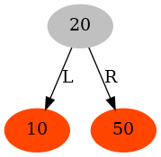 | 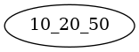 |
| 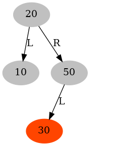 |  |
| 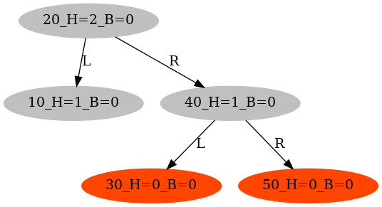 |  |
| 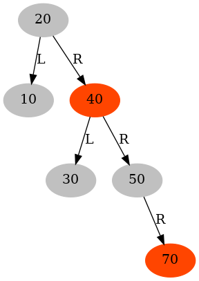 |  |
| 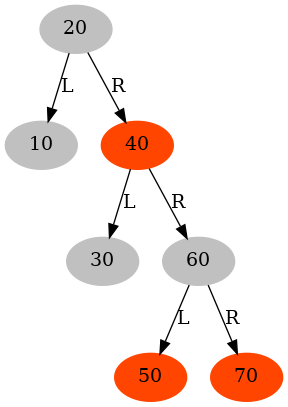 |  |
| 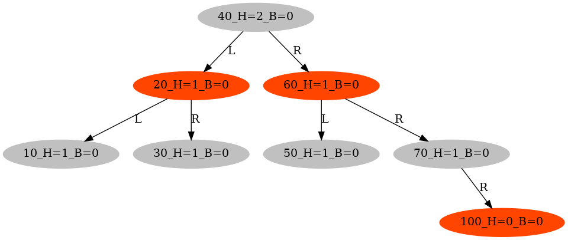 |  |
| 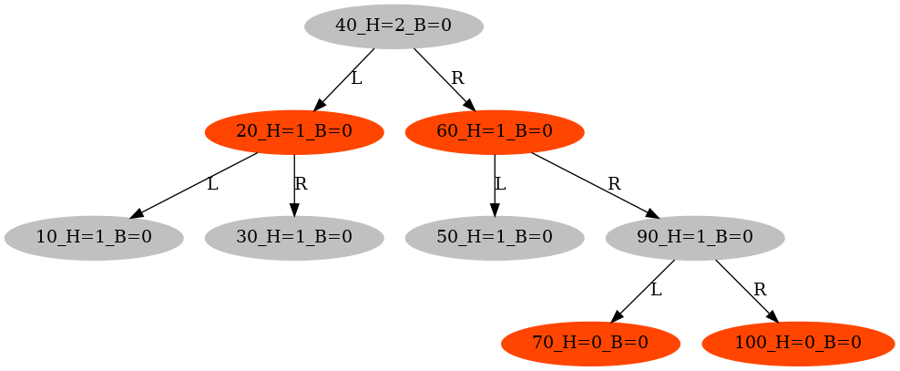 |  |
| 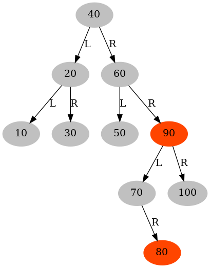 | 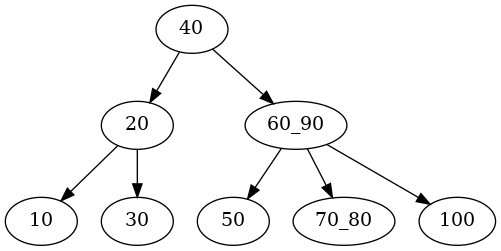 |

### How to insert a node (as a red leaf) into a red-black tree

Two steps are needed:

- Perform the standard [Binary Search Tree](../BinarySearchTree/README.md) insertion

- Fix any violations of the Red-Black Tree properties that may arise

```C

static void RecursiveRBTreeInsert(RBTreeNodePtr *pRoot, RBTreeNodePtr *pNodePtr, long numVal, char *nodeName, long *pCnt) {
    RBTreeNodePtr pNode = *pNodePtr;
    assert(pCnt);

    char *graphName = "RBTree";
    char *fileName = "images/RBTree1Insert";

    if (pNode == NULL) {
        RBTreeNodePtr tmp = CreateRBTreeNode(numVal, nodeName, NULL, NULL);
        *pNodePtr = tmp;
        // printf("inserting %ld\n", numVal);
        return;
    } else {
        if (numVal < pNode->value.numVal) {
            RecursiveRBTreeInsert(pRoot, &pNode->leftChild, numVal, nodeName, pCnt);
        } else if (numVal > pNode->value.numVal) {
            RecursiveRBTreeInsert(pRoot, &pNode->rightChild, numVal, nodeName, pCnt);
        } else {
            // If numVal is already in the binary search tree, do nothing.
            return;
        }
        // The inserted node is RED node. We will update black heights in FixViolationsInInsertion().
        FixViolationsInInsertion(pRoot, pNodePtr, pCnt, graphName, fileName);
    }
}

/*
    The cases in FixViolationsInInsertion():

    e.g., RedParentRedUncle_RXXX represents

                Grandparent
                 /     \
                /       \
        Red Parent     Red Uncle
            /    
           /
        Red Child 
        (inserted)
 */
typedef enum {
    // R + R
    RedParentRedUncle_RXXX, // red parent, red uncle, left red child
    RedParentRedUncle_XRXX, // red parent, red uncle, right red child
    RedUncleRedParent_XXRX, // red uncle, red parent, left red child
    RedUncleRedParent_XXXR, // red uncle, red parent, right red child
    // R + B
    RedParentBlackUncle_RXXX, // red parent, black uncle, left red child
    RedParentBlackUncle_XRXX, // red parent, black uncle, right red child
    BlackUncleRedParent_XXRX, // black uncle, red parent, left red child
    BlackUncleRedParent_XXXR, // black uncle, red parent, right red child
    // other: e.g., B + B
    OtherRBState,
} RBTreeNodeState;
```

### How to delete a node from a red-black tree

Two steps are needed:

- Perform the standard [Binary Search Tree](../BinarySearchTree/README.md) deletion

- Fix any violations of the Red-Black Tree properties that may arise

```C
// The parameter pRoot is only used for generating the image of the binary search tree.
// In this recursive function, *pNodePtr might point to a sub-tree in the BST.
static DoubleBlackState RecursiveRBTreeDelete(RBTreeNodePtr *pRoot, RBTreeNodePtr *pNodePtr, 
                                              long numVal, long *pCnt, TraversalDirection direction) {
    // static long cnt = 0;
    assert(pCnt);
    char *graphName = "RBTree";
    char *fileName = "images/RBTree2Delete";
    RBTreeNodePtr pNode = *pNodePtr;

    DoubleBlackState dbState = NO_DOUBLE_BACK;
    
    if (pNode) {
        // It is on stack
        pNode->visited = 1;

        if (numVal < pNode->value.numVal) {
            dbState = RecursiveRBTreeDelete(pRoot, &(pNode->left), numVal, pCnt, TURN_LEFT);
        } else if (numVal > pNode->value.numVal) {
            dbState = RecursiveRBTreeDelete(pRoot, &(pNode->right), numVal, pCnt, TURN_RIGHT);
        } else {
            if (pNode->left == NULL && pNode->right == NULL) {   //// case 00: no child
                if (pNode->color == BLACK) {
                    if (direction == TURN_LEFT) {
                        dbState = DOUBLE_BLACK_FROM_LEFT;
                    } else {
                        dbState = DOUBLE_BLACK_FROM_RIGHT;
                    }
                }
                free(pNode);
                *pNodePtr = NULL;   
                return dbState;  
            } else if (pNode->left == NULL && pNode->right != NULL) { // case 01: only right  
                RBTreeNodePtr tmp = pNode->right;
                assert(pNode->color == BLACK && pNode->right->color == RED);
                pNode->right->color = BLACK;
                free(pNode);
                *pNodePtr = tmp; 
                pNode = tmp;               
            } else if (pNode->left != NULL && pNode->right == NULL) { // case 10: only left
                // case 10
                RBTreeNodePtr tmp = pNode->left;
                assert(pNode->color == BLACK && pNode->left->color == RED);
                pNode->left->color = BLACK;
                free(pNode);
                *pNodePtr = tmp;
                pNode = tmp;
            } else { // case 11:  with two children                
                // Get pNode's in-order pPredecessor, which is right-most node in its left sub-tree.
                RBTreeNodePtr pPredecessor = BiTreeMaxValueNode(pNode->left);

                // (Swapping is done for clearer debugging output)
                // Swap the values of the node pointed to by pNode and its in-order predecessor
                NodeValue val = pNode->value;
                // Copy the predecessor's value (this copy is necessary)
                pNode->value = pPredecessor->value;
                pPredecessor->value = val;

                GEN_ONE_IMAGE("After swapping, recursively delete", pNode->left->value.numVal);

                // Now, numVal is in left sub-tree. Let us recursively delete it.
                // Temporarily, the whole binary search tree is at an inconsistent state.
                // It will become consistent when the deletion is really done.
                dbState = RecursiveRBTreeDelete(pRoot, &pNode->left, pPredecessor->value.numVal, pCnt, TURN_LEFT);
            }
        }
        assert(pNode);
        // The deleted node has been replaced with a non-null node. 
        // If no double black or already fixed in lower tree nodes, return NO_DOUBLE_BACK
        if (dbState == NO_DOUBLE_BACK) {
            pNode->visited = 0;
            return NO_DOUBLE_BACK;            
        } 
        // Try to fix the double black propagated from downwards
        int fixed = 0;
        if (dbState == DOUBLE_BLACK_FROM_LEFT) { // from its left child
            /*
                      (*pNodePtr)
                          |
                          |
                          v
                         Node
                        /      \
                       /        \
                Deleted (B)    Sibling (R or B)
             */            
            if (hasRedRight(pNode)) {
                fixed = FixRedRightSiblingInDeletion(pRoot, pNodePtr, graphName, fileName, pCnt);
            } else if (hasBlackRight(pNode) && pNode->right) {
                fixed = FixBlackRightSiblingInDeletion(pRoot, pNodePtr, graphName, fileName, pCnt);
            } 
        } else if (dbState == DOUBLE_BLACK_FROM_RIGHT) { // from its right child
            /*
                          (*pNodePtr)
                              |
                              |
                              v
                             Node
                            /      \
                           /        \
                Sibling (R or B)    Deleted (B)
             */            
            if (hasRedLeft(pNode)) {
                fixed = FixRedLeftSiblingInDeletion(pRoot, pNodePtr, graphName, fileName, pCnt);
            } else if (hasBlackLeft(pNode) && pNode->left) {
                fixed = FixBlackLeftSiblingInDeletion(pRoot, pNodePtr, graphName, fileName, pCnt);
            }            
        } 
        // If fixed, reset the state to be NO_DOUBLE_BACK
        if (fixed) {
            dbState = NO_DOUBLE_BACK;
        }
        // For algorithm visualization
        if (dbState != NO_DOUBLE_BACK) {
            GEN_ONE_IMAGE("Propagate double black upwards from", pNode->value.numVal);
        } else {
            GEN_ONE_IMAGE("After fixing double black at", pNode->value.numVal);
        }
        // The violation cannot be fixed, propagate it upwards.
        if (!fixed) {
            if (direction == TURN_LEFT) {
                dbState = DOUBLE_BLACK_FROM_LEFT;
            } else {
                dbState = DOUBLE_BLACK_FROM_RIGHT;
            }
        }     
        // It is not on stack
        pNode->visited = 0;        
    }
    return dbState;     
}
```


### How to convert a red-black tree into a 2-3-4 tree


| Red-Black Tree | 2-3-4 Tree |
|:-------------:|:-------------:|
|  |  |


```C
struct BTreeNode *RBTreeTo234Tree(RBTreeNodePtr root) {
    if (root) {
        assert(root->color == BLACK);
        struct BTreeNode *pNode = CreateBTree();
        if (hasRedLeft(root) && hasRedRight(root)) {
            /*
                       root (Black)                                                   
                       /   \                         (red1,  root,  red2)                            
                      /     \                        /     |       |    \                     
                    red1    red2        ---->       /      |       |     \                   
                   / \      / \                    /       |       |      \             
                  /   \    /   \                  r1L     r1R      r2L    r2R                     
                r1L   r1R r2L   r2R
             */
            struct BTreeNode *red1Left = RBTreeTo234Tree(root->leftChild->leftChild);            
            struct BTreeNode *red1Right = RBTreeTo234Tree(root->leftChild->rightChild);
            struct BTreeNode *red2Left = RBTreeTo234Tree(root->rightChild->leftChild);
            struct BTreeNode *red2Right = RBTreeTo234Tree(root->rightChild->rightChild);            
            //
            SetKeyAtIndex(pNode, root->leftChild->value.numVal, 0);
            SetKeyAtIndex(pNode, root->value.numVal, 1);
            SetKeyAtIndex(pNode, root->rightChild->value.numVal, 2);

            SetNumberOfKeys(pNode, 3);

            SetChildAtIndex(pNode, red1Left, 0);
            SetChildAtIndex(pNode, red1Right, 1);
            SetChildAtIndex(pNode, red2Left, 2);
            SetChildAtIndex(pNode, red2Right, 3);            

            SetLeafStatus(pNode, !(red1Left || red1Right || red2Left || red2Right));

        } else if (hasRedLeft(root)) {
            /*
                       root (Black)                                                        
                       /   \                           (red1, root)                                          
                      /     \                          /     |     \                         
                    red1    black2       ---->        /      |      \                                   
                    / \                              /       |       \                                   
                   /   \                           r1L      r1R      black2                          
                 r1L   r1R                                                                                      
             */          
            struct BTreeNode *red1Left = RBTreeTo234Tree(root->leftChild->leftChild);            
            struct BTreeNode *red1Right = RBTreeTo234Tree(root->leftChild->rightChild);
            struct BTreeNode *black2 = RBTreeTo234Tree(root->rightChild);

            SetKeyAtIndex(pNode, root->leftChild->value.numVal, 0);
            SetKeyAtIndex(pNode, root->value.numVal, 1);

            SetNumberOfKeys(pNode, 2);

            SetChildAtIndex(pNode, red1Left, 0);
            SetChildAtIndex(pNode, red1Right, 1);
            SetChildAtIndex(pNode, black2, 2);

            SetLeafStatus(pNode, !(red1Left || red1Right || black2));


        } else if (hasRedRight(root)) {
            /*
                       root (Black)                                                           
                       /   \                             (root, red2)                                    
                      /     \                            /     |     \                             
                   black1    red2         ---->         /      |      \                                 
                             / \                       /       |       \                                  
                            /   \                    black1    r2L      r2R                                    
                          r2L   r2R                                                                       
             */
            struct BTreeNode *black1 = RBTreeTo234Tree(root->leftChild);
            struct BTreeNode *red2Left = RBTreeTo234Tree(root->rightChild->leftChild);
            struct BTreeNode *red2Right = RBTreeTo234Tree(root->rightChild->rightChild);

            SetKeyAtIndex(pNode, root->value.numVal, 0);
            SetKeyAtIndex(pNode, root->rightChild->value.numVal, 1);

            SetNumberOfKeys(pNode, 2);

            SetChildAtIndex(pNode, black1, 0);
            SetChildAtIndex(pNode, red2Left, 1);
            SetChildAtIndex(pNode, red2Right, 2);

            SetLeafStatus(pNode, !(black1 || red2Left || red2Right));

        } else {
            /*
                       root (Black)                    (root)                              
                       /   \             ---->         /    \                               
                      /     \                         /      \                         
                   black1    black2                 black1    black2                                                  
             */
            struct BTreeNode *black1 = RBTreeTo234Tree(root->leftChild);
            struct BTreeNode *black2 = RBTreeTo234Tree(root->rightChild);

            SetKeyAtIndex(pNode, root->value.numVal, 0);

            SetNumberOfKeys(pNode, 1);

            SetChildAtIndex(pNode, black1, 0);
            SetChildAtIndex(pNode, black2, 1);

            SetLeafStatus(pNode, !(black1 || black2));
        }
        return pNode;

    } else {
        return NULL;
    }
}

```


### make view

```sh
RedBlackTree$ make view
```
|  | 
|:-------------:|
| 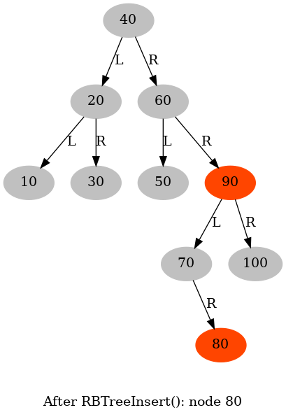 |

### make animation

```sh
RedBlackTree$ make animation
```

|  | 
|:-------------:|
| 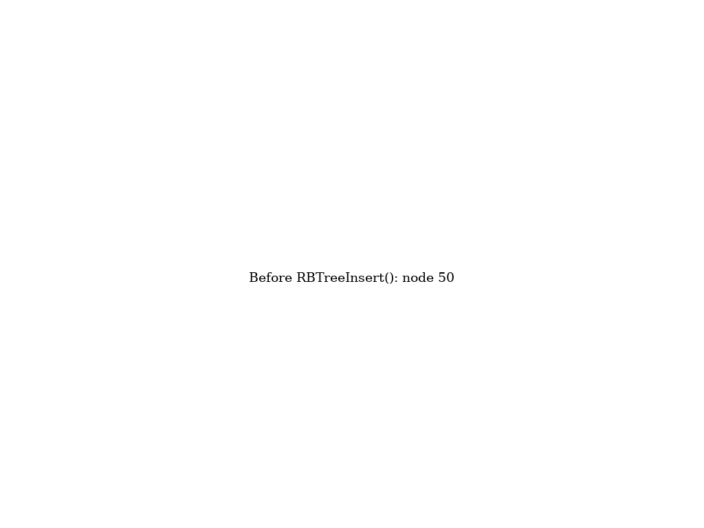 |
