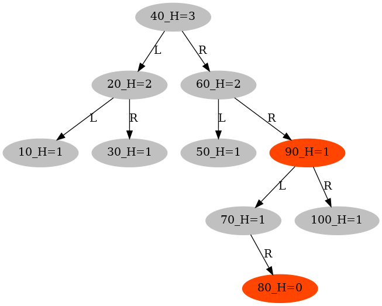

# Red-Black Tree (with the parent field)

In this project, each node in the red-black tree has a parent field, whereas the red-black tree nodes in the project [Red-Black Tree (black height)](../RedBlackTree/README.md) do not include a parent field.

Using the parent field allows for more concise code when accessing a node's uncle and sibling. However, it introduces additional complexity in the handling of rotations.

A Red-Black Tree is a self-balancing [binary search tree](../BinarySearchTree/README.md) with the following properties.

- Property 1: the root is black.
- Property 2: a node is either BLACK or RED
- Property 3: a red node shouldn't have any red child.
- Property 4: the left and right subtrees have the same black height.
- Property 5: all null nodes are black.

## Number of rotations in AVL and Red-Black trees while inserting/deleting 100,000 keys

| Insert+Delete 100000 keys | [AVL](../SelfBalancingBST/README.md)| [Red-Black Tree (black height)](../RedBlackTree/README.md) | [Red-Black Tree (parent)](./README.md)|
| :---:|:---:|:---:|:---:|
| #Left Rotations|   56232    |   50368   | 52376    |
| #Right Rotations|   53837   |   52764   |   50665  |


| Insert 100000 keys | [AVL](../SelfBalancingBST/README.md)| [Red-Black Tree (black height)](../RedBlackTree/README.md) | [Red-Black Tree (parent)](./README.md)|
| :---:|:---:|:---:|:---:|
| #Left Rotations|   35048    |   29159   | 29159    |
| #Right Rotations|   35190   |   29375   |   29375  |

## Fix red-red violations in insertions

A red-red violation occurs when a newly inserted red node has a red parent.
When the imbalance cannot be fixed locally through rotations and recoloring, 
it will be propagated from bottom to up, with its grandparent node marked as red.

| Case| Node |Parent |Uncle | Grandparent | How to restore balance|
| :---|:---|:---|:---|:---|:---|
| red-uncle | red| red|  red    | black |  Mark both parent and uncle as black, but grandparent as red. |
|  | | |      |  |  Recursively fix the possible red-red violation in grandparent. |
|  | | |      |  |  The root node of a red-black tree is set to be black. |
| black-uncle | red| red|  black    | black | Fixed locally (Left-left, left-right, right-left, or right-right rotations + recoloring). |
|  | | |      |  |  Note that the black uncle can be NULL. The current red node is either the newly-inserted red node|
|  | | |      |  |  or a grandparent converted from black to red in fixing its grandchild's red-uncle red-red violation. |

Refer to [RBTreeFixRedRed()](./src/RedBlackTree.c) for more details.

## Fix double-black violations in deletions


When a black node is deleted, the Red-Black tree loses its balance in terms of black height. 
The node (to be deleted) is marked as double black to indicate where the imbalance occurs. 
When the imbalance cannot be fixed locally through rotations and recoloring, 
it will be propagated from bottom to up, with its parent node marked as double black.

The double-black node is the root node of the subtree which has caused the imbalance in black height.

| Case| Node (marked as double black)|Parent |Sibling | Red nephew | How to restore balance|
| :---|:---|:---|:---|:---|:---|
| red-sibling | black| black|  red    |   No   |  The red sibling of the black node must have two black nephews (not NULL). |
| || | | | After one rotation and recoloring, the double-black node with a red sibling is  |
| || | | |converted into a double-black node with a black sibling and a red parent, which will be fixed later. |
|black-sibling| black| red or black|  black   |   Yes   |   Fixed locally (Left-left, left-right, right-left, or right-right rotations + recoloring) |
| | black| red |  black   |   No   |   Fixed locally (mark parent as black and sibling as red)  |
| | black| black|  black   |   No   |  Mark sibling as red, and propagate the double black to the parent |

Refer to [RBTreeFixDoubleBlack()](./src/RedBlackTree.c) for more details.


### make view

```sh
RedBlackTreeParent$ make view
```
**H** is short for the black height of a tree node, returned by **RBTreeBlackHeight()**

|  |
|:-------------:|
|  |

