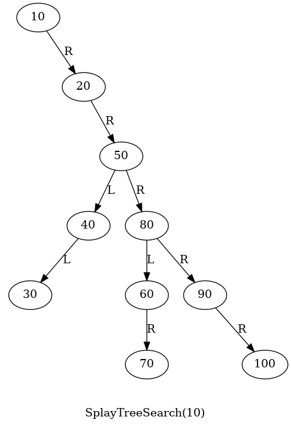
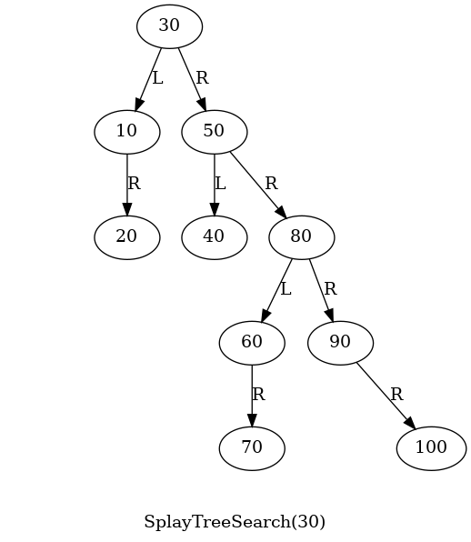
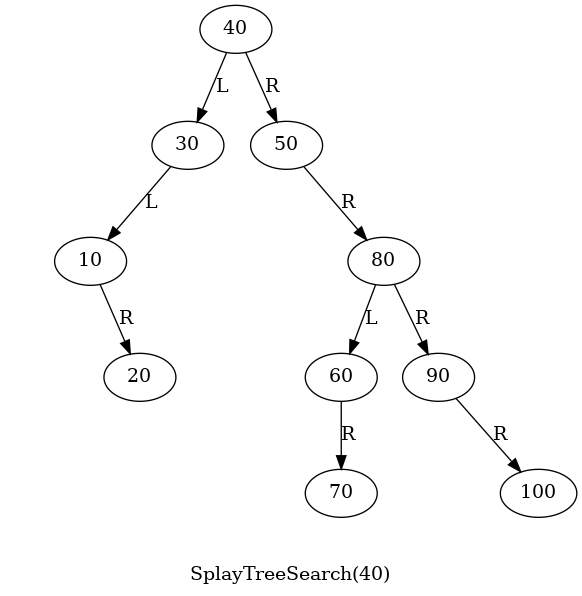
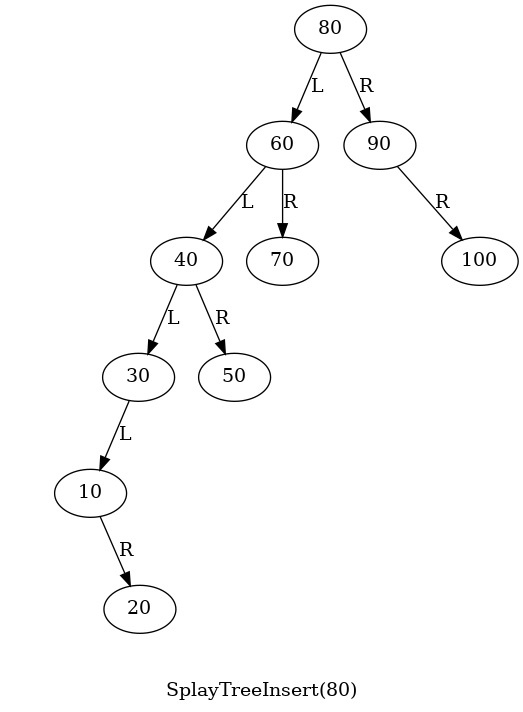
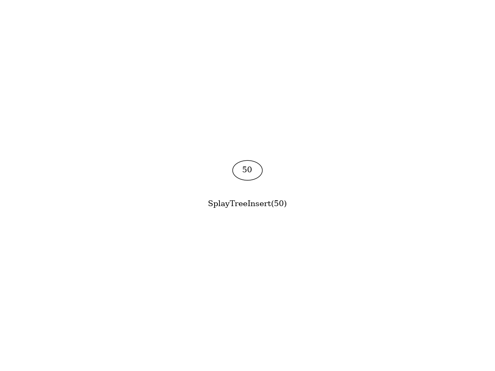

# Splay Tree

A splay tree is a type of self-adjusting [binary search tree (BST)](../BinarySearchTree/README.md) that attempts to keep frequently accessed elements near the root of the tree, improving the performance of subsequent accesses. The primary idea behind a splay tree is that recently accessed or modified elements should be easier to access in the future, thus optimizing performance for certain access patterns.

| | | |
|:----:|:----:|:----:|
|  |  |  |

The main operation of a splay tree is the splay operation, which is performed after every insertion, deletion, or access of a node. The splay operation moves the accessed node to the root of the tree using a series of tree rotations, thus restructuring the tree in a way that the most recently accessed nodes become more easily accessible.

Unlike [AVL trees](../SelfBalancingBST/README.md) or [Red-Black trees](../RedBlackTree/README.md), splay trees do not explicitly maintain a balance criterion (such as height or color). 
The worst-case time complexity for a single operation can be O(n). However, over a sequence of operations, the amortized cost remains O(log n) per operation, as shown in the following table.

| Number of random keys| Maximum tree height encountered during testing |
|:----:|:----:|
| $2^{4}$ | 9 |
| $2^{6}$ | 14 |
| $2^{8}$ | 25 |
| $2^{10}$ | 27 |
| $2^{12}$ | 40 |
| $2^{14}$ | 44 |
| $2^{16}$ | 50 |
| $2^{18}$ | 58 |
| $2^{20}$ | 64 |
| $2^{22}$ | 72 |
| $2^{24}$ | 81 |


### make view

```sh
SplayTree$ make view
```

| |
|:----:|
|  |

### make animation


```sh
SplayTree$ make animation
```
| |
|:----:|
|  |

