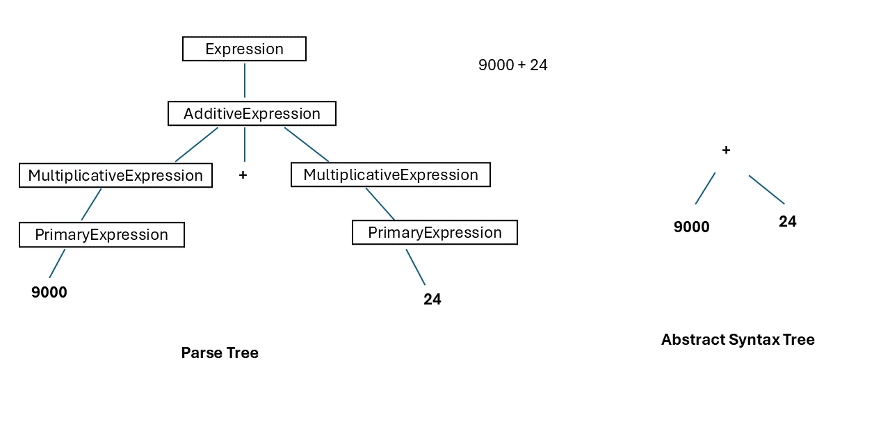
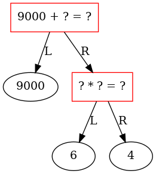
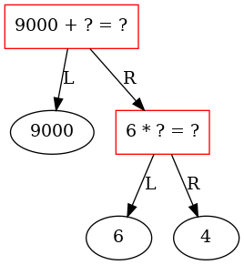
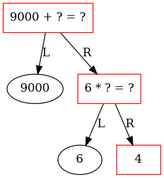
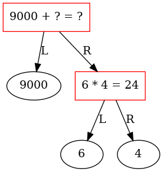

# Str2Ast

``` sh
/*******************************************************************
                   Str2Ast

    1.  How to define the data structure of a binary tree in C

    2.  How to use a binary tree to represent an arithmetic expression

    3.  How to perform a postorder traversal of a binary tree

    4.  How to write a simple parser to parse an expression 
        (from an input string to an abstract syntax tree)

    5.  How to evaluate an arithmetic expression 

                                             COMP9024

 *******************************************************************/
``` 

## Introduction

In this project, we only use binary operators (such as '+' and '*'), 

allowing us to represent the abstract syntax tree as a binary tree.

In an abstract syntax tree, syntactic details such as parentheses in expressions 

like "(20 + 30) * 40" are considered redundant and thus ignored.


```sh
An expression (i.e., a string) from a user:

   "9000 + (6 * 4)" 

It is represented as an abstract syntax tree after parsing.

        + 
      /   \ 
    9000   * 
          /  \ 
         6    4 
```
### Lexical analysis 

Lexical analysis is used to recognize tokens (i.e., words).

**Token**
```C
// A token is like an English word.
// But a token = (token kind, token value)
// For example, 300 and 400 are of the same token kind (i.e., TK_NUM),
// but with different values.
typedef struct {
    TokenKind kind;
    Value value;
} Token;


```
**Token Value**
```C
// Max length of an identifier (e.g., a function or variable name)
#define MAX_ID_LEN 127

// token value
typedef struct {
    // e.g, "year", "t0", "t1", "+", "-", "*", "/", "(", ")", ...
    char name[MAX_ID_LEN + 1];
    // value of an integer, e.g., 2024
    long numVal;
} Value;
```

**Token Kind**
```C
//In C, an Enum/Enumeration is a custom data type where users can assign names to
//constant integers. Using enums makes it easier for programmers to learn,
//understand, and maintain the program.
typedef enum {
    TK_NA,    // 0     By default, the first item has the value 0. Here, NA stands for Not Available. 
    TK_ADD,   // 1 
    TK_SUB,   // 2 
    TK_MUL, 
    TK_DIV, 
    TK_NUM,
    TK_LPAREN,
    TK_RPAREN,
    TK_EOF,
} TokenKind;
```
**An example**

The input string 
```sh
"9000 + (6 * 4)"
```
is converted into a sequence of tokens.
```sh
(TK_NUM, 9000)
(TK_ADD, '+')
(TK_LPAREN, '(')
(TK_NUM, 6)
(TK_MUL, '*')
(TK_NUM, 4)
(TK_RPAREN, ')')
(TK_EOF, )
```


### Parser

In [COMP9024/Trees/BiTree](../../Trees/BiTree/README.md), we have studied how to create a binary tree manually.

In this project, we will delve into the creation of a binary tree (with a parser).

- How to define the grammar of an arithmetic expression
- How to write a parser based on the grammar of an arithmetic expression.

```C
static const char *srcCode = "9000 + (6 * 4)";

// declaration of a global variable in C
extern Token curToken;

// Read the next token from the input file and save it in the global variable
// curToken.
#define NEXT_TOKEN                                                             \
    do {                                                                       \
        curToken = GetToken();                                                 \
    } while (0)

int main(void) {
    // The source code to be parsed
    printf("\"%s\" \n\n", srcCode);
    // Initialize the lexical analysis
    InitLexer(NextCharFromMem);
    // Get the first token
    NEXT_TOKEN;
    // Create a tree by parsing the arithmetic expression
    AstExprNodePtr expr = Expression();
    Expect(TK_EOF);
    // Perform a postorder traversal of the tree
    long result = EvalExpression(expr);
    // Output the result
    printf("\neval(\"%s\") == %ld\n", srcCode, result);
    // Free the heap memory
    ReleaseAstExpr(expr);
    return 0;
}
```

**About do {} while(0) in NEXT_TOKEN**

Please refer to the web page [do{}while(0)](https://stackoverflow.com/questions/257418/do-while-0-what-is-it-good-for).

```sh
It's the construct in C that you can use to #define a multi-statement operation, 
put a semicolon after, and still use within an if statement. 
```

An example.
```C
#define TEST(x) do { TestA(x); TestB(x); } while (0)

if (condition)
    TEST(x);
else {
    // ...
}

```

### Error handling

Since variadic functions in C will be discussed in [COMP9024/Strings/FormatString](../../Strings/FormatString/README.md),

you can skip the implementation details of the code in [COMP9024/Trees/Str2Ast/src/error.c](./src/error.c) now.

To be simple, when there is a syntax error, our parser will output a message and stop the parsing process.

```C
void Error(const char *format, ...) {
    // ......
    fprintf(stderr, "\n");

    exit(-1);
}
```

### Overview: Input String --> Parse Tree ---> Abstract Syntax Tree

```sh
9000 + 24
```



**(1) Debug this program in VS Code and follow the recursive functions in expr.c step by step during parsing "9000 + 24".**

     You can set a breaking point inside the function Expression() during dedugging this program.

**(2) The parse tree is introduced to help us further understand the code of the syntax parser in [src/expr.c](./src/expr.c).**

     We do not explicitly create the parse tree.

**(3) Complete Q1-Q10 in the parse tree with function names you discovered during debugging and then answer the questions in Quiz 3 (Week 4) on [Moodle](https://moodle.telt.unsw.edu.au/my/courses.php).**


### make view

**Click on the window of 'feh' or use your mouse scroll wheel to view images**.

```sh
Str2Ast$ make view
```

Here, **feh** is an image viewer available in [CSE VLAB](https://vlabgateway.cse.unsw.edu.au/).

All of these images for visualizing algorithms are generated automatically in [COMP9024/Trees/Ast2Dot](../../Trees/Ast2Dot/README.md).

**eval() stands for EvalExpression() in the following diagrams.**

| Initial |
|:-------------:|
|  |

|Function calls on call stack: eval($\color{red}{+}$)|
|:-------------:|
|  |

|Function calls on call stack: eval($\color{red}{9000}$), eval(+)|
|:-------------:|
|  |

|Function calls on call stack: eval($\color{red}{+}$)|
|:-------------:|
|  |

|Function calls on call stack: eval($\color{red}{*}$), eval(+)|
|:-------------:|
|  |

|Function calls on call stack: eval($\color{red}{6}$), eval(*), eval(+)|
|:-------------:|
|  |

|Function calls on call stack: eval($\color{red}{*}$), eval(+)|
|:-------------:|
|  |

|Function calls on call stack: eval($\color{red}{4}$), eval(*), eval(+)|
|:-------------:|
|  |

|Function calls on call stack: eval($\color{red}{*}$), eval(+)|
|:-------------:|
|  |

|Function calls on call stack: eval($\color{red}{*}$), eval(+)|
|:-------------:|
|  |

|Function calls on call stack: eval($\color{red}{+}$)|
|:-------------:|
|  |

|Function calls on call stack: eval($\color{red}{+}$)|
|:-------------:|
|  |

**The above diagrams are used to explain the recursive algorithm.**

**Note that we don't actually change the binary tree itself in the post-order traversal.**

| Final  |
|:-------------:|
|  |


## 1 How to download this project in [CSE VLAB](https://vlabgateway.cse.unsw.edu.au/)

Open a terminal (Applications -> Terminal Emulator)

```sh

$ git clone https://github.com/sheisc/COMP9024.git

$ cd COMP9024/Trees/Str2Ast

Str2Ast$ 

```


## 2 How to start [Visual Studio Code](https://code.visualstudio.com/) to browse/edit/debug a project.


```sh

Str2Ast$ code

```

Two configuration files (Str2Ast/.vscode/[launch.json](https://code.visualstudio.com/docs/cpp/launch-json-reference) and Str2Ast/.vscode/[tasks.json](https://code.visualstudio.com/docs/editor/tasks)) have been preset.


### 2.1 Open the project in VS Code

In the window of Visual Studio Code, please click "File" and "Open Folder",

select the folder "COMP9024/Trees/Str2Ast", then click the "Open" button.


### 2.2 Build the project in VS Code

click **Terminal -> Run Build Task**


### 2.3 Debug the project in VS Code

Open src/main.c, and click to add a breakpoint (say, line 67).

Then, click **Run -> Start Debugging**


### 2.4 Directory

```sh
├── Makefile             defining set of tasks to be executed (the input file of the 'make' command)
|
├── README.md            introduction to this project
|
├── src                  containing *.c and *.h
|    |
|    ├── error.c         reporting an error
|    ├── error.h
|    ├── expr.c          create a tree by parsing an arithmetic expression (e.g., "9000 + (6 * 4)") and evaluate its value     
|    ├── expr.h
|    ├── lex.c           lexical analysis for recognizing a token (i.e., a word), such as 9000, +, (, ...
|    ├── lex.h      
|    ├── main.c          main()
|    └── tokens.txt      containing the token kinds and names
|
└── .vscode              containing configuration files for Visual Studio Code
    |
    ├── launch.json      specifying which program to debug and with which debugger,
    |                    used when you click "Run -> Start Debugging"
    |
    └── tasks.json       specifying which task to run (e.g., 'make' or 'make clean')
                         used when you click "Terminal -> Run Build Task" or "Terminal -> Run Task"
```
Makefile is discussed in [COMP9024/C/HowToMake](../../C/HowToMake/README.md).


## 3 Data structure 

### Type definitions
```C

/*
    The Abstract Syntax Tree Node for an expression.

    In an abstract syntax tree, syntactic details such as parentheses in expressions 
    like "(20 + 30) * 40" are considered redundant and thus ignored.

             * 
           /   \
          +     40
        /   \ 
       20   30
 */
struct astExprNode {
    /*
      1. The kind of an expression node: 
           an operand (e.g., 300) or an operator (e.g., '+', '-', '*' and '/')

      2. To keep it simple, we use the TokenKind defined in tokens.txt.  
           TK_NUM for 300, 400, ...
           TK_ADD for '+'
           TK_SUB for '-'
           TK_MUL for '*'
           TK_DIV for '/'
     */
    TokenKind op;
    /*
     The value of the token (a token is a word), consisting of two parts:

     1. an integer for representing the node's value (e.g., 300), 

     2. a C string for representing its name or value (e.g., "+", "t0", "t1", "(", ")", "300", ...)
     */
    Value value;

    /////////////////////////////////////////////
    // e.g.,  left and right operands of a binary operator (+, -, *, /)
    struct astExprNode *kids[2];  
};

typedef struct astExprNode *AstExprNodePtr;

// token value
typedef struct {
    // e.g, "year", "t0", "t1", "+", "-", "*", "/", "(", ")", ...
    char name[MAX_ID_LEN + 1];
    // value of an integer, e.g., 2024
    long numVal;
} Value;

// In C, an Enum/Enumeration is a custom data type where users can assign names to constant integers. 
// Using enums makes it easier for programmers to learn, understand, and maintain the program.
typedef enum {
  TK_NA,    // 0     By default, the first item has the value 0. Here, NA stands for Not Available.
  TK_ADD,   // 1
  TK_SUB,   // 2
  TK_MUL,
  TK_DIV,
  TK_NUM, 
  TK_LPAREN,
  TK_RPAREN, 
  TK_EOF, 
} TokenKind;

```
## 4 Algorithm

```C
// In fact, it is a simple interpreter
long EvalExpression(AstExprNodePtr root) {    
    assert(root);
    if (root->op == TK_NUM) { // 9000, 6, 4        
        return root->value.numVal;
    }
    else if (isArithmeticOperator(root->op)) { // +, -, *, /
        //
        assert(root->kids[0]);
        assert(root->kids[1]);        
        long leftOperand = EvalExpression(root->kids[0]);
        long rightOperand = EvalExpression(root->kids[1]); 
        // Postorder traversal
        long result = 0;
        switch (root->op) {
        case TK_ADD:                
            result = leftOperand + rightOperand;
            EmitIR("%s = %s + %s\n", root->value.name, 
                                     root->kids[0]->value.name, 
                                     root->kids[1]->value.name);
            break;
        case TK_SUB:
            result = leftOperand - rightOperand;
            EmitIR("%s = %s - %s\n", root->value.name, 
                                     root->kids[0]->value.name, 
                                     root->kids[1]->value.name);              
            break;
        case TK_MUL:
            result = leftOperand * rightOperand;
            EmitIR("%s = %s * %s\n", root->value.name, 
                                     root->kids[0]->value.name, 
                                     root->kids[1]->value.name);             
            break;
        case TK_DIV:
            result = leftOperand / rightOperand;
            EmitIR("%s = %s / %s\n", root->value.name, 
                                     root->kids[0]->value.name, 
                                     root->kids[1]->value.name);               
            break;
        default:
            break;              
        }
        return result;
    } else {
      Error("Unknown operator/operand");
    }
}

```

## 5 The grammar of an arithmetic expression and its corresponding parser.


### Motivation

Let’s explore how to define an arithmetic expression that includes two operators: '+' and '*', with integer operands represented by NUM.

A complex system is typically composed of simple, fundamental components.

We can start by defining a primary expression.  

```sh
PrimaryExpression:
    NUM
```
Next, we introduce the '*' operator by defining a multiplicative expression.

```sh
MultiplicativeExpression:
    PrimaryExpression
    PrimaryExpression * PrimaryExpression * ... * PrimaryExpression
```

Similarly, we can define an additive expression to introduce the '+' operator.

```sh
AdditiveExpression:
    MultiplicativeExpression
    MultiplicativeExpression + MultiplicativeExpression + ... + MultiplicativeExpression
```
To evaluate an additive expression, such as 'MultiplicativeExpression + MultiplicativeExpression', 

we first need to determine the values of the operands (i.e., the MultiplicativeExpressions). 

This indicates that the '*' operator in a multiplicative expression has higher precedence than the '+' operator in an additive expression.

Since we aim to support only these two operators, we can finalize our definition of an expression.

```sh
Expression:
    AdditiveExpression
```

Additionally, we recognize that an expression enclosed in parentheses can also serve as a primary expression. 

Thus, we can redefine our primary expression accordingly.

```sh
PrimaryExpression:
    NUM
    (Expression)
```

The '/' operator can be treated in a similar manner to the '*' operator by defining a multiplicative operator.
```sh
 // multiplicative operator
mop:
    *  
    / 
```

The '-' operator can be handled similarly.
```sh
// additive operator
aop:
    +  
    -    
```

**The grammar of an arithmetic expression is recursive.**

**So our parser will be implemented in recursive functions.**

### 5.1 PrimaryExpression 

It is used to describe numbers (like 9000, 6, and 4) or a sub-expression in a pair of parentheses (like (6*4)).

```C
  PrimaryExpression:
      NUM
      (Expression)
```
**Meaning**

- A number can be seen as a primary expression.
- An expression within a pair of parentheses can also be treated as a primary expression.

Input string
```sh
9000  +  ( 6  *  4 )
 ^
 ^
 ^
 curToken

```

```sh
Suppose curToken is (TK_NUM, 9000)
```

**Parser function**
```C
static AstExprNodePtr PrimaryExpression(void) {
    AstExprNodePtr expr = NULL;
    if (curToken.kind == TK_NUM) {
        expr = CreateAstExprNode(curToken.kind, &curToken.value, NULL, NULL);
        NEXT_TOKEN;
    } else if (curToken.kind == TK_LPAREN) {
        NEXT_TOKEN;
        expr = Expression();
        Expect(TK_RPAREN);
    } else {
        Error("number or '(' expected");
    }
    return expr;
}
```

```C
void Expect(TokenKind tk) {
    if (curToken.kind == tk) {
        NEXT_TOKEN;
    } else {
        Error("\"%s\" expected", GetTokenName(tk));
    }
}
```

### 5.2 MultiplicativeExpression 

It is used to describe a multiplicative expression like 6 * 4 or a primary expression (like (6*4) or 6)

```C  
  MultiplicativeExpression:
          PrimaryExpression
          PrimaryExpression  mop PrimaryExpression  ...   mop PrimaryExpression  

  // multiplicative operator
  mop:
              *  
              / 
```
**Meaning**

To do an multiplicative operation in 'PrimaryExpression mop PrimaryExpression', 
we need to evaluate the value of PrimaryExpression first.

In other words, PrimaryExpression has higher precedence than MultiplicativeExpression.

**An example**
```sh
6 * 4
```

**Parser function**
```C
static AstExprNodePtr MultiplicativeExpression(void) {
    AstExprNodePtr left;
    left = PrimaryExpression();
    while (curToken.kind == TK_MUL || curToken.kind == TK_DIV) {
        Value value;
        AstExprNodePtr expr;
        memset(&value, 0, sizeof(value));
        snprintf(value.name, MAX_ID_LEN, TEMP_VAR_NAME_FMT, NewTemp());
        // create a tree node for * or /
        expr = CreateAstExprNode(curToken.kind, &value, NULL, NULL);
        // skip '*' or '/'
        NEXT_TOKEN;
        expr->kids[0] = left;
        expr->kids[1] = PrimaryExpression();
        left = expr;
    }
    return left;
}
```

### 5.3  AdditiveExpression 

It is used to describe an additive expression like 9000 + 6 * 4 or a multiplicative expression like 6*4.

```C  
  AdditiveExpression:
        MultiplicativeExpression
        MultiplicativeExpression  aop MultiplicativeExpression  ...   aop MultiplicativeExpression  

  // additive operator
  aop:
              +  
              -
```
**Meaning**

To do an additive operation in 'MultiplicativeExpression  aop MultiplicativeExpression', 
we need to evaluate the value of MultiplicativeExpression first.

In other words, the operator mop (e.g., *) has higher precedence than the operator aop (e.g., +).

**An example**
```sh
9000  +  ( 6  *  4 )
```

**Parser function**
```C
static AstExprNodePtr AdditiveExpression(void) {
    AstExprNodePtr left;
    /*
        Take "9000  +  ( 6  *  4 )" as an example.

        9000  +  ( 6  *  4 )
        ^
        ^
        Current Token

        Let's call MultiplicativeExpression() to parse the first
        MultiplicativeExpression in an AdditiveExpression.
        MultiplicativeExpression() will return a sub-tree for "9000"
     */
    left = MultiplicativeExpression();
    /*
        Now, the curToken points to '+' (i.e, TK_ADD)
  
        9000  +  ( 6  *  4 )
              ^
              ^
              Current Token
  
        Parse "aop MultiplicativeExpression" if they are in the input stream
     */
    while (curToken.kind == TK_SUB || curToken.kind == TK_ADD) {
        Value value;
        AstExprNodePtr expr;
        memset(&value, 0, sizeof(value));
        // A temporary variable "t0" is assigned the value resulting from the
        // expression "t0 = 9000 + t1". "t1 = 6 * 4" will be created in
        // MultiplicativeExpression() later.
        snprintf(value.name, MAX_ID_LEN, TEMP_VAR_NAME_FMT, NewTemp());
        // create a tree node for '+' or '-'
        expr = CreateAstExprNode(curToken.kind, &value, NULL, NULL);
        // skip '+' or '-'
        NEXT_TOKEN;
        /*
            Now, the curToken points to '('
  
            9000  +  ( 6  *  4 )
                     ^
                     ^
                     Current Token
  
            Call MultiplicativeExpression() to parse the right operand "(6 * 4)"
            Again, it will return a sub-tree for "(6 * 4)"
        */
        expr->kids[0] = left;
        expr->kids[1] = MultiplicativeExpression();
        /*
            If the current token is '+' or '-', The while-loop will iterate once
            more. Otherwise, the while-loop will stop, meaning our parser has
            recognized an additive expression in the input stream.
  
            In this simple example, now, the current token is TK_EOF (end of
            file).
  
            9000  +  ( 6  *  4 )
                                  ^
                                  ^
                                  Current Token
  
         */
        left = expr;
    }
    return left;
}
```
The function MultiplicativeExpression() in expr.c can be analyzed similarly.

### 5.4  Arithmetic expression
```C 
  Expression:
        AdditiveExpression
```

**An example**
```sh
9000  +  ( 6  *  4 )
```

**Parser function**
```C
AstExprNodePtr Expression(void) { 
    return AdditiveExpression(); 
}
```


## 6  Lexical analysis

The lexical analysis is used to recognize tokens (i.e., words).

The code is in [src/lex.c](./src/lex.c).


