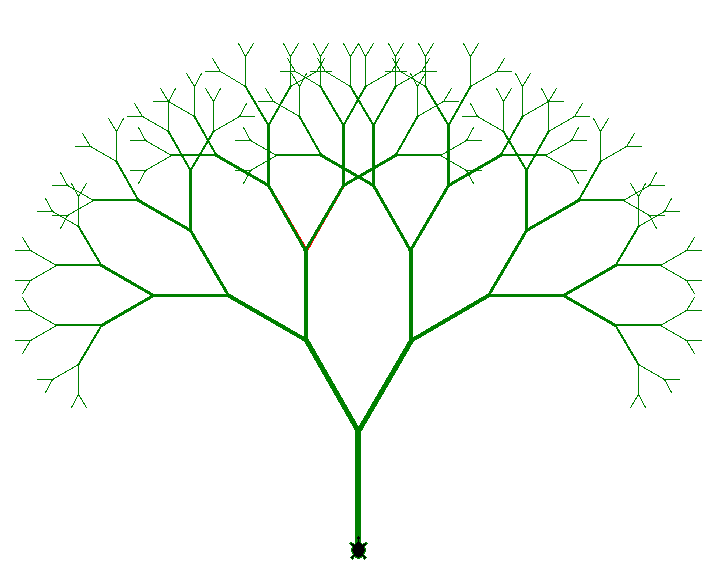
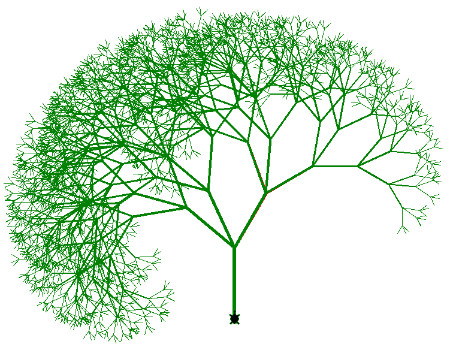

# Tree2Dot

``` sh
/*******************************************************************
                        Tree2Dot

    1.  How to use *.dot files to represent trees

    2.  How to generate images (*.png) from *.dot files

    3.  Breadth First Search in a tree

                                             COMP9024 24T2

 *******************************************************************/
``` 
#### Non-recursive Depth First Search (DFS) is based on a stack

Non-recursive DFS (in [Tutorial 4](../../Tutorials/Week5/README.md)) uses an explicit [stack](../../Stacks/Stack_LL/README.md) data structure. 

Unlike the recursive implementation that relies on the [call stack](../../Stacks/Recursion/README.md), the non-recursive approach uses a stack to keep track of nodes to be visited.

DFS goes as deep as possible from the starting node before backtracking to explore other branches.

|[Maze](https://sheisc.github.io/slides/COMP9024/24T2/week10/maze.html)|
|:-------------:|
|  |

#### Recursive Depth First Search (DFS) is based on the call stack

A fractal is a geometric shape or pattern that is self-similar at different scales.

Fractal trees are defined by their recursive, self-similar structure, where each branch subdivides into smaller branches that resemble the whole tree. 


```sh

Tree2Dot$ make tree

python3 FractalTree.py &

Tree2Dot$ make tree3

python3 FractalTree3.py &
```

**Recursion is hard**.

**Recursion is beautiful**.

|Fractal Tree (with 2 branches) |Fractal Tree (with 3 branches)|
|:-------------:|:-------------:|
|  |  |

To create graphics on the screen, we instruct the turtle (a pen) to move.

Operating the [turtle](https://docs.python.org/3/library/turtle.html) is just like driving a car as follows.

* Turn left

* Turn right

* Forward

* Backward

```Python
import turtle

# Fractal tree
def draw_branch(t:turtle.Pen, length):
    if length > 5:
        # Pen size
        sz = int(length / 20)
        if sz < 1:
            sz = 1
        t.pensize(sz)

        # Main branch
        t.forward(length)

        # turn right by 30 degrees
        t.right(30)
        # right sub-tree, the length of its main branch is (length - 15) pixels
        draw_branch(t, length - 15)

        # turn left by 60 degrees
        t.left(60)
        # left sub-tree,  the length of its branch is (length - 15) pixels
        draw_branch(t, length - 15)

        # turn right by 30 degrees
        t.right(30)
        # go back to the origin position
        t.backward(length)


def draw():
    # Default direction:  --->
    t = turtle.Pen()

    # Direction: Up
    t.left(90)
    t.penup()
    t.backward(260)
    t.pendown()    
    t.shape("turtle")
    t.speed(6)
    
    colors = ['red', 'green']
    for color in colors:
        t.pencolor(color)
        # the length of the main branch is 120 pixels
        draw_branch(t, 120)
    
    #t.hideturtle()

    screen = turtle.Screen()
    #canvas = screen.getcanvas()
    #canvas.postscript(file='FractalTree.eps')   
    screen.exitonclick()


if __name__ == '__main__':
    draw()
```

#### Breadth First Search (BFS) is based on a queue

BFS uses a [queue](../../Queues/Queue_LL/README.md) data structure to facilitate its exploration strategy. 

The queue operates on a First-In-First-Out (FIFO) principle, meaning nodes are processed in the order they are added.

Breadth First Search propagates like ripples.

|BFS|
|:-------------:|
|  |  


Breadth First Search (BFS) visits nodes level by level (layer by layer).

It explores all nodes at the present "depth" level before moving on to nodes at the next depth level. 

Based on the queue introduced in [COMP9024/Queues/Queue_LL](../../Queues/Queue_LL/README.md), we discuss how to 
perform a breadth-first search in a tree and generate a dot file for the tree.


```sh

         100
        /   \
      98    101
     /  \
   97    99 

```


## [images/OurBiTree_0000.dot](./images/OurBiTree_0000.dot)

```sh
digraph OurBiTree {
"100" -> {"98"} [label="L"]
"100" -> {"101"} [label="R"]
"98" -> {"97"} [label="L"]
"98" -> {"99"} [label="R"]
}

```
## [images/OurBiTree_0000.png](./images/OurBiTree_0000.png)

|  | 
|:-------------:|
|   |


## 1 How to download this project in [CSE VLAB](https://vlabgateway.cse.unsw.edu.au/)

Open a terminal (Applications -> Terminal Emulator)

```sh

$ git clone https://github.com/sheisc/COMP9024.git

$ cd COMP9024/Trees/Tree2Dot

Tree2Dot$ 

```


## 2 How to start [Visual Studio Code](https://code.visualstudio.com/) to browse/edit/debug a project.


```sh

Tree2Dot$ code

```

Two configuration files (Tree2Dot/.vscode/[launch.json](https://code.visualstudio.com/docs/cpp/launch-json-reference) and Tree2Dot/.vscode/[tasks.json](https://code.visualstudio.com/docs/editor/tasks)) have been preset.


#### 2.1 Open the project in VS Code

In the window of Visual Studio Code, please click "File" and "Open Folder",

select the folder "COMP9024/Trees/Tree2Dot", then click the "Open" button.


#### 2.2 Build the project in VS Code

click **Terminal -> Run Build Task**


#### 2.3 Debug the project in VS Code

Open src/main.c, and click to add a breakpoint (say, line 8).

Then, click **Run -> Start Debugging**

### 2.4 Directory

```sh
├── Makefile             defining set of tasks to be executed (the input file of the 'make' command)
|
├── README.md            introduction to this project
|
├── FractalTree.py       fractal tree
|
├── src                  containing *.c and *.h
|   |
|   |
│   ├── BiTree.c         binary tree
│   ├── BiTree.h
|   |
│   ├── Queue.c          used in a breadth-first tree traversal when generating *.dot files
│   ├── Queue.h
|   |
│   └── main.c           main()
|
|── images               containing *.dot and *.png files
|
|── diagrams             containing *.dot and *.png files
|
└── .vscode              containing configuration files for Visual Studio Code
    |
    ├── launch.json      specifying which program to debug and with which debugger,
    |                    used when you click "Run -> Start Debugging"
    |
    └── tasks.json       specifying which task to run (e.g., 'make' or 'make clean')
                         used when you click "Terminal -> Run Build Task" or "Terminal -> Run Task"
```

Makefile is discussed in [COMP9024/C/HowToMake](../../C/HowToMake/README.md).

## 3 The main procedure

### 3.1 make and ./main

**In addition to utilizing VS Code, we can also compile and execute programs directly from the command line interface as follows.**
```sh

         100
        /   \
      98    101
     /  \
   97    99 

```

``` sh

Tree2Dot$ make
dot -T png images/OurBiTree_0000.dot -o images/OurBiTree_0000.png

Tree2Dot$ ./main

```

### 3.2 make view

**Ensure that you have executed 'make' and './main' before 'make view'.**


```sh
Tree2Dot$ make view
```

**Click on the window of 'feh' or use your mouse scroll wheel to view images**.

Here, **feh** is an image viewer available in [CSE VLAB](https://vlabgateway.cse.unsw.edu.au/).


| Initial | 
|:-------------:|
|   |


## 4 Data structures

```C
/*
    During the depth-first traversal of a binary tree, 
    there are three times we arrive at a binary tree node:

    (1) from its parent 
    (2) from its left child
    (3) from its right child

    We can use the following node states to represent different stages 
    when we walk through a binary tree node in a non-recursive algorithm.


                 |
                 |  NS_FROM_UP
                 |
                 v
          ----------------
          |              |
          | BiTree Node  |
          ----------------
                ^  ^
               /    \
              /      \
             /        \
    NS_FROM_LEFT        NS_FROM_RIGHT
 */    

typedef enum {
    NS_FROM_UP,      // 0   
    NS_FROM_LEFT,    // 1
    NS_FROM_RIGHT,   // 2
} NodeState;


// Max length of an identifier (e.g., the name for a tree node) 
#define MAX_ID_LEN 127


typedef struct {
    // e.g, "9000", "Node A", "Node B"
    char name[MAX_ID_LEN + 1];
    // value of an integer, e.g., 2024
    long numVal;
} NodeValue;

struct BiTreeNode {
    /*
     The value of a binary tree node:
  
     1. an integer for representing the node's value (e.g., 300), 
      
     2. a C string for representing its node name
     */
    NodeValue value;  
    // left subtree
    struct BiTreeNode *leftChild;
    // right subtree
    struct BiTreeNode *rightChild;
    // the current state when this node is pushed on the data stack (in non-recursive DFS traversals)
    NodeState state;
    // whether this node has been visited
    int visited;
};

typedef struct BiTreeNode *BiTreeNodePtr;
```


## 5 Algorithms

### 5.1 main()

```C

/*
  Create a binary tree node
 */
BiTreeNodePtr CreateBinaryTreeNode(long numVal, char *nodeName, BiTreeNodePtr left, BiTreeNodePtr right) {
    BiTreeNodePtr pNode = (BiTreeNodePtr) malloc(sizeof(struct BiTreeNode));
    assert(pNode != NULL);

    memset(pNode, 0, sizeof(*pNode));

    pNode->value.numVal = numVal;
    // If nodeName is not specified, we use the string representation of numVal as its node name.
    if (nodeName == NULL) {
        snprintf(pNode->value.name, MAX_ID_LEN, "%ld", numVal);
    } else {
        snprintf(pNode->value.name, MAX_ID_LEN, "%s", nodeName);
    }
    pNode->leftChild = left;
    pNode->rightChild = right;
    // used in preorder, inorder and postorder traversals
    pNode->state = NS_FROM_UP;
    pNode->visited = 0;   
    return pNode;
}


BiTreeNodePtr CreateBinaryTree(void) {
    /*********************************  

           100
          /   \
        98    101
       /  \
     97    99

     *********************************/
    // To be simple, let's manually create the binary tree. 
    BiTreeNodePtr leftLeft = CreateBinaryTreeNode(97, NULL, NULL, NULL);
    BiTreeNodePtr leftRight = CreateBinaryTreeNode(99, NULL, NULL, NULL);
    BiTreeNodePtr left = CreateBinaryTreeNode(98, NULL, leftLeft, leftRight);
    BiTreeNodePtr right = CreateBinaryTreeNode(101, NULL, NULL, NULL);
    BiTreeNodePtr root = CreateBinaryTreeNode(100, NULL, left, right);

    return root;
}

int main(int argc, char **argv, char **env) {
    // Create a binary tree
    BiTreeNodePtr root = CreateBinaryTree();

    // create a sub-directory 'images' (if it is not present) in the current directory
    system("mkdir -p images");
    // remove the *.dot and *.png files in the directory 'images'
    system("rm -f images/*.dot images/*.png");
    // generate one image  
    GenOneImage(root, "OurBiTree", "images/OurBiTree", 0);
    
    // Free the heap memory
    ReleaseBinaryTree(root);

    return 0;
}

```


### 5.2 GenOneImage()

```C
#define FILE_NAME_LEN  255

// dot -T png images/OurBiTree_0000.dot -o images/OurBiTree_0000.png

void GenOneImage(BiTreeNodePtr root, char *graphName, char *fileName, long seqNo) {
    char dotFileName[FILE_NAME_LEN+1] = {0};
    char pngFileName[FILE_NAME_LEN+1] = {0};
    char command[(FILE_NAME_LEN+1)*4] = {0};
    
    snprintf(dotFileName, FILE_NAME_LEN, "%s_%04ld.dot", fileName, seqNo);
    snprintf(pngFileName, FILE_NAME_LEN, "%s_%04ld.png", fileName, seqNo);

    BiTree2Dot(root, dotFileName, graphName, 1);

    snprintf(command, FILE_NAME_LEN*4, "dot -T png %s -o %s", dotFileName, pngFileName);

    printf("%s\n", command);
    
    // Execute the command in a child process (fork() + exec() on Linux)
    system(command); 

}
```

### 5.3 BiTree2Dot()

```C

static void DisplayVisited(FILE *dotFile, BiTreeNodePtr root) {
    if (root) {
        if (root->visited) {
            fprintf(dotFile, "\"%s\" [color=red]\n", root->value.name);            
        }
        DisplayVisited(dotFile, root->leftChild);
        DisplayVisited(dotFile, root->rightChild);
    }
}


/*
    Dot Files

    We assume each node has a distinct key value.

   
          100
         /   \
       98    101
      /  \
    97    99
    

    digraph OurBiTree {
    "100" -> {"98"} [label="L"]
    "100" -> {"101"} [label="R"]
    "98" -> {"97"} [label="L"]
    "98" -> {"99"} [label="R"]
    "97" [color=red]
    }  

 */

void BiTree2Dot(BiTreeNodePtr root, 
               char *filePath,
               char *graphName,
               int displayVisited) {

    FILE *dotFile = fopen(filePath, "w");
    /*
        FIXME:  check sanity of the parameters.
     */
    if (dotFile) {
        char *edgeConnectorStr = "->";
        fprintf(dotFile, "digraph %s {\n", graphName);
        
        struct Queue *pQueue = CreateQueue();
        if (root) {
            QueueEnqueue(pQueue, root);
            while (!QueueIsEmpty(pQueue)) {
                BiTreeNodePtr curNode = QueueDequeue(pQueue);
                if (curNode->leftChild) {
                    fprintf(dotFile, "\"%s\" %s {\"%s\"} [label=\"L\"]\n",
                            curNode->value.name,
                            edgeConnectorStr,                         
                            curNode->leftChild->value.name);
                    QueueEnqueue(pQueue, curNode->leftChild);
                }
                if (curNode->rightChild) {
                    fprintf(dotFile, "\"%s\" %s {\"%s\"} [label=\"R\"]\n",                        
                            curNode->value.name, 
                            edgeConnectorStr,
                            curNode->rightChild->value.name);
                    QueueEnqueue(pQueue, curNode->rightChild);
                }            
                
            }
        }
        ReleaseQueue(pQueue);
        /*
        "0" [color=red]
         */
        if (displayVisited) {
            DisplayVisited(dotFile, root);
        }        
        fprintf(dotFile, "}\n");
        fclose(dotFile);
    }                
}
```

### 5.4 ReleaseBinaryTree()

```C
void ReleaseBinaryTree(BiTreeNodePtr root) {
    if (root) {
        ReleaseBinaryTree(root->leftChild);
        ReleaseBinaryTree(root->rightChild);
        free(root);
    }
}
```


